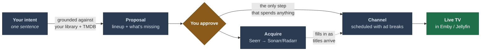

# Loomarr

[](https://github.com/mantonx/loomarr/actions/workflows/ci.yml)
[](LICENSE)
[](go.mod)

**Describe a TV channel in a sentence. Loomarr builds it, plays it, and keeps it running.**

> *"90s Saturday morning cartoons for the kids"*

It proposes a lineup grounded in your actual library, requests anything missing, schedules it
with era-appropriate ad breaks, streams it to your media server as Live TV, and backfills the
gaps as downloads land.



Every pick is **grounded** — a real title from your library or TMDB. The model can't invent one.
Nothing is downloaded and no channel is created until an admin approves.

The LLM runs locally through Ollama by default, so nothing leaves your network; any
OpenAI-compatible provider works too. [What each option sends](docs/dev/ai.md#ai-as-a-feature).

## Install

You need **Emby or Jellyfin**. Everything else is optional and can be added later.

```bash
git clone https://github.com/mantonx/loomarr && cd loomarr
docker compose -f docker/compose.yaml --profile sqlite up -d
```

Open `http://<host>:8080` and the setup wizard takes it from there.

> No `v*` tag has been cut yet, so there is no published image and the command above **builds
> locally**. Once a release is tagged this becomes a plain `docker pull`.

→ **[Installation guide](docs/install/index.md)** · [Docker](docs/install/docker.md) ·
[Hardware acceleration](docs/install/hardware.md) · [Upgrading](docs/install/upgrading.md) ·
[Configuration reference](docs/configuration.md)

## How it plays

By default **Loomarr streams your channels itself** — it encodes and serves a tuner your media
server picks up as Live TV, with nothing else to install. **Tunarr** is a fully supported
alternative, chosen in the wizard and overridable per channel; pick it when your hardware can't
transcode, or when you already run it.

## Develop

Go 1.26+, Node 22.5+, `ffmpeg`/`ffprobe` on `PATH`, Docker for the Postgres and Playwright
suites.

```bash
make check          # the gate: fmt + vet + vet-tags + lint + unit tests
make fe-install     # pnpm install — nothing else does this
make dev-be         # backend :8080 with live reload
```

→ **[Developer guide](docs/dev/index.md)** · [Setup](docs/dev/setup.md) ·
[Dev loop](docs/dev/dev-loop.md) · [Testing](docs/dev/testing.md) · [CI](docs/dev/ci.md) ·
[Commands](docs/dev/commands.md)

## Documentation

| For | Where |
| --- | --- |
| Installing and running | [`docs/install/`](docs/install/index.md) |
| Using it | [`docs/help/`](docs/help/quickstart.md) — also served in-app under **Help** |
| Contributing | [`docs/dev/`](docs/dev/index.md) and [`CONTRIBUTING.md`](CONTRIBUTING.md) |
| How it works | [`docs/design.md`](docs/design.md) — the single source of truth |

The help pages are embedded in the binary and rendered offline, so they work air-gapped. The
same files are rendered by the docs site — one source, three renderers, no copies.

## Stack

A single Go binary with the web UI, help pages and API baked in. stdlib `net/http` + Huma v2
(code-first OpenAPI 3.1, consumed by the frontend through orval) · `database/sql` over
`modernc.org/sqlite` **or** pgx · goose migrations · an embedded Vite + React SPA · ffmpeg for
playout · LLM via local Ollama or any OpenAI-compatible provider. Non-root, cgo-free.
Rationale in [`docs/design.md`](docs/design.md) §14.

## Operations

- **Probes** — `/v1/healthz` and `/v1/readyz`, unauthenticated on the LAN. Bare `/healthz` and
  `/readyz` answer identically and always will: a healthcheck lives in someone's compose file,
  not in this repo.
- **Metrics** — `/v1/metrics` exposes Prometheus text: HTTP RED, Go runtime, state gauges,
  outbound per-dependency latency, channel reconcile timing, and the domain counters. Cost is
  deliberately left to a dashboard recording rule rather than a price table that would drift.
- **Backup** — `GET /v1/backup` for SQLite; `pg_dump` for Postgres. Backups contain secrets.

## Contributing

See [`CONTRIBUTING.md`](CONTRIBUTING.md). By participating you agree to the
[Code of Conduct](CODE_OF_CONDUCT.md). Security issues: [`SECURITY.md`](SECURITY.md).

## License

[MIT](LICENSE). Bundled components — notably the GPL `ffmpeg` — are inventoried in
[`THIRD_PARTY_NOTICES.md`](THIRD_PARTY_NOTICES.md).
