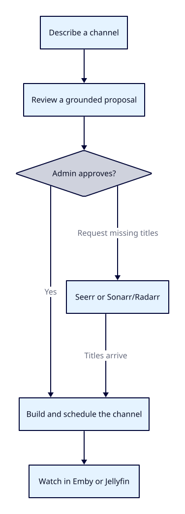

# Loomarr

[](https://github.com/loomarr/loomarr/actions/workflows/ci.yml)
[](LICENSE)
[](go.mod)

**Describe a TV channel in a sentence. Loomarr builds it, plays it, and keeps it running.**

> *"90s Saturday morning cartoons for the kids"*

Loomarr picks a lineup from your library, requests anything missing, schedules it with ad
breaks, and streams it to your media server as Live TV.



*[D2 source](docs/diagrams/readme-overview.d2)*

Every pick is a real title from your library or TMDB — the model can't invent one. Nothing
downloads until an admin approves.

## Install

You need Emby or Jellyfin to run Loomarr. To use its defining describe-a-channel flow, you also
need TMDB and either Ollama or an OpenAI-compatible provider. Requesters and filler remain optional.

Choose an exact version from [GitHub Releases](https://github.com/loomarr/loomarr/releases). The
example below uses one published beta; keep the version pinned when you upgrade.

```bash
VERSION=0.1.0-beta.8
git clone --branch "v${VERSION}" --depth 1 https://github.com/loomarr/loomarr && cd loomarr
cp .env.example .env                     # set SERVER_PUBLIC_URL to this host's reachable URL
LOOMARR_VERSION="$VERSION" docker compose -f docker/compose.yaml --profile sqlite up -d
```

Open the `SERVER_PUBLIC_URL` you set and follow the wizard. Traefik owns the host's port 8080 by
default and health-checks the compiled Loomarr app on its private container port; set
`LOOMARR_HTTP_PORT` when port 8080 is already in use.

The image supports Linux on amd64 and arm64. On macOS, run it through Docker Desktop; Apple
Silicon pulls the arm64 image and Intel Macs pull amd64.

→ [Install guide](docs/install/index.md) · [Docker](docs/install/docker.md) ·
[Hardware acceleration](docs/install/hardware.md) · [Upgrading](docs/install/upgrading.md) ·
[All settings](docs/configuration.md)

## How it plays

Loomarr streams your channels itself by default — your media server picks it up as Live TV,
with nothing else to install. **Tunarr** is a supported alternative if your hardware can't
transcode, or if you already run it. You choose in the wizard, and can override it per channel.

## Develop

Go 1.26+, the Rust toolchain pinned by `rust-toolchain.toml`, Node 22.x, `ffmpeg` and `ffprobe` on `PATH`, Docker for the Postgres and browser
test suites.

```bash
make doctor         # toolchain and local-state diagnostics
make bootstrap      # Rust worker + frontend dependencies + codegen
make dev-be         # isolated Go/Rust backend with live reload
make dev-fe         # isolated frontend pointed at that backend
```

→ [Developer guide](docs/dev/index.md) · [Setup](docs/dev/setup.md) ·
[Dev loop](docs/dev/dev-loop.md) · [Testing](docs/dev/testing.md) · [CI](docs/dev/ci.md) ·
[Commands](docs/dev/commands.md) · [Agent development](docs/dev/agents.md)

## Documentation

| For | Where |
| --- | --- |
| Installing | [`docs/install/`](docs/install/index.md) |
| Using it | [`docs/help/`](docs/help/quickstart.md) — also in the app under **Help** |
| Contributing | [`docs/dev/`](docs/dev/index.md), [`CONTRIBUTING.md`](CONTRIBUTING.md) |
| How it works | [`docs/design.md`](docs/design.md) |

The help pages are built into the binary, so they work offline. The docs site renders the same
files.

## Stack

One Go binary with the UI, help pages and API built in, served behind Traefik in the supported
Docker topology. Huma v2 for the API (OpenAPI 3.1,
consumed by the frontend via orval), `database/sql` over SQLite or Postgres, goose migrations,
an embedded Vite + React SPA, ffmpeg for playout, and Ollama or any OpenAI-compatible provider
for the LLM. Details in [`docs/design.md`](docs/design.md) §14.

## Operations

- **Probes** — `/v1/healthz` and `/v1/readyz`, unauthenticated on the LAN. `/healthz` and
  `/readyz` also work.
- **Metrics** — `/v1/metrics` in Prometheus format: HTTP rates and latency, Go runtime, state
  gauges, per-dependency outbound timing, and channel reconcile timing.
- **Backup** — `GET /v1/backup` for SQLite; a mode-`0600` `pg_dump --format=custom` archive for
  Postgres. Backups contain secrets; restore procedures are in the install and upgrade guides.

## Contributing

See [`CONTRIBUTING.md`](CONTRIBUTING.md) and the [Code of Conduct](CODE_OF_CONDUCT.md).
Security issues: [`SECURITY.md`](SECURITY.md).

## License

Loomarr source is [MIT](LICENSE). The distributed image also contains GPL and permissively licensed
components; their terms and the redistribution work still open for beta are listed in
[`THIRD_PARTY_NOTICES.md`](THIRD_PARTY_NOTICES.md). The image carries both files under
`/usr/share/doc/loomarr/`.
