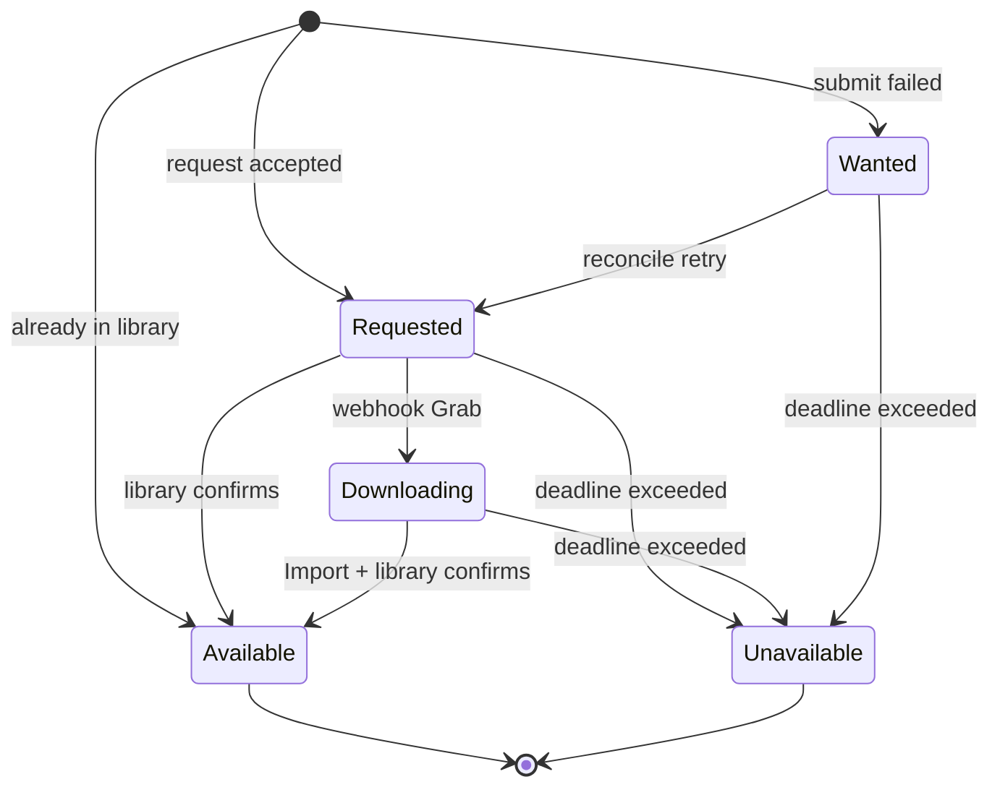
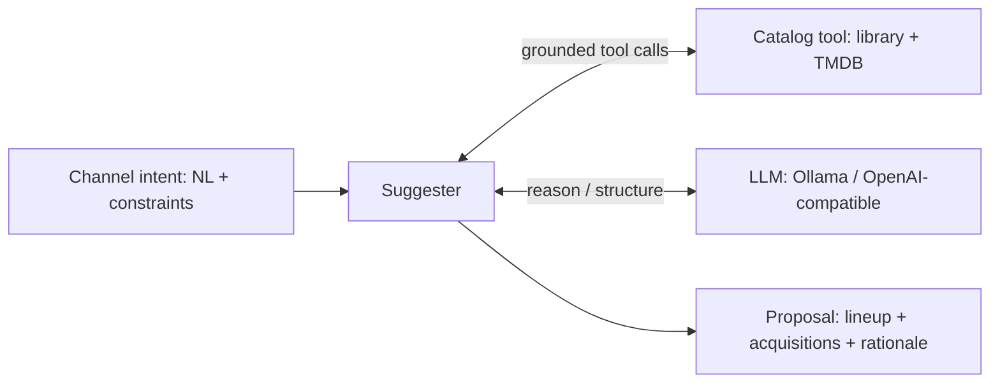

# Virtual Channel Builder — Design Doc

**Status:** Draft for implementation
**Audience:** Claude Code (build agent) + maintainer
**Working name:** `loomarr` — weaves your library into TV channels, and follows the *arr / Servarr naming convention since it lives in that stack (alongside Sonarr/Radarr, which it drives). Container image `loomarr`. Rename freely.

> Supersedes the earlier "Channel Content Provisioner" framing. The app's purpose is to **build and maintain virtual TV channels end to end**: from a natural-language intent, through content acquisition, to a live Tunarr channel that stays filled. "Provisioning" is one subsystem of that, not the product.

---

## 1. Purpose

`loomarr` turns *"I want a channel that feels like X"* into an actual, running Tunarr channel — and keeps it populated as content comes and goes. It closes the full loop:

**intent → suggest a lineup → acquire what's missing → build the schedule → push it to Tunarr → backfill and maintain.**

The app has **five cooperating subsystems**:

| Subsystem | Owns | "Decides…" |
| --- | --- | --- |
| **Suggester** (§8) | intent → proposal | *what* content belongs on the channel |
| **Provisioner** (§3–§7) | acquire missing titles, track to available | *whether/when* content exists |
| **Scheduler** (§9) | build lineup, insert pods, push to Tunarr, backfill | *order, timing, and delivery* |
| **Filler** (§10) | filler ingestion, clip catalog, pod assembly | *what plays in the breaks* |
| **Web** (§12) | human control surface | *approval and oversight* |

### In scope
- Natural-language channel intent → grounded proposal (lineup + acquisitions).
- Acquire missing titles via Seerr (or Sonarr/Radarr) and track each to `available`/`unavailable`.
- **Build channel programming** (order, time-slots, shuffle/blocks) and insert **era/audience-matched commercial pods** with their own filler sourcing pipeline (§10).
- **Push channels to Tunarr** via its API and **reconcile** desired vs. actual channel state.
- **Backfill loop:** go live immediately with available content + filler; swap in real titles as acquisitions land; substitute on give-up.
- Persist all state to **Postgres or SQLite**.
- **Multi-user login with Emby/Jellyfin accounts** (Seerr-style import/sync), roles, per-user quotas, and audited approvals (§11).
- Self-documented HTTP API (§7.1) and an embedded web UI (§12).
- Deploy as a single Docker container.
- **Play out its own channels** (§9.1): serve HLS + MPEG-TS segments and publish an M3U tuner + XMLTV guide that the media server registers directly, with Tunarr as a supported alternative backend rather than a requirement.

### Explicit non-goals
- **Does not manage indexers, download clients, or quality profiles** — that's Sonarr/Radarr's job.
- **Does not replace the media server** — Emby/Jellyfin remain the client, the library, and the thing a viewer actually opens. Loomarr feeds them a tuner; it is not a player.
- **Does not replace Tunarr** — Tunarr stays a first-class playout backend (§9.1), chosen per channel. Hardware that can't transcode, or an install already happy with Tunarr, keeps working unchanged.
- **The provisioner core never chooses titles or auto-acquires** — the suggester proposes and a human (or a quota-gated auto-approve, or a channel's opted-in auto-curate grant — `programming-design.md` §8.2) confirms before anything is acquired or scheduled. Every one of those paths routes through the single `Approve` gate; none writes a `wanted` title directly.

### Design envelope
Sized for a household/homelab, and tests should assume it: **~100k library items, ≤50 channels, ≤20 users, ≤10k filler clips, single media server.** These bounds justify several deliberate simplicities (federated search over indexes, `LIKE` over FTS, client-side list filtering, in-process jobs). Anything beyond the envelope is future work, not a v1 requirement.

---

## 2. Architecture

```mermaid
flowchart LR
  User[Human]
  Web[Web UI]
  SUG[Suggester]
  PROV[Provisioner]
  SCH[Scheduler]
  MS[(Emby / Jellyfin)]
  Seerr[Seerr]
  Arr[Sonarr / Radarr]
  LLM[LLM: Ollama / OpenAI-compatible]
  Tunarr[Tunarr]
  DB[(Postgres / SQLite)]

  User --> Web
  Web -->|intent| SUG
  SUG <-->|grounded tool calls| MS
  SUG <-->|reason| LLM
  SUG -->|proposal| Web
  Web -->|approve: acquisitions| PROV
  Web -->|approve: lineup| SCH
  PROV -->|request| Seerr --> Arr
  PROV -->|poll queue: progress / grabbed| Arr
  PROV -->|library scan + GET /Items lookup| MS
  PROV -->|available / unavailable &#40;internal events&#41;| SCH
  SCH -->|build + push channel, filler, flex| Tunarr
  SCH -->|backfill re-push| Tunarr
  Web -->|monitor via SSE| PROV
  PROV <--> DB
  SCH <--> DB
```



The subsystems are internally decoupled (clean interfaces) but ship in one binary/container by default. The **provisioner's availability events are now an internal feed to the scheduler** — that's what drives backfill. An *optional* outbound webhook/SSE remains for external consumers, but the primary consumer is `loomarr`'s own scheduler.

**Filler flow (not drawn above to keep the diagram legible):** clips land in a drop-folder (manually, via MeTube, or via loomarr's own **ingest job** on a `filler`-variant image) → Tunarr scans that folder as a **`local` media source** → loomarr **syncs its clip catalog from Tunarr** (§10). The media server is not in the filler path at all, and the core never *probes* media — Tunarr assigns duration and program ids.

### Boundaries (ports)
Core logic depends only on interfaces; concrete adapters live at the edges.

| Boundary | Interface | Adapters |
| --- | --- | --- |
| Library | `Library.Lookup(title) → (itemID, present)` | Emby, Jellyfin (shared impl, flavor-specific auth) |
| Requester | `Requester.Request/Cancel(title)` | Seerr (default), Sonarr+Radarr (alt) |
| **Programmer** | `Programmer.Reconcile(channel, lineup)` | **Tunarr** (only impl; abstracted for future ErsatzTV) |
| Suggester | `Suggester.Propose(intent) → Proposal` | LLM: Ollama (local) or an OpenAI-compatible endpoint (hosted — OpenRouter, or a user-supplied Custom base URL; Claude via OpenRouter) |
| Catalog | `Catalog.Search(query) → []Candidate` | Library + TMDB/TVDB — grounds the LLM **and** backs `GET /v1/search` (§7.2) |
| FillerSource | catalog sync + optional ingest | Tunarr `local`-source catalog sync (core); `Ingester`: yt-dlp / Archive.org → drop-folder, in-core on a `filler`-variant image (§10) |
| Store | `Store` (see §5) | Postgres, SQLite |
| Events | `EventBus` | internal (→ scheduler) + optional outbound webhook |

---

## 3. Provisioner domain model

**Title** — a unit of content the app wants. Identity is an external id, never a title string.
- `MediaType`: `movie` | `series`
- `TMDBID` (canonical for movies; accepted by Seerr for series), `TVDBID` (preferred key for series)
- `Name`, `Year` — logs/request payloads only, never identity
- `Seasons []int` — series only; empty = all

**Key** — stable dedup/identity key, identical whether derived from a `Title` or a webhook:
- series with TVDB id → `series:tvdb:<id>`; otherwise → `<mediatype>:tmdb:<id>`

**Record** — persisted provisioning state: key, title blob, state, library item id, `requested_at`, `deadline`, `attempts`, `last_error`, `updated_at`.

> **Time storage:** persist timestamps as Unix epoch `BIGINT`, not native datetime types — keeps the schema dialect-neutral across Postgres/SQLite.

---

## 4. Provisioning state machine



| State | Meaning | Emits event? |
| --- | --- | --- |
| `wanted` | Requested by app; downstream submission not yet accepted | no |
| `requested` | Accepted by Seerr/*arr; awaiting a release | no |
| `downloading` | A release was grabbed; genuinely in flight | no |
| `available` | Present in the library, schedulable | **yes → scheduler** |
| `unavailable` | Gave up (deadline / unfindable) | **yes → scheduler** |

**Availability is discovered by polling, not (only) by a webhook.** The primary path to
`available` is the scheduled **library scan** (§6, §18.1): a `library-scan` job periodically
lists what the media server has recently added and confirms any in-flight title now present —
the same `LibraryConfirmed` transition the reconciler's deadline backstop applies, but
continuous and not deadline-gated. Correlation matches a scanned item to an in-flight record by
**any** provider id the item carries, not just its preferred one: a series is keyed
`series:tvdb:<id>` when a TVDB id is known but `series:tmdb:<id>` when it was added TMDB-only
(the suggester/channel-add path), while the media server exposes *both* ids on the show — so the
scan probes every key an item can produce, or a TMDB-keyed series would never confirm `available`
even with its episodes present. This mirrors how Overseerr/Seerr work (they are entirely
poll-based; verified). The inbound Sonarr/Radarr webhook (§6 Ingest) is a *latency
optimization* on top of the scan, not the source of truth — and is retired once the scan path
is proven (build plan). A `library-full-scan` runs less often as a safety net for anything the
incremental scan's "recently added" window missed.

### Invariants (cover with tests)
1. **Terminal monotonicity — scoped to the acquisition lifecycle.** Once `available`/`unavailable`, no *provisioning* event regresses it; late/duplicate webhooks ignored. But `available` is a statement about a moment, not a promise about forever: media gets deleted, replaced, or re-id'd after acquisition completes. The **scheduler** therefore revalidates slot items against the library at reconcile time (§9) rather than trusting an old `available` — drift is the scheduler's problem to detect, not a reason to mutate terminal provisioning state.
2. **Only `available`/`unavailable` emit events** — those are the only transitions the scheduler acts on.
3. **Idempotent enqueue.** Safe to enqueue the same title repeatedly; dedup keyed on external id via the store; per-key lock prevents concurrent double-requests.
4. **Library is source of truth.** Even on an import webhook, confirm the library reports the item before `available` — Tunarr reads the library, and there's scan lag.
5. **Deadline discipline.** Every in-flight record has a deadline; a `Grab` webhook resets it to the shorter downloading TTL; past deadline → `unavailable` + downstream `Cancel`.

---

## 5. Persistence — Postgres **and** SQLite

One store abstraction; both backends first-class. It holds **both** provisioning records **and** scheduler state (channels, desired lineups).

```
Store interface:
  # provisioning
  GetTitle/UpsertTitle/ListTitlesByState
  ClaimDueTitles(now, limit)               # concurrency-safe reconcile claim
  # scheduling
  GetChannel/UpsertChannel/ListChannels
  GetDesiredLineup/UpsertDesiredLineup
  # filler catalog (§10)
  GetClip/UpsertClip/DeleteClip
  ListClips(filter: kind/era/audience/category)
  # users & sessions (§11)
  GetUser/UpsertUser/ListUsers            # keyed by media-server user id
  CreateSession/GetSession/RevokeSessionsForUser
  # jobs & proposals (§8, §10)
  CreateJob/GetJob/UpdateJob
  ClaimDueJobs(now, limit)                # same SKIP LOCKED pattern as titles
  GetProposal/UpsertProposal
  ListProposals(status[, user])           # approval queue; My proposals
  # settings KV (small, typed accessors over one table)
  GetSetting/SetSetting                   # instance id (§11 DeviceId)
```

### Backend selection
`DATABASE_URL` scheme selects the backend: `sqlite:///data/loomarr.db` or `postgres://…`. Fail fast on unknown scheme.

### Drivers
- **SQLite:** `modernc.org/sqlite` — pure Go, **no cgo** → tiny static image (distroless/scratch). Open with `journal_mode=WAL` + `busy_timeout`.
- **Postgres:** `jackc/pgx` **via its `database/sql` stdlib shim** — decided, so both backends share one store code path (§14).

### Schema & migrations
- Keep SQL ANSI where possible; `INSERT … ON CONFLICT(key) DO UPDATE` works on both.
- **`goose`** (decided, §14) with an **embedded** FS and separate `migrations/sqlite` + `migrations/postgres` dirs so dialect DDL never leaks. Auto-run on startup (`AUTO_MIGRATE=true`).

### Retention & janitor
State accumulates; a **janitor** (piggybacking the reconciler ticker) enforces retention so a year-old install isn't dragging a landfill:
- **Sessions:** sliding TTL, `SESSION_TTL` default 30d; expired rows purged. (Without this, sessions live forever — both a growth and a security problem.)
- **Jobs:** completed/failed jobs purged after `JOBS_RETENTION` (default 30d).
- **Proposals:** `denied`/superseded purged after `PROPOSALS_RETENTION` (default 90d); **approved proposals are kept indefinitely** — they're the audit trail behind `approved_by`.
- Filler catalog sync (§10) already removes clips that vanished from the media server.

### Concurrency consequence of supporting Postgres (important)
SQLite ⇒ **single instance**. Postgres enables **replicas**, which changes reconcile correctness:
- `ClaimDueTitles` on Postgres uses `SELECT … FOR UPDATE SKIP LOCKED` (or an advisory-lock leader) so two replicas don't both fire a give-up/retry — the reason it's a distinct method, not a plain list.
- On SQLite it's a straight query.
- **Run exactly one replica with SQLite.** Scale horizontally only with Postgres + row claiming.

---

## 6. External contracts

### Client resilience defaults (apply to every adapter below)
Every outbound client is built from a shared HTTP factory with **hard timeouts**: media server 10s, Seerr 10s, TMDB 10s, Tunarr 20s (lineup pushes are chunky), LLM 120s per call. **Retry philosophy:** jittered-backoff retries only for idempotent GETs; *writes never client-retry* — write recovery is owned by the idempotent reconcile loops and periodic sweeps, which is why they exist. A down dependency degrades the relevant feature (and lights up the §13 checklist), never wedges the process.

### Library — Emby & Jellyfin
Both share `GET /Items?Recursive=true&AnyProviderIdEquals=<provider>&IncludeItemTypes=<Movie|Series>&Limit=1`; provider `tmdb.<id>` / `tvdb.<id>`; present iff `Items` non-empty → `Items[0].Id`. Use **header** auth (never `api_key` query param — leaks to logs; Jellyfin deprecates legacy auth from 10.11+):
- Emby: `X-Emby-Token: <key>` · Jellyfin: `Authorization: MediaBrowser Token="<key>"`

Flavor via `LIBRARY_FLAVOR`. **Season precision default:** `SEASON_PRECISION=series` — a series counts as in-library if the show exists; `seasons` mode (verify each requested season before `available`) is the stricter opt-in. Caveat to encode as a TODO: provider-name casing in `AnyProviderIdEquals` can differ across versions — if a known-present title returns empty, check casing first.

**Bulk scan (poll-based availability, §4 + §18.1).** Beyond the id-only `Lookup`, the library adapter exposes two bulk reads that drive the `library-scan`/`library-full-scan` jobs — one call returns *many* items with their provider ids, so availability is confirmed without an N-lookup storm:

- `RecentlyAdded(since)` — `GET /Items?Recursive=true&IncludeItemTypes=Movie,Series&SortBy=DateCreated&SortOrder=Descending&MinDateLastSaved=<since>&Fields=ProviderIds,ProductionYear`. The incremental 5-minute path: only what changed since the last scan.
- `AllItems()` — the same query without `MinDateLastSaved`: the periodic full sweep (safety net for anything the incremental window missed).

Both return `[]SearchResult` (the existing shape carrying `LibraryItemID` + `TMDBID`/`TVDBID`), one code path for both flavors (auth-only divergence, as with every `/Items` call). The scan job builds a `provision.Key` from each returned item and confirms any in-flight (`requested`/`downloading`) title whose key matches — applying `LibraryConfirmed` → `available`. Key parity (same key from a `Title`, a webhook, or a scan item) is what makes this correlation exact.

**User auth & listing (for §11):** `POST /Users/AuthenticateByName` (body `{Username, Pw}`) validates a user's credentials — Jellyfin requires the `Authorization: MediaBrowser Client="…", Device="…", DeviceId="…", Version="…"` header on this request even without a token; Emby accepts the equivalent `X-Emby-Authorization`. `GET /Users` with the admin `LIBRARY_TOKEN` lists users (id, name, `Policy.IsAdministrator`, `Policy.IsDisabled`) for import/sync. Both live in the same flavored adapter as `Lookup`.

### Requester — Seerr (default) or direct Sonarr/Radarr

A `requester.provider` setting (`seerr` default, or `arr`) selects the acquisition backend. The wizard/Settings show the `seerr.*` fields OR the `sonarr.*`/`radarr.*` fields via `ShowWhen` on the provider (mirrors `llm.provider`). Both implement the same `Requester` port (`Request`/`Cancel`) plus a `Reachable` probe for the Test button; the app branches on the provider at construction.

**Seerr (default).** `POST {SEERR_URL}/api/v1/request` (header `X-Api-Key`), body `{mediaType, mediaId=TMDBID, seasons}`. Treat **201** and **409** as success (idempotency). Seerr supports Emby/Jellyfin/Plex natively. **Operational trap:** Seerr has its own approval workflow — if Loomarr's API user lacks auto-approve permission in Seerr, every Loomarr-approved acquisition stalls in a *second* pending queue and deadlines expire. The integrations doc (§13) must instruct: grant the Loomarr service user auto-approve in Seerr; the troubleshooting page covers the "everything stuck in `requested`" symptom.

**Direct Sonarr/Radarr.** Routes movie→Radarr, series→Sonarr (header `X-Api-Key`), each built dynamically like Seerr (conn closures, `httpx.TimeoutArr`). Per title:
- **Request:** `GET /api/v3/{movie,series}/lookup?term={tmdb,tvdb}:<id>` to resolve the arr's payload, then `POST /api/v3/{movie,series}` with `qualityProfileId` + `rootFolderPath` + `monitored:true` + an add-options search trigger. An already-added title (arr returns **400/409**) is treated as success — the same 2xx-or-conflict idempotency rule as Seerr.
- **Quality profile / root folder:** auto-picked (first of `GET /api/v3/qualityprofile` and `/api/v3/rootfolder`) unless overridden by `sonarr.quality_profile`/`sonarr.root_folder` (+ radarr). This keeps the common path zero-config while letting a power user pin them.
- **Cancel:** a *real* withdrawal (unlike Seerr's no-op) — DELETE the matching `GET /api/v3/queue` record so a given-up title stops downloading.
- **Reachable:** `GET /api/v3/system/status` on each configured arr — validates URL + key for the Test button (a dead host is a transport error, a bad key 401).

Availability under the direct requester comes from the same **library scan** (§4, §18.1) as Seerr, plus the arr **queue poller** (`arr-queue-poll`, §18.1): it reads each arr's `/api/v3/queue`, promotes a title with a live download record to `downloading` (`Grabbed`), and **persists progress on the title record** (`progress`/`eta_text`/`download_status`, surfaced by `GET /v1/titles`). Never an inbound webhook.

### Programmer — Tunarr
The scheduler drives Tunarr's REST API (documented OpenAPI at `tunarr.com/api-docs.html`): channels CRUD, programming/lineup, filler lists, flex, custom shows. **Decided: hand-write a thin client** against only the endpoints we use — generating from Tunarr's full pre-1.0 spec would couple us to its schema churn. Pin and record the Tunarr version tested against in the README. Tunarr ships with no authentication (Phase-0 finding: empty `securitySchemes`) and Loomarr reaches it machine-to-machine on the same network, so there is **no Tunarr API-key config** — just the URL. (An operator who fronts Tunarr with their own auth proxy would terminate that at the proxy; Loomarr does not model it.) Tunarr owns transcoding/streaming/EPG/HDHR+M3U output; `loomarr` owns lineup + filler. **Important:** Tunarr must have the same Emby/Jellyfin library configured as *its* media source **with that library enabled and scanned** — Tunarr streams the underlying files and indexes them into its own program table. `loomarr` and Tunarr agree on titles via the library.

**Loomarr wires this for the operator** (`POST /v1/setup/tunarr-connect`, admin — §7): it ensures the Emby/Jellyfin media source exists in Tunarr, then enables the movie + show libraries and triggers a scan — the same **enumerate-first, idempotent** pattern as the Live TV wiring (below) and filler (§10). It reuses Loomarr's **existing admin API key** as the source's access token (Tunarr accepts the admin `X-Emby-Token` directly — verified against Tunarr 1.3.8 + Emby 4.10; no separate Emby *user* login, so Loomarr stores no extra credential). This closes a **silent-failure** gap: without the scan, a channel's slots find no Tunarr program and degrade to flex/dead-air (§9), yet the rest of the wizard reads all-green — so `/v1/setup/status` carries a **`tunarr_library`** check that fails until the source is wired + scanned. Division of labor is unchanged (§6/§1): Tunarr still owns streaming/indexing; Loomarr only performs the one-time setup the operator would otherwise do by hand. It does **not** poll or re-scan on a timer — the one exception is *demand-driven*: a reconcile that finds a program slot Tunarr hasn't indexed yet triggers a library scan so that content becomes playable (§ Content-id resolution below), which is a targeted response to real unresolved content, not a routine background sweep.

**Content-id resolution (Programmer adapter).** A lineup slot carries the *media-server* item id (the Emby/Jellyfin id, from the provisioner). Tunarr's manual-programming API does **not** accept that id directly — a programming entry references Tunarr's *own* program id (a stable uuid Tunarr assigns when it scans the item). So the adapter resolves media-server-item-id → Tunarr-program-id before pushing: it reads Tunarr's persisted library index (`GET /api/media-libraries/{libraryId}/programs`, where each program carries `identifiers[{type:"emby"|"jellyfin"},…]` + its uuid) and builds a cached `{external item id → program uuid}` map (refreshed on a miss / TTL). This covers movies and TV episodes uniformly (episodes are indexed individually; a series pick expands to its episodes' ids). If a slot's item isn't in Tunarr's index yet (library not scanned, or a just-landed acquisition Tunarr hasn't picked up), that slot degrades to flex — never dead air (§9) — and resolves on a later reconcile once Tunarr has scanned it. **To close that gap without waiting on Tunarr's own scan cadence, a reconcile that produced any unresolved program slot triggers a Tunarr media-library scan** (`POST /api/media-sources/{src}/libraries/{lib}/scan`, each non-`local` source's enabled libraries) so the next reconcile finds the now-indexed episodes and promotes those flex gaps to real content. It is **debounced** (one scan pass per reconcile-that-had-misses) and **best-effort** (Tunarr scanning is async + idempotent, the flex fallback is already on-air, and a scan failure never fails the push). NB: Tunarr's browse endpoint (`/api/emby/{src}/libraries/{lib}/items`) returns *ephemeral* handles that change per request; only the persisted `/programs` index yields ids valid for programming.

### Live TV wiring — Tunarr → Emby/Jellyfin (tuner + guide)

For Loomarr's channels to appear in the family's TV guide, the media server must consume Tunarr's **tuner + guide** surface. This is **one-time wiring of Tunarr as a tuner/guide source — never per-channel registration.** Once wired, every channel Loomarr creates/renames/deletes propagates through Tunarr's M3U/XMLTV output; Loomarr then pokes the media server so the change appears in minutes rather than after its nightly refresh. **The poke is operation-specific (§9):** a *new or removed* channel needs a **tuner re-scan** (re-read the M3U channel list — a guide refresh alone won't surface it); an *existing* channel's lineup change needs a **guide refresh** (EPG data).

- **Endpoints (both flavors, Emby lineage):** `POST /LiveTv/TunerHosts` (type `m3u`, `Url` = Tunarr's playlist URL) and `POST /LiveTv/ListingProviders` (type `xmltv`, `Url` = Tunarr's guide URL), using the admin `LIBRARY_TOKEN`. **M3U is preferred over HDHomeRun emulation** — explicit and discovery-free, so registration is deterministic.
- **One-time & never silent.** There is no per-channel media-server call, ever. Wiring is an explicit operator action — the wizard's one-click "Connect Tunarr to Emby/Jellyfin" (`POST /v1/setup/livetv-connect`, admin — §7) or the manual runbook step (§16). Loomarr never reconfigures a media server unasked.
- **Idempotent & self-healing on URL change.** Enumerate first via **`GET /System/Configuration/livetv`** — one read that returns `{TunerHosts, ListingProviders}` — and if Tunarr is already registered the connect is a no-op. Duplicate tuners are a classic Emby mess; tests assert **second-call-no-op** (Phase 10 gate). **Reconcile is by *identity*, not URL string.** Loomarr tags every tuner it registers with `FriendlyName: "loomarr"`, so `Connect` owns exactly the tuners it created: when the Tunarr URL *changes* (the operator repoints `TUNARR_URL`), enumerate-first finds a Loomarr-owned tuner whose `Url` no longer matches the desired M3U, **DELETEs the stale one** (`DELETE /LiveTv/TunerHosts?Id=<id>` → 204, Phase-0 capture), and registers the new — so a URL change *moves* the tuner instead of orphaning a dead one alongside a live one. A tuner the household added by hand (any other `FriendlyName`) is **never touched** (§9 ownership: Loomarr owns only what it created). Listing providers carry no `FriendlyName`, so the stale one is identified as the Loomarr-shaped `xmltv` provider whose `Path` is a Tunarr guide URL that no longer matches; it is likewise DELETEd (`DELETE /LiveTv/ListingProviders?Id=<id>` → 204) and re-added. **A connect that changed anything (added or retired a tuner/listing) then pokes the media server — a tuner re-scan *and* a guide refresh — so the freshly-registered tuner's channels are discovered and their EPG populated immediately, rather than after the media server's nightly scan** (the newly-wired tuner has zero channels in the media server's view until it re-reads the M3U — a guide refresh alone won't surface them; §9 poke semantics). Both pokes are **best-effort**: a poke failure degrades freshness but never fails the wiring. A no-op connect (nothing changed) skips the pokes — there is nothing new to discover. *The Emby-lineage `GET /LiveTv/TunerHosts` / `GET /LiveTv/ListingProviders` are **write-only on Jellyfin** — `POST` works, `GET` returns **405** (verified against Jellyfin 10.10.3). Enumerating through them therefore failed on every Jellyfin install, so the idempotency check could not run and the connect either errored or duplicated the tuner on each attempt. The Phase-10 capture was Emby-only, which is how it survived: §6 claims both flavors, and only Emby was ever exercised. The config endpoint answers 200 on **both**, so this is one code path rather than a flavor branch.*
- **Version fragility → live capture.** The endpoints exist on both flavors, but **payload fields and the guide-refresh task id drift across versions.** A Phase-0-style maintainer-supervised capture (folded into Phase 10, §21) pins the exact accepted request/response payloads + the guide-refresh task id from the real Emby/Jellyfin into `internal/testkit/fixtures/`; the adapter is written against those pins, not memory. Any contract deviation ⇒ update this doc first.
- **Division of labor is unchanged (§1 non-goals):** Loomarr decides *what plays and when*; Tunarr owns playout/transcode/EPG and the HDHR/M3U/XMLTV tuner surface; Emby/Jellyfin consume that tuner + guide like any HDHomeRun. Loomarr never builds streaming; the escape hatch is a second `Programmer` adapter (ErsatzTV).

### Suggester / Catalog — LLM
See §8. Provider-neutral; Ollama (local) or any OpenAI-compatible endpoint (hosted); catalog tool grounds it against the real library + TMDB. In-app provider/model selection with live probe + hot-swap: §8.1.

---

## 7. HTTP API

| Method | Path | Purpose |
| --- | --- | --- |
| POST | `/v1/titles` | Enqueue/ensure a title. Idempotent. |
| GET | `/v1/titles/{key}` | Provisioning state for a title. |
| GET | `/v1/titles?state=…` | List, filter by state. |
| DELETE | `/v1/titles/{key}` | Give up / cancel. |
| POST | `/v1/channels` | Create a channel (admin). From an **approved proposal** (`intentRef` → its grounded lineup + policy), a **hand-made single-series** channel (`series`), or an **empty hand-made** channel (neither given → name/number/strategy only, no lineup — then fill it via the manual lineup editor or Refine-with-AI on its page). The channel **`id` is optional**: the client may pass a stable caller-assigned id, or omit it and the **server assigns one** (`ch_…`) — so the UI's "New channel" action needs no client-side id scheme. Duplicate id or number → 409. |
| GET | `/v1/channels` / `/v1/channels/{id}` | Channel definition + current status. The **single-channel** GET additionally resolves each lineup entry's `state` — `available` (in the library, plays now), `acquiring` (wanted/requested/downloading — on its way), `pending` (added but nothing requested it yet — the manual-add case with no provision Record), or `unavailable` (acquisition gave up) — derived from the `provision.Record` per key, so the editor's "not here yet" badge is durable across reloads rather than known only at add-time. The list endpoint omits per-entry state (its cards show counts, not entries) to avoid an N-query fan-out. |
| PATCH | `/v1/channels/{id}` | Edit a channel (admin). A **partial** update of the identity fields (`name`, `number`, `group`, `logo`), the per-channel programming `policy` (§8, `programming-design.md`), `status` for pause/resume (`paused`↔`building` only), and the **`lineup`** entries. Renumber is unique-checked (409 on a collision). `policy.applied` is reconcile-owned and rejected on write. **Policy ownership is sticky (§8.2 / `programming-design.md` §2):** the `policy` blob mixes proposal-owned fields (scope, audience, ordering, separation, seasonal — the suggester extracts them) with operator-owned ones (filler, window, auto-curate). A PATCH that sets a proposal-owned field **marks it operator-set**, and a later refine/re-curate then **cannot overwrite it** (untouched fields still refresh from the fresh proposal); the audience ceiling is additionally never relaxed. Curation `rules` carry **provenance** (`llm` or `operator`): a refine replaces only the LLM-authored rules and preserves the operator's, so shaping rules by refine and by hand compose instead of clobbering. **Every edit auto-reconciles** (best-effort, like create) — there is **no manual "rebuild" step**; the change reaches Tunarr on its own and the UI reflects it live via the `channel` SSE frame. **Editing the lineup** is a **whole-list replace** (the client sends the full ordered list of entries): add = a new entry, remove = an omitted entry, reorder = the same entries in a new order — one idempotent payload, diffed server-side. Each entry's `key` is validated (`provision.ParseKey`; a malformed key → 422). The handler mutates `ch.Lineup` only and lets the reconcile derive `desired` — it never computes slots itself (§9). Entries that carry richer scheduling metadata already on the channel (a series' season range, `officialRating`, runtime) are **preserved by key**: an incoming entry whose key already exists keeps that metadata; the read DTO is deliberately lossy, so a reorder must not silently drop a season scope. **Safety (prime directive #3):** a manually-added key that is not `available` in the library is inert — it renders as a **pending slot** (flex to Tunarr, never content) and swaps to a program in place only if/when that title independently reaches `available` through the acquisition pipeline. Manual editing therefore cannot make unapproved content play, and does not itself trigger acquisition. |
| POST | `/v1/channels/{id}/refine` | Refine a channel with the LLM (admin). Takes free-text ("add more Schwarzenegger, drop the slow ones"); builds an intent from the channel's **current lineup** + the ask, runs the SAME grounded suggester → proposal (§8), and returns a `jobId`. Approving that proposal patches THIS channel (idempotent on its `intentRef`, same as re-approval). The review shows a **diff** (kept / added / removed); an approve step appears **only if the re-proposal actually differs**. This is the "shape a channel over time by talking to it" path — no create-a-channel-from-scratch detour. |
| GET | `/v1/channels/{id}/pods` | Preview the commercial pool this channel would get from its **saved** filler selection (§10, §12). Assembles WITHOUT touching Tunarr, through the same code path and seed as reconcile, so preview and reality cannot disagree. Returns the ordered entries, total duration, and the `matchLevel` reached on the fallback ladder — the answer to "why are my commercials wrong". Read-only, so any authenticated user may call it. |
| POST | `/v1/channels/{id}/pods/preview` | Preview the pool a **draft** filler selection would produce, WITHOUT saving it (§10, §12) — the live sandbox on the channel's Filler section. Body is a `FillerSelection` (the unsaved draft); the handler runs the SAME assembler as `GET …/pods`/reconcile but with the draft in place of the persisted selection, and returns the SAME shape (entries + `matchLevel` + total). One assembler ⇒ the sandbox shows exactly what will air once applied. Admin-only (it's an authoring tool); applying is a normal `PATCH …/{id}` of `policy.filler`. |
| POST | `/v1/channels/{id}/programming/preview` | Preview a **whole-definition draft** `{lineup?, policy?}` (§8.1) — the cycle slots (which rule wins at `at`, the resolved window) **and** the assembled break pool — WITHOUT saving or touching Tunarr. Generalizes `GET …/cycle` + `POST …/pods/preview` into one call over an unsaved edit; runs the SAME `ComputeDesiredAt` + pod assembler as reconcile, so the preview can't drift from what applying it would ship. Omitted lineup/policy fall back to the saved value. Admin-only (an authoring tool). |
| GET | `/v1/programming/vocabulary` | The closed WHEN/WHAT/HOW curation-rule presets (§6.6): each token + label + the value the BE lowers it to. The rules editor renders its picker from this and lowers identically to the server, so the FE no longer hand-mirrors the lowering table (drift-killed). Read-only; any authenticated user. |
| POST | `/v1/channels/{id}/reconcile` | Force desired→Tunarr reconciliation. Internal/idempotent (§9); NOT a user-facing "rebuild" — edits reconcile automatically, and the periodic sweep is the guarantee. |
| DELETE | `/v1/channels/{id}` | Remove channel; `?purge=true` also deletes the Tunarr channel (default detaches only). |
| POST | `/v1/suggestions` | Start a suggestion job from an intent. |
| GET | `/v1/suggestions?status=…` | List proposals by status (`submitted` = the admin approval queue). |
| GET | `/v1/suggestions/{id}` | Job status + proposal (the source of truth on SSE reconnect; generation progress streams over `/v1/events` as `suggestion` frames, not a per-job endpoint). |
| POST | `/v1/suggestions/{id}/approve` | Approve (admin) → enqueue acquisitions **+ create/patch the channel**, returning its id. This is the primary path from an approved intent to a live channel — §13's flow is describe → review → approve, so **the everyday way to make a channel is to describe one, not fill out a form** (the two other origination seeds — a hand-made single-series or empty channel via `POST /v1/channels` — are express doors into the same object, not a separate "create screen" model; see §12 origination-vs-evolution). **Idempotent on `intentRef`** (the suggestion job id): re-approving the same intent patches that channel rather than minting a second one. The channel is created `building` with the proposal's lineup + grounded policy, then reconciled immediately (§9 "live immediately — never dead air"). **Number** = the lowest free positive integer, so an operator never has to think about numbering to get on air; **name** = the intent description, trimmed to a channel-sized label. Both are ordinary editable fields afterwards (§7 `PATCH /v1/channels/{id}`) — the point is that approving is *sufficient*, not that the derived values are final. A channel is **shaped over time** after creation: direct edits (name/number/rules/lineup) via `PATCH`, or by *refining* it with the LLM (`POST /v1/channels/{id}/refine` → review the diff → approve → the same idempotent patch). |
| POST | `/v1/suggestions/{id}/deny` | Deny (admin) with optional reason; proposal → `denied`, member sees it in My proposals. |
| GET | `/v1/filler` | List clip catalog; filter by kind/era/audience/category/untagged, plus `q` for a `name LIKE` search (§7.2 — clip search lives here, not in `/v1/search`). |
| PATCH | `/v1/filler/{id}` | Edit a clip's tags. |
| POST | `/v1/filler/sync` | Sync catalog from the Tunarr `local` filler source (§10). |
| POST | `/v1/filler/ingest` | Download clips into the drop-folder from a playlist/collection/video URL (admin). Runs as a job; progress on `/v1/events`. 409 `feature_not_configured` if the vendored ingest tooling isn't runnable — it ships in the single image (§10, §16), so this is a degraded-install signal, not an opt-in gate. |
| POST | `/v1/filler/tag` | Start an AI-tagging job over untagged clips (§10). |
| POST | `/v1/auth/login` | Sign in with media-server credentials (§11) → session cookie. |
| POST | `/v1/auth/logout` | End session. |
| GET | `/v1/auth/me` | Current user + role + quotas. |
| GET | `/v1/users` | List users (admin). |
| PATCH | `/v1/users/{id}` | Role / quotas / disable (admin). |
| POST | `/v1/users/sync` | Import/sync users from the media server (admin). |
| GET | `/v1/users/{id}/sessions` | List a user's live sessions (admin). Each is `{id, userId, createdAt, expiresAt, current}` where `id` is the stored token **hash** — the revocation handle, never a token. `current` marks the caller's own session so an admin does not sign themselves out by accident. |
| DELETE | `/v1/sessions/{hash}` | Revoke one session (admin). **Idempotent** — revoking an already-dead session succeeds, because the list an admin clicks from can go stale between render and click. |
| GET | `/v1/users/candidates` | List media-server accounts available to import, each flagged `imported` (admin). The read side of §11's explicit-import model — the wizard's step-5 picker and Settings→Users render from this; without it an admin would have to know raw media-server user ids. |
| GET | `/v1/setup/status` | Run the connection checklist; structured pass/fail per integration (admin; powers the wizard + Settings troubleshooting, §13). Each check is `{name, ok, hint, docHref}` where `docHref` deep-links its Troubleshooting section. Covers the connection probes (`media_server`, `requester`/Seerr, `tunarr`, `llm` incl. tool-calling, `tmdb`, and `filler` when configured), the wiring checks `livetv` ("Tunarr wired as tuner + guide in the media server") and `tunarr_library` ("Tunarr's Emby/Jellyfin source is wired + scanned" — §6). |
| GET | `/v1/setup/state` | **Unauthenticated.** `{bootstrapped: bool}` — whether the install has an owning admin yet (§11). Exists so the frontend can route a first-run visitor to the wizard instead of a login they cannot pass: the app is a static bundle, so with no unauthenticated signal every entry point resolves to `/login`, and a brand-new install has no account to log in with — a dead end that only an operator who guesses `/wizard` escapes. Deliberately the *only* fact it exposes, and it leaks nothing `POST /v1/setup/bootstrap` doesn't already reveal by answering 409-vs-created. It carries no counts, no names, and no configuration. |
| GET | `/v1/docs` | The Help table of contents: the embedded pages' slugs + titles (§13). Any authenticated user. |
| GET | `/v1/docs/{slug}` | One help page as **raw markdown** — the frontend renders it and searches it client-side (§7.2), which needs the source, not a rendered blob. Any authenticated user. |
| GET | `/v1/system/version` | Version/commit/build time + the readiness `/readyz` reports. The typed, authenticated twin of the ops probes: `/healthz` and `/readyz` stay OUTSIDE the versioned API and unauthenticated, because their consumers are Docker `HEALTHCHECK` and orchestrators, which hold no session — putting auth in front of a container health probe to satisfy the typed client would be the wrong trade. |
| POST | `/v1/setup/test` | Run one named check (powers per-block Test buttons; `config-design.md` §8). |
| GET | `/v1/settings` | Settings registry with per-key provenance; secret values masked (admin, §15). |
| PATCH | `/v1/settings` | Update settings; validates, persists, hot-applies; env-pinned keys rejected (admin). An empty value clears an optional key — except a secret, which is replace-only (`config-design.md` §9). |
| DELETE | `/v1/settings/{key}` | Explicitly clear a key's stored override (reverts to env/default); the only way to unset a secret. 204 · 404 unknown · 409 env-pinned (admin, `config-design.md` §8). |
| GET | `/v1/settings/secrets/{name}` | Reveal a displayable generated secret (admin; API_TOKEN per §4's eye-toggle. SESSION_SECRET returns `displayable:false`, value withheld). Reading never rotates. |
| POST | `/v1/settings/secrets/{name}/regenerate` | Regenerate a generated secret (admin; SESSION_SECRET regen invalidates sessions). |
| POST | `/v1/setup/livetv-connect` | One-time wiring of Tunarr as an M3U tuner + XMLTV guide source in Emby/Jellyfin (admin; idempotent — §6). |
| POST | `/v1/setup/tunarr-connect` | One-time wiring of the Emby/Jellyfin library as *Tunarr's* media source: ensure the source (Loomarr's admin token), enable the movie/show libraries, trigger a scan (admin; idempotent — §6). Distinct from `livetv-connect` (opposite direction: Tunarr→media-server vs media-server→Tunarr). |
| GET | `/v1/system/llm` | Probe the LLM host + machine and recommend a provider/model (admin, §8.1): active provider + model, the **local** model catalog (for `ollama`: detected VRAM/version, per-model fit + recommended default, pulled flags), and the **hosted** catalog (OpenRouter + a Custom template — base URLs, recommended models, `keyConfigured`). API keys are never returned. Read-only. |
| POST | `/v1/system/llm/select` | Set the active provider + model (admin, §8.1). Persists to the settings store and **hot-swaps** the running suggester (no restart); settings override the §15 env defaults. Local model must be pulled (409 else). Hosted: accepts an optional `apiKey`, **validates** it live before committing (401/502 on a bad key), stores it as a secret (never echoed). |
| POST | `/v1/system/llm/test` | Validate a hosted provider + key **without** swapping (admin, §8.1) — the "test my key" check. Returns reachable/authorized + an error hint on failure. |
| POST | `/v1/system/llm/pull` | Start an Ollama `pull` of a model (admin, §8.1; **local-only**, 409 on a hosted provider). Accepts **any** tag — a catalog model, a browse-to-download `pullRef` (`hf.co/…`), or a hand-typed name. Returns a job id; progress streams over `/v1/events` (percent-complete). Idempotent. |
| GET | `/v1/system/llm/discover` | The **downloadable** local models that are **compatible with this machine**, ranked best-first (admin, §8.1). Takes the most-popular GGUF repos from a live source (Hugging Face, §14), sizes each against detected VRAM (the repo's Q4_K_M-class build — what Ollama's `latest` resolves to and what actually downloads), drops repos too big for the machine, and returns each with a bare `pullRef` (`hf.co/<repo>`, implicit `:latest`) to hand to `/pull`. Tool-capability is confirmed only **after** pull + probe. No keyword — it's the compatible set. Best-effort — a source outage returns an empty list (browse on huggingface.co instead), never a 5xx. |
| GET | `/v1/search?q=&scope=` | Federated search (§7.2): library + TMDB. Any authenticated user. Clips are not a scope — see §7.2; use `/v1/filler?q=`. |
| GET | `/v1/backup` | Stream a consistent DB snapshot (admin; SQLite backend — §16). Postgres → 501 + pg_dump docs. |
| GET | `/v1/events` | SSE stream of state changes. Frame `event:` types: `title` (provisioning) · `channel` (lineup/health) · `suggestion` (generation progress — `searching`→`reasoning`→`scoring`→`done`/`failed`, payload `{jobId, phase}`) · `llm_pull` (model-download percent). Latency-only: a dropped frame is never a correctness bug — the `GET` endpoints are the source of truth on reconnect (§8). |
| GET | `/openapi.json` / `/openapi.yaml` | OpenAPI 3.1 spec. |
| GET | `/docs` | Interactive API docs (self-hosted assets). |
| GET | `/healthz` / `/readyz` / `/metrics` | Ops. |

**Authorization model:** every `/v1/*` route requires a session cookie or `Authorization: Bearer ${API_TOKEN}`; approval, destructive-channel, user-management, and filler-ingestion routes additionally require `admin` (§11) — **and so do `POST`/`DELETE /v1/titles`**, since enqueuing an acquisition directly is exactly what the approval gate exists to control (members reach acquisition only via submit→approve). Read visibility is global for all authenticated users — this is a household-scale app, and members see all channels and titles. SSE endpoints authenticate via the same cookie (EventSource sends cookies same-origin). `/healthz`, `/readyz`, `/metrics`, `/openapi.*`, and `/docs` are unauthenticated on the LAN.

### 7.1 Self-documenting API (OpenAPI)
Single source of truth: spec, request validation, and served docs all derive from the same operation definitions — hand-maintained docs are disallowed (they drift).

**Decided — code-first with Huma v2** (see §14): define each operation once (Go input/output types + tags); Huma emits OpenAPI 3.1, validates inputs from the same schema, and serves the docs UI, mounted on stdlib `net/http` via `humago`. Rejected: spec-first `oapi-codegen` (contract-review ceremony we don't need with a committed exported spec) and annotation-first `swaggo` (comments rot — weakest drift guarantee).

**Requirements:** OpenAPI **3.1** at `/openapi.{json,yaml}`; interactive docs at `/docs` with **bundled assets** — note Huma's default docs page loads Stoplight Elements **from a CDN**, which violates the offline rule: override the docs handler to serve self-hosted assets (works air-gapped on LAN); every operation has summary/description/operationId/tags + an example; schemas generated from domain types (`Title`, `Record`, `State` enum, `Channel`, `Proposal`, `Clip`, `Pod`, RFC 7807 error) — the spec `State` enum must equal the code enum; `make openapi` exports and commits `api/openapi.yaml` (diffed in review, published as CI artifact).

### 7.2 Search (federated, no index)
**Decision: Loomarr builds no search index.** Every searchable corpus is already indexed by its owner: the media server exposes `SearchTerm` on the same `/Items` surface as §6 (with `IncludeItemTypes` + `Recursive=true`, flavor auth as usual); TMDB has `/search/multi`; the clip catalog is thousands of rows where a `name LIKE` filter in the store suffices. Dual-dialect full-text (SQLite FTS5 *and* Postgres tsvector, which diverge substantially) to re-index data we don't own is explicitly rejected — revisit only if enormous filler catalogs demand it (§20).

`GET /v1/search?q=&scope=library|tmdb|all` fans out accordingly and returns unified `Candidate` results (external ids, library item id when present, `in_library` flag). **Clips are deliberately NOT a search scope (revised).** `Candidate` models a *provisionable title* — its `MediaType` admits only `movie|series`, and it flows through the same dedupe/identity machinery that grounds the LLM. A clip is not a title (§10: commercials "are not 'titles,' so the provisioning loop does not apply"), so representing one as a `Candidate` would push an unprovisionable row with an invalid media type through the grounding path — the exact filler-into-programming leak §10 is built to prevent. Clip search therefore lives where clips live: `GET /v1/filler?q=` applies the `name LIKE` filter this section prescribes and returns real `ClipDTO`s, so a result carries a Tunarr program id and can be deep-linked. *The `clips` scope was advertised in the enum but never implemented — the catalog was always constructed with a nil clip searcher, so it silently returned nothing. Removing it corrects the contract rather than shipping a leak to satisfy it.* Crucially, **this is the same implementation as the Catalog boundary (§8)** — the LLM's grounding tool and the human's search box share one code path, so humans and the model see identical results, and "why did the suggester pick/miss X" is debuggable by typing the query into the UI. Results feed the lineup editor: adding an `in_library` result places it; adding a missing one creates an acquisition — which flows through the existing approval gate, so search adds **no new privilege surface and no new config**.

Channel/proposal/Board filtering and Help search stay **client-side** — household-scale lists and already-embedded markdown need no backend.

---

## 8. Suggester (AI suggestion engine)

Turns a channel **intent** (NL description + optional constraints: era, runtime target, tone, must-include/exclude) into a **proposal**: a lineup from existing library content + an acquisition list of missing titles. Approved acquisitions feed the provisioner; the approved lineup feeds the scheduler. The intent also carries the **refine** inputs (§7 `POST .../{id}/refine`): a free-text change plus the channel's *current lineup* as context, rendered into the prompt so the model reasons from what's already there. Grounding is unchanged — the current lineup is context only; every new pick is still grounded through the catalog tool (real ids), so a refine can't invent titles any more than a fresh suggestion can.



### Grounding — the critical correctness rule
An AI that can trigger real downloads must never act on a hallucinated title.
- The LLM does **not** invent titles; it proposes candidates via a **catalog tool** (function-calling) that searches the real library + TMDB/TVDB and returns **real external ids**. The model selects from tool results. The tool supports both **keyword search** (by title text) and **discovery** (by genre + era) — so an abstract intent ("high-energy 90s action") surfaces themed content instead of an empty title-match, and each returned candidate carries **genre + a short overview** so the model reasons about theme rather than guessing from the title string alone.
- Every proposal item resolves to a real id, tagged `in_library: true|false`; unresolvable items are dropped before display.
- Acquisitions re-validated against TMDB (exists) + library (not present) before actionable.
- Library/TMDB text in prompts is **untrusted**: it must not steer tools, change quotas, or reach secrets; catalog tools are read-only.

### Provider abstraction
One `Suggester` interface; provider by config. **Two adapters, both plain `net/http` (no vendor SDK):**
- **`ollama`** (native `/api/chat` with tools) — the homelab default: local, private, no cost, and its capability/version API gives the §13 wizard + §8.1 model picker a fast pre-check. On a reasoning model (Qwen3-class), thinking mode is disabled on tool turns — with tools present it otherwise returns empty/leaked-marker output that breaks tool-calls (open Ollama bugs).
- **`openai`** (generic OpenAI-compatible: `/v1/chat/completions` with tools) — **one** adapter that covers the converged ecosystem, so the model is a config choice, not a per-vendor fork: OpenAI, Gemini (compat endpoint), Groq, Together, OpenRouter, and local runtimes (llama.cpp/vLLM/LocalAI/LM Studio) — **and Ollama's own `/v1` mode**. **Claude is reached through OpenRouter/an OpenAI-compatible gateway, not a native Anthropic SDK** (a deliberate net dependency *reduction* — the dialect is the interface; do not add named per-vendor adapters). The one shape difference it normalizes: OpenAI returns tool-call `arguments` as a JSON *string* (Ollama gives an object).

`LLM_PROVIDER` selects the client; the model is `LLM_MODEL` (or an in-app selection, §8.1). Both need structured JSON output + tool-use; prompts/tool schemas stay provider-neutral. **JSON mode is off whenever tools are offered** — forcing `format:json`/`response_format` *and* tools makes some models emit the tool call as a JSON object in `content` instead of the native `tool_calls` array, which the grounding loop then mis-reads as a pick-less final answer. Because different models present their *final* JSON differently (some bare, some wrapped in a ```` ```json ```` fence or a sentence of prose even when told "ONLY JSON"), the parser extracts the outermost balanced JSON object from the final turn before validating — presentation never rejects a well-formed, grounded proposal. Grounding is unaffected: extraction only decides whether the picks are *readable*, never which picks survive the surfaced-id chokepoint.

**The probe is the arbiter of capability:** tool-calling support varies by runtime and model, and generic endpoints expose no uniform capability API — so the §13 wizard check is *behavioral* (send a trivial tool-call request, assert a real tool call returns). Ollama's declared capabilities are a pre-check only. Keep the tool loop to **sequential single tool calls** (no parallel-call dependence — the least-supported corner of the dialect); the grounding pipeline already ensures a weak model degrades to "no valid proposal," never to corruption.

**Honest quality guidance:** ~7–8B-class models are the practical floor for reliable grounded tool use; local inference yields private, free, serviceable proposals, hosted frontier models yield noticeably better curation — the deterministic scoring below exists partly to narrow that gap.

### 8.1 Model selection & system probe (local + hosted)

Picking a local model is a real onboarding hurdle: a household admin shouldn't have to know which Ollama tag fits their GPU or supports tool-calling. Loomarr does that for them.

The same guided flow covers **both** a local Ollama host and a **hosted** endpoint — the user picks instead of hand-editing four env vars, and the choice hot-swaps the running suggester with no restart. The hosted surface is deliberately narrow: **OpenRouter** (the one blessed aggregator — a single key reaches every frontier family: OpenAI, Anthropic, Gemini, Llama, Qwen, …) plus **Custom** (any OpenAI-compatible base URL the user supplies — a direct vendor endpoint, or a self-hosted runtime like vLLM/LM Studio/LocalAI/a corporate gateway). We do **not** curate per-vendor entries (OpenAI/Anthropic/Groq/Gemini as separate providers): OpenRouter already fronts them with the richest live metadata, and Custom reaches any that OpenRouter doesn't — so two hosted choices cover the ecosystem without per-vendor curation to maintain (consistent with §8: "the dialect is the interface; do not add named per-vendor adapters").

- **System probe** (`GET /v1/system/llm`, admin) returns the active provider + model and **two curated catalogs**:
  - **Local models** — the catalog is **discovered live from the host**, not curated in-code (there is no maintained "good models" list to go stale). Detected inputs: **GPU VRAM** (best-effort via `nvidia-smi`; absent → CPU/unknown, which just widens the "tight" band) and the models that are **already pulled** (`/api/tags`, which also gives each model's on-disk size — a VRAM proxy — and its family/params/quant). Each pulled model is then checked for **tool-calling** via `/api/show` `capabilities`: only tool-capable models enter the catalog (grounding is impossible without tools), so a model that can't tool-call — e.g. a DeepSeek-R1 build — simply never appears, with no hand-maintained exclusion list. Each carries its VRAM footprint and a **fit verdict** ("fits" / "tight" / "won't fit") against detected VRAM, plus a single **recommended** best-fit default (the largest pulled tool-capable model that comfortably fits). To pull something new, the user **browses downloadable models live** (`GET /v1/system/llm/discover`, below) rather than choosing from a frozen list.
  - **Hosted** — the probe returns **OpenRouter** (curated in-code: label, base URL, keys-URL, note — stable) and a **Custom** template (the user fills base URL + key). For either, the **model list is live** (`{baseURL}/models`), and recommendations rank it for **Loomarr's use case — best grounded tool-caller, not merely cheapest**. Ranking, over the live list:
    1. **Hard filter (capability):** keep only models the provider advertises as tool-calling (`supported_parameters` has `tools`) — grounding is impossible without it. This is pure live metadata.
    2. **Quality tier (curated by FAMILY, not exact id):** a small durable table maps model **families** (`gpt-4o`, `claude-sonnet`/`claude-haiku`, `gemini-*-flash`/`-pro`, `llama-3.3`, `qwen*`) to a quality tier for grounded reasoning. Families change far slower than exact ids, so this barely rots — and it encodes the one thing metadata can't: *which models actually reason well enough to pick themed titles*. A live model matches by family **prefix**.
    3. **Cost tie-break:** within a tier, cheaper wins (from live `pricing`); context length breaks a further tie.

    So the recommended few are **high-tier families that are live + tool-capable**, cheapest within tier — with a rationale naming the family + why ("GPT-4o family — strong grounded tool-caller, ~$X/1M tokens"). A tool-capable model **not in any tier still appears** (selectable), just **unranked** — we never hide a new model we haven't tiered yet. A **thin** provider whose `/models` returns bare ids degrades to the live id list, unranked. Each provider carries a **`keyConfigured`** flag; the API key is **never echoed back**. The one per-model hardcode is a tiny pre-key **fallback**. The user may always select any id they type.

  The **local** catalog is **live-discovered** — installed models from `/api/tags` + `/api/show`, tool-capability from Ollama itself, fit from real on-disk size — with **no** curated-in-code model list. The **hosted** ranking likewise curates only *quality judgment by family* (durable) and derives *availability, capability, and cost* from live metadata. Neither side hardcodes an exact model id that can silently go stale.
- **Select** (`POST /v1/system/llm/select`, admin) sets the active provider **and** model. For a **local** model it verifies the tag is pulled (409 if not — pull it first). For **OpenRouter** it accepts an optional `apiKey`; for **Custom** it accepts a `baseUrl` (any OpenAI-compatible `/v1`) plus its `apiKey`. Before committing it **validates** the endpoint + key with a cheap live call (a tiny models-list / completion) and rejects a bad base or key (**401/502**) rather than letting the next suggestion job fail opaquely — so only a reachable, authorized endpoint is ever committed (this validation, not a hardcoded allowlist, is what gates a user-supplied base URL). It then persists to the **settings store** (§5: `llm.provider`, `llm.model`, `llm.url`, and the **secret** `llm.api_key`) and **hot-swaps** the live suggester via an atomic pointer — effective on the next job, **no restart**. These persisted settings **override** their §15 env defaults when present, so an in-app choice survives reboots. The stored key rides in the settings table (plaintext, same trust boundary as the `LLM_API_KEY` env var it replaces — a household LAN app; §11) and is **never returned** by any GET.
- **Test** (`POST /v1/system/llm/test`, admin) validates a provider+key **without** committing a swap — the "test my key" button. Returns reachable/authorized + the error on failure. Uses the same cheap validation call as select.
- **Discover** (`GET /v1/system/llm/discover`, admin) returns the downloadable models that are **compatible with this machine**, ranked best-first — since **Ollama has no first-party "what can I download" API** (`/api/search` is unshipped; ollama.com serves HTML only). Loomarr takes the most-popular GGUF repos from **Hugging Face's model API** (§14) and, crucially, reads **each repo's real per-file GGUF sizes** (which HF exposes *before* download) to size it against the detected VRAM — using the **Q4_K_M-class build**, which is what Ollama's `latest` tag resolves to and therefore what actually downloads. Repos too big for the machine are dropped; the rest are **curated, dedup'd, and ranked for Loomarr's use case** (below) — *not* by raw HF popularity — with one **recommended** pick surfaced for this machine. Each carries a **bare `pullRef`** of the form `hf.co/<repo>` (Ollama's implicit `:latest`). *(A synthesized `:quant` tag would NOT be reliable: Ollama resolves `hf.co/<repo>:<tag>` against the repo's own manifest, and many repos expose only `latest`, so a guessed `hf.co/<repo>:Q8_0` returns 400 "tag not available". `latest` always resolves and is the build we size against, so what we show equals what pulls.)* **The list is filtered to a curated allowlist of tool-capable model *families*** (Qwen, Llama, Mistral, Gemma, Phi, …) — because grounding needs tool-calling and **HF exposes no reliable pre-download signal for it** (verified live: its `conversational`/`pipeline_tag` tags don't separate tool-callers from completion-only models, and a model like DeepSeek-V4 reports no `tools` to Ollama only *after* pull). This is a deliberate, documented tradeoff: a maintained *family* allowlist (broad names that change slowly, one table in `internal/llm`) is the price of "only offer models that actually work locally", chosen over an inaccurate live heuristic that would both hide good models and still let dead ends through. So the operator sees "these download and run on your GPU, best first" — every one usable — not a search box. There is **no keyword parameter**: it's the compatible set for this hardware. Tool-capability is confirmed only after the model is pulled and re-probed (HF has no reliable tool-calling signal). It's **best-effort**: if the source is unreachable the list is empty and the UI falls back to a "browse on huggingface.co" link — a discovery outage never wedges the AI settings page. This machine-ranked browse, plus `/api/tags` for what's installed, is what replaces any curated-in-code local catalog.

  **Curation (the family gate is necessary but not sufficient).** Raw popularity within the family allowlist still surfaces a list that's hostile to a non-expert: the *same* weights re-uploaded by several packagers appear as separate rows (three "Qwen3.5 9B"s), and community remixes leak through the substring family match (`gemma-…-Heretic-Uncensored-Aggressive`, `…agentic-composer2.5-v2-3.5x-tau2` — they *contain* "gemma"/"qwen"). So after family-gating + sizing, Discover applies a curation pass, entirely over HF metadata already fetched (no extra calls):
    1. **Reject fine-tune soup.** Drop repos whose id carries remix markers that signal a community fine-tune rather than a base/instruct model — `uncensored`, `abliterated`, `heretic`, `roleplay`/`rp`, `-nsfw`, `aggressive`, and multi-token "recipe" names (several `-vN`/`x`/exotic-word segments). These are broad, lowercase, delimiter-bounded id substrings (one table in `internal/llm`, sibling to the family allowlist), kept narrow so a clean `-instruct`/`-it` build never trips them. A base *family* stays; its remixes go.
    1a. **Reject vision/multimodal variants that don't tool-call.** The family gate matches by substring, so a family's *multimodal* line rides in — `Qwen3-VL-*` (vision-language), Gemma's `-E2B`/`-E4B` efficiency-multimodal builds — and Ollama confirms only *after* pull that these advertise `vision`/`completion` but **not** `tools`. Grounding needs tool-calling, so a pulled vision model downloads fine yet never enters the installed catalog and can't be used — exactly the "I downloaded it but nothing happened" trap. Their repo ids **do** carry the marker before download (`vl`, `e2b`, `e4b`), so Discover drops them the same way it drops soup: a small, delimiter-bounded marker table (`internal/llm`). This is a *usability* gate on top of the *family* gate — the family says "right lineage", this says "the tool-calling member of it". A genuinely-usable model that slips through is still caught post-pull by the `tools` capability check; this table stops the common, popular offenders from ever being *recommended*.
    2. **Collapse to one row per real model.** Group the survivors by a **canonical model key** — family + parameter size + base variant (e.g. `qwen3.5/9b`, `gemma/12b-it`), ignoring uploader, quant, and packaging — and keep a **single representative** per key. The representative is chosen by **uploader trust then popularity**: a small allowlist of known-good packagers (`unsloth`, `bartowski`, `ggml-org`, `Qwen`, `google`, `meta-llama`, `microsoft`, `mistralai`, …) wins over an unknown re-uploader; ties break on downloads. The representative's own download count (not the group's) carries into ranking, so a widely-pulled canonical model still ranks high.
    3. **Rank for Loomarr, not for Hugging Face.** Raw download count is HF's popularity signal, not "best model for this app on this machine" — so it is **not** the sort key (and is **not** shown to the user). Discover instead ranks each survivor by a **fitness score** that mirrors the hosted ranking (above): (a) **fit** — a model that fits comfortably outranks a tight one (a tight model runs slowly or spills to CPU); (b) **family+size reliability** — a small durable table scores the *known-good grounded tool-callers* at the sizes that reason well enough to pick themed titles (a well-supported 7–14B instruct model outranks a 1B toy and an exotic 30B that barely fits), the same "quality by family, not exact id" judgment §8.1 already applies to hosted; (c) **popularity as a last tiebreak only** — within an equal fit+reliability tier, a more-pulled repo is the better-supported one. So the top of the list is "the model Loomarr would pick for your GPU", not "what's trending on HF".
    4. **Assign a role + recommend one.** Over the ranked survivors, Discover assigns each a plain-English **`role`** from the choice the user is actually making — **balanced** (the all-rounder), **faster** (smaller/lighter, quicker but lower quality), **higher-quality** (larger, best output that still fits) — and flags exactly one **`recommended`** pick: the top-ranked *balanced* model that fits comfortably (the safe default for a household admin). Each model also carries a deterministic **`note`** — its role phrased for a human plus the fit, e.g. "Best all-round pick — fits comfortably", "Faster and lighter — fits comfortably", "Higher quality — fits, but tight on VRAM". No jargon (no quant tag, no download count) reaches the row; `role`/`recommended`/`note` are all derived from params + fit + the reliability table, no new fetch.
    5. **Show a recommendation, not a firehose.** The API returns the full ranked+curated list (capped at `hfKeepLimit`), but the **UI leads with the one `recommended` pick as a hero card** ("Recommended for your RTX 3080 Ti — Qwen3 8B, best all-round pick, fits comfortably, ~5 GB"), then a **short list of a few strong alternatives** (the next best across roles), then a **"show more"** revealing the rest for anyone who wants the full compatible set. A beginner sees one confident choice; an expert can still expand.

    The result is "the model Loomarr recommends for your GPU, in plain language — with a few good alternatives" — the family gate decides *usable*, the ranking decides *best-for-Loomarr*, the roles + hero make it *legible*.
- **Pull** (`POST /v1/system/llm/pull`, admin) is **local-only**: it triggers an Ollama `pull` as a background job and streams **percent-complete** over the `/v1/events` SSE bus (§7) so the UI shows a live download bar. It accepts **any** tag — a bare `pullRef` from discover (`hf.co/<repo>`), or a plain tag — Ollama errors cleanly on an unresolvable one. Idempotent. A hosted provider has nothing to download (409 if called on one).

The grounding rules (above) are untouched — provider/model selection changes *which* grounded model runs, never *whether* grounding is enforced.

### Output contract (schema-validated, in the OpenAPI spec)
- `lineup[]` — library items: external id, library item id, order hint, why-it-fits, and — for a **series** whose intent implies an era — an optional **airing season range** (`seasonMin`/`seasonMax`).
- `acquisitions[]` — media type, resolved id, seasons, rationale, confidence.
- **Per-pick airing season range (`seasonMin`/`seasonMax`)** — a series `lineup`/`alternates` pick may carry a season window so an era-scoped intent airs only those seasons. **"Simpsons Classics" → seasons 1–10**; "early Seinfeld", "golden-age X", "first N seasons" are the trigger phrases. This is the LLM translating the intent's *era words* into a concrete, per-series constraint the scheduler already enforces (`LineupEntry.SeasonMin/Max` → `inSeasonRange`, §9 series expansion). **It is airing scope, DISTINCT from acquisition `seasons`** (what to *download*): a show can be fully acquired yet air only its classic seasons, so a range never suppresses acquiring later seasons. **Grounded + clamped like all pick metadata (§8):** the model proposes a range but the suggester validates it — a non-positive or inverted (`min>max`) range is dropped (→ all seasons, never an empty channel), and the value is a *hint* the scheduler applies against the series' real in-library seasons (an out-of-range window simply matches nothing extra). The model can never invent airing content this way — every episode still comes from the grounded, in-library series; the range only *narrows* an already-grounded expansion, upholding the grounding chokepoint. Movies ignore it.
- `alternates[]` — ranked backup candidates (same shape as acquisitions/lineup items), consumed by the scheduler when a title goes `unavailable` (§9). Same grounding rules — real ids only.
- `policy` — the **ChannelPolicy**: scope (series/seasons/era/genres), audience ceiling, separation, ordering, seasonal mode — extracted by the LLM, schema-validated, grounded (season ranges clamped to the real series, ratings from a closed enum), and enforced deterministically by the scheduler. Full design: `programming-design.md`. **Audience enforcement needs a content rating**, so `Candidate`/`ProposalItem` carry `officialRating` (from the media server's `OfficialRating`, alongside `genres`/`overview`); it is display/enforcement metadata only — never identity (`Candidate.Key()`/dedupe ignore it). **v1 limitation:** the rating enforced on a series is the *series'* rating (episodes carry no per-episode rating in the current library adapter), so a mixed-rating series is gated at its series ceiling; per-episode ceilings are future work. The stamped rating/genres/year travel onto the channel's approved lineup entries at create time, so enforcement is a pure entry-set filter (no per-reconcile library I/O) — **once an entry is rated**. Two paths keep an entry from reaching the scheduler *unrated*, which would be dropped by a fail-closed audience gate and take the channel to dead air (§9): (1) at proposal time an acquisition not yet in the library — so with no library rating — is enriched from **TMDB** (`/tv/{id}/content_ratings`, `/movie/{id}/release_dates`, US); TMDB coverage is sparse, so this is best-effort. (2) at reconcile, an entry that is *still* unrated but whose title is now present in the library has its rating **healed from the library and persisted back onto the entry** — a one-time, self-healing repair bounded to unrated entries (a normally-stamped entry is never re-looked-up, preserving the no-per-reconcile-I/O property for the steady state). This is what makes an acquisition rateable once it lands, and repairs a pre-fix cached proposal (§8 24h TTL) whose entries were stamped empty.
- `scores` — **deterministic** post-scoring (theme fit, runtime/era balance, availability ratio) layered on the LLM output so ranking isn't pure vibes (à la SmarTunarr's multi-criterion scoring; keep criteria configurable). **Theme fit measures the intent's terms against each item's genres + overview** (not the title string — a "90s action" intent rarely appears in a *title*, so title-substring scoring is near-useless); it stays deterministic (same inputs → same score). `Candidate`/`ProposalItem` therefore carry `genres` + `overview` (populated from TMDB and the media server; §7.2 output contract, in the OpenAPI spec).

### Human-in-the-loop (non-negotiable default)
Proposals are never auto-executed. Members submit; a user with the **approve** permission (`admin`, §11) confirms before anything acquires or schedules, and `approved_by` is recorded. Optional `auto_approve` is a per-user grant **hard-gated by the pending-acquisition cap** (§11): a proposal auto-approves only while its requester stays within quota, and otherwise falls back to the admin queue rather than being denied. `approved_by` records `auto` for that path, so the audit distinguishes a machine decision from a human one.

### Execution model
Generation is a **job**, persisted in the store (§5) and executed by the in-process worker pool (§14; `JOB_WORKERS` default 2, per-job `JOB_TIMEOUT` default 10m — so one hung LLM call can never starve the queue) — on Postgres replicas, jobs are claimed via the same `SKIP LOCKED` pattern as titles. Proposals are persisted too, each recording `created_by` (powers My proposals, §12): the approval queue (`GET /v1/suggestions?status=submitted`) and pending approvals must survive restarts. Generation progress streams over the shared `/v1/events` SSE bus (§7) as `suggestion` frames — payload `{jobId, phase}` where phase advances `searching` (grounding via the catalog tool) → `reasoning` (the model composing the grounded lineup) → `scoring` (deterministic post-scoring) → `done`/`failed`; on reconnect, `GET /v1/suggestions/{id}` is the source of truth (dropped progress events are a latency bug, never a correctness bug). Cache proposals by hash(normalized intent + constraints) with a short TTL (default 24h) — **but only a *successful* job is a cache hit**: a run that grounds no titles (or fails/times out) must NOT be cached, or an operator retrying the same intent would be wedged to the empty result for the TTL. A zero-grounded-title result **fails the job** (with a clear "no grounded titles found" reason surfaced via `last_error`), rather than persisting an empty `submitted` proposal. The grounded turns are generated at a **low sampling temperature** (JSON/tool-call adherence over creativity), with a small **bounded repair loop** that re-asks when the model's final turn isn't valid schema JSON. The suggester is an internal subsystem using the Store like the others; the *external* thing it talks to is the LLM, and that boundary is what the grounding rules police.

### Bonus: filler suggestions
The suggester can also propose **era/genre-matched filler** (90s ads → 90s sitcom block) for the scheduler's flex — same grounding rules apply.

---

## 9. Scheduler / lineup builder — *the point of the app*

Turns an approved proposal + live availability into an actual, filled Tunarr channel, and keeps it that way. Everything upstream exists to feed this.

### Responsibilities
- Own a **Channel**: intent ref, target Tunarr channel (number, name, logo, group), scheduling strategy, filler policy.
- Compute **desired programming** from the approved lineup per strategy.
- **Reconcile desired → actual** in Tunarr (create/update channel, set lineup, filler lists, flex) — idempotent, minimal-diff.
- Run the **backfill loop** so a channel is live immediately and improves as content lands.
- Keep channels from running dry; refresh on library changes.

### Scheduler domain (persisted in the same store, §5)
- `Channel`: id, intent ref, Tunarr channel id/number, strategy, filler-list ref, status.
- `DesiredLineup`: ordered `Slot`s referencing external ids (some not-yet-available).
- `Slot`: `program` (library item, once available) | `pending` (awaiting provisioner) | `filler`/`flex`.
- **Availability resolution** turns an approved lineup entry into a `program` slot: it resolves the entry's key to `(library item id, duration, available)`. Duration comes from the media server (the same `RunTimeTicks` source filler uses, §10) — the approved lineup carries only *what* should play, not its runtime, so the scheduler learns duration at resolution time. A program slot always carries a real `duration > 0`; the downstream Tunarr programming push requires it.
- **Series expansion.** A movie lineup entry is one playable item → one program slot. A **series** entry is *not* directly playable: a show has no single library item and no single runtime — its **episodes** are the programs. So a `series` entry **expands** at resolution time into one program slot **per episode**, each carrying that episode's own media-server item id and duration (from `RunTimeTicks`). Expansion is the scheduler's job, not the suggester's: the approved lineup stays at the intent level ("this channel plays Seinfeld"), and the scheduler resolves the concrete episodes that exist *now* (so newly-imported episodes join on a later reconcile, consistent with backfill). **Ordering follows the channel strategy** (the same rule as movies): `sequential` → episodes in season/episode order; `shuffle` → episodes shuffled with the channel seed. Episode enumeration comes from the library adapter (`ListEpisodes(showItemID)` → `[]{itemID, durationMs, season, episode}`); a series whose episodes aren't in the library yet resolves to a `pending` slot until they land.
  - **Season range (intent-level constraint).** A series entry may carry an optional `SeasonMin`/`SeasonMax` (inclusive; 0 = unbounded on that end) — an intent-level filter for channels like "old-school Simpsons" (seasons 1–10) or "just the classic run." Expansion filters the enumerated episodes to that range (by each episode's season number) before producing slots. It's a property of the *approved lineup entry* (the human's intent), not of availability, so it survives re-syncs and applies uniformly under any strategy. A range that matches no in-library episodes yet → a `pending` slot (same as an unavailable series).

### Scheduling strategies (map onto Tunarr)
- **Ordered/sequential** (e.g., a series in episode order).
- **Shuffle** (random rotation).
- **Time-slot / block** (fixed start times, themed blocks — cartoons AM, movies PM).

### Filler & commercials
Ad pods, bumpers, and station IDs between programs are what make a channel read as broadcast rather than a playlist. This is a first-class capability with its own sourcing pipeline and matching logic — see **§10**. The scheduler is the component that inserts the pods (via Tunarr Flex + filler lists) as it builds each channel.

### Backfill loop (async correctness)
- On approval: build the channel from currently-available items; fill the remaining timeline with filler/fallback so it's **live immediately — never dead air**. **Default pending-slot policy: pod-fill** (fill the gap with matched filler); a "coming soon" interstitial card is a config alternative.
- Subscribe to provisioner availability events (internal). On `available` → place the real title, re-push affected programming. On `unavailable` → substitute permanently: next-ranked candidate from the proposal's `alternates[]` (§8), else the fallback pool. **The fallback pool is defined as** the channel's already-available lineup items (loopable) plus its filler catalog — i.e., "never dead air" concretely means: loop what the channel has, padded with pods.
- **Default backfill placement is stable:** landed titles fill their pending slots in place; no global reshuffle of a live channel on backfill (`SCHED_BACKFILL=stable|reshuffle`, default `stable`) — viewers shouldn't see the guide scramble every time a download lands.
- The desired lineup is built under the channel's **ChannelPolicy** — hard filters (scope, audience fail-closed, seasonal bench) → seeded constraint-aware slotting (separation, ordering) → **relaxation ladder** on shortfall (recorded + surfaced; audience and scope are never relaxed) → pods. Separation is enforced **across the cycle seam** (Tunarr lineups loop, so the last→first adjacency honors the gaps too). The audience filter emits an **exclusion report** (`{overCeiling, unrated, items}`) surfaced at proposal review *and* reconcile, so gaps are visible before approval ("14 excluded: 11 over ceiling, 3 unrated") — the fix (rate the media, or relax the policy) is a human decision. The `programming-design.md` doc is authoritative for the policy schema, the enforce-not-extract split, cycle-wrap separation, seasonality, and the ladder; the `GET /v1/channels/{id}/cycle` cycle preview (§8.1) shows the first N slots with the active-rule attribution for proposal review and the channel's Programming surface.
- **Policy defaults (v1):** omitted policy fields resolve to **built-in Go constants** (§15 lists the values). The full `channel-policy > registry-default > built-in` precedence in `config-design.md` awaits the settings registry (not yet built); the registry-default middle tier is a documented no-op for v1 and slots in later without touching enforcement.
- **Ordering has one operator-facing knob (`policy.ordering`), not two.** The canonical 3-tier precedence is **per-rule `How.Ordering` (within that rule's window) > `policy.ordering` > `Channel.Strategy` (the stored default)**. `Channel.Strategy` is the create-time default the suggester/binder seed and is consulted only when `policy.ordering` is unset (inherit); it is **not** a separately-editable field on the channel page — the operator edits `policy.ordering`. (`programming-design.md` §5 is authoritative for the ladder.)
- Reconciliation is **desired-vs-actual and idempotent**: recompute desired lineup, diff against Tunarr's current channel state, apply the minimal API calls. Safe to re-run any time (`/v1/channels/{id}/reconcile`).
- **Periodic sweep (correctness):** a channel-reconcile ticker (`CHANNEL_RECONCILE_EVERY`, default `10m`) re-derives every channel's desired lineup from the store and reconciles — so availability **events are a latency optimization, never load-bearing**. This is what makes backfill survive a crash between event and re-push, and what makes Postgres multi-replica correct without cross-instance event delivery (an in-memory event can't reach another replica; the sweep can). The sweep also **revalidates every program slot against the library** (§4 invariant 1): if a scheduled item has vanished (deleted, replaced, re-id'd), the slot is substituted via `alternates[]`/fallback pool and the channel is flagged on the Channels view — an old `available` is never trusted forever. Postgres `LISTEN/NOTIFY` as a faster cross-replica signal is future work (§20).
- **Ownership semantics:** Loomarr-managed Tunarr channels are **desired-state authoritative** — manual edits made in Tunarr's own UI will be overwritten by the next sweep, by design (that's what idempotent reconcile means). The UI labels these channels "Managed by Loomarr" (§12) so nobody loses an hour of hand-tweaking to the robot. Channels Loomarr didn't create are never touched.
- **Time zones:** time-slot schedules are computed in the container's `TZ` (standard env; set it in compose). Slots are **wall-clock** — "cartoons at 8 AM" stays 8 AM across DST transitions, accepting the one skipped/doubled hour a year. Per-channel time zones are future work (§20).

### Tunarr integration
Only implementation of the `Programmer` boundary, but abstracted so a future ErsatzTV/dizqueTV target is possible. Tunarr must point at the same Emby/Jellyfin library as its media source (§6).

### Guide freshness
Emby/Jellyfin refresh guide data on a schedule (nightly by default). After any channel reconcile that **creates, renames, or deletes** channels, the scheduler pokes the media server so the change appears in minutes rather than after the nightly refresh (best-effort — a failure degrades freshness, never the reconcile). **Two distinct media-server operations, and the difference matters (learned in the first live smoke):**
- **Guide refresh** (the `RefreshGuide` scheduled task) updates **EPG/program data for channels the media server already knows about**. It does **not** discover new channels. Use it when an *existing* channel's lineup changed.
- **Tuner re-scan** re-reads the tuner's **M3U playlist to discover the channel _list_** — this is what surfaces a **newly-created** (or removed) channel. On Emby/Jellyfin, re-saving the M3U tuner host (`POST /LiveTv/TunerHosts` with the existing host config) forces this re-read. A guide refresh alone leaves a brand-new channel invisible in the family's guide until the media server's own periodic tuner scan (hence "I had to refresh the playlist manually").

So the poke is **operation-specific**: a reconcile that **added or removed a channel** triggers a **tuner re-scan** (channel-list changed); a reconcile that only changed an existing channel's lineup triggers a **guide refresh** (EPG changed). Both are best-effort and idempotent (safe to re-request). The tuner-host payload + guide-refresh task id are version-fragile and pinned via the §6 Live TV wiring capture. Wiring itself is one-time (§6); these pokes are the only per-reconcile media-server touch.

---

## 9.1 Playout backends — *Loomarr serves its own streams*

> **This section reverses a founding non-goal, deliberately.** §1 previously read *"Not a
> transcoder/streamer. Tunarr (and Emby/Jellyfin) do playback, transcoding, EPG, and HDHomeRun/M3U
> output."* That is no longer true: Loomarr plays out its own channels, with Tunarr retained as an
> alternative backend.
>
> **Why the reversal.** Every capability that distinguishes real TV from a playlist lives at the
> encoder: mid-roll breaks (§10 — impossible at Tunarr's program boundaries), honest transcode
> telemetry (§12's dashboard can only report on an encoder it owns), and per-channel control of cut
> points. Handing playout to another service meant those were permanently out of reach, and the
> workarounds were accumulating faster than the feature they avoided. The cost is real and stated
> below — this is not a free win, and it is not reversible cheaply.

**A channel names its backend.** `playout.backend` is a registry setting (§15) with a **per-channel
override** — switching the global default affects *new* channels only; channels already on the other
backend keep playing exactly as they are, and one can be moved from its own page. There is never a
fleet-wide flip.

| | **Loomarr (internal)** | **Tunarr** |
| --- | --- | --- |
| Streams | Loomarr, via bundled `ffmpeg` | Tunarr |
| Break placement | between programs **and mid-roll** (§10) | between programs only |
| Transcode telemetry | real, per-session (§12) | none — Loomarr can't see inside Tunarr |
| Extra service to run | no | yes |
| Right when | you want mid-roll, fewer moving parts, or visibility into playback | your hardware can't transcode, or your install already works |

**Tunarr is not deprecated.** It remains first-class and supported: the honest answer for hardware
that can't transcode is "let Tunarr do it", and an install that already works should never be forced
to migrate.

### What internal playout serves

- **Segments** over **both HLS and MPEG-TS**. Both, because media servers differ in what they accept
  and the compatibility matrix is not ours to police — MPEG-TS matches Tunarr's existing shape and
  keeps latency low; HLS survives proxies.
- **An M3U tuner** (`/playout/tuner.m3u`) — the channel list the media server registers.
- **An XMLTV guide** (`/playout/guide.xml`) — the listings provider.

Both files carry a **`playout_token`** (§15, a generated secret): every segment request is signed, so
only the operator's media server can pull the stream. Regenerating it invalidates the media server's
wiring — guide entries survive, playback stops until Live TV is re-connected — so the UI gates it
behind a typed confirmation.

**Segment auth is a second authorization path, and §11 says so explicitly.** A television cannot hold
a session cookie, so segment routes authenticate a **device** by token, not a **person** by session.
This is the only route family that bypasses the allowlist model, it is read-only, and it is scoped to
playout. It is described in §11 alongside the credential paths rather than left implicit here.

### Consequences recorded honestly

1. **`ffmpeg` becomes a core runtime dependency** (§14) and ships in the single image (§16). The
   previous "two tags, one binary" split — a 31 MB default plus a 549 MB `loomarr:filler` — collapses
   into one 549 MB image. An 18× increase in the default download, accepted because a playout-capable
   Loomarr without an encoder is not a coherent artifact.
2. **`ffprobe` returns.** §16 excluded it on the grounds that *"Loomarr never probes media — Tunarr
   assigns duration during its `local`-source scan."* Once Loomarr owns playout it owns duration, so
   the premise no longer holds. This is the second reversal in this section; both follow from the
   same root cause.
3. **Loomarr publishes its own M3U/XMLTV**, so the §6 Live TV wiring points at Loomarr rather than
   Tunarr for internal channels. `StaleLoomarrListings` currently identifies Loomarr's provider **by
   its Tunarr-shaped path** — retargeting silently breaks stale cleanup unless that identification
   changes with it.
4. **Restart is no longer free.** Prior copy promised *"Channels keep playing — Tunarr streams them,
   not Loomarr."* For internal-playout channels a restart **does** interrupt playback, and any
   restart UI must say so rather than inherit the old reassurance.

### What does not change

The scheduler, the lineup, pod assembly, the relaxation ladder, determinism and the approval gate are
**backend-agnostic**. A backend decides *how bytes reach the television*; it never decides what plays,
in what order, or whether a title was allowed to be acquired. The same lineup produces the same
schedule on either backend — that is the invariant that makes the choice safe to change per channel.

---

## 10. Commercials & filler

Commercials are core to the "feels like real TV" goal, not a garnish — this is a first-class capability with its own **sourcing pipeline** (deliberately *not* the *arr acquisition path) and its own **matching logic**. The scheduler (§9) inserts the results; this section defines where filler comes from, how it's described, and how pods are built.

### Why filler is a separate pipeline
Titles come from TMDB via Seerr/Sonarr/Radarr. Commercials, bumpers, and station IDs are **not** in TMDB and aren't "titles," so the provisioning loop (§3–§7) does not apply to them. Filler gets its own ingestion — designed so the **core stays a static binary** (no Python, no ffprobe; see §16):
- **Sources:** Internet Archive collections; curated YouTube playlists (the dizqueTV-wiki-style filler repos); user-created bumpers / station IDs / "we'll be right back" cards.
- **Ingestion path (v1):** clips land in a **drop-folder** — placed manually, via an existing tool like MeTube, or via loomarr's own **ingest job** (yt-dlp for YouTube/playlists, plain `net/http` for Archive.org), which writes files + info-JSON sidecars into that folder.
- **Ingest runs in the core, in the single image (revised twice — see the history below).** Ingest is a normal job on the same job bus as every other long operation: it reports progress over SSE, is cancellable, and needs no service discovery, no compose profile, and no proxy hop from the API. The tooling it shells out to (`yt-dlp` + `ffmpeg`) **ships in the one published image** (§16), so ingest is always available. The `FeatureIngest` gate (config-design §7) remains — it now resolves from the binaries being *runnable* rather than from the image variant, and still drives the 409 and the Filler tab's empty state, so a broken vendored binary degrades honestly instead of erroring at the point of use.
  - *History, because this question keeps being re-decided:* **(1)** a `loomarr-ingest` sidecar, removed because its only justification was keeping media tooling out of the core image, bought at the price of a second image, a compose profile, a distributed seam on the Filler page's primary action, and progress that couldn't ride the SSE job bus. **(2)** an opt-in `loomarr:filler` tag, which bought the same slimness without the seam. **(3)** the single image (§9.1, §16) — because `ffmpeg` became load-bearing for *playout*, so a variant without it is not a slimmer Loomarr but a broken one. Each step followed a change in what the tooling was **for**.
- **Filler is Loomarr-owned, NOT a media-server library (revised — the media server is out of the filler path).** The drop-folder is registered in **Tunarr as a `local` media source** (Tunarr scans a plain folder directly — no Emby/Jellyfin involved) that Loomarr sets up idempotently at first filler sync (same enumerate-first pattern as the Live TV wiring, §6). This keeps filler a pure **Loomarr↔Tunarr** concern: the operator never creates or manages a commercials library in their media server, and program content (Emby) stays cleanly separated from filler (Tunarr-local) — filler *cannot* leak into a programming lineup because it isn't in the media server at all. Rationale: commercials aren't "library titles"; making the operator curate an Emby library for them was the wrong seam.
- **Catalog sync (core) — revised by §9.1.** Loomarr scans **`FILLER_DIR` itself** and probes each clip's duration with `ffprobe`. **Clip identity = the clip's path relative to `FILLER_DIR`** (e.g. `1994/toys-transformers.mp4`).

  *This reverses the previous design, in which Tunarr scanned the folder, assigned each clip a program id, probed its duration, and Loomarr synced that back — clip identity being the Tunarr program id.* Two things forced the change, both traceable to §9.1:

  1. **Internal playout needs a playable input, and a Tunarr program uuid is not one.** Loomarr's own encoder takes a file path or a URL. A channel on the internal backend could assemble a pod and then have nothing to hand ffmpeg.
  2. **The dependency ran the wrong way.** Discovering clips *by asking Tunarr* meant an install running internal playout with **no Tunarr at all** had an empty catalog and therefore no commercials — a hard requirement on a service §9.1 makes optional. The files are on Loomarr's own disk the whole time; routing their discovery through Tunarr was a detour.

  The premise for the old arrangement is also simply gone: it existed so *"probing stays out of loomarr entirely… the core never needs ffprobe"*, and §14 now bundles both `ffmpeg` and `ffprobe` as core runtime dependencies **because internal playout owns duration and cut points**. Scanning locally spends a dependency we already have.

  **Tunarr-backed channels are unaffected.** A clip row keeps a nullable `tunarr_program_id`, populated by the same local-source sync as before, so `attachFillerList` still builds filler-lists from real Tunarr program ids. Internal playout reads `path`; Tunarr reads `tunarr_program_id`; one catalog, one assembler, one seed (below). An install with no Tunarr simply leaves that column empty.

  `/v1/filler/sync` triggers the scan; a periodic sync runs alongside the reconciler. **Identity change ⇒ forward-only migration that drops and recreates the catalog empty**, exactly as `00006` did for the same reason: filler is a synced cache, not source-of-truth data, so the next sync repopulates it.

### Filler catalog (metadata is what enables matching)
Each clip carries metadata so the scheduler can place it well, persisted in the store (§5):
- `kind`: commercial | bumper | station_id | psa | trailer | interstitial
- `era`: decade / year (e.g., 1994)
- `audience`: kids | family | general | late_night
- `category`: toys | cereal | cars | tech | fast_food | movie_trailer | …
- `duration` (from the media server), `rating`, `source`

Tagging options, in increasing order of leverage: filename/folder convention → sidecar metadata → **AI-assisted classification**. **V1 AI tagging uses text signals only** — filename, and the source title/description that yt-dlp/Archive provide (the ingest job preserves these as info-JSON sidecar files next to each clip) — classified by the configured LLM into era/audience/category. Transcript- or vision-based tagging (whisper, video models) is future work (§20). Even text-only tagging is what makes thousands of clips practical, and is where Loomarr beats hand-curated filler lists.

### Break & pod policy (per channel)
The scheduler assembles realistic **ad pods**, not single random clips:
- **Pod structure:** intro bumper → 2–4 matched commercials → return bumper, sized to the flex gap.
- **Matching rules:** `era` to the block (90s sitcom block → 90s ads), `audience` to the channel (Saturday-morning cartoons → toy/cereal ads, not car insurance), `category` variety within a pod so it doesn't play three car ads back to back.
- **Per-channel filler selection (`policy.filler`, the `FillerSelection`).** A channel narrows its own break content — the era/audience/category/kinds it draws from, plus specific clips to always include or never use — rather than every channel drawing the same global pool. It lives on `ChannelPolicy` (persisted in `policy_json`, no new column; edited on the channel page like the other programming rules). The shape: `era` (a year range; unset = any, **seeded from `policy.scope.era` at channel creation** so a 90s channel gets 90s ads out of the box), `audience` (unset = any), `categories` (empty = any; a subset of the closed category set), `kinds` (empty = the default commercial+bumper+station_id; else the chosen subset), `pinned` (clip ids always included), `excluded` (clip ids never used). Every field is optional and an empty selection == the whole catalog (the prior behavior), so this is additive.
- **How the selection reaches assembly.** The theme filter is applied as a **catalog pre-filter** (`[]Clip → []Clip` by category + kinds) plus `Window.Era`/`Window.Audience` from the selection — replacing the previously **hardcoded** `PodEra→0` and empty audience. `excluded` ids are pre-seeded into the assembler's no-repeat set (`used`), which already excludes at every pick site, so exclusion needs no ladder change. `pinned` ids are placed as a **top-priority pool** at the front of the commercial fill before the ladder takes the rest (the one genuinely new assembly step, since the ladder ranks pools and has no force-include). If a clip is both pinned and excluded, **exclude wins** (the safe default). *(Historical note: the assembler once passed `general` as the channel audience under a comment claiming it "matches broadly" — the opposite of the filter's actual behavior — so every channel's filler-list held only bumpers + the fallback card, §10's central feature silently doing nothing; found by building the §12 pod preview. The per-channel selection above is what finally wires real era/audience through.)*
- **Density:** target break length and breaks-per-hour; min/max filler duration. **Break placement (the scheduler's job, §9):** the scheduler interleaves break slots between program slots at `FILLER_BREAKS_PER_HOUR` — a break roughly every `60 / breaks-per-hour` minutes of accumulated program runtime (default 4/hr ⇒ ~every 15 min). Because Tunarr only inserts filler at **program boundaries** (below), breaks snap to the nearest boundary: walk the ordered program slots summing durations, and when the running total crosses the next break threshold, emit a `SlotFiller` break *after* the current program and reset the accumulator. This is duration-aware — a 90-min movie gets several breaks, a 22-min sitcom about one — and it inserts `SlotFiller` gaps that the reconcile's pod assembler (`fillPods` → `Assemble`) fills with matched pods. **Breaks are only interleaved when a filler pool actually exists** (the reconcile builds the pool up front and passes `BreaksPerHour 0` when it's empty / no `FILLER_DIR` / no `PodFiller`): inserting break gaps with no clips to fill them leaves empty flex that Tunarr renders as large **channel-named blocks** in the guide — a promise of commercials it can't keep. No pool ⇒ programs play **back-to-back** (still "never dead air"). Self-healing: once clips land, the next reconcile sees a pool and re-inserts breaks. Deterministic: the same lineup + seed yields the same break positions.
- **Repeat avoidance:** don't repeat a clip within a session/window.
- **Fallback ladder:** exact-era match → widen era → any appropriate-audience clip → channel bumper card (Tunarr's flex fallback). Never dead air. Loomarr **ships a default bumper-card asset** (embedded) and sets it as each channel's Tunarr fallback at creation, so the bottom of the ladder exists on day one; operators can replace it per channel.

### Break placement: a per-backend capability
Loomarr drives Tunarr's **Flex** (time between programs) + **Filler lists**. A channel's commercials live in a Tunarr **filler-list** (`/api/filler-lists`, referencing the Tunarr-`local`-source clip program ids) that Loomarr builds from its matched catalog and attaches to the channel; Tunarr then plays clips from that list into the flex gaps the scheduler leaves between programs (§9 break placement). Both the filler-list programs and the channel's flex gaps are Loomarr-managed, so pods reproduce deterministically. Tunarr inserts filler at **program boundaries** — breaks *between* episodes/movies — not true mid-episode cut-ins. Real TV cuts mid-show; Tunarr generally doesn't unless the content itself is pre-segmented into parts.

**Where breaks can go depends on the channel's playout backend (§9.1) — this is the clearest functional difference between the two:**

| Backend | Break placement |
| --- | --- |
| **Tunarr** | **Between programs only.** The limitation above is Tunarr's, and it is not going away — design for between-program pods on these channels and be upfront about it in the UI. |
| **Loomarr (internal)** | **Between programs *and* mid-roll.** Owning the encoder means owning the cut points, so a break can land inside a program. |

**Mid-roll is therefore in scope for internal-playout channels** (it was previously out of scope everywhere, because Tunarr was the only backend — see the §20 note struck alongside this change). It carries its own costs, decided deliberately:

- **Detection is opt-in per channel, not library-wide.** Finding cut points means decoding the file, which is minutes per title; running it across a whole library to serve a handful of channels is waste. Detect only for titles on channels with mid-roll enabled.
- **The guide does not advertise mid-roll breaks.** Breaks stay an internal scheduling detail; a break rendering as its own EPG entry is confusing in the family's TV guide, and empty breaks have already caused exactly that (a bare channel name between episodes).
- **Everything else is unchanged.** Pod assembly, the relaxation ladder, determinism and the shared assembler (below) are backend-agnostic — a mid-roll pod is assembled by the same code, from the same catalog, with the same seed, as a between-program one.

### AI assist (optional, opt-in)
Two jobs the suggester (§8) can do here, both under the same grounding rule (can only reference clips that actually exist in the filler catalog):
1. **Classify/tag** ingested filler so matching works without manual tagging.
2. **Assemble pods** matched to a block's vibe, and flag gaps — "the Saturday-morning channel has no 80s toy ads" — so you can point the `FillerSource` at a playlist to fill them.

### Config
Core: `FILLER_DIR` (the drop-folder path Loomarr registers as a Tunarr `local` media source — replaces the old `FILLER_LIBRARY` media-server-library id, which is removed since the media server is no longer in the filler path), `FILLER_SYNC_EVERY`, `FILLER_AI_TAGGING`, and pod/density knobs (see §15). **Ingest config now lives in the core** (revised — it previously belonged to the sidecar, which no longer exists): `INGEST_YTDLP_PATH` and `INGEST_FFMPEG_PATH` (defaulted to the vendored binaries on the `filler` variant; overridable so an operator can point at a newer yt-dlp without waiting on a loomarr release — the tool ships fixes far faster than we cut images), plus `INGEST_MAX_CONCURRENT` and `INGEST_TIMEOUT`. Ingestion *targets* (playlist/collection URLs) are supplied per-request by an admin, not configured globally — there is no unattended crawler. **Migration note (twice revised):** the `FILLER_LIBRARY` env var and the media-server-item-id clip identity were superseded by the Tunarr `local`-source program id — which is **itself now superseded by the clip's path relative to `FILLER_DIR`** (§9.1: internal playout needs a playable input, and it must not require Tunarr to discover its own files). Each step moved identity closer to the thing Loomarr actually owns.

---

## 11. Users, authentication & permissions

Multi-user, **Loomarr-owned identity**: the local `users` table is the source of truth (the allowlist — you can sign in iff you have a row), and roles gate the actions that spend real resources. Two credential paths land on that one identity: **local** users authenticate against a Loomarr-stored bcrypt hash; **imported** media-server users authenticate against Emby/Jellyfin (Loomarr never stores their password). A media-server account grants no access until an admin has **explicitly imported** it — signing in is not self-provisioning.

*This replaces the earlier "first media-server admin to sign in claims the instance / users created lazily on first login" model. The reason: identity should be Loomarr's to own, so an install works with zero media-server config, and access is an admin decision, not a side effect of who happens to hold a media-server account.*

### Identity is the DB; credentials are per-user
- The `users` table (keyed by user id) is the **allowlist and source of truth**. Each row carries an optional `password_hash` (bcrypt): set ⇒ a **local** user (verified in-app); null ⇒ an **imported** media-server user (verified against the media server). Role/quota/disabled are Loomarr-owned regardless of credential path. The credential path itself is exposed as `local` on the user body (hash set ⇒ true) so the UI can label rows and explain why password actions apply to some users and not others — the hash is never exposed, only whether one exists.
- A login attempt for a username with **no matching row is rejected** (`invalid credentials`, indistinguishable from a wrong password) — an un-imported media-server user is denied *even with valid Emby credentials*. There is no lazy self-provision.

### Authentication
- **Local users:** `POST /v1/auth/login` verifies the password against the row's bcrypt `password_hash` (constant-time; a missing hash never verifies).
- **Imported media-server users:** verification delegates to `POST {LIBRARY_URL}/Users/AuthenticateByName` (shared Emby/Jellyfin endpoint). On success the server returns an `AccessToken` + `User`; Loomarr verifies, **discards** the media-server token (best-effort `POST /Sessions/Logout`), and — critically — only proceeds if the user id is already an allowlisted row. Media-server passwords are never persisted or logged.
- **Flavor quirk (encode in the adapter):** Jellyfin requires a client-identification authorization header **on the login request itself** — `Authorization: MediaBrowser Client="Loomarr", Device="…", DeviceId="…", Version="…"` — even before any token exists. Emby accepts the equivalent `X-Emby-Authorization` header. Extend the existing flavor-specific auth handling (§6) rather than special-casing.
- Either path issues Loomarr's **own session**: HTTP-only, `SameSite=Strict` cookie signed with the generated `SESSION_SECRET` (config-design §4). Sessions are rows in the store (revocable **and reviewable** — `GET /v1/users/{id}/sessions` lists a user's live sessions for an admin, `DELETE /v1/sessions/{hash}` ends one), not stateless JWTs — disabling a user kills their sessions immediately; sliding `SESSION_TTL` (§5) expires idle ones. Cookies set `Secure` per `cookie.secure=auto|always|never` (`auto` honors direct TLS or `X-Forwarded-Proto: https` from a reverse proxy — plain-HTTP LAN installs still work). Session tokens are random 256-bit values, **SHA-256-hashed at rest** (a DB read never yields a usable cookie). Mutating routes additionally require a static `X-Loomarr-Csrf: 1` header — combined with `SameSite=Strict`, that closes form-based CSRF cheaply. Rate-limit login attempts.
- The `DeviceId` in the media-server login header is stable per install (derived from an instance id generated at first migration), so Loomarr appears as one device in the media server's dashboard.
- **Machine access:** the generated `API_TOKEN` (config-design §4) authenticates non-human clients (scripts, an external scheduler) via `Authorization: Bearer` and doubles as break-glass admin — it is the escape hatch if the media server is down *and* before any user exists.

### Device authentication for playout (§9.1) — the one path that isn't a person

Internal playout (§9.1) serves segments to a **television**, which cannot hold a session cookie. Those routes therefore authenticate a **device** by token rather than a **person** by session — the only route family that does not resolve to a `users` row. Stated explicitly rather than left implicit, because §11's whole model is "identity is the DB":

- **Scope is playout and nothing else:** the tuner M3U, the XMLTV guide, and segment reads. A valid `playout_token` grants **no** API access, no user identity, and no write of any kind.
- **Read-only by construction.** There is no playout route that mutates state, so a leaked token exposes the streams — the same content the media server already serves to the household — and never the approval gate, settings, or user data.
- **It does not touch the allowlist.** A device is not a user, is never provisioned as one, and cannot become one. The invariant that *"a login attempt for a username with no matching row is rejected"* is untouched, because this path has no username.
- **Rotation is a deliberate, gated action.** Regenerating `playout_token` invalidates the media server's wiring: guide entries survive, playback stops until Live TV is re-connected. The UI requires a typed confirmation and says exactly that.
- **Redaction applies** (config-design §4): the token never appears in logs, error bodies, or `setup/status`, and it is covered by the log-grep redaction test like every other secret.

*Comparison:* `API_TOKEN` is break-glass **admin** — full authority, one secret, for a human or a script acting as one. `playout_token` is the opposite: no authority beyond reading streams, held by an appliance. They are separate secrets and must not be conflated.

### Explicit import & sync (admin-only, never implicit)
- `GET {LIBRARY_URL}/Users` with Loomarr's admin `library.token` lists server users; `GET /v1/users/candidates` (admin-only) surfaces that list to the UI with an `imported` flag per account, so picking is a choice from real names rather than pasted ids. `POST /v1/users/import` (admin-only) takes an explicit set of media-server user ids and upserts them as allowlisted rows (`password_hash` null; media-server admins may map to `admin` at the importing admin's choice, default `member`). This is the **only** way a media-server user gains access.
- `POST /v1/users/sync` (and a periodic sync, same pattern as the filler catalog) refreshes **already-imported** users: name + disabled state from the source. It **never adds** new users — sync reconciles the allowlist, import defines it. **This route is registered only when a media server is configured**, yet it is unconditionally present in the committed spec (which is generated in schema-only mode), so the generated client would otherwise offer a call that 404s. The computed `user_sync` feature (config-design §7) gates it, mirroring the same `library.flavor` condition the wiring uses. Users disabled/deleted server-side are disabled in Loomarr on next sync, and their sessions revoked. Local users are untouched by sync.

### Roles & quotas (v1: deliberately simple)
- **`admin`** — approve proposals/acquisitions, manage channels destructively, manage users (import/disable/role), settings, filler ingestion.
- **`member`** — browse everything, run suggestion jobs, **submit** proposals; approval routes to an admin. This gives §8's human-in-the-loop a concrete owner: *approve* is a permission, not a vibe.
- **Per-user quotas:** a **pending-acquisition cap** (0 ⇒ the `suggest.max_acquisitions` default) and an optional per-user `auto_approve` grant, bounded by that cap. Approvals are audited: `approved_by` is recorded on every approval and channel creation.

**What "pending" counts.** A title is keyed by identity (`movie:tmdb:603`), not by requester — two people wanting the same film is one row — so pending acquisitions are attributed through **proposals**, which carry `created_by`. A user's pending count is the deduplicated set of acquisition keys across their **approved** proposals whose titles have not yet reached a terminal state (`available`/`unavailable`). A title two users both asked for counts against both, which is the honest reading: each of them caused it.

**Where the cap binds.** On **auto-approve only**. An admin's manual approval is never blocked, because the admin *is* the approval gate (§7) — the quota exists to bound what happens when nobody is looking, and a human deciding is the thing it substitutes for. The UI still shows the count against the cap on the Users page, so an admin sees the cost before clicking.

**Auto-approve.** When a proposal is produced for a user holding the `auto_approve` grant, it is approved automatically **iff** its new acquisitions keep that user at or under their cap; otherwise it stays `submitted` for an admin, with the reason recorded. Approval — auto or manual — runs the identical code path, so the two can never diverge on what approving means (§19: "`auto_approve` respects quota").

### Bootstrap — first-run local admin
First run creates a **Loomarr-native admin** with a local username + bcrypt password, working with **zero media-server config**: `POST /v1/setup/bootstrap` (username, password) succeeds **exactly once** — only while `CountAdmins() == 0` — and creates the owning admin (`password_hash` set). It is unauthenticated *because* it is gated on "no admin exists yet"; the first success closes the door (a second call 409s), and the wizard (§13) drives it as its first step. `API_TOKEN` works throughout as break-glass, including to run bootstrap in automation. Media-server users are added afterward via explicit import — the bootstrap admin does the importing.

---

## 12. Web UI

Human control surface for the whole loop: browse/search, drive suggestions, approve, monitor channels and provisioning live.

### Stack & delivery
- **React 18 + TypeScript** (Vite SPA); **TanStack Router** (file-based, typed); **TanStack Query** for server state; **Tailwind CSS + shadcn/ui** (full stack rationale in §14).
- **Typed hooks generated by `orval` from committed `api/openapi.yaml`** — the payoff of §7.1: no hand-written types or fetch glue; contract changes become TypeScript compile errors.
- **Decided: embed** built assets in the Go binary (`embed.FS`), served at `/` → single self-contained container (§16), same-origin (no CORS). A separate SSR container is future work if ever needed.
- **Live updates** via SSE `/v1/events` (native `EventSource` hook).

### Views
- **Login** — local or imported-media-server credentials (§11); first-run flows into the **setup wizard** (§13): create the owning admin (bootstrap) → connection checklist → **connect Tunarr to your library** (`tunarr-connect`: wire + scan Tunarr's media source, so channels get real programs not dead-air — §6) → import media-server users → guided first channel.
- **Channels** — the list shows each channel's health, now/next, "Managed by Loomarr" badge (§9 ownership), and drift flags from slot revalidation. **Origination** (how a channel is born) is a list-level action: the everyday door is **"Add a channel" → describe it** (the §13 describe→review→approve flow, inlined), with a quiet **hand-made "New channel"** door for the single-series / empty seeds (`POST /v1/channels`). **Evolution** (shaping a live channel) happens on the detail page and never re-originates it.

  The **channel detail page is four surfaces, organized by intent, with two audiences** — the everyday **Overview is the viewer surface (read-only); the other three are admin.** Every surface answers one question, so the page stops being a flat pile of tabs:
  - **Overview** — *"Is it on? What's playing? What's on later?"* Status (`OnAirIndicator`) + an **Upcoming guide strip** — the program airing now (highlighted) then the next few with their real Tunarr airtimes (`GET …/{id}/upcoming`, §6: Tunarr owns airtimes; commercial gaps filtered out). This is the schedule on the product's face, shown to every user. An admin-only **diagnostics** disclosure carries the relaxation-ladder report (§9), drift, and the Tunarr link — *status, not settings*. (The channel-icon editor lives in **Settings → Identity**, not here — it is a setting, not read-only status.)
  - **Programming** (admin) — *"What plays, and when?"* One surface with a visible hierarchy: **what plays** (the lineup + scope: era, genres, audience ceiling + unrated, runtimeMax) → **how it's ordered** (ordering, separation) → **when it changes** (the wall-clock curation rules, `programming-design.md` §6.5). The `GET …/cycle` **cycle preview docks here** as the shared verification pane ("what airs Saturday 9am, and which rule wins"). **Refine-with-AI is a verb on this surface, not a separate place** — a header action opens the describe→review→apply loop (§8) acting on the *same* object the manual controls edit; the review shows a diff including **policy deltas** (so a refine can't silently change era/ceiling — §8.2 ownership).
  - **Filler** (admin) — *"What plays between shows?"* The per-channel selection (era/audience/category/kinds + pin/exclude) with a **live sandbox** — every change re-assembles the actual break against an unsaved draft (`POST …/pods/preview`, §7/§10) so you see exactly what airs before you **Apply**.
  - **Settings** (admin) — *"What is this channel?"* Identity (name/number/group/logo) and lifecycle: the **auto-curate** opt-in (§8.2), pause/resume, and a typed-confirm **danger zone** (delete). Identity/lifecycle only — content filters (incl. the audience ceiling) live in Programming → What plays, never split across tabs.

  **Two commit models, each cued:** most edits are **seamless** — no "rebuild now" button; an edit auto-reconciles in the background and the page updates live (the `channel` SSE frame). The two **review-before-apply** surfaces (AI refine's diff, the filler sandbox) say so explicitly. A **surface map** (below) is the contract that every channel capability has exactly one home and audience.

  **Channel surface map** (the guardrail against capability-without-UI — kept complete; a PR adding a channel capability updates this row):

  | Capability | API field / route | Home (surface) | Audience |
  | --- | --- | --- | --- |
  | name / number / group | `PATCH` `name`/`number`/`group` | Overview → header (inline rename/renumber); `group` API-only v1 | admin |
  | channel icon (`logo`) | `PATCH` `logo`; `GET …/{id}/icon-suggestions`, `POST …/{id}/icon` | Overview → Channel icon | viewer sees it; admin edits |
  | on-air status, now/next, upcoming guide | `GET …/now-next` (card), `GET …/{id}/upcoming` (Overview strip) | Overview | viewer |
  | cross-channel schedule (time grid) | `GET /v1/guide?from=&to=` | **Guide** (top-level, not a channel surface) | viewer |
  | relaxation ladder, drift, Tunarr link | `policy.applied`, status | Overview → diagnostics | admin |
  | lineup (add/remove/reorder, season windows) | `PATCH` `lineup` | Programming → What plays | admin |
  | scope: era, genres, collections, runtimeMax | `policy.scope.*` | Programming → What plays | admin (some API-only v1) |
  | audience ceiling + unrated (safety) | `policy.audience.*` | Programming → What plays | admin |
  | ordering; separation (gap/block) | `policy.ordering`, `policy.separation.*` | Programming → How it's ordered | admin |
  | wall-clock curation rules | `policy.rules` | Programming → When it changes | admin |
  | rolling-window horizon | `policy.window` | Programming → When it changes | admin |
  | AI refine (diff → apply) | `POST …/refine` | Programming → header action | admin |
  | cycle preview (`?at=`) | `GET …/cycle` | Programming → verification pane | any authenticated |
  | per-channel filler + sandbox | `policy.filler`, `POST …/pods/preview` | Filler | admin |
  | auto-curate opt-in (+ overrides) | `policy.autoCurate` | Settings → lifecycle | admin |
  | pause / resume / delete | `PATCH` `status`, `DELETE` | Settings → danger zone | admin |
  | origination (describe / hand-made) | `POST /v1/channels`, approve | Channels **list** | admin |

- **Guide (time grid)** — the cross-channel schedule: every channel a row, time the shared horizontal axis, each programme a block whose width IS its duration. Answers the question the per-channel Upcoming strip cannot — *"what is on across all my channels right now?"* — and is the product's most recognisable surface, because it is what a TV guide has always looked like.

  Reads `GET /v1/guide?from=&to=` (§7), which returns per-channel timelines over a window with an explicit `kind` per block. **The `kind` discriminator is what makes the grid honest**: a commercial pod, a programme, and a still-acquiring slot are three different things, and the earlier `gap bool` could represent only "not a programme" — so a break and a pending acquisition rendered identically. Blocks are drawn:
  - **program** — the normal case; title, and for an episode the series name plus SxxExx.
  - **filler** — a commercial pod, visually quieter than a programme (it is not what the viewer tuned in for) but never invisible: an unexplained gap in a schedule reads as a bug.
  - **pending** — an acquisition still in flight, drawn at a **nominal width** and cued as an estimate (hatched/dimmed, not a solid block). Its times are a placeholder so the slot holds its position in the timeline; it is *not* a promise that something airs then, and the API marks it `nominal` for exactly this reason.
  - **flex** — dead-time padding, the quietest of all.

  **Gaps are preserved, never filtered.** Dropping a block would leave a hole that every later block slides into, so the timeline would stop matching the clock — the one thing a guide must never do. (`GET …/{id}/upcoming` *does* filter gaps; that is right for a "what's on next" strip and wrong here.)

  A **now-line** marks the current instant and advances client-side from the block timestamps rather than by polling — the browser already knows the wall clock, so pushing "time passed" over the wire would be pure waste. **Lineup changes** are the genuine invalidation, and those arrive on the existing `channel` SSE frame (§7 live updates): the grid refetches its window when a channel reconciles. Zoom controls the window span; scrolling backwards is bounded (the past is recomputed from the *current* lineup, so a distant past would be fiction rather than history).

- **Board / My proposals** — tracked titles by provisioning state with retry/cancel; members see their submissions' journey (*pending approval → acquiring (3/7) → live on channel N*).
- **Suggestion workspace** — enter intent (or start from a **template**, §13) → watch generation → review lineup + acquisitions w/ rationale + scores → **edit via search** (§7.2: add/replace titles; missing ones become acquisitions) → **submit**; admins get an **approval queue** and approve/deny with `approved_by` recorded. Inline intent-writing hints. The same describe→review→approve machinery is reused **in a refine mode on an existing channel** (§7 `refine`): the intent is seeded from the channel's current lineup + a free-text change, and review shows a diff instead of a fresh lineup.
- **Filler library** — browse/tag commercial clips (era/audience/category), trigger sync, review AI tags, preview a channel's pods (§10). This is the **catalog**; each channel *chooses* from it on its own Filler section (§10 per-channel selection). The two surfaces cross-link both ways — the catalog heading points to per-channel selection, a channel's Filler section links back to the catalog, and a clip offers a **"Use in a channel"** action that pins it into a channel's filler directly (a normal `PATCH …/{id}` of `policy.filler.pinned`, merged onto the channel's live policy).
- **Users** (admin) — imported users, roles, quotas, disable, sync-now (§11).
- **Settings/health** — provider config visibility, `/readyz`, and the re-runnable **connection checklist** (§13) as the troubleshooting console.
- **Global search (⌘K)** — command palette (shadcn `Command`/cmdk) over `/v1/search` scopes + channels + help; the single fast entry point.
- **Help** — embedded docs (§13), rendered offline; searched client-side.

### Auth
Sessions and roles per §11; the UI hides admin-only actions from members and surfaces the approval queue to admins. Do not expose the app publicly.

---

## 13. Onboarding & documentation

Two personas with different problems. The **operator** faces an integration problem — five external services must be wired correctly before anything works. The **member** faces a blank-page problem — an NL intent box with no guidance produces bad intents and confusion about what happens after submit. Both get first-class treatment.

### Design decision: settings live in the app; the environment pins
**(Supersedes the earlier "wizard validates, does not store" rule.)** Loomarr follows the *arr-ecosystem convention — connections and integration settings (media server URL + token, Seerr, Tunarr, TMDB, LLM) are configured **in the app**, like Sonarr and Seerr — because fix-in-place beats "edit compose, restart, return." The dual-source-of-truth wound is prevented not by banning a source but by **deterministic precedence with visible provenance**: every setting resolves `env > database > default`, per key, through one typed settings registry (§15). An env var that is set **wins and locks its UI field** with a "set via environment" chip; unset, the field is editable and persisted. GitOps/compose-template users pin what they want and lose nothing. Full mechanics: `config-design.md`.

Consequences, embraced:
- **Generated secrets:** `SESSION_SECRET` and `API_TOKEN` are auto-generated at first migration (like the instance id), viewable/regenerable in Settings — the Sonarr API-key model. Env override remains possible, never required.
- **Zero-required-env first run:** with `DATABASE_URL` defaulting to the SQLite volume path, `docker run -v loomarr-data:/data loomarr` boots straight into the wizard.
- **The wizard becomes configure → validate → save:** each step is a real settings form with a live test; the checklist still re-runs from Settings for the life of the install.
- **The LLM provider/model is configured in-app** (§8.1): the AI settings step probes the host, lists a fit-ranked model catalog, tests a hosted key, and hot-swaps — the persisted `llm.*` settings override their env defaults like any other key.
- **Secrets in the DB** follow ecosystem practice (Sonarr's config, Seerr's settings) with hard redaction rules: masked after save (replace-only), never logged, excluded from `/v1/setup/status` responses — and **backups are secret material** (§16).

### Operator first-run (wizard)
**Entry:** every route the operator can land on — `/` above all — sends an **unbootstrapped** install to the wizard, decided from the unauthenticated `GET /v1/setup/state` (§7). Without that signal the guard has only the session to go on, so a fresh install bounces the owner to `/login` and strands them there: no account exists, and nothing on the page says the install is unclaimed. §16's install steps say "open the UI at `/` and create the owning admin", and this is what makes that true.

On a fresh instance the UI then walks the owner through, in order:
1. **Bootstrap** — create the owning admin (local username + password, `POST /v1/setup/bootstrap`, §11). Works with zero media-server config; succeeds once (while no admin exists), then this step is done forever.
2. **Connection checklist** — live-tests each dependency and shows pass/fail with a fix hint and a deep link into the relevant docs page: media server reachable + `library.token` valid; filler library found (if configured); Seerr reachable + key valid; **Tunarr reachable *and* has a media source matching `library.url`** (queryable via Tunarr's API — this verifies §6's "Important" invariant instead of just documenting it); LLM reachable + model present **and supports tool-calling** (Ollama: query the model's capabilities — a non-tools model fails grounding silently otherwise); TMDB key valid.
3. **Connect Tunarr to the guide** — one-click "Connect Tunarr to Emby/Jellyfin" wires Tunarr as an M3U tuner + XMLTV guide source (`POST /v1/setup/livetv-connect`, §6/§7). Idempotent and never silent — this is the step that makes Loomarr's channels appear in the family's TV guide. The `GET /v1/setup/status` "Tunarr wired as tuner + guide" check surfaces the button when it's red and confirms when green.
4. **Import media-server users** (optional) — the admin picks which Emby/Jellyfin accounts get in (`POST /v1/users/import`, §11); only imported users can sign in. Skippable for a solo install (the bootstrap admin is enough).
5. **Guided first channel** — offer a template intent (below); since the owner is an admin, they can self-approve and watch the full pipeline run end to end.

The checklist is backed by `GET /v1/setup/status` (runs all checks, returns structured results) and is **re-runnable from Settings** — the same panel doubles as the troubleshooting console for the life of the install.

**No wiring step may hold the wizard hostage.** The blocking set is `media_server` + `tunarr` — the shortest honest path to a live channel (config-design §6). The three wiring steps (guide, webhooks, library) are all **skippable**, and skipping records a deliberate `skipped`, not an unfinished step. This is not a convenience: an install that doesn't use its media server's Live TV, or has no *arr apps, can never turn those checks green, and a step that blocks on a check the operator cannot satisfy is a dead end with no way around it — the wizard offers only Back/Continue, so a hard gate strands them on that screen forever. It bit hardest on the *library* step, whose whole purpose (§6) is to prevent channels scheduling slots with no program: gating it behind Live TV meant an operator whose guide wiring failed could never reach the guard against dead air.

**Both one-click wiring actions also live in Settings → Connections** (config-design §5), so they are available for the life of the install rather than only during first-run — the same principle that already makes the checklist re-runnable there.

### Member first-run
- **First login intro** — one screen with the mental model: *intent → proposal → submit → admin approves → titles are acquired → your channel appears in the TV guide.* Sets the expectation that channels may start filler-heavy and improve as content lands (§9's backfill).
- **Channel templates** — the blank-page killer: a set of one-click starter intents ("90s Saturday Morning Cartoons," "Cozy Mystery Nights," "Late-Night Sci-Fi," "Action Movie Marathon") that prefill the suggestion workspace with a good intent + sensible constraints. Templates ship as embedded JSON in the FE bundle; users edit before running.
- **Intent-writing hints** — inline examples in the workspace of constraints that work well (era, tone, runtime target, must-include/exclude).
- **"My proposals" status** — members always see where their submission is: *pending approval → approved → acquiring (3/7 titles) → live on channel 42.* This is the member-facing framing of the Board + channel status.
- In-app status only for v1; notification agents (email/Discord on approval or channel-live) are future work (§20).

### Documentation set
Docs live as markdown in `docs/` in the repo and are **embedded and rendered as an in-app Help section** (same `embed.FS` mechanism as the SPA and `/docs` — works air-gapped, consistent with §7.1's offline rule). A public MkDocs site can be generated from the same files later.

**Mechanics.** The user-facing pages live in **`docs/help/`** and are embedded by `docs/embed.go`. Only that subdirectory ships: the design docs sit beside it and are internal, so embedding `docs/` wholesale would put the project's own architecture notes and open questions in front of every operator. (A Go file lives in `docs/` because `//go:embed` cannot reference paths outside its own package directory — moving the pages under `internal/` would contradict this section's "docs live in `docs/`".) `GET /v1/docs` lists them; `GET /v1/docs/{slug}` returns raw markdown, since the frontend both renders and *searches* it client-side (§7.2).

**The `docHref` anchors are a contract.** Every setup check carries a deep-link like `troubleshooting#tunarr-library`, and §13's promise that "every red check deep-links to its section" is only true if the target exists. A dangling deep-link is worse than none — it promises help and delivers a blank page at the exact moment the operator is already stuck. A test asserts every anchor the API emits resolves to a real heading in an embedded page, so renaming a heading fails the build rather than silently breaking a link.
- **Quickstart** — compose up → wizard → first channel (the 10-minute path).
- **Integrations** — one page per dependency (media server, Tunarr, Seerr, Sonarr/Radarr webhooks, LLM: Ollama or a hosted OpenAI-compatible provider, TMDB) with exact setup steps.
- **Concepts** — the mental model: proposals, approval, provisioning states, backfill, pods, and the **programming heuristics** extract/enforce principle (`programming-design.md` §1). (Aimed at both personas.)
- **Member guide** — writing good intents; what happens after submit; reading channel status.
- **Programming guide** — the ChannelPolicy: scope/audience/separation/ordering/seasonal, and how the relaxation ladder keeps a channel filled (`programming-design.md`).
- **Filler guide** — drop-folder, MeTube, the in-core ingest job, tagging, pod policy.
- **Troubleshooting** — organized by checklist item: every red check in the wizard deep-links to its section here. The checklist is executable documentation; this page is its narrative twin.

**Companion design docs** (incorporated in Phase 14; authoritative for their own domains): `programming-design.md` (ChannelPolicy heuristics — §8/§9), `config-design.md` (settings registry mechanics — §13/§15), and `frontend-design.md` (the "Test Card" design system — §12/§14).

---

## 14. Technology stack (decided)

Every "pick one" in this doc is now picked. The agent builds with this stack; deviations require a doc update first.

### Backend (Go 1.22+)
| Concern | Decision | Why |
| --- | --- | --- |
| HTTP router | **stdlib `net/http` ServeMux** (Go 1.22 method+path patterns) via Huma's `humago` adapter | No third-party router; the embedded same-origin SPA also means **no CORS layer at all** |
| API framework | **Huma v2** (code-first OpenAPI 3.1 + validation + docs UI) | §7.1's single-source-of-truth requirement; `oapi-codegen`/`swaggo` rejected (spec-first ceremony / weakest drift guarantee) |
| Config | `caarlos0/env` (struct tags) for the bootstrap/env layer, feeding one **typed settings registry** (`env > database > default`, hot-apply, `config-design.md`) | Boring, maintained; the registry is the single source of truth (§15) |
| DB access | **`database/sql` for both backends** — `modernc.org/sqlite` + `pgx` via its stdlib shim | One store code path; dialect differences live only in migrations + `ClaimDue*` |
| Migrations | **`goose`** with `embed.FS`, per-dialect dirs | Simple embedded-FS story; golang-migrate rejected as heavier for no gain here |
| Jobs | **hand-rolled jobs table in the Store** + in-process worker | Forced, not preferred: River is Postgres-only, Asynq needs Redis — both break the SQLite promise. Claiming reuses the `SKIP LOCKED` pattern |
| Scheduled-job cron | **`github.com/adhocore/gronx`** (parse + next-tick) | The job scheduler (§18.1) exposes Sonarr/Overseerr-style **cron** schedules (6-field, seconds-leading). Correct cron next-time (DST, ranges, `*/n`, day-of-week vs day-of-month) is fiddly to hand-roll; gronx is a **pure-Go, zero-transitive-dependency** parser/next-tick lib — the minimal add for correctness. Used only to validate a job's cron setting and compute its next run. |
| Sessions | hand-rolled in the Store (random 256-bit token, **SHA-256-hashed at rest**, HttpOnly cookie) | We need revocation-by-user + dual-backend anyway; `scs`/`gorilla` add a dependency for no gain |
| Local passwords | `golang.org/x/crypto/bcrypt` (DefaultCost) | Local-admin bootstrap + local users (§11 identity rework) need a password hash at rest. bcrypt is the boring, correct choice; already in the module tree transitively — this promotes it to a direct dependency. Session *tokens* stay SHA-256 (fast, high-entropy); only human passwords use bcrypt. |
| Rate limiting | `golang.org/x/time/rate`, per-IP+username, in-memory | Login only; per-instance is acceptable v1 |
| Metrics / logs | `prometheus/client_golang` / `slog` | Standard |
| LLM clients | **Ollama via plain HTTP** (`/api/chat` with tools) + a hand-written **OpenAI-compatible** client (`/v1/chat/completions` with tools) — both plain `net/http`, no SDK | One OpenAI-compat client covers OpenAI, Gemini (compat endpoint), Groq, Together, OpenRouter, **and** local Ollama's own `/v1` mode — so the model is a config choice, not a per-vendor code fork. Replaces the earlier `anthropics/anthropic-sdk-go` intent (a net dependency *reduction*); Claude is still reachable via OpenRouter. Ollama stays first-class as the local default. |
| TMDB / Seerr / media server / Tunarr | **plain HTTP, hand-written thin clients** | Each uses a handful of endpoints; generating from Tunarr's full pre-1.0 spec couples us to its churn. Pin + record versions tested against |
| Model discovery source | **Hugging Face model API** (`huggingface.co/api/models`), plain HTTP via the existing factory | The **only** live source of *downloadable* Ollama models — Ollama ships no such API (`/api/search` unshipped; ollama.com is HTML-only). Anonymous GET, **no new Go dependency** (one `net/http` call), and `ollama pull hf.co/<repo>` consumes its ids directly (§8.1). Best-effort: an outage degrades to a "browse on huggingface.co" link, never a page failure. A single read-only outbound endpoint, pinned via a captured fixture like the others |
| Backend tests | stdlib `testing` + `testcontainers-go` (Postgres) | Already specified |

### Frontend (Node 20+, Vite + React 18 + TypeScript)
| Concern | Decision | Why |
| --- | --- | --- |
| Server state + API client | **TanStack Query** with hooks **generated by `orval`** from `api/openapi.yaml` | One generator yields both types and query/mutation hooks; `openapi-typescript`+`openapi-fetch` rejected only because orval removes more hand-written glue |
| Routing | **`@tanstack/react-router`** (file-based; `@tanstack/router-plugin` + `-cli` generate `routeTree.gen.ts`) | End-to-end type-safe routing (typed params/search/links) matching the orval-contract ethos; shares the TanStack Query client via router `context` + loader-based auth guards (`beforeLoad` → `redirect`, no guard-flash). Web-only — routing was always the per-platform seam (frontend-build-plan §), mobile keeps Expo Router; `react-router` v6 replaced 13.3a |
| Styling / components | **Tailwind CSS + shadcn/ui** (Radix primitives: `@radix-ui/react-slot`, `@radix-ui/react-select`, `@radix-ui/react-tooltip`) | Fast, decent defaults, copy-in components. Radix primitives are the runtime piece shadcn wraps. **`@radix-ui/react-select`** added for the enum control: the native `<select>` first shipped (accessible, mobile-correct, zero-dep) renders an **unstyleable OS option list** (light popup on some platforms, off-theme), and richer selects (search, groups, icons) are planned that native can't do — so standardize on Radix Select now. Supersedes the earlier native-only choice recorded in `select.tsx`. **`@radix-ui/react-tooltip`** added for icon-only-button labels: the app has many icon-only affordances (sidebar search/sign-out, the channel-detail back arrow, row actions) whose meaning needs a hover/focus label; the native `title=` attribute is unstyled, ~1s-delayed, and keyboard/touch-hostile, so a themed Radix tooltip (matching the Select precedent) is the accessible, on-brand choice. |
| Drag-and-drop (lineup reorder) | **`@dnd-kit`** (`@dnd-kit/core` + `@dnd-kit/sortable` + `@dnd-kit/utilities`) | Reordering a channel's lineup (§7 PATCH, §12) is a sortable list. `@dnd-kit` is the current-gen, React-18/StrictMode-safe choice (`react-beautiful-dnd` is archived); it is headless (~10kb core, no runtime deps of its own, CSP-safe for the embedded assets) and ships **keyboard + screen-reader reordering** built in (arrow-key sort + live-region announcements), which is the accessibility cost that would otherwise make drag worse than up/down buttons. The reorder still commits through the same `PATCH /v1/channels/{id}` whole-list replace — DnD is presentation only. |
| Live updates | native `EventSource` wrapped in a small hook | SSE, cookie-authed same-origin |
| Forms | **`@tanstack/react-form`** | Consumes the `packages/core` zod schemas **directly via Standard Schema** (zod ≥3.24) — no resolver adapter, so `react-hook-form` + `@hookform/resolvers` collapse to one dep; field names/values infer from `defaultValues` (the same end-to-end typing as orval DTOs + typed router links); `@tanstack/form-core` is framework-agnostic so mobile shares form logic like it already shares the schemas; consistent with TanStack Query + Router. Replaced `react-hook-form` — its stated justification was shadcn's RHF `<Form>` wrapper, which Loomarr never adopted (forms hand-compose `Label`+`Input`). Used by Login and the wizard's Bootstrap step. *(`SettingsGroupForm` was removed — Settings writes through `SettingsPage`'s one-save-bar-per-page path instead, config-design §5.)* |
| Help rendering | `react-markdown` + `remark-gfm` over the embedded `docs/` markdown | Offline, consistent with §7.1 |
| Component workshop + gallery | **Storybook 10** (`@storybook/react-vite`) + `@storybook/addon-a11y` (axe, in the workshop) | The component gallery/contract *and* dev workshop (frontend-design §5); carries to the future mobile app via `@storybook/react-native` (Expo, on-device). Replaces the hand-rolled `/__gallery` registry. The CI gate (visual + a11y) is **one Playwright pass** over the offline `storybook-static` build. **Chromatic rejected** — hosted SaaS visual-diff, breaks the offline/self-hosted rule (§16) |
| FE tests | Vitest + Testing Library (jsdom units) + a story-coverage test; **Playwright** over `storybook-static` for the visual suite (`toHaveScreenshot`) **and** a11y (`@axe-core/playwright`), plus the e2e approve-flow smoke | Matches §19 |

### Ingest tooling & CI
- **Ingest is core Go code** (`internal/clipfetch` — named so it is never confused with `internal/ingest`, the Sonarr/Radarr *webhook* handler of §6), shelling out to **`yt-dlp`** + **`ffmpeg`** (CLI) for YouTube/playlists and plain `net/http` for Archive.org; it writes files + info-JSON sidecars into the drop-folder. Deliberately dumb. Those binaries — plus **`deno`** (modern yt-dlp requires it for YouTube extraction) and **`ffprobe`** — are the **only** vendored non-Go executables the project allows, and they are invoked via `exec`, never linked. **They ship in the single image** (§16); there is no variant that omits them, so the `ingest` feature is always available.
  - **`ffmpeg` is a core runtime dependency, not an ingest-only tool** (revised — §9.1). It serves two callers now: yt-dlp's stream merging, and **internal playout's encoder**. A Loomarr that can't encode can't play out, so the previous opt-in-variant model (below) no longer describes a coherent artifact.
  - **`ffprobe` is bundled** (revised — it was previously excluded to save ~99MB, on the grounds that *"Loomarr never probes media — Tunarr assigns duration during its `local`-source scan"*). Internal playout owns duration and cut points, so the premise is gone. Both reversals trace to the same root cause: §9.1.
- **ffmpeg is bundled** (not skipped) so yt-dlp can merge separate video/audio streams — without it, high-resolution YouTube sources either fail or silently downgrade to a muxed low-quality rendition, which is a poor default for content that will be shown between programs. The cost is a second fast-moving vendored binary; both are version-pinned in the image and overridable by path (§10 config).
- CI (GitHub Actions): `golangci-lint`; `make openapi` then **`git diff --exit-code api/openapi.yaml`** (spec drift = red); **`vacuum`** lints the spec as valid 3.1; FE Biome + typegen + `tsc` + Vitest (jsdom units) + story-coverage; Storybook build + Playwright visual/a11y over `storybook-static` (Docker); Playwright e2e smoke.

---

## 15. Configuration — layered settings

**Full subsystem design — registry schema, resolution semantics, secrets lifecycle, Settings IA, wizard integration — lives in `config-design.md`.** Every setting resolves **`env > database > default`**, per key, through one **typed settings registry** (backed by the §5 settings store; all subsystems read via the settings service, never `os.Getenv` directly). An env var that is set wins and **locks its UI field** ("set via environment"); unset, the setting is managed in the app (§13). Connection settings **hot-apply** on save (adapters read through the service; intervals re-read per tick; the LLM provider hot-swaps per §8.1) — the rare restart-required keys are exactly the bootstrap set below.

### Bootstrap (needed before/independent of the DB) — `env > file > default`

*Revised by V5: these were env-**only**. The wizard's Database step must persist which
database to use and cannot write into the database it is choosing, so a narrow file tier
sits beneath env — `bootstrap.json` in the data directory, bootstrap keys only, env still
wins. See `config-design.md` §1. Every app-managed setting is unchanged at
`env > database > default`.*

| Env var | Required | Example / default |
| --- | --- | --- |
| `DATABASE_URL` | no | **default `sqlite:///data/loomarr.db`** / `postgres://…` |
| `AUTO_MIGRATE` | no | `true` |
| `LISTEN_ADDR` / `LOG_LEVEL` | no | `:8080` / `info` |
| `TZ` | no | container time zone; time-slot schedules computed here (§9) |

**Zero required env** for a SQLite first run: `docker run -v loomarr-data:/data loomarr` → wizard.

### Generated secrets (created at first migration; view/regenerate in Settings; env override optional)

| Setting (env override) | Notes |
| --- | --- |
| `SESSION_SECRET` | Signs session cookies (§11). Regenerating invalidates all sessions. |
| `API_TOKEN` | Machine access + break-glass admin (§11) — the Sonarr API-key model. |

### Application settings registry (UI-managed; each key's env name pins it)

| Setting (env name) | Default / example |
| --- | --- |
| `LIBRARY_FLAVOR` / `LIBRARY_URL` / `LIBRARY_TOKEN` | `emby` \| `jellyfin` / `http://emby:8096` / *(secret)* |
| `REQUESTER_PROVIDER` | `seerr` \| `arr` — selects the acquisition backend (load-bearing, like `LLM_PROVIDER`); gates which fields show. |
| `SEERR_URL` / `SEERR_API_KEY` | `http://seerr:5055` / *(secret)* — when `REQUESTER_PROVIDER=seerr` |
| `SONARR_URL` / `SONARR_API_KEY` / `RADARR_URL` / `RADARR_API_KEY` | direct requester (`REQUESTER_PROVIDER=arr`): TV→Sonarr, movies→Radarr / *(secrets)*. Optional `SONARR_QUALITY_PROFILE`/`SONARR_ROOT_FOLDER` (+ `RADARR_*`) pin the profile/root; blank = the arr's first. |
| `TUNARR_URL` | `http://tunarr:8000` (Tunarr has no auth; no key config) |
| `TUNARR_TRANSCODE_CONFIG_ID` | Tunarr transcode-config uuid created channels reference (Phase-0: channel create requires a valid `transcodeConfigId`; empty → resolve the instance `Default` via `GET /api/transcode_configs`, §9) |
| `SERVER_PUBLIC_URL` | **Re-scoped by §9.1 — no longer icon-only, and no longer Advanced.** Loomarr's own address as your media server *and* Tunarr reach it (e.g. `http://loomarr:8080`). Internal playout serves **every stream segment** from this base, so a wrong value means channels appear in the guide and never play. Still also used for **uploaded** channel icons — the stored icon URL is built from this, never from request headers (Host-injection-safe). Deliberately ONE key rather than a second `playout.public_url`: it is genuinely the server's own address, both callers need the same value, and two keys could drift. Empty → a relative `/v1/channels/{id}/icon` URL for icons (works when Tunarr shares Loomarr's origin); internal playout requires it set. |

**Playout (§9.1 — added with internal playout).**

| Env | Meaning / default |
| --- | --- |
| `PLAYOUT_BACKEND` | `internal` (default) or `tunarr` — who streams a channel. **Overridable per channel** via `policy.playout.backend`, which rides `policy_json` (no schema change, like `rules`/`filler`/`window`/`autoCurate`). Nil per-channel = inherit this global, which is what makes "changing the default affects new channels only" true rather than aspirational. |
| `PLAYOUT_TRANSPORT` | `both` (default) / `hls` / `mpegts` — which formats internal playout offers. Both by default: MPEG-TS matches Tunarr's shape and keeps latency low, HLS survives proxies. |
| `PLAYOUT_ENCODER` | ffmpeg encoder (e.g. `libx264`, `h264_vaapi`, `h264_nvenc`). Empty ⇒ the best one the transcode check found. |
| `PLAYOUT_FFMPEG_PATH` | `ffmpeg` — the binary playout executes. Deliberately **separate from `INGEST_FFMPEG_PATH`**: the filler sidecar bundles its own ffmpeg+yt-dlp in a different image (§10), so one key would tie two independent deployments together and a sidecar-shaped path would break playout on the core image. Advanced; the default is right whenever ffmpeg is on `PATH`. |
| `PLAYOUT_QUALITY_TIER` | `balanced` (default) / `efficient` / `quality` — the picture-vs-channel-count target. Resolved at each program boundary against measured capacity and current load, so quality adapts as channels come and go rather than being fixed per channel (§9.1). |
| `PLAYOUT_MAX_CHANNELS` | `4` — concurrent encodes. The wizard's transcode check measures a realistic figure; a test pattern encodes cheaper than film grain, so treat any measurement as a starting estimate. |
| `PLAYOUT_TOKEN` | **Generated secret** (§11 device auth), viewable because it must be pasted into a tuner/listings URL by hand. Signs every segment request so only your media server can pull a stream. Distinct from `API_TOKEN`: that is break-glass **admin** with full authority; this grants nothing beyond reading streams. |

**Backup (§16 — added with the Backup UI).**

| Env | Meaning / default |
| --- | --- |
| `BACKUP_SCHEDULE` | `0 30 3 * * *` — nightly instance backup. A backup is the whole instance (settings, channels, people, generated secrets), so treat the file as a credential. |
| `BACKUP_RETAIN` | `7` — how many to keep before pruning the oldest. |
| `BACKUP_DIR` | `/data/backups` — inside the documented volume by default; point elsewhere to keep backups off the database's disk. |
| `LLM_PROVIDER` / `LLM_URL` / `LLM_MODEL` | `ollama` \| `openai` / base URL / model id. **`LLM_PROVIDER` is load-bearing** (selects the client). For `openai`, `LLM_URL` is the OpenAI-compatible **base URL** (a hosted `…/v1`, or Ollama's own `http://ollama:11434/v1`). Local default: `ollama` + `qwen3:8b` (or `qwen3:14b` at **Q6_K** — stock Q4 degrades tool-calling/JSON). **Initial defaults only:** an in-app selection (§8.1) persisted to the settings store (`llm.provider`/`llm.url`/`llm.model` + per-provider secret `llm.api_key.<provider>`) **overrides** them and hot-swaps the running suggester, so a UI choice survives a reboot without editing env. |
| `LLM_API_KEY` | *(secret; read for `LLM_PROVIDER=openai`. An in-app hosted selection stores its own per-provider key in the settings store, overriding this — §8.1; **never echoed** by any API.)* |
| `TMDB_API_KEY` | *(secret; grounds suggestions — required if the suggester is enabled)* |
| `REQUEST_TTL` / `DOWNLOADING_TTL` / `RECONCILE_EVERY` | `48h` / `12h` / `5m` |
| `CHANNEL_RECONCILE_EVERY` | `10m` (periodic channel sweep, §9) |
| `SESSION_TTL` / `COOKIE_SECURE` | `720h` / `auto` (§11) |
| `JOB_WORKERS` / `JOB_TIMEOUT` | `2` / `10m` (§8) |
| `JOBS_RETENTION` / `PROPOSALS_RETENTION` | `720h` / `2160h` (§5 janitor) |
| `EVENT_WEBHOOK_URL` | optional external event target |
| `SUGGEST_AUTO_APPROVE` / `SUGGEST_MAX_ACQUISITIONS` | `false` / `10` |
| `SEASON_PRECISION` | `series` (default) \| `seasons` (§6) |
| `SCHED_DEFAULT_STRATEGY` / `SCHED_BACKFILL` | `shuffle` / `stable` (§9) |
| Policy defaults: `SCHED_EPISODE_NOREPEAT` / `SCHED_MOVIE_NOREPEAT` / `SCHED_SERIES_MIN_GAP` / `SCHED_BLOCK_MAX` / `SCHED_ORDERING` / `SEASONAL_MODE` | `168h` / `720h` / `2h` / `2` / `syndication` / `auto` (per-channel overridable — `programming-design.md`) |
| `SCHED_WINDOW_HOURS` | `24h` (rolling-window horizon a channel materializes; per-channel/-rule overridable, `0` = the whole run — `programming-design.md` §6.5) |
| `FILLER_DIR` / `FILLER_SYNC_EVERY` / `FILLER_AI_TAGGING` | drop-folder Loomarr registers as a Tunarr `local` source / `15m` / `false` (§10) |
| `FILLER_BREAKS_PER_HOUR` / `FILLER_POD_MAX` | `4` / `4` (density + pod size) |
| `FILLER_COOLDOWN_SECONDS` / `FILLER_WEIGHT` | `30` / `1` (Tunarr filler-list attach: min seconds before a clip repeats; relative draw weight across multiple filler-lists) |
| `INGEST_YTDLP_PATH` / `INGEST_FFMPEG_PATH` | vendored paths in the image; unset/unrunnable ⇒ `ingest` feature off (§10). Overridable so an operator can run a newer yt-dlp than the image ships. `ffmpeg` is also the internal-playout encoder (§9.1), so pointing this at a broken binary degrades playout too |
| `INGEST_MAX_CONCURRENT` / `INGEST_TIMEOUT` | `2` / `30m` (bounded parallel downloads; per-item wall-clock ceiling so one wedged fetch can't hold a worker forever) |
| `USER_SYNC_EVERY` | `1h` (user import/sync from the media server) |

**Secrets handling:** stored in the DB following ecosystem practice (Sonarr, Seerr); masked after save (replace-only in the UI), never logged, excluded from `/v1/setup/status`; env-supplied secrets may come from env or mounted files (`<VAR>_FILE`), never baked into the image. This table mirrors the code registry — a setting that isn't here doesn't exist (CLAUDE.md do-nots). Full mechanics: `config-design.md`.

---

## 16. Deployment (Docker)

Multi-stage build → **distroless static** or `scratch` (pure-Go SQLite driver ⇒ no cgo). Toolchain pins: **Go 1.22+** for the binary, **Node 20+** in the FE build stage. Non-root. `HEALTHCHECK` → `/healthz`. The web UI is embedded and served at `/`.

**One image (revised — supersedes "two tags, one binary").** `loomarr:latest` is the only published tag. It vendors pinned **`yt-dlp`** + **`ffmpeg`** + **`ffprobe`** + **`deno`** on a non-distroless base (those binaries are glibc-linked), at **~510MB measured** (amd64) — lower than the 549MB the two-tag `loomarr:filler` weighed, because that variant was built *alongside* the static image rather than replacing it.

It pre-creates `/data` owned by uid 65532 and declares it a `VOLUME`, so a fresh named volume inherits nonroot ownership and the documented `docker run -v loomarr-data:/data loomarr` boots. Without that the volume arrives root-owned and boot dies with *"unable to open database file (14)"* — a failure that was **masked** while `DATABASE_URL` had no default (§15), because the app never tried to open a file. Compose's one-shot chown init container stays for **bind mounts**, which the image cannot pre-seed.

*Superseded model, recorded because the reversal matters:* the project previously published a 31MB `loomarr:latest` with no media tooling plus a 549MB `loomarr:filler` variant that added it, so an operator opted in with a tag change and a restart. That split existed to keep media tooling out of the default image — the same goal that had earlier motivated a separate ingest sidecar, itself already reversed in favour of the opt-in tag.

**Why one image now.** §9.1 makes `ffmpeg` load-bearing for *playout*, not just ingest. A tag without an encoder can't serve a channel, which means the "slim" variant would no longer be a smaller Loomarr — it would be a Loomarr that can't do the main thing. Two tags where one is functionally incomplete is a support burden, not a choice, so the split collapses.

**The cost, stated plainly:** the default download grows **~16×** (31MB → 510MB measured) and every install carries an encoder whether or not it uses internal playout. That is the price of the capability, and it is the third time this packaging question has been decided — sidecar → opt-in tag → single image. Each reversal followed a change in what the tooling was *for*; if a future change makes the encoder optional again, revisit it with that history in view rather than as a fresh question.

Both binaries are invoked via `exec` and are the only vendored non-Go executables the project permits (§14).

### Compose (profiles: sqlite · postgres · ai)
- **sqlite:** just `loomarr` + a `/data` volume for the DB file.
- **postgres:** `loomarr` + `postgres:16` (or external). No SQLite volume.
- **ai:** adds a local **Ollama** service (skip if using a hosted OpenAI-compatible provider or an external Ollama). The service ships **ready-to-use but model-less** — model choice is the wizard's job (§8.1: it depends on the user's GPU), so no model is baked in. Three deploy affordances, all optional and design-aligned: (1) a **healthcheck + `depends_on` gate** so `loomarr` waits for Ollama before its first probe (no transient "AI host unreachable" on first load) — the `depends_on` is `required:false`, so a hosted/external-LLM deploy that omits the `ai` profile skips it; (2) **opt-in GPU passthrough** via a separate overlay (`docker/compose.gpu.yaml`, NVIDIA + nvidia-container-toolkit; mirrors the dev Tunarr overlay) — without it Ollama runs on CPU (works, but slow); (3) **opt-in model preload** — set `LLM_MODEL` and a one-shot `ollama-pull` fetches it on first boot for a zero-wizard-step install; left empty (the default), the wizard picks the model, preserving the §8.1 "the user picks" default.
**Filler ingest needs no profile, no tag, and no service.** The vendored yt-dlp + ffmpeg + deno ship in the single image (§16), so in-app clip downloads work out of the box — mount a drop-folder and go. *Revised: this supersedes both the `filler` compose profile and the opt-in `loomarr:filler` tag that replaced it; see §10's history note for why the question moved three times.*

The image is **non-root** (distroless `nonroot`, uid 65532). A freshly-created named
volume is owned by `root:root`, so under the sqlite backend the container cannot create
`/data/loomarr.db` (`SQLITE_CANTOPEN`) on first run. Fix it **in compose**, not by running
the app as root: a one-shot `loomarr-init` sidecar chowns the volume to uid 65532 before
`loomarr` starts (`depends_on … service_completed_successfully`). This is sqlite-only — the
postgres backend has no `/data` volume — so the init runs under the `sqlite` profile.

```yaml
services:
  # sqlite-only: chown the fresh /data volume to the nonroot uid before loomarr starts.
  loomarr-init:
    image: busybox:1.36
    profiles: ["sqlite"]
    command: ["sh", "-c", "chown -R 65532:65532 /data"]
    volumes: ["loomarr-data:/data"]

  loomarr:
    image: loomarr:latest
    depends_on:
      loomarr-init:
        condition: service_completed_successfully   # sqlite profile only
        required: false                             # postgres profile skips it
    environment:
      DATABASE_URL: ${DATABASE_URL}
      LIBRARY_FLAVOR: ${LIBRARY_FLAVOR}
      LIBRARY_URL: ${LIBRARY_URL}
      LIBRARY_TOKEN: ${LIBRARY_TOKEN}
      SEERR_URL: ${SEERR_URL}
      SEERR_API_KEY: ${SEERR_API_KEY}
      TUNARR_URL: ${TUNARR_URL}
      SESSION_SECRET: ${SESSION_SECRET}
      API_TOKEN: ${API_TOKEN:-}
      LLM_PROVIDER: ${LLM_PROVIDER:-ollama}
      LLM_URL: ${LLM_URL:-http://ollama:11434}
      LLM_MODEL: ${LLM_MODEL}
      LLM_API_KEY: ${LLM_API_KEY:-}
      TMDB_API_KEY: ${TMDB_API_KEY}
      AUTO_MIGRATE: "true"
    ports: ["8080:8080"]
    volumes: ["loomarr-data:/data"]   # sqlite backend only
    restart: unless-stopped
    # depends_on: [postgres]       # postgres profile

  # postgres:                      # postgres profile
  #   image: postgres:16
  #   environment: { POSTGRES_DB: loomarr, POSTGRES_PASSWORD: ... }
  #   volumes: [pg-data:/var/lib/postgresql/data]
  # ollama:                        # ai profile
  #   image: ollama/ollama:latest
  #   volumes: [ollama:/root/.ollama]
  # For in-app clip downloads, mount the drop-folder (the tooling is already
  # in the image — no tag change, no extra service):
  #   volumes: [/mnt/media/filler:/filler]      # the folder Tunarr scans as a `local` source

volumes:
  loomarr-data:
  # pg-data:
  # ollama:
```

### Backup & restore
The database **is** the product — channels, tags, proposals, audit trail — so data safety is not optional (every mature *arr app ships backups):
- **SQLite:** `GET /v1/backup` (admin) streams a **consistent snapshot** produced via `VACUUM INTO` a temp file — pure SQL, so it works with the cgo-free driver and is safe while WAL is active (never `cp` a live SQLite file). Restore = stop container, replace `/data/loomarr.db`, start.
- **Postgres:** `/v1/backup` returns **501 + a docs pointer** — the container has no `pg_dump` (scratch image, by design); back up with `pg_dump` against the DB directly, restore with `pg_restore`. The docs Quickstart shows a one-line cron example for each backend.
- Scheduled in-app backups with rotation are future work (§20); v1 is on-demand + documented cron.

### Upgrades & downgrades
- **Images are semver-tagged**; docs steer production installs to pinned tags, not `:latest`.
- **Migrations are forward-only** (goose up; no down migrations to half-trust). The upgrade ritual, stated in the runbook and Quickstart: **back up, then pull.** Migrations that alter a table holding real data use `ALTER TABLE … ADD COLUMN` with a DDL default (the ChannelPolicy migration `00007` establishes this convention — earlier migrations only ever DROP+CREATE disposable caches like `clips`, which is unsafe for tables with durable rows).
- **Downgrade guard:** on startup, if the DB's schema version is **newer than the binary knows**, Loomarr **refuses to start** with a clear message ("DB is from a newer version — restore your pre-upgrade backup or return to tag ≥ X") instead of limping into corruption. Rolling back a container is a homelab reflex; this makes it safe-by-failure rather than silently destructive.

### Operator runbook
The first-run wizard (§13) walks these checks interactively — the list below is the manual path and the reference for what the wizard verifies.
1. `loomarr` must reach the library, Seerr, **Tunarr**, the LLM (if AI), and any external event target.
2. **Tunarr must have the same Emby/Jellyfin library as a media source** — that's how `loomarr` and Tunarr agree on titles.
3. Open the UI at `/` and **create the owning admin** (bootstrap: a local username + password, §11) — no media-server config needed to get in. Then connect the media server and import the accounts you want to admit. If local AI, pull the model into Ollama first.
4. Keep everything on an internal Docker network / LAN; do not expose publicly.

---

## 17. Observability
- **Logging:** structured (`slog`); one line per provisioning transition and per channel reconcile (diff summary).
- **Metrics (Prometheus):** records by state; requests submitted / give-ups; webhook events by type; library-lookup + reconcile-loop latency; **channel reconciles, Tunarr API latency/errors, slots pending-vs-filled per channel**; LLM latency + (hosted) token/cost, proposals generated, acquisitions proposed/approved/rejected, grounding-dropped candidates; filler clips synced/tagged/untagged and pod fallback-ladder depth (how often matching degrades); logins (success/failure) and active sessions; job queue depth + janitor purge counts; slot-drift substitutions. Log lines carry the relevant job/proposal/channel id as a correlation field.
- **Readiness** true only after DB connectivity + migrations, and (soft) Tunarr reachability.

---

## 18. Concurrency & correctness
- Per-key mutex serializes provisioning work per title; per-channel mutex serializes reconciles per channel.
- Upsert + external-id keying ⇒ idempotent writes; terminal provisioning states monotonic.
- Reconciler is the deadline enforcer + a library-presence backstop; availability itself is confirmed by the poll-based scheduler jobs (§18.1), not by an inbound webhook.
- **Channel reconciliation is desired-vs-actual and idempotent** — recompute + diff + minimal Tunarr calls; safe to re-run.
- Multi-instance (Postgres) needs `ClaimDue*` (titles, jobs, **and scheduled jobs**) via `FOR UPDATE SKIP LOCKED` / advisory-lock leader; **the channel reconcile loop likewise needs single-leader or per-channel row claiming** so two replicas don't fight over one Tunarr channel. In-memory availability events do not cross replicas — the periodic channel sweep (§9) is what makes multi-replica correct; events only reduce latency on the instance that emitted them. SQLite = single instance.

### 18.1 The job scheduler — named, tunable, on-demand background work

All recurring background work runs under **one scheduler** (`internal/scheduler`), modeled on how Sonarr/Radarr/Overseerr expose *System → Tasks*: a registry of **named jobs**, each with a **default interval** that is **user-configurable**, all **triggerable on demand** ("Run now"). This replaces the previous model of four independent `time.NewTicker` goroutines — there is now **one scheduling mechanism**, one place to see what runs when, and one way to force a run.

- **Jobs are code-defined; schedules are cron settings; run-history is state.** The set of jobs and their `Run` funcs live in a code registry (a runner can't live in a DB row). Each job's schedule is a **cron expression** (6-field, seconds-leading, Overseerr-style, e.g. `0 */5 * * * *`) in an ordinary **settings key** (`job.<name>.schedule`, a new `KindCron` validated via the cron lib, `env > db > default`, hot-read per tick), so a schedule is edited through the normal settings path (`PATCH /v1/settings`), not a bespoke one. Next-run is computed from the cron (`gronx.NextTick`), not `now + interval`. *Last-run / next-run / last-result* is **runtime state** in a small `scheduled_jobs` table (keyed by job name), upserted after each run — this powers the Tasks UI and coordinates multi-replica.
- **One heartbeat, leased due-selection.** A single short heartbeat (~5s) claims due jobs via the same guarded-UPDATE (SQLite) / `FOR UPDATE SKIP LOCKED` (Postgres) idiom as `ClaimDueTitles` (`ClaimDueScheduledJobs` advances `next_run` so only one replica runs a given tick), runs each in a bounded goroutine (a hung job can't starve the others), then records state. **Run now** = `Trigger(name)` sets `next_run <= now` and wakes the loop — no separate code path.
- **The existing loops are jobs.** The reconciler tick, the channel sweep, filler sync, and the session sweep are registered jobs (reading their existing interval keys `reconcile.every` / `channel.reconcile_every` / `filler.sync_every`, plus a new `job.session_sweep.interval`); their standalone ticker/retune plumbing is gone. Their *logic* (`Tick`/`Sweep`/`Sync`) is unchanged — only the loop driver moved. So they appear on the Tasks page and are Run-now-triggerable like any other job.
- **Availability jobs (§4, §6).** Poll-based availability runs as scheduler jobs: **`library-scan`** (incremental, default every 5m — `RecentlyAdded(since)` within `job.library_scan.lookback`) and **`library-full-scan`** (daily safety net — `AllItems()`). The scan confirms any in-flight (`requested`/`downloading`) title now present in the media server → `available`, correlating by `provision.Key`. This is the mechanism that replaces the retired inbound `/hooks/arr` webhook.
- **Arr queue poller (§6, arr provider only).** When `requester.provider=arr`, a **`arr-queue-poll`** job (default every 1m) reads each configured arr's `/api/v3/queue` and correlates records to in-flight titles by `provision.Key` (via the arr's lookup id). A title with a live download record is **`Grabbed`** → `downloading` (resetting the deadline), and its **download progress is persisted on the title record** — `progress` (0..1), `eta_text`, and `download_status` (the arr's own status string, passed through so a `warning`/`stalled` download reads as such rather than fake healthy progress). Persisting (rather than an in-memory cache) means `GET /v1/titles` reads progress straight from the store and it survives a restart. A grabbed-but-stalled title still ages out under the reconciler's deadline discipline (§4). Availability itself still comes from the library scan; the poller adds the grabbed transition + progress, never the `available` flip.
- **Seerr queue poller (§6, seerr provider only).** When the provider is Seerr, a **`seerr-queue-poll`** job (default every 1m) shares the same poller but a different source: Seerr exposes no download *queue*, so it cannot report a byte percentage. Instead one `GET /api/v1/media?filter=processing` returns Seerr's coarse per-title lifecycle enum, correlated to in-flight titles by TMDB id. `PROCESSING`/`PARTIALLY_AVAILABLE` are **`Grabbed`** → `downloading` and persist a **coarse `download_status` label** ("Downloading" / "Partly available") with `progress` left **0** (indeterminate — never a fabricated percentage); `PENDING` and `AVAILABLE` are not grabbed (`AVAILABLE` is the library scan's flip). Observed caveat: Jellyseerr's `downloadStatus` array *can* carry the arr's size/sizeleft, but it is empty on the deployments seen, so this path deliberately reads only the enum. The UI shows the label as the acquiring entry's chip text (no progress bar, since there's no percentage). Both pollers register mutually exclusively (a provider is arr XOR seerr).
- **API + UI.** `GET /v1/jobs` (status list — each job's cron `schedule`, its settings `scheduleKey`, a human label, last/next-run, result) + `POST /v1/jobs/{name}/run` (trigger), **admin-only** (they expose acquisition internals — §7 authorization model). Schedule editing reuses `PATCH /v1/settings` (the cron key). The Settings → **Tasks** page renders the list with relative last/next-run, a status dot, and a Run-now button; a **"Modify Job" modal** edits the schedule — **human-readable presets by default** ("Every 5 minutes", "Daily at 3 am", …) each mapping to a canonical cron, with an **"Advanced" toggle revealing the raw cron field** for power users (validated live). A schedule not matching a preset shows as "Custom".

---

## 19. Testing strategy
- **State machine:** every transition + the five invariants.
- **Store conformance:** one suite vs **both** SQLite (temp file) and Postgres (**testcontainers**), incl. `ClaimDue` concurrency (no record claimed twice).
- **Library conformance:** Emby vs Jellyfin flavors w/ mock transport; correct auth header each.
- **Webhook idempotency/replay:** duplicate/out-of-order events converge.
- **Scheduler reconcile:** desired-vs-actual against a **mock Tunarr** — idempotent (second reconcile = no-op), minimal-diff, and **backfill** (pending slot filled with filler → real title on `available` → re-push; `unavailable` → substitute). **Event-loss recovery:** drop the availability event entirely and assert the periodic sweep still backfills. Per-channel single-leader claim under concurrency.
- **Jobs:** `ClaimDueJobs` concurrency (no job claimed twice); a hung mock LLM hits `JOB_TIMEOUT` and the worker pool keeps draining other jobs; proposals and the approval queue survive a restart.
- **Lifecycle:** the downgrade guard refuses to start on a newer-schema DB; the janitor purges expired sessions/old jobs on schedule; `GET /v1/backup` (SQLite) yields a snapshot that restores to a working instance; deleting a scheduled item from the mock library → the sweep flags drift and substitutes.
- **Search:** `/v1/search` fans out to mock media server + mock TMDB + clip store; `in_library` flags correct; a member can search (read-only) but adding a missing title still routes through submit→approve; scope filters honored.
- **Suggestion grounding (critical):** mock LLM returns fabricated titles → **zero** unresolvable items reach a proposal, **nothing** unapproved reaches `/v1/titles`; already-present acquisitions filtered; `auto_approve` respects quota; output validates against schema.
- **Filler & pods:** catalog sync from a **mock media server's** filler library lands clips with duration + metadata; pod assembly is **seeded-deterministic** (seed = channel + window, so tests reproduce exactly) and respects era/audience matching, category variety, density, and no-repeat-in-window; the fallback ladder degrades gracefully to a bumper card; filler never appears as a lineup "program". Grounding applies to AI tagging and pod assembly (only real catalog clips).
- **Auth & roles:** bootstrap creates the first local admin and succeeds **exactly once** (a second call 409s while an admin exists); a **local** user logs in against its bcrypt hash; an **imported** media-server user logs in against a mock media server with the correct flavor header (MediaBrowser vs X-Emby-Authorization); an **un-imported** media-server user is **rejected even with valid credentials** (the allowlist — no lazy self-provision); passwords/media-server tokens never persisted; import is admin-only and creates rows, sync refreshes but **never adds**; `member` cannot hit approve/admin routes **or `POST /v1/titles`** (403 — the approval bypass is closed); disabling a user (directly or via sync of a server-disabled user) revokes their sessions immediately; `API_TOKEN` grants break-glass admin.
- **Onboarding:** `GET /v1/setup/status` reports each integration pass/fail correctly against mocks (including the Tunarr media-source-matches-library check); a Sonarr/Radarr `Test` webhook with minimal payload is acked and flips the handshake check; a failing check carries an actionable hint + doc link.
- **API contract:** `/openapi.json` valid 3.1; served spec == committed `api/openapi.yaml` (fail CI on drift); spec `State` enum == code enum; `/docs` renders offline.
- **Frontend:** typed-client generation compiles; e2e smoke of approve flow vs mocked backend; SSE board updates on simulated `available`.

---

## 20. Open questions & follow-ons
Decisions formerly listed here now have v1 defaults baked into the doc (season precision → `series`, §6; pending-slot policy → pod-fill, §9; backfill placement → `stable`, §9) — all config-overridable. **Pre-publish decisions for the maintainer** (none block the build; Claude Code should use placeholders):
- **License** — pick before publishing (MIT/Apache-2.0 for permissive, GPL-3.0 if you want Jellyfin-style copyleft; Tunarr itself is Zlib).
- **Name availability** — verify `loomarr` is free on GitHub, Docker Hub, and isn't squatted in the Servarr ecosystem before announcing.
- **Go module path** — `github.com/<you>/loomarr`; agent builds against a placeholder until set.

Genuinely future work:
- **Direct *arr requester** as a Seerr alternative (adds real `Cancel` via un-monitor).
- **Local (non-media-server) accounts** and finer-grained permissions beyond admin/member (§11's v1 keeps two roles).
- **Notification agents** (email/Discord/webhook on approval, channel-live, give-ups) — Seerr users will expect these; v1 is in-app status only (§13).
- ~~**DB-backed settings UI** as an alternative to env-only config, if demand warrants the dual-source complexity (§13's wizard deliberately validates rather than stores).~~ **Resolved and superseded** by `config-design.md`: settings are DB-backed with `env > database > default` resolution, and the wizard **writes** through the same `PATCH` path as Settings (configure → validate → save → advance). The parenthetical above described the opposite rule and was dead text.
- **Transcript/vision-based filler tagging** (whisper / video models) beyond v1's text-signal classification (§10).
- ~~**Mid-roll ad insertion** via content segmentation, if Tunarr ever supports it (§10's honest limitation).~~ **Resolved:** internal playout (§9.1) owns the encoder and therefore the cut points, so mid-roll is in scope for internal-playout channels without waiting on Tunarr. See §10 "Break placement: a per-backend capability".
- **Second Programmer target** (ErsatzTV) once the Tunarr adapter is proven.
- **Leader election** if Postgres scale-out is needed beyond `SKIP LOCKED`.
- **Postgres `LISTEN/NOTIFY`** as a faster cross-replica availability signal (the periodic sweep already makes replicas correct; this would only cut backfill latency).
- **Full-text search index** (SQLite FTS5 / Postgres tsvector) only if enormous filler catalogs outgrow `LIKE` — §7.2 deliberately federates instead of indexing.
- **Scheduled in-app backups with rotation** (§16 ships on-demand + documented cron for v1).
- **Per-channel time zones** (§9 uses the container `TZ` for all channels in v1).
- **Multiple media servers** (v1 assumes one `LIBRARY_URL`, per the design envelope).

---

## 21. Build plan for Claude Code (phased, verifiable)

Each phase ends green (compiles + its tests pass) before the next.

0. **Contract spikes (with the maintainer, against real services).** Before any product code: verify the risky external contracts against the maintainer's live homelab and **pin the evidence into the repo**. (a) Tunarr: exercise channel CRUD + lineup + filler-list calls against a throwaway test channel; vendor the spec to `api/vendor/tunarr-openapi.json` with the tested version recorded; settle the API-key question (§6). (b) Sonarr/Radarr: trigger real `Test`, `Grab`, and `Download/Import` webhooks; capture the JSON verbatim to `internal/testkit/fixtures/` with source-version comments — the phase-6 handler is written against these, not against memory. (c) Media server: one authenticated `AuthenticateByName` + `SearchTerm` round-trip per flavor available. **If any contract deviates from §6/§9, stop and update this doc before proceeding.** Deliverables: pinned spec, fixtures, and a short findings note in PROGRESS.md.
1. **Scaffold + build harness.** Module, `cmd/loomarr`, env config, `slog`, `/healthz`, **shared outbound HTTP client factory with per-service timeouts (§6)**, Dockerfile (distroless, non-root), compose skeleton (all profiles). **Harness:** `Makefile` target contract (`check`, `test`, `test-pg`, `openapi`, `openapi-verify`, `fe`, `e2e`, `dev`, `seed`), `.env.example` covering every §15 var, `internal/testkit/` skeleton (shared mocks for media server ×2 flavors, Tunarr, Seerr, TMDB, LLM + the Phase-0 fixtures), `PROGRESS.md`, and `CLAUDE.md` at the repo root. Repo layout:
   ```
   cmd/loomarr/            # main
   internal/provision/     # §3–§4 domain + reconciler
   internal/schedule/      # §9 channels, lineups, backfill, Programmer
   internal/suggest/       # §8 suggester + catalog tool
   internal/filler/        # §10 catalog sync + pod assembly
   internal/library/       # §6 Emby/Jellyfin adapter
   internal/store/         # §5 + migrations/{sqlite,postgres}/
   internal/testkit/       # shared mocks + Phase-0 fixtures (all tests use these)
   internal/api/           # §7 HTTP + OpenAPI wiring
   web/                    # §12 Vite SPA (built assets embedded)
   docs/                   # §13 markdown docs (embedded → in-app Help)
   api/openapi.yaml        # committed exported spec
   ```
2. **Provisioner domain + state machine.** Types, keying (+ webhook-key parity test), pure transitions + invariant tests. No I/O.
3. **Store + SQLite.** `Store` (titles, channels, **clips**, **users, sessions**, **jobs, proposals**), `modernc.org/sqlite`, WAL, embedded migrations + **startup downgrade guard**, `ClaimDue`. Conformance suite (SQLite).
4. **Postgres backend.** `pgx`, `postgres` migrations, `ClaimDue` via `FOR UPDATE SKIP LOCKED`; same conformance suite via testcontainers incl. concurrent claim. DSN-scheme selection.
5. **Library adapter.** Shared Emby/Jellyfin `Lookup` + `AuthenticateByName` + `ListUsers`, flavor header auth (incl. Jellyfin's MediaBrowser login header), `SEASON_PRECISION` (default `series`), flavor tests.
6. **Requester + availability.** Seerr requester (201/409 ok) or direct Sonarr/Radarr (§6); availability by **library scan** (poll, not webhook — §4/§18.1) + the arr queue poller (progress + grabbed); library-confirm-before-available, idempotency tests. *(The inbound `/hooks/arr` webhook this phase originally shipped has been retired in favor of polling — see the webhook-retirement arc.)*
7. **Provisioning reconciler + janitor.** Ticker → `ClaimDue` → retry `wanted`, library re-check (deadline backstop), deadline give-up + `Cancel`; retention sweeps (§5: sessions, jobs, proposals).
8. **Self-documenting API.** Huma v2 on `humago` (§7.1, §14); `/v1/titles*`, `/v1/events`, `/openapi.*`, `/docs`, ops; `GET /v1/backup` (SQLite `VACUUM INTO`); `make openapi` + committed `api/openapi.yaml`; contract tests.
9. **Users & auth (§11).** Session issuance/middleware, `/v1/auth/*` + `/v1/users*`, **local-admin bootstrap (once) + explicit media-server import (allowlist; un-imported → 403) + local bcrypt credential path**, user sync (periodic + on-demand; refreshes imported users, never adds), role enforcement on all mutating routes, `API_TOKEN` break-glass, login rate-limit. **Auth & roles tests are the gate.** *(The identity model was reworked from the earlier claim-on-login/lazy-provision design — see §11.)*
10. **Scheduler + Tunarr (the point).** `Channel`/`DesiredLineup`/`Slot`; Tunarr `Programmer` adapter; desired-vs-actual reconcile + **periodic sweep with slot revalidation** (`CHANNEL_RECONCILE_EVERY`, §9 drift + ownership + TZ); **backfill** consuming provisioning events (sweep-backed); basic Flex/filler-list plumbing; `/v1/channels*`. **Live TV wiring (§6):** `POST /v1/setup/livetv-connect` wires Tunarr as an M3U tuner + XMLTV guide source in the media server (idempotent enumerate-first), a `/v1/setup/status` "wired?" check, and a best-effort guide-refresh poke after channel-affecting reconciles (§9). **Maintainer-supervised live capture (Phase-0 style, folded here):** pin the accepted `/LiveTv/TunerHosts` + `/LiveTv/ListingProviders` request/response payloads and the guide-refresh task id from the real Emby/Jellyfin into `internal/testkit/fixtures/`; adapter written against the pins, not memory. Reconcile-against-mock-Tunarr tests **and the idempotent-connect second-call-no-op test** are the gate.
11. **Suggester (§8).** `Suggester` + Ollama and the OpenAI-compatible client (hosted OR Ollama's own `/v1`); in-app provider/model selection (§8.1: probe, catalog, hot-swap); catalog tool (library+TMDB) w/ tool-calling; grounding + validation; deterministic scoring; persisted jobs (store worker + `ClaimDueJobs`) + proposals + SSE; `/v1/suggestions*` + `/v1/system/llm*`; expose Catalog as `GET /v1/search` (§7.2). **Grounding tests are the gate.**
12. **Commercials & filler (§10).** Catalog sync from the Tunarr `local` filler source (`/v1/filler/sync` + periodic); clip metadata + tag editing; pod assembly with era/audience matching, category variety, density, no-repeat, and the fallback ladder; optional AI text-signal tagging job; the in-core ingest job (yt-dlp/Archive → drop-folder) plus the `loomarr:filler` image variant that carries its tooling. **Filler-never-a-program + pod-matching tests are the gate.**
12.5. **End-to-end integration (the seams).** *Added after the first live smoke (2026-07-13/14) revealed that phases 0–12, each gate-green in isolation, had unwired seams between them — the per-phase unit gates never exercised the composition.* This phase makes "the whole thing works, driven only through Loomarr's own endpoints" an explicit gate, not an emergent hope. Scope = close every seam between an approved intent and a playing channel **with pods**, each proven against the live stack AND covered by an integration test:
    - **Approve → lineup carries acquisitions** (`#9`): a not-yet-available acquisition must enter the channel's lineup as a *pending* entry (key preserved) so backfill/sweep can place it — today `lineupEntries` drops non-in-library items, so acquired titles never appear.
    - **Provisioner availability events → scheduler** (`#10`) and **→ SSE `/v1/events`** (`#11`): wire the emitter adapters in `cmd/loomarr/main.go` (a `reconcile.Emitter` + ingest-handler emitter) that fan `DomainEvent`s to `engine.OnAvailability` **and** `eventBus.Publish`. Both are built on the consuming side and never called.
    - **Commercial breaks between programs** (§10 density): `ComputeDesired` must interleave pod-fill break slots at `FILLER_BREAKS_PER_HOUR` between *available* programs (today `SlotFiller` gaps are only created for *un*available titles, so an all-available channel gets zero commercials even with a full catalog). The pod assembler + `fillPods` already consume such gaps.
    - **Filler catalog present**: the manual smoke syncs a real (small) filler library so pods have content; the automated gate uses testkit clips.
    - **Playback sanity**: the channel plays through Tunarr AND is watchable from the media server's Live TV (rule out tuner-stream/format issues end-to-end, not just a raw Tunarr pull).
    Already fixed en route to this phase (live-smoke commits): `#6` channel-create binds the approved lineup, `#7` program duration resolution, `#8` in-library picks become `available` records, `#12` Tunarr content-id resolution (media-server id → program uuid), `#13` series expansion (a series entry → episode slots). **Gate:** an integration test (`make e2e` or a Go integration suite) that drives intent → suggest → approve → create channel → reconcile → asserts the pushed Tunarr lineup has real programs **with pod breaks**; plus the live manual smoke below. No phase-13 UI work starts until this is green — the UI must be built on a system that actually works end-to-end.
13. **Web UI + onboarding (§12, §13).** Vite React+TS per §14 (TanStack Query, orval hooks, Tailwind+shadcn/ui); typed client from `api/openapi.yaml`; Login + first-run wizard (bootstrap admin → `GET /v1/setup/status` checklist → import users → guided first channel), embedded channel templates, Channels, Board/My-proposals, Suggestion workspace (search-driven lineup editing) + admin approval queue, ⌘K command palette, Filler library, Users, Settings w/ re-runnable checklist, Help (embedded docs rendering); SSE; embed in binary at `/`. **Onboarding tests are part of this gate.**
14. **Docs, harden & ship.** Write the `docs/` set (§13: Quickstart, Integrations, Concepts, Member guide, Filler guide, Troubleshooting keyed to checklist items); finalize profiles (incl. ai/Ollama), runbook (§16), metrics/dashboards, README (record OpenAPI approach, LLM provider, FE delivery).

**Definition of done — automated (CI, against the testkit):** compose `sqlite` and `postgres` both start clean; store conformance green on both. A **member signs in** (mock media server), starts from a **template**, gets a **grounded** proposal (no unresolvable titles) → submits; an **admin approves** (`approved_by` recorded) → acquisitions enqueue and the reconcile issues the expected Tunarr API calls (mock) creating the channel **with matched commercial pods and filler**; a fixture Sonarr `Import` webhook flips titles to `available` and the scheduler **backfills** and re-pushes; `/docs` and in-app **Help** render offline; `/openapi.json` is valid 3.1 and matches committed `api/openapi.yaml`; the lifecycle suite (downgrade guard, janitor, backup snapshot, drift substitution) is green.

**Definition of done — manual smoke (real stack, maintainer-run):** against live Jellyfin/Emby + Tunarr + Seerr + Sonarr/Radarr (the Phase-0 environment): complete the first-run wizard with **all checklist items green** including the Tunarr media-source check and a real Sonarr **Test** webhook; run one intent → approve → **watch the channel actually play in Tunarr** with pods between programs. The end state is a **populated, self-maintaining Tunarr channel — with era-appropriate ad breaks — built from a sentence.**

> **Enforcement (learned the hard way).** This manual smoke is exactly the flow **phase 12.5** gates. The first live run (2026-07-13/14) proved that phases can be individually gate-green while the *integration* is broken — because the per-phase gates test components in isolation, never the composition. The lesson: **"gate-green" ≠ "works end-to-end"**; the DoD is only real once phase 12.5's integration gate passes. Prerequisite for Tunarr playback: Tunarr must have the media-server libraries **enabled + scanned** (§6) — an empty Tunarr program index fails all programming pushes.
