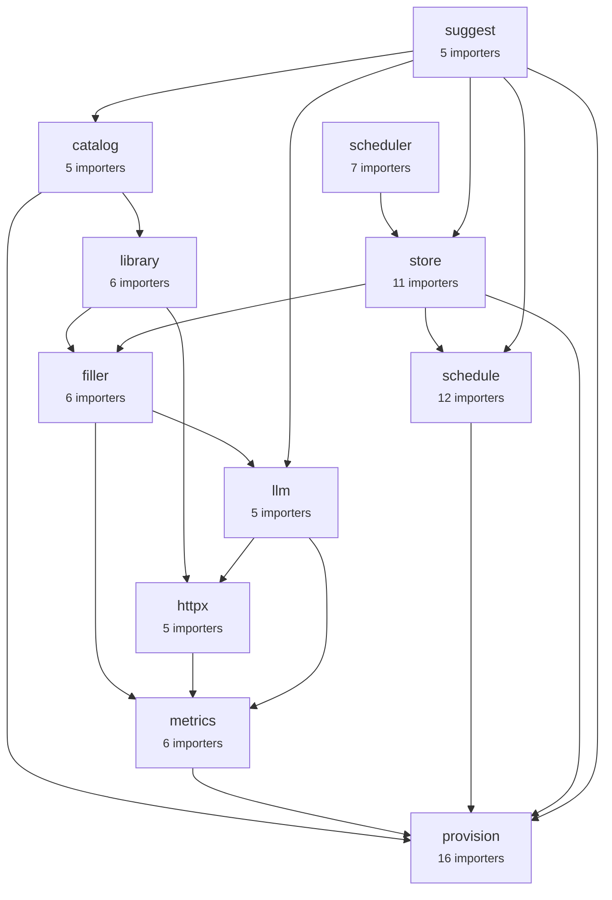
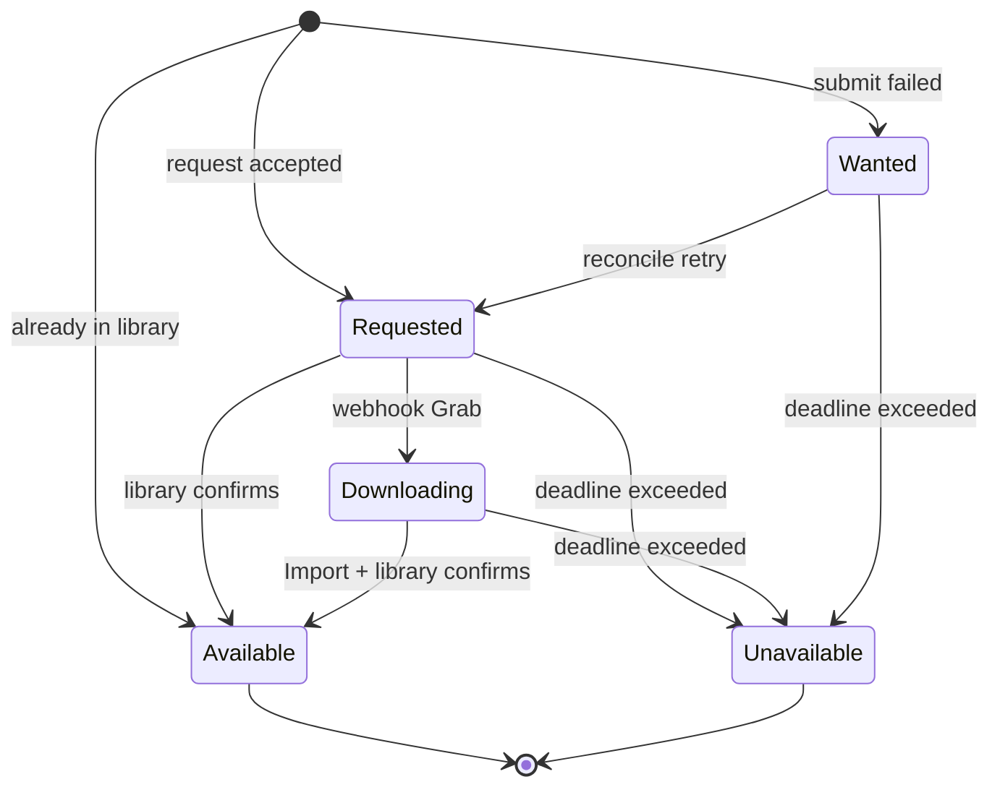
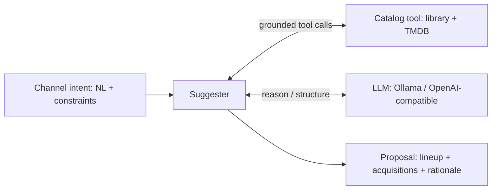

# Virtual Channel Builder — Design Doc

**Status:** Draft for implementation
**Audience:** coding agents + maintainer
**Working name:** `loomarr` — weaves your library into TV channels, and follows the *arr / Servarr naming convention since it lives in that stack (alongside Sonarr/Radarr, which it drives). Container image `loomarr`. Rename freely.

> Supersedes the earlier "Channel Content Provisioner" framing. The app's purpose is to **build and maintain virtual TV channels end to end**: from a natural-language intent, through content acquisition, to a live Tunarr channel that stays filled. "Provisioning" is one subsystem of that, not the product.

---

## 1. Purpose

`loomarr` turns *"I want a channel that feels like X"* into an actual, running Tunarr channel — and keeps it populated as content comes and goes. It closes the full loop:

**intent → suggest a lineup → acquire what's missing → build the schedule → push it to Tunarr → backfill and maintain.**

The app has **five cooperating subsystems**:

| Subsystem | Owns | "Decides…" |
| --- | --- | --- |
| **Suggester** (§8) | intent → proposal | *what* content belongs on the channel |
| **Provisioner** (§3–§7) | acquire missing titles, track to available | *whether/when* content exists |
| **Scheduler** (§9) | build lineup, insert pods, push to Tunarr, backfill | *order, timing, and delivery* |
| **Filler** (§10) | filler ingestion, clip catalog, pod assembly | *what plays in the breaks* |
| **Web** (§12) | human control surface | *approval and oversight* |

### In scope
- Natural-language channel intent → grounded proposal (lineup + acquisitions).
- Acquire missing titles via Seerr (or Sonarr/Radarr) and track each to `available`/`unavailable`.
- **Build channel programming** (order, time-slots, shuffle/blocks) and insert **era/audience-matched commercial pods** with their own filler sourcing pipeline (§10).
- **Push channels to Tunarr** via its API and **reconcile** desired vs. actual channel state.
- **Backfill loop:** go live immediately with available content + filler; swap in real titles as acquisitions land; substitute on give-up.
- Persist all state to **Postgres or SQLite**.
- **Multi-user login with Emby/Jellyfin accounts** (Seerr-style import/sync), roles, per-user quotas, and audited approvals (§11).
- Self-documented HTTP API (§7.1) and an embedded web UI (§12).
- Deploy as a single Docker container.
- **Play out its own channels** (§9.1): serve HLS + MPEG-TS segments and publish an M3U tuner + XMLTV guide that the media server registers directly, with Tunarr as a supported alternative backend rather than a requirement.

### Explicit non-goals
- **Does not manage indexers, download clients, or quality profiles** — that's Sonarr/Radarr's job.
- **Does not replace the media server** — Emby/Jellyfin remain the client, the library, and the thing a viewer actually opens. Loomarr feeds them a tuner; it is not a player.
- **Does not replace Tunarr** — Tunarr stays a first-class playout backend (§9.1), chosen per channel. Hardware that can't transcode, or an install already happy with Tunarr, keeps working unchanged.
- **The provisioner core never chooses titles or auto-acquires** — the suggester proposes and a human (or a quota-gated auto-approve, or a channel's opted-in auto-curate grant — `programming-design.md` §8.2) confirms before anything is acquired or scheduled. Every one of those paths routes through the single `Approve` gate; none writes a `wanted` title directly.

### Design envelope
Sized for a household/homelab, and tests should assume it: **~100k library items, ≤50 channels, ≤20 users, ≤10k filler clips, single media server.** These bounds justify several deliberate simplicities (federated search over indexes, `LIKE` over FTS, client-side list filtering, in-process jobs). Anything beyond the envelope is future work, not a v1 requirement.

---

## 2. Architecture

```mermaid
flowchart LR
  User[Human]
  Web[Web UI]
  SUG[Suggester]
  PROV[Provisioner]
  SCH[Scheduler]
  MS[(Emby / Jellyfin)]
  Seerr[Seerr]
  Arr[Sonarr / Radarr]
  LLM[LLM: Ollama / OpenAI-compatible]
  Tunarr[Tunarr]
  DB[(Postgres / SQLite)]
  FILL[Filler: catalog + pod assembly]
  PLAY[Playout: Loomarr's own streams]
  Clips[/Clip sources: folder, yt-dlp, Archive.org/]

  User --> Web
  Web -->|intent| SUG
  SUG <-->|grounded tool calls| MS
  SUG <-->|reason| LLM
  SUG -->|proposal| Web
  Web -->|approve: acquisitions| PROV
  Web -->|approve: lineup| SCH
  PROV -->|request| Seerr --> Arr
  PROV -->|poll queue: progress / grabbed| Arr
  PROV -->|library scan + GET /Items lookup| MS
  PROV -->|available / unavailable &#40;internal events&#41;| SCH
  SCH -->|build + push channel, filler, flex| Tunarr
  SCH -->|backfill re-push| Tunarr
  Web -->|monitor via SSE| PROV
  PROV <--> DB
  SCH <--> DB
  SCH -->|breaks to fill| FILL
  FILL -->|scan + probe + ingest pipeline| Clips
  FILL <-->|optional: program uuids| Tunarr
  MS -->|filler library source| FILL
  SCH -->|lineup| PLAY
  PLAY -->|MPEG-TS / HLS| MS
  FILL <--> DB
```



⚠ **`filler` and `playout` were absent from this diagram until 2026-08-10** — the former excluded on purpose ("to keep the diagram legible"), the latter because it arrived later as §9.1. They are the 2nd and 5th largest packages in the tree, so the one picture a newcomer reads first was missing roughly a quarter of the system. Legibility is a real constraint, but the fix for a crowded diagram is a second diagram, not a silent omission.

The subsystems are internally decoupled (clean interfaces) but ship in one binary/container by default. The **provisioner's availability events are now an internal feed to the scheduler** — that's what drives backfill. An *optional* outbound webhook/SSE remains for external consumers, but the primary consumer is `loomarr`'s own scheduler.

**Filler flow (§10).** Every clip arrives through a **filler source**, of which there are four kinds: `folder` (a watched directory), `youtube` (yt-dlp), `archive` (Archive.org), and `library` (a dedicated filler library on the media server). Loomarr **scans and probes the files itself** — `ffprobe` for duration, a sparse content hash for identity — and each clip then travels the **ingest pipeline** (V51b), whose rungs transcode, detect language, transcribe, tag, and split compilations. Tunarr is **optional**: when present it registers the folder as a `local` media source and hands back program uuids for filler-lists, and when absent an install running internal playout still has a complete catalog.

⚠ **This paragraph described the reverse of all three of those facts until 2026-08-10** — it said Tunarr scanned the drop-folder and Loomarr synced its catalog *from* Tunarr, that "the media server is not in the filler path at all", and that ingest ran on a separate image variant (retired-ok). The first was the dependency-runs-the-wrong-way bug `filler.Clip` records as fixed; the second stopped being true when sources became pluggable; the third names something that no longer exists. It is kept here, corrected rather than deleted, because §10 notes this area "keeps being re-decided" and a silent edit loses that.

### Boundaries (ports)
Core logic depends only on interfaces; concrete adapters live at the edges.

⚠ **Three of the eight below are Go `struct`s, not interfaces** (2026-08-10): `suggest.Suggester`, `catalog.Catalog` and `events.Bus`. That is not a defect — each has exactly one implementation and inverts its *own* dependencies through narrow interfaces it declares — but the column header said "Interface" for all eight, which sent a reader looking for a seam that is not there. The **Shape** column now says which is which.

| Boundary | Shape | Adapters |
| --- | --- | --- |
| Library | **interface** `Library.Lookup(title) → (itemID, present)` | Emby, Jellyfin (shared impl, flavor-specific auth) |
| Requester | **interface** `Requester.Request/Cancel(title)` | Seerr (default), Sonarr+Radarr (alt) |
| **Programmer** | **interface** `Programmer.Reconcile(channel, lineup)` | **Tunarr** (only impl; abstracted for future ErsatzTV) |
| Suggester | *struct* `suggest.Suggester` | LLM: Ollama (local) or an OpenAI-compatible endpoint (hosted — OpenRouter, or a user-supplied Custom base URL; Claude via OpenRouter) |
| Catalog | *struct* `catalog.Catalog` | Library + TMDB/TVDB — grounds the LLM **and** backs `GET /v1/search` (§7.2) |
| FillerSource | **interface** `filler.FillerSource` | Four source kinds — `folder`, `youtube` (yt-dlp), `archive` (Archive.org), `library` (the media server's filler library). Loomarr scans and probes them itself; Tunarr is optional (§10) |
| Store | **interface** `Store` (see §5) | Postgres, SQLite |
| Events | *struct* `events.Bus` | internal (→ scheduler) + optional outbound webhook |

### Names that do not separate themselves

The subsystem names above map **many-to-many** onto package names, and four packages share two verbs. This is the single most common way to get lost in this tree, so it is written down rather than left to be re-derived. (Renaming them is a live question — see §14.1's rule that a metric is a prompt to read, not a finding — but a rename touches every import and thousands of §-refs, so the table comes first.)

| If you are looking for… | It is in | Not in |
| --- | --- | --- |
| Channel identity, `DesiredLineup`, `ChannelPolicy`, the ordering/relaxation/seasonal math — **pure, no I/O** | `internal/schedule` | `internal/scheduler` |
| The cron/job runner — named jobs, tunable intervals, leases, "Run now". **Nothing to do with TV** | `internal/scheduler` | `internal/schedule` |
| Making a channel real in Tunarr: diff desired-vs-actual, apply minimal calls, own the per-channel mutex | `internal/channels` | `internal/reconcile` |
| The provisioning backstop: claim due titles, retry `wanted`, poll the library, enforce deadlines | `internal/reconcile` | `internal/channels` |
| Turning an **approved proposal** into a channel (create or patch, preserving operator edits) | `internal/binder` | `internal/channels` |
| Periodically re-evaluating a channel's intent and evolving its lineup, through the approval gate | `internal/recurate` | `internal/suggest` |
| The Title/Key identity model and acquisition **state machine** — pure, zero internal deps | `internal/provision` | `internal/reconcile` |
| Operator **connection** flows (Live TV wiring, setup checklist) | `internal/setup` | `internal/config`, `internal/app` |
| Federated **search** over library + TMDB + clips | `internal/catalog` | — |

Two further traps worth naming: **`internal/programmer`** is the port for pushing a channel to Tunarr, and is unrelated to **`docs/programming-design.md`**, which is about `ChannelPolicy` heuristics. And §2's **"Provisioner"** is not one package — it is `provision` + `reconcile` + `requester` + `store`; §9's **"Scheduler"** is `schedule` + `channels` + `programmer`, and does *not* include `scheduler`.

---

<!-- BEGIN GENERATED: package-map — `make arch-docs`. DO NOT EDIT BY HAND. -->

#### Package map

Generated from each package's own doc comment and its imports, so it cannot drift from the code the way a hand-maintained list does. **Layer** is derived: the longest path from that package to one with no internal dependencies. It is the measured layering, not an aspirational one.

Sizes are deliberately absent — they change on nearly every commit, which would make the drift check red by default and train everyone to regenerate without reading.

##### The spine

Packages imported by 5 or more others, and how they sit against each other. Everything else in the tree sits on top of this.



##### Every package, by layer

**Layer 0** — no internal dependencies. These are the vocabulary the rest agrees on.

- **`buildinfo`** · 1 importer
  Carries the version stamped into the binary at build time.
- **`config`** · 1 importer
  Loads Loomarr's ENV-ONLY BOOTSTRAP configuration (config-design §1): the handful of keys needed before the database opens or that describe process topology.
- **`events`** · 2 importers
  In-memory event bus behind SSE (§7 /v1/events, §8).
- **`media`** · 2 importers
  Owns host-wide resources shared by live and background media work.
- **`prepared`** · 1 importer
  Owns immutable, reusable playout publications.
- **`provision`** · 16 importers
  Provisioner domain (design §3–§4): the Title/Key identity model and the acquisition state machine.
- **`settings`** · 1 importer
  Loomarr's configuration subsystem (config-design.md): one typed registry declares every app-managed setting exactly once, and resolution (env > database > default), the Settings API, the wizard, feature gating, and the generated docs all derive from it.
- **`taxonomy`** · 4 importers
  Clip tag vocabulary (§10 V45a): a forest of taxa on independent AXES (product / format / seasonal / audience-cue), the graph that turns a leaf tag like `beer` into its rollups (`alcohol`, `drinks`), and the resolve-or-drop grounding that keeps a model's output on the vocabulary.
- **`web`** · 1 importer
  Embeds the built SPA and serves it same-origin at / (main doc §12).

**Layer 1**

- **`metrics`** · 6 importers · → `provision`
  Loomarr's Prometheus surface (design §7 /metrics, §18).
- **`schedule`** · 12 importers · → `provision`
  Scheduler domain (design §9): the Channel identity, the DesiredLineup / Slot model, and the *pure* computation that turns an approved lineup plus live availability into ordered desired programming.

**Layer 2**

- **`httpx`** · 5 importers · → `metrics`
  Shared outbound HTTP client factory (design §6, §21 phase 1).
- **`playout`** · 3 importers · → `prepared`, `provision`, `schedule`
  Loomarr's own streaming engine (design §9.1): it turns a channel's computed lineup into a continuous MPEG-TS a media server can tune, without Tunarr.

**Layer 3**

- **`llm`** · 5 importers · → `httpx`, `metrics`
  LLM provider abstraction (design §8): one provider-neutral Chat primitive with tool-use, implemented by exactly TWO wire kinds — Ollama (the homelab default) and OpenAI-compatible.
- **`mediatools`** · 2 importers · → `playout`
  Ffmpeg / ffprobe / whisper layer (§10, §14.2): the exec calls, the parsers for what those binaries print, and the shapes they return.
- **`programmer`** · 3 importers · → `httpx`, `schedule`
  Programmer boundary (design §6/§9): the port the scheduler drives to make a Loomarr channel real, plus its only v1 implementation, a thin hand-written Tunarr client (§6: "hand-write a thin client against only the endpoints we use" — not codegen against Tunarr's churny pre-1.0 spec).
- **`requester`** · 2 importers · → `httpx`, `provision`
  Requester port (design §2, §6): it asks a downstream service to acquire a title.

**Layer 4**

- **`filler`** · 6 importers · → `llm`, `mediatools`, `metrics`, `taxonomy`
  Commercials & filler domain (design §10): the clip catalog model and pod assembly.
- **`testkit`** · → `llm`, `programmer`, `provision`, `schedule`
  The shared test doubles and pinned fixtures every test uses (AGENTS.md testing rules: unit tests never touch the network; phases extend the testkit rather than inventing private mocks).

**Layer 5**

- **`clipfetch`** · 1 importer · → `filler`
  Downloads filler clips into the drop-folder (design §10, §16).
- **`library`** · 6 importers · → `filler`, `httpx`
  Library port (design §6, §2 boundaries): a shared Emby/Jellyfin adapter.
- **`store`** · 11 importers · → `filler`, `provision`, `schedule`, `taxonomy`
  Loomarr's persistence abstraction (design §5): one Store interface, two first-class backends (SQLite via modernc.org/sqlite, Postgres via pgx's database/sql shim).

**Layer 6**

- **`activity`** · 3 importers · → `store`
  Records what Loomarr did, for the Dashboard's Recent activity feed (§5, §12, V32).
- **`catalog`** · 5 importers · → `library`, `provision`
  Catalog boundary (design §7.2, §8): federated search over the library + TMDB + the clip catalog, returning grounded Candidates with real external ids and an in_library flag.
- **`scheduler`** · 7 importers · → `store`
  Runs Loomarr's recurring background work as named, tunable, on-demand JOBS (design §18.1) — the model Sonarr/Radarr/Overseerr expose as System → Tasks.
- **`setup`** · 1 importer · → `library`
  Owns the operator connection flows (§7, §13): the Live TV wiring (auto-run on a Connections save — see LiveTVConnector) and the setup-status checklist.

**Layer 7**

- **`auth`** · 2 importers · → `library`, `scheduler`, `store`
  Issues and validates Loomarr sessions (design §11).
- **`channels`** · 2 importers · → `filler`, `metrics`, `programmer`, `provision`, `schedule`, `scheduler`, `store`
  Channel reconcile engine (design §9/§18): the conductor that turns a store.Channel's approved lineup + live availability into an actual, filled Tunarr channel and keeps it that way.
- **`images`** · 2 importers · → `scheduler`
  One pipeline every image in Loomarr travels (§22).
- **`reconcile`** · 1 importer · → `activity`, `library`, `provision`, `requester`, `schedule`, `scheduler`, `store`
  Provisioning backstop (design §4, §7, §18).
- **`retention`** · 1 importer · → `scheduler`, `store`
  Owns the scheduled purges that keep the accumulating tables bounded (§5, §18.1): finished jobs, denied proposals, and old activity rows.
- **`suggest`** · 5 importers · → `catalog`, `llm`, `provision`, `schedule`, `store`
  Suggester (design §8): it turns a channel intent into a grounded proposal (a lineup from the library + an acquisition list of missing titles).
- **`tmdb`** · 2 importers · → `catalog`, `httpx`, `provision`
  TMDB adapter (design §8 grounding): the TMDB-scope corpus for the catalog and the exists-check for acquisition validation.

**Layer 8**

- **`binder`** · 2 importers · → `provision`, `schedule`, `store`, `suggest`
  Materializes an APPROVED proposal onto a channel (§7): create it on first approval, patch it (preserving operator-owned fields) on re-approval or refine.
- **`eval`** · → `catalog`, `library`, `llm`, `provision`, `schedule`, `suggest`, `tmdb`
  Loomarr's semantic-evaluation harness (a §14 Go test binary, NOT a service).
- **`recurate`** · 1 importer · → `catalog`, `provision`, `schedule`, `scheduler`, `store`, `suggest`
  Scheduled channel re-curation (programming-design §8.2): a self-updating channel that periodically re-evaluates its intent against the current library and evolves its lineup — preferring in-library matches, weighting net-new acquisitions by quality + intent, and NEVER bypassing the approval gate.

**Layer 9**

- **`api`** · 1 importer · → `activity`, `auth`, `binder`, `buildinfo`, `channels`, `events`, `filler`, `images`, `media`, `metrics`, `playout`, `provision`, `schedule`, `store`, `suggest`, `taxonomy`, `web`
  Wires Loomarr's inbound HTTP surface (§7).

**Layer 10**

- **`app`** · → `activity`, `api`, `auth`, `binder`, `catalog`, `channels`, `clipfetch`, `config`, `events`, `filler`, `images`, `library`, `llm`, `media`, `mediatools`, `metrics`, `playout`, `programmer`, `provision`, `reconcile`, `recurate`, `requester`, `retention`, `schedule`, `scheduler`, `settings`, `setup`, `store`, `suggest`, `taxonomy`, `tmdb`
  Composition root: it wires every subsystem from an open store into the API handler that cmd/loomarr serves and the integration tests drive.


<!-- END GENERATED: package-map -->

## 3. Provisioner domain model

**Title** — a unit of content the app wants. Identity is an external id, never a title string.
- `MediaType`: `movie` | `series`
- `TMDBID` (canonical for movies; accepted by Seerr for series), `TVDBID` (preferred key for series)
- `Name`, `Year` — logs/request payloads only, never identity
- `Seasons []int` — series only; empty = all

**Key** — stable dedup/identity key, identical whether derived from a `Title` or a webhook:
- series with TVDB id → `series:tvdb:<id>`; otherwise → `<mediatype>:tmdb:<id>`

**Record** — persisted provisioning state: key, title blob, state, library item id, `requested_at`, `deadline`, `attempts`, `last_error`, `updated_at`.

> **Time storage:** persist timestamps as Unix epoch `BIGINT`, not native datetime types — keeps the schema dialect-neutral across Postgres/SQLite.

---

## 4. Provisioning state machine



| State | Meaning | Emits event? |
| --- | --- | --- |
| `wanted` | Requested by app; downstream submission not yet accepted | no |
| `requested` | Accepted by Seerr/*arr; awaiting a release | no |
| `downloading` | A release was grabbed; genuinely in flight | no |
| `available` | Present in the library, schedulable | **yes → scheduler** |
| `unavailable` | Gave up (deadline / unfindable) | **yes → scheduler** |

**Availability is discovered by polling, not (only) by a webhook.** The primary path to
`available` is the scheduled **library scan** (§6, §18.1): a `library-scan` job periodically
lists what the media server has recently added and confirms any in-flight title now present —
the same `LibraryConfirmed` transition the reconciler's deadline backstop applies, but
continuous and not deadline-gated. Correlation matches a scanned item to an in-flight record by
**any** provider id the item carries, not just its preferred one: a series is keyed
`series:tvdb:<id>` when a TVDB id is known but `series:tmdb:<id>` when it was added TMDB-only
(the suggester/channel-add path), while the media server exposes *both* ids on the show — so the
scan probes every key an item can produce, or a TMDB-keyed series would never confirm `available`
even with its episodes present. This mirrors how Overseerr/Seerr work (they are entirely
poll-based; verified). The inbound Sonarr/Radarr webhook (§6 Ingest) is a *latency
optimization* on top of the scan, not the source of truth — and is retired once the scan path
is proven (build plan). A `library-full-scan` runs less often as a safety net for anything the
incremental scan's "recently added" window missed.

### Invariants (cover with tests)
1. **Terminal monotonicity — scoped to the acquisition lifecycle.** Once `available`/`unavailable`, no *provisioning* event regresses it; late/duplicate webhooks ignored. But `available` is a statement about a moment, not a promise about forever: media gets deleted, replaced, or re-id'd after acquisition completes. The **scheduler** therefore revalidates slot items against the library at reconcile time (§9) rather than trusting an old `available` — drift is the scheduler's problem to detect, not a reason to mutate terminal provisioning state.
2. **Only `available`/`unavailable` emit events** — those are the only transitions the scheduler acts on.
3. **Idempotent enqueue.** Safe to enqueue the same title repeatedly; dedup keyed on external id via the store; per-key lock prevents concurrent double-requests.
4. **Library is source of truth.** Even on an import webhook, confirm the library reports the item before `available` — Tunarr reads the library, and there's scan lag.
5. **Deadline discipline.** Every in-flight record has a deadline; a `Grab` webhook resets it to the shorter downloading TTL; past deadline → `unavailable` + downstream `Cancel`.

---

## 5. Persistence — Postgres **and** SQLite

One store abstraction; both backends first-class. It holds **both** provisioning records **and** scheduler state (channels, desired lineups).

```
Store interface:
  # provisioning
  GetTitle/UpsertTitle/ListTitlesByState
  ClaimDueTitles(now, limit)               # concurrency-safe reconcile claim
  # scheduling
  GetChannel/UpsertChannel/ListChannels
  GetDesiredLineup/UpsertDesiredLineup
  GetSeriesEpisodes/UpsertSeriesEpisodes  # §9 series expansion, cached (see below)
  ListStaleSeriesEpisodes(before, limit)  # which shows the refresh job should re-enumerate
  # filler catalog (§10)
  GetClip/UpsertClip/DeleteClip
  ListClips(filter: kind/era/audience/category)
  GetSplitProposal/UpsertSplitProposal/DeleteSplitProposal  # §10 V34: persisted until review
  ListSplitProposals(status)              # §10 V35: the Incoming tab's reels
  SetClipsRemoved(paths, at)              # §10 V35: the ONLY writer of the removal tombstone
                                          #   (the scan's upsert must never write it)
                                          # §10 V38: clips carry `confidence` (0-100) + `auto_filed`
                                          #   — the score is grounding-CAPPED, never self-reported,
                                          #   and auto_filed is what makes an unattended file undoable
  ListFillerSources/UpsertFillerSource/DeleteFillerSource   # §10 V35/V37: ONE flat list, all kinds
                                          #   ⚠ V37: `folder`/`library` are SINGLETON rows
                                          #   materialised from config — never operator-inserted,
                                          #   never removable, so no source is listed twice
  GetPull/UpsertPull/ListPulls(status)    # §10 V35: filler acquisition's approval gate
  # users & sessions (§11)
  GetUser/UpsertUser/ListUsers            # keyed by media-server user id
  CreateSession/GetSession/RevokeSessionsForUser
  # jobs & proposals (§8, §10)
  CreateJob/GetJob/UpdateJob
  ClaimDueJobs(now, limit)                # same SKIP LOCKED pattern as titles
  GetProposal/UpsertProposal
  ListProposals(status[, user])           # approval queue; My proposals
  # settings KV (small, typed accessors over one table)
  GetSetting/SetSetting                   # instance id (§11 DeviceId)
```

### Backend selection
`DATABASE_URL` scheme selects the backend: `sqlite:///data/loomarr.db` or `postgres://…`. Fail fast on unknown scheme.

### Drivers
- **SQLite:** `modernc.org/sqlite` — pure Go, **no cgo** → tiny static image (distroless/scratch). Open with `journal_mode=WAL` + `busy_timeout`.
- **Postgres:** `jackc/pgx` **via its `database/sql` stdlib shim** — decided, so both backends share one store code path (§14).

### Schema & migrations
- Keep SQL ANSI where possible; `INSERT … ON CONFLICT(key) DO UPDATE` works on both.
- **`goose`** (decided, §14) with an **embedded** FS and separate `migrations/sqlite` + `migrations/postgres` dirs so dialect DDL never leaks. Auto-run on startup (`AUTO_MIGRATE=true`).

### Cached series episodes (§9 series expansion)

A series lineup entry expands into its episodes, and enumerating them is a media-server call
per SHOW. That call sat on the **request path**: `GET /v1/guide` re-expanded every series on
every load, so a channel with four shows spent **232ms** in enumeration while a 25-film movie
channel spent 1ms. Profiling put ~90% of the guide's latency there (`ComputeDesiredAt` itself
benchmarks at 45ms for *200* channels, so it was never the cost).

`series_episodes` caches one row per show — its episode list plus `fetched_at` — so expansion
becomes a store read. The **library is still the source of truth**; this is a materialized
answer, never a second opinion:

- **Read path:** `GetSeriesEpisodes(libraryID)`. A miss (or a row older than the staleness
  horizon) falls back to the live call and writes the result back, so a cold cache degrades to
  today's behaviour rather than to an empty channel.
- **Refresh:** the **`series-episode-refresh`** job (§18.1) re-enumerates shows whose rows have
  aged out. Bounded to the shows actually referenced by channel lineups — the set that matters
  is small and known, and sweeping the whole library would cost far more than it saves.
- ⚠ **NOT hung off `library-scan`.** That job correlates *in-flight* acquisitions
  (`requested`/`downloading`) and returns early when none exist, so a show that is already
  `available` — precisely the ones the guide expands — is never revisited. Attaching episode
  refresh there would produce a cache that looks invalidated and never is, on exactly the
  settled installs where the guide is used most.
- **New episodes still appear promptly by the other path:** a newly-landed episode arrives as an
  acquisition, and that already triggers a reconcile + a `channel` SSE frame. The refresh job
  covers the case nothing else does — episodes added to the media server directly, with no
  Loomarr acquisition behind them.

### Airing history (§9 recency-aware placement)

The scheduler had no memory of its own output. Separation (`programming-design.md` §3) constrains
what recurs **within one cycle**; once the cycle wraps, the count resets and the deck replays from
position. A viewer sees the same film every couple of days with no pattern behind it — reported
from the dev "1980s Action Heroes": Akira at Tue 21:53, Fri 13:33, Sat 02:10, Mon 01:30.

`airings` records one row per programme aired — `{channel_id, key, library_item_id, aired_at}` —
written from playout at the moment a programme is resolved for streaming. It is the programme
analogue of `RecordClipPlay` (§10 V28), which already does exactly this for commercial clips: the
same write point, the same best-effort posture, and for the same reason (you cannot rotate what
you cannot remember).

- **Write path:** the playout resolver knows what it is about to stream, so the write costs no new
  lookup. **Best-effort:** a failed insert is logged and the programme still airs — telemetry must
  never be able to take a channel off the air.
- **Read path:** `LastAiredByChannel(channelID)` returns the most recent airing per key, which is
  all the scheduler needs. One row per distinct key, not the full history.
- **Loomarr's own output, not viewer behaviour.** This deliberately does not touch the media
  server's per-user watch state (`UserData`): that is a different signal with a per-user "whose
  history counts?" question and privacy implications. This is the system remembering what it
  broadcast — the minimum a human programmer does.
- **Retention:** rows older than the janitor's horizon are purged like every other accumulating
  table (below). History beyond the longest recency horizon has no reader.

`activity` records what Loomarr did, one row per notable event — `{id, at, kind, level, text,
subject_id}` — for the Dashboard's **Recent activity** feed (§12, V32).

- ⚠ **Written at each domain TRANSITION, not at the event bus.** Publishing to the bus is one
  line and would look like a free feed, but the bus is deliberately **in-memory and lossy**
  (`events/bus.go`: *"a dropped event is a latency bug, not a correctness bug"*) — so a feed
  built on it would silently lose rows under load, which is exactly what a persisted feed
  exists to prevent. It is also domain-neutral: it knows `{type: "title"}`, not *"Darkwing Duck
  landed — CH 42 slot 05 backfilled in place"*. The subsystem making the change is the only
  place that knows what actually happened, so that is where the row is written.
- **Best-effort, exactly like `airings`.** A failed insert is logged and the operation
  continues. Recording that a title landed must never be able to stop it landing.
- **`text` is composed at the write point and stored**, not templated at read time. A feed row
  is a historical record: re-rendering it later against current data would let last week's entry
  change its wording when a channel is renamed, which is the opposite of an audit trail.
- **`level`** (`info` | `warn` | `error`) drives the mock's coloured dot. Bounded, not free
  text, so the UI cannot receive a colour it has no rendering for.
- **Read path:** `ListActivity(limit)` — newest first, and nothing else. The feed is a glance,
  not a query surface; a filterable log is a different feature (§20).
- **Retention:** `activity.retention` (§15), purged by the `activity-purge` job (§18.1). ⚠ The
  key is **consumed in the same PR that declares it**. `jobs.retention` and
  `proposals.retention` were declared long ago and are read by **nothing** — no purge exists
  for either table — which is the same dead-setting shape V12 found in `backup.retain`. Adding
  a third would make the Advanced settings page a list of promises. *(Those two remain open;
  they are a pre-existing gap, not this phase's.)*

⚠ **A recency signal cannot make repeats rare on a small library, and must not pretend to.** The
arithmetic is unforgiving: a 24h day consumes ~13 films, so a channel needs ~168h of content to
avoid repeating inside a week. The dev channel has 34 titles ≈ 62h — a 3-day no-repeat is already
*impossible* there, let alone 7. That is why placement consumes this as a **soft ranking signal**
(`programming-design.md` §3.1) rather than a hard constraint with a ladder step: a constraint that
is unsatisfiable on every real run produces a relaxation note on every real run, which teaches
operators to ignore the ladder. The signal spreads airings evenly and stops a title clustering near
its own last showing; only more content fixes the underlying frequency, which is what re-curation
and adjacency candidates (`programming-design.md` §8.2/§8.3) exist to supply.

### Retention & janitor
State accumulates; a **janitor** (piggybacking the reconciler ticker) enforces retention so a year-old install isn't dragging a landfill:
- **Sessions:** sliding TTL, `SESSION_TTL` default 30d; expired rows purged. (Without this, sessions live forever — both a growth and a security problem.)
- **Activity:** feed rows purged after `activity.retention` (default 30d) by the `activity-purge` job (§18.1, V32).
- **Jobs:** finished jobs (`done`/`failed`) purged after `JOBS_RETENTION` (default 30d) by the `retention-purge` job (§18.1). A `queued` or `running` job is never purged regardless of age — age is not evidence that work finished, and deleting a running job's row would strand the worker holding its lease.
- **Proposals:** `denied` purged after `PROPOSALS_RETENTION` (default 90d). ⚠ **`approved` and `submitted` are kept indefinitely**, for different reasons: an approved proposal is the audit trail behind `approved_by` (the record of a decision that spent real resources), and a `submitted` one is a member still waiting for an answer — ageing it out would silently discard a request rather than decline it.
  - ⚠ **Purge order is proposals, then jobs.** `proposals.job_id` has no foreign key, so the constraint is ours to keep: removing a job first would leave a proposal pointing at nothing. Verified that no read path joins the two (`job_id` is diagnostic provenance; the proposal endpoint does not resolve it), so an orphan is cosmetic rather than broken — but a purge that creates one on every run is a purge that makes the data harder to reason about for no gain.
  - *These two keys were declared long before they were read — the same declared-but-unconsumed shape V12 found in `backup.retain` and V32 avoided for `activity.retention`. This section described the purge as shipped for several phases while it did not exist.*
- Filler catalog sync (§10) already removes clips that vanished from the media server.

### Concurrency consequence of supporting Postgres (important)
SQLite ⇒ **single instance**. Postgres enables **replicas**, which changes reconcile correctness:
- `ClaimDueTitles` on Postgres uses `SELECT … FOR UPDATE SKIP LOCKED` (or an advisory-lock leader) so two replicas don't both fire a give-up/retry — the reason it's a distinct method, not a plain list.
- On SQLite it's a straight query.
- **Run exactly one replica with SQLite.** Scale horizontally only with Postgres + row claiming.

### Migrating SQLite → PostgreSQL (V11)

An install that outgrows SQLite can move without an export/import dance: **Settings → System →
Database** runs a six-stage stepper — connect → preflight → backup → migrate → verify → restart.
Only this direction is supported; the reverse is served by the backup file plus reverting one
config line.

**The invariant: the source is only ever READ.** Every failure mode ends with the operator still
running on the database they started on, which is what makes "roll back by reverting one config
line" true rather than aspirational. Nothing in the copy writes to, vacuums, or locks the source
beyond its read transaction, and the destination is never switched to until parity passes.

| Stage | What it does | Why it is its own stage |
| --- | --- | --- |
| Connect | Takes the target DSN | — |
| Preflight | Reachable · version ≥ 13 · **target is empty** · privileges · UTF8 encoding | Fails while failing is free; can send you back to fix the target |
| Backup | Writes a server-side snapshot into `backup.dir` | **A gate, not a step** — see below |
| Migrate | Copies every table, streaming progress as `database` SSE frames | — |
| Verify | Re-counts BOTH sides independently; a mismatch aborts | A copy that reports success is a claim; parity is the evidence |
| Restart | Persists the new `DATABASE_URL` to the bootstrap file | Copying data and changing which database the app answers from are different commitments |

Four rules that are not negotiable, each because the obvious alternative is subtly wrong:

1. **The backup gate is enforced server-side.** The UI disables Migrate until a backup exists, but
   that is a hint: anything a client can satisfy, a client can skip. The server refuses a migrate
   call unless *it* wrote a backup for this migration. This is why `WriteBackup` writes a real file
   rather than streaming one to the browser — a download leaves no evidence.
2. **The table list AND the copy order come from the destination catalog.** goose builds the
   destination from the same embedded migrations, so its live catalog *is* the schema by
   construction. A hardcoded list drifts (this repo's own `TRUNCATE` list had already drifted to 8
   of 10 tables), and the order is load-bearing: `sessions.user_id REFERENCES users(id)` is NOT
   DEFERRABLE, so a topological sort over the catalog's FK graph is what keeps inserts legal.
   `goose_db_version` is never copied — the destination earns its own.
3. **Values are coerced by the DESTINATION's column type.** Everything is scanned as a string,
   which makes the SQLite-INTEGER/Postgres-BOOLEAN divergence a non-event (both drivers parse
   `"0"`/`"1"` correctly). Binary is the real exception — routing a BLOB/BYTEA column through a Go
   string corrupts every byte that is not valid UTF-8. ⚠ **The schema currently has no binary
   column at all.** `channel_icons.bytes` was the only one and it retired with the table in V52
   phase 8 (§22), so the coercion branch is defensive rather than exercised, and the test that
   proved it (`TestIconBytesSurviveMigration`) could not be rewritten against a real table. Keeping
   the branch means the next binary column added does not silently arrive mangled; the cost is a
   path no test covers. *(Named here as the historical example, not a live column — retired-ok.)*
4. **Preflight refuses a populated target.** "Wipe it and retry" is safe advice only because this
   check guarantees there was nothing there to lose.

**An env-pinned `DATABASE_URL` makes this copy-only.** Env always wins at boot (§15), so writing
the bootstrap file would produce a switch that silently does not happen. The server refuses the
switchover and the UI says so up front, rather than after a backup and a full copy.

---

## 6. External contracts

### Client resilience defaults (apply to every adapter below)
Every outbound client is built from a shared HTTP factory with **hard timeouts**: media server 10s, Seerr 10s, TMDB 10s, Tunarr 20s (lineup pushes are chunky), LLM 120s per call. **Retry philosophy:** jittered-backoff retries only for idempotent GETs; *writes never client-retry* — write recovery is owned by the idempotent reconcile loops and periodic sweeps, which is why they exist. A down dependency degrades the relevant feature (and lights up the §13 checklist), never wedges the process.

### Library — Emby & Jellyfin
Both share `GET /Items?Recursive=true&AnyProviderIdEquals=<provider>&IncludeItemTypes=<Movie|Series>&Limit=1`; provider `tmdb.<id>` / `tvdb.<id>`; present iff `Items` non-empty → `Items[0].Id`. Use **header** auth (never `api_key` query param — leaks to logs; Jellyfin deprecates legacy auth from 10.11+):
- Emby: `X-Emby-Token: <key>` · Jellyfin: `Authorization: MediaBrowser Token="<key>"`

Flavor via `LIBRARY_FLAVOR`. **Season precision default:** `SEASON_PRECISION=series` — a series counts as in-library if the show exists; `seasons` mode (verify each requested season before `available`) is the stricter opt-in. Caveat to encode as a TODO: provider-name casing in `AnyProviderIdEquals` can differ across versions — if a known-present title returns empty, check casing first.

**Bulk scan (poll-based availability, §4 + §18.1).** Beyond the id-only `Lookup`, the library adapter exposes two bulk reads that drive the `library-scan`/`library-full-scan` jobs — one call returns *many* items with their provider ids, so availability is confirmed without an N-lookup storm:

- `RecentlyAdded(since)` — `GET /Items?Recursive=true&IncludeItemTypes=Movie,Series&SortBy=DateCreated&SortOrder=Descending&MinDateLastSaved=<since>&Fields=ProviderIds,ProductionYear`. The incremental 5-minute path: only what changed since the last scan.
- `AllItems()` — the same query without `MinDateLastSaved`: the periodic full sweep (safety net for anything the incremental window missed).

Both return `[]SearchResult` (the existing shape carrying `LibraryItemID` + `TMDBID`/`TVDBID`), one code path for both flavors (auth-only divergence, as with every `/Items` call). The scan job builds a `provision.Key` from each returned item and confirms any in-flight (`requested`/`downloading`) title whose key matches — applying `LibraryConfirmed` → `available`. Key parity (same key from a `Title`, a webhook, or a scan item) is what makes this correlation exact.

**Collections / BoxSets (for `scope.collections`, programming-design §2.2).** The same `/Items` surface, two reads:

- `Collections()` — `GET /Items?IncludeItemTypes=BoxSet&Recursive=true&Fields=ChildCount&SortBy=SortName`. Lists the operator's curated collections (id + name) so the channel editor can offer a picker. Emby and Jellyfin both model a collection as an item of `Type: "BoxSet"`.
- `CollectionMembers(id)` — `GET /Items?ParentId=<id>&Recursive=true&Fields=ProviderIds`. Returns the members as ordinary `Movie`/`Series` items, so membership maps onto a `provision.Key` with no second lookup — the same `[]SearchResult` shape and the same key-parity property the bulk scan relies on.

**Verified live against Emby 4.10** (2026-07-30), which settled the two open questions: `ParentId=<boxset>` DOES enumerate members (109 returned for a 109-title collection), and members carry full `ProviderIds` (`Tmdb`/`Tvdb`/`Imdb`), so membership maps onto a `provision.Key` with no second lookup. ⚠ **`ChildCount` is NOT returned by Emby even when requested via `Fields=`** — treat it as optional and render around its absence; it is on `LibraryCollection` because Jellyfin may supply it, never as something to rely on.

⚠ **Collections are not the small hand-curated set the name suggests.** A real library returns ~125, roughly 90% of them auto-generated one-per-franchise groupings ("Alien Collection"), because Kometa and similar tools write them in bulk. Any UI over this must assume hundreds and rank the hand-made ones first (§12); a flat list buries the handful that carry a decision.

**User auth & listing (for §11):** `POST /Users/AuthenticateByName` (body `{Username, Pw}`) validates a user's credentials — Jellyfin requires the `Authorization: MediaBrowser Client="…", Device="…", DeviceId="…", Version="…"` header on this request even without a token; Emby accepts the equivalent `X-Emby-Authorization`. `GET /Users` with the admin `LIBRARY_TOKEN` lists users (id, name, `Policy.IsAdministrator`, `Policy.IsDisabled`) for import/sync. Both live in the same flavored adapter as `Lookup`.

### Requester — Seerr (default) or direct Sonarr/Radarr

A `requester.provider` setting (`seerr` default, or `arr`) selects the acquisition backend. The wizard/Settings show the `seerr.*` fields OR the `sonarr.*`/`radarr.*` fields via `ShowWhen` on the provider (mirrors `llm.provider`). Both implement the same `Requester` port (`Request`/`Cancel`) plus a `Reachable` probe for the Test button; the app branches on the provider at construction.

**Seerr (default).** `POST {SEERR_URL}/api/v1/request` (header `X-Api-Key`), body `{mediaType, mediaId=TMDBID, seasons}`. Treat **201** and **409** as success (idempotency). Seerr supports Emby/Jellyfin/Plex natively. **Operational trap:** Seerr has its own approval workflow — if Loomarr's API user lacks auto-approve permission in Seerr, every Loomarr-approved acquisition stalls in a *second* pending queue and deadlines expire. The integrations doc (§13) must instruct: grant the Loomarr service user auto-approve in Seerr; the troubleshooting page covers the "everything stuck in `requested`" symptom.

**Direct Sonarr/Radarr.** Routes movie→Radarr, series→Sonarr (header `X-Api-Key`), each built dynamically like Seerr (conn closures, `httpx.TimeoutArr`). Per title:
- **Request:** `GET /api/v3/{movie,series}/lookup?term={tmdb,tvdb}:<id>` to resolve the arr's payload, then `POST /api/v3/{movie,series}` with `qualityProfileId` + `rootFolderPath` + `monitored:true` + an add-options search trigger. An already-added title (arr returns **400/409**) is treated as success — the same 2xx-or-conflict idempotency rule as Seerr.
- **Quality profile / root folder:** auto-picked (first of `GET /api/v3/qualityprofile` and `/api/v3/rootfolder`) unless overridden by `sonarr.quality_profile`/`sonarr.root_folder` (+ radarr). This keeps the common path zero-config while letting a power user pin them.
- **Cancel:** a *real* withdrawal (unlike Seerr's no-op) — DELETE the matching `GET /api/v3/queue` record so a given-up title stops downloading.
- **Reachable:** `GET /api/v3/system/status` on each configured arr — validates URL + key for the Test button (a dead host is a transport error, a bad key 401).

Availability under the direct requester comes from the same **library scan** (§4, §18.1) as Seerr, plus the arr **queue poller** (`arr-queue-poll`, §18.1): it reads each arr's `/api/v3/queue`, promotes a title with a live download record to `downloading` (`Grabbed`), and **persists progress on the title record** (`progress`/`eta_text`/`download_status`, surfaced by `GET /v1/titles`). Never an inbound webhook.

### Programmer — Tunarr
The scheduler drives Tunarr's REST API (documented OpenAPI at `tunarr.com/api-docs.html`): channels CRUD, programming/lineup, filler lists, flex, custom shows. **Decided: hand-write a thin client** against only the endpoints we use — generating from Tunarr's full pre-1.0 spec would couple us to its schema churn. Pin and record the Tunarr version tested against in the README. Tunarr ships with no authentication (Phase-0 finding: empty `securitySchemes`) and Loomarr reaches it machine-to-machine on the same network, so there is **no Tunarr API-key config** — just the URL. (An operator who fronts Tunarr with their own auth proxy would terminate that at the proxy; Loomarr does not model it.) Tunarr owns transcoding/streaming/EPG/HDHR+M3U output; `loomarr` owns lineup + filler. **Important:** Tunarr must have the same Emby/Jellyfin library configured as *its* media source **with that library enabled and scanned** — Tunarr streams the underlying files and indexes them into its own program table. `loomarr` and Tunarr agree on titles via the library.

**Loomarr wires this for the operator** (`POST /v1/setup/tunarr-connect`, admin — §7): it ensures the Emby/Jellyfin media source exists in Tunarr, then enables the movie + show libraries and triggers a scan — the same **enumerate-first, idempotent** pattern as the Live TV wiring (below) and filler (§10). It reuses Loomarr's **existing admin API key** as the source's access token (Tunarr accepts the admin `X-Emby-Token` directly — verified against Tunarr 1.3.8 + Emby 4.10; no separate Emby *user* login, so Loomarr stores no extra credential). This closes a **silent-failure** gap: without the scan, a channel's slots find no Tunarr program and degrade to flex/dead-air (§9), yet the rest of the wizard reads all-green — so `/v1/setup/status` carries a **`tunarr_library`** check that fails until the source is wired + scanned. Division of labor is unchanged (§6/§1): Tunarr still owns streaming/indexing; Loomarr only performs the one-time setup the operator would otherwise do by hand. It does **not** poll or re-scan on a timer — the one exception is *demand-driven*: a reconcile that finds a program slot Tunarr hasn't indexed yet triggers a library scan so that content becomes playable (§ Content-id resolution below), which is a targeted response to real unresolved content, not a routine background sweep.

**Content-id resolution (Programmer adapter).** A lineup slot carries the *media-server* item id (the Emby/Jellyfin id, from the provisioner). Tunarr's manual-programming API does **not** accept that id directly — a programming entry references Tunarr's *own* program id (a stable uuid Tunarr assigns when it scans the item). So the adapter resolves media-server-item-id → Tunarr-program-id before pushing: it reads Tunarr's persisted library index (`GET /api/media-libraries/{libraryId}/programs`, where each program carries `identifiers[{type:"emby"|"jellyfin"},…]` + its uuid) and builds a cached `{external item id → program uuid}` map (refreshed on a miss / TTL). This covers movies and TV episodes uniformly (episodes are indexed individually; a series pick expands to its episodes' ids). If a slot's item isn't in Tunarr's index yet (library not scanned, or a just-landed acquisition Tunarr hasn't picked up), that slot degrades to flex — never dead air (§9) — and resolves on a later reconcile once Tunarr has scanned it. **To close that gap without waiting on Tunarr's own scan cadence, a reconcile that produced any unresolved program slot triggers a Tunarr media-library scan** (`POST /api/media-sources/{src}/libraries/{lib}/scan`, each non-`local` source's enabled libraries) so the next reconcile finds the now-indexed episodes and promotes those flex gaps to real content. It is **debounced** (one scan pass per reconcile-that-had-misses) and **best-effort** (Tunarr scanning is async + idempotent, the flex fallback is already on-air, and a scan failure never fails the push). NB: Tunarr's browse endpoint (`/api/emby/{src}/libraries/{lib}/items`) returns *ephemeral* handles that change per request; only the persisted `/programs` index yields ids valid for programming.

### Live TV wiring — Tunarr → Emby/Jellyfin (tuner + guide)

For Loomarr's channels to appear in the family's TV guide, the media server must consume Tunarr's **tuner + guide** surface. This is **one-time wiring of Tunarr as a tuner/guide source — never per-channel registration.** Once wired, every channel Loomarr creates/renames/deletes propagates through Tunarr's M3U/XMLTV output; Loomarr then pokes the media server so the change appears in minutes rather than after its nightly refresh. **The poke is operation-specific (§9):** a *new or removed* channel needs a **tuner re-scan** (re-read the M3U channel list — a guide refresh alone won't surface it); an *existing* channel's lineup change needs a **guide refresh** (EPG data).

- **Endpoints (both flavors, Emby lineage):** `POST /LiveTv/TunerHosts` (type `m3u`, `Url` = Tunarr's playlist URL) and `POST /LiveTv/ListingProviders` (type `xmltv`, `Url` = Tunarr's guide URL), using the admin `LIBRARY_TOKEN`. **M3U is preferred over HDHomeRun emulation** — explicit and discovery-free, so registration is deterministic.
- **One-time & never silent.** There is no per-channel media-server call, ever. Wiring happens once, as a consequence of the operator saving their Tunarr connection — it is idempotent and fully derived from that connection, so it auto-runs on a Connections save rather than needing a separate button (`autoWireAfterSave`; the `livetv` setup check reports the result). Loomarr never reconfigures a media server unasked: saving the connection *is* the ask. `POST /v1/setup/livetv-reconnect` (admin — §7) force re-wires when a stale channel→stream binding needs clearing. *There is no `livetv-connect` route; it was removed when the wiring became automatic, and `scripts/check-retired.sh` now bans the name.*
- **Idempotent & self-healing on URL change.** Enumerate first via **`GET /System/Configuration/livetv`** — one read that returns `{TunerHosts, ListingProviders}` — and if Tunarr is already registered the connect is a no-op. Duplicate tuners are a classic Emby mess; tests assert **second-call-no-op** (Phase 10 gate). **Reconcile is by *identity*, not URL string.** Loomarr tags every tuner it registers with `FriendlyName: "loomarr"`, so `Connect` owns exactly the tuners it created: when the Tunarr URL *changes* (the operator repoints `TUNARR_URL`), enumerate-first finds a Loomarr-owned tuner whose `Url` no longer matches the desired M3U, **DELETEs the stale one** (`DELETE /LiveTv/TunerHosts?Id=<id>` → 204, Phase-0 capture), and registers the new — so a URL change *moves* the tuner instead of orphaning a dead one alongside a live one. A tuner the household added by hand (any other `FriendlyName`) is **never touched** (§9 ownership: Loomarr owns only what it created). Listing providers carry no `FriendlyName`, so the stale one is identified as the Loomarr-shaped `xmltv` provider whose `Path` is a Tunarr guide URL that no longer matches; it is likewise DELETEd (`DELETE /LiveTv/ListingProviders?Id=<id>` → 204) and re-added. **A connect that changed anything (added or retired a tuner/listing) then pokes the media server — a tuner re-scan *and* a guide refresh — so the freshly-registered tuner's channels are discovered and their EPG populated immediately, rather than after the media server's nightly scan** (the newly-wired tuner has zero channels in the media server's view until it re-reads the M3U — a guide refresh alone won't surface them; §9 poke semantics). Both pokes are **best-effort**: a poke failure degrades freshness but never fails the wiring. A no-op connect (nothing changed) skips the pokes — there is nothing new to discover. *The Emby-lineage `GET /LiveTv/TunerHosts` / `GET /LiveTv/ListingProviders` are **write-only on Jellyfin** — `POST` works, `GET` returns **405** (verified against Jellyfin 10.10.3). Enumerating through them therefore failed on every Jellyfin install, so the idempotency check could not run and the connect either errored or duplicated the tuner on each attempt. The Phase-10 capture was Emby-only, which is how it survived: §6 claims both flavors, and only Emby was ever exercised. The config endpoint answers 200 on **both**, so this is one code path rather than a flavor branch.*
- **Version fragility → live capture.** The endpoints exist on both flavors, but **payload fields and the guide-refresh task id drift across versions.** A Phase-0-style maintainer-supervised capture (folded into Phase 10, §21) pins the exact accepted request/response payloads + the guide-refresh task id from the real Emby/Jellyfin into `internal/testkit/fixtures/`; the adapter is written against those pins, not memory. Any contract deviation ⇒ update this doc first.
- **Division of labor is unchanged (§1 non-goals):** Loomarr decides *what plays and when*; Tunarr owns playout/transcode/EPG and the HDHR/M3U/XMLTV tuner surface; Emby/Jellyfin consume that tuner + guide like any HDHomeRun. Loomarr never builds streaming; the escape hatch is a second `Programmer` adapter (ErsatzTV).

### Suggester / Catalog — LLM
See §8. Provider-neutral; Ollama (local) or any OpenAI-compatible endpoint (hosted); catalog tool grounds it against the real library + TMDB. In-app provider/model selection with live probe + hot-swap: §8.1.

---

## 7. HTTP API

| Method | Path | Purpose |
| --- | --- | --- |
| POST | `/v1/titles` | Enqueue/ensure a title. Idempotent. |
| GET | `/v1/titles/{key}` | Provisioning state for a title. |
| GET | `/v1/titles?state=…` | List, filter by state. |
| DELETE | `/v1/titles/{key}` | Give up / cancel. |
| POST | `/v1/channels` | Create a channel (admin). From an **approved proposal** (`intentRef` → its grounded lineup + policy), a **hand-made single-series** channel (`series`), or an **empty hand-made** channel (neither given → name/number/strategy only, no lineup — then fill it via the manual lineup editor or Refine-with-AI on its page). The channel **`id` is optional**: the client may pass a stable caller-assigned id, or omit it and the **server assigns one** (`ch_…`) — so the UI's "New channel" action needs no client-side id scheme. Duplicate id or number → 409. |
| GET | `/v1/channels` / `/v1/channels/{id}` | Channel definition + current status. The **single-channel** GET additionally resolves each lineup entry's `state` — `available` (in the library, plays now), `acquiring` (wanted/requested/downloading — on its way), `pending` (added but nothing requested it yet — the manual-add case with no provision Record), or `unavailable` (acquisition gave up) — derived from the `provision.Record` per key, so the editor's "not here yet" badge is durable across reloads rather than known only at add-time. The list endpoint omits per-entry state (its cards show counts, not entries) to avoid an N-query fan-out. |
| PATCH | `/v1/channels/{id}` | Edit a channel (admin). A **partial** update of the identity fields (`name`, `number`, `group`, `logo`), the per-channel programming `policy` (§8, `programming-design.md`), `status` for pause/resume (`paused`↔`building` only), and the **`lineup`** entries. Renumber is unique-checked (409 on a collision). `policy.applied` is reconcile-owned and rejected on write. **Policy ownership is sticky (§8.2 / `programming-design.md` §2):** the `policy` blob mixes proposal-owned fields (scope, audience, ordering, separation, seasonal — the suggester extracts them) with operator-owned ones (filler, window, auto-curate). A PATCH that sets a proposal-owned field **marks it operator-set**, and a later refine/re-curate then **cannot overwrite it** (untouched fields still refresh from the fresh proposal); the audience ceiling is additionally never relaxed. Curation `rules` carry **provenance** (`llm` or `operator`): a refine replaces only the LLM-authored rules and preserves the operator's, so shaping rules by refine and by hand compose instead of clobbering. **Every edit auto-reconciles** (best-effort, like create) — there is **no manual "rebuild" step**; the change reaches Tunarr on its own and the UI reflects it live via the `channel` SSE frame. **Editing the lineup** is a **whole-list replace** (the client sends the full ordered list of entries): add = a new entry, remove = an omitted entry, reorder = the same entries in a new order — one idempotent payload, diffed server-side. Each entry's `key` is validated (`provision.ParseKey`; a malformed key → 422). The handler mutates `ch.Lineup` only and lets the reconcile derive `desired` — it never computes slots itself (§9). Entries that carry richer scheduling metadata already on the channel (a series' season range, `officialRating`, runtime) are **preserved by key**: an incoming entry whose key already exists keeps that metadata; the read DTO is deliberately lossy, so a reorder must not silently drop a season scope. **Safety (prime directive #3):** a manually-added key that is not `available` in the library is inert — it renders as a **pending slot** (flex to Tunarr, never content) and swaps to a program in place only if/when that title independently reaches `available` through the acquisition pipeline. Manual editing therefore cannot make unapproved content play, and does not itself trigger acquisition. |
| POST | `/v1/channels/{id}/refine` | Refine a channel with the LLM (admin). Takes free-text ("add more Schwarzenegger, drop the slow ones"); builds an intent from the channel's **current lineup** + the ask, runs the SAME grounded suggester → proposal (§8), and returns a `jobId`. Approving that proposal patches THIS channel (idempotent on its `intentRef`, same as re-approval). The review shows a **diff** (kept / added / removed); an approve step appears **only if the re-proposal actually differs**. This is the "shape a channel over time by talking to it" path — no create-a-channel-from-scratch detour. |
| GET | `/v1/channels/{id}/pods` | Preview the commercial pool this channel would get from its **saved** filler selection (§10, §12). Assembles WITHOUT touching Tunarr, through the same code path and seed as reconcile, so preview and reality cannot disagree. Returns the ordered entries, total duration, and the `matchLevel` reached on the fallback ladder — the answer to "why are my commercials wrong". Read-only, so any authenticated user may call it. |
| POST | `/v1/channels/{id}/pods/preview` | Preview the pool a **draft** filler selection would produce, WITHOUT saving it (§10, §12) — the live sandbox on the channel's Filler section. Body is a `FillerSelection` (the unsaved draft); the handler runs the SAME assembler as `GET …/pods`/reconcile but with the draft in place of the persisted selection, and returns the SAME shape (entries + `matchLevel` + total). One assembler ⇒ the sandbox shows exactly what will air once applied. Admin-only (it's an authoring tool); applying is a normal `PATCH …/{id}` of `policy.filler`. |
| POST | `/v1/channels/{id}/programming/preview` | Preview a **whole-definition draft** `{lineup?, policy?}` (§8.1) — the cycle slots (which rule wins at `at`, the resolved window) **and** the assembled break pool — WITHOUT saving or touching Tunarr. Generalizes `GET …/cycle` + `POST …/pods/preview` into one call over an unsaved edit; runs the SAME `ComputeDesiredAt` + pod assembler as reconcile, so the preview can't drift from what applying it would ship. Omitted lineup/policy fall back to the saved value. Admin-only (an authoring tool). |
| GET | `/v1/programming/vocabulary` | The closed WHEN/WHAT/HOW curation-rule presets (§6.6): each token + label + the value the BE lowers it to. The rules editor renders its picker from this and lowers identically to the server, so the FE no longer hand-mirrors the lowering table (drift-killed). Read-only; any authenticated user. |
| POST | `/v1/channels/{id}/reconcile` | Force desired→Tunarr reconciliation. Internal/idempotent (§9); NOT a user-facing "rebuild" — edits reconcile automatically, and the periodic sweep is the guarantee. |
| DELETE | `/v1/channels/{id}` | Remove channel; `?purge=true` also deletes the Tunarr channel (default detaches only). |
| POST | `/v1/proposals` | Start a suggestion job from an intent. |
| GET | `/v1/proposals?status=…&mine=true` | List proposals by status (`submitted` = the admin approval queue). **`mine=true` scopes the list to the caller's own proposals** — the "My requests" surface (§12). Scoping is resolved **server-side from the session**, never from a client-supplied user id: a `?user=` parameter would let any member read another's requests by editing a URL. A break-glass `API_TOKEN` caller has no user record, so `mine=true` returns **empty** rather than everyone's — an unscopable caller asking for "mine" must not silently receive all. |
| GET | `/v1/proposals/{id}` | Job status + proposal (the source of truth on SSE reconnect; generation progress streams over `/v1/events` as `suggestion` frames, not a per-job endpoint). |
| POST | `/v1/proposals/{id}/approve` | Approve (admin) → enqueue acquisitions **+ create/patch the channel**, returning its id. This is the primary path from an approved intent to a live channel — §13's flow is describe → review → approve, so **the everyday way to make a channel is to describe one, not fill out a form** (the two other origination seeds — a hand-made single-series or empty channel via `POST /v1/channels` — are express doors into the same object, not a separate "create screen" model; see §12 origination-vs-evolution). **Idempotent on `intentRef`** (the suggestion job id): re-approving the same intent patches that channel rather than minting a second one. The channel is created `building` with the proposal's lineup + grounded policy, then reconciled immediately (§9 "live immediately — never dead air"). **Number** = the lowest free positive integer, so an operator never has to think about numbering to get on air; **name** = the intent description, trimmed to a channel-sized label. Both are ordinary editable fields afterwards (§7 `PATCH /v1/channels/{id}`) — the point is that approving is *sufficient*, not that the derived values are final. A channel is **shaped over time** after creation: direct edits (name/number/rules/lineup) via `PATCH`, or by *refining* it with the LLM (`POST /v1/channels/{id}/refine` → review the diff → approve → the same idempotent patch). |
| POST | `/v1/proposals/{id}/deny` | Deny (admin) with optional reason; proposal → `denied`, member sees it in My proposals. |
| GET | `/v1/filler` | List clip catalog; filter by kind/era/audience/category/untagged, plus `q` for a `name LIKE` search (§7.2 — clip search lives here, not in `/v1/search`). |
| PATCH | `/v1/filler/tags` | Edit a clip's tags — including **confirming an era suggestion** (§10): setting `era` on a clip that carries one clears the suggestion. The suggestion itself is never settable directly; only the tagger writes it, and only when the year is not in the source text. ⚠ **The clip is identified by its content `hash` in the BODY** (V45a) — completing the V38c identity change up through the API. The wire identity is the hash (hex, no slashes), NOT the path: the path is a disk *location* the server keeps to itself, and putting a slash-bearing path in a URL or body was the source of a routing/proxy 404. Every clip-addressing route (this, split, and the byte routes below) takes the hash. |
| GET | `/v1/filler/discover` | Browse clips the operator could add, **downloading nothing** (admin, §10 V33/V17d). Two mutually exclusive modes: `q` searches archive.org by keyword; `collection` lists one named collection (a URL, a `/details/<id>` path, or a bare identifier). The `collection` mode is what a **starter pack** is — a curated collection listed for keep/exclude before anything is fetched — so browsing a suggested pack and browsing a search result are one code path, not two. Neither mode requires the ingest tooling: listing is plain `net/http`, so an operator on a degraded install can still see what exists and learn why the fetch is unavailable. Licence availability is stated **once, about the search** — archive.org declares one on ~8% of items, so a per-row chip would imply a check that never happened (build plan §6.3). |
| POST | `/v1/filler/sync` | Sync catalog from the Tunarr `local` filler source (§10). |
| POST | `/v1/filler/ingest` | Download clips into the drop-folder from a playlist/collection/video URL (admin). Runs as a job; progress on `/v1/events`. 409 `feature_not_configured` if the vendored ingest tooling isn't runnable — it ships in the single image (§10, §16), so this is a degraded-install signal, not an opt-in gate. |
| POST | `/v1/filler/tag` | Start an AI-tagging job over untagged clips (§10). |
| POST | `/v1/filler/split` | Propose splits for a compilation clip (admin, §10 V34). ⚠ The clip is identified by its content `hash` in the BODY — same wire-identity rule as `PATCH /v1/filler/tags` above. Runs detection — chapters → `blackdetect`/`silencedetect` → transcript rescue for over-long segments — as a **job** (minutes per file; progress on `/v1/events`), producing a persisted **split proposal**: the cut points, per-segment duration/tags (era suggestions marked unconfirmed when the year is not in the text), and dedup flags (a segment whose dHash matches an existing clip). **Nothing enters the catalog here** — review is not optional, because detection quality is a property of the source (§10). |
| GET | `/v1/filler/splits/{proposalId}` | Read a split proposal (admin, §10 V34) — the source of truth on SSE reconnect, the same pattern as `/v1/proposals/{id}`. |
| POST | `/v1/filler/splits/{proposalId}/confirm` | Commit a reviewed split (admin, §10 V34). The body is the operator's confirmed cut list — the proposal as returned, possibly edited (cuts moved, merged, or dropped; era suggestions accepted or rejected; dedup-flagged segments kept or skipped). Only now do segments become catalog clips: cut with ffmpeg stream copy (no re-encode), classified from their transcripts, written into the drop-folder, and the **original compilation row removed** — its identity is a path that now means twenty clips, not one. |
| GET | `/v1/filler/media/{path...}` | Stream a clip's own bytes for in-app preview (§10 V35). The path is resolved inside `FILLER_DIR` and anything escaping it is refused before the file is opened. Served with `http.ServeContent`, so Range and conditional requests work and a `<video>` element can seek. ⚠ **Deliberately not named `preview`**: "preview" already means a pod listing in two places (build plan §6.2). ⚠ It had two siblings serving a clip's still and hover loop; both were **retired in V52 phase 8** (§22) — artwork is image-service content now, addressed by content hash and served from `/v1/images/{hash}`. This route survives because a clip's own bytes are not an image. |
| GET | `/v1/filler/pool` | Catalog-wide filler health (§10 V35) — how well the catalog can actually resolve breaks, plus what is thin. ⚠ **Computed over the same pools pod assembly uses** (`internal/filler`), never a second implementation: a meter that agrees today and drifts next quarter is worse than none, which is why the per-channel `/v1/channels/{id}/filler/coverage` was built the same way. |
| GET/POST | `/v1/filler/sources` | List sources, or add one (admin, §10 V35/V37/V38c). **One flat list, one row per source.** A POST carries `{kind, uri, label?}` — ⚠ `kind` is required and validated **per kind** (an archive identifier, a YouTube playlist URL, an absolute folder path and a media-server library name are not interchangeable). ⚠ **V38c: `folder` and `library` are ADDABLE and no longer singletons** — many watched folders and many scanned libraries are supported, so the partial unique index and the 409 that enforced one-of-each are both gone. |
| PATCH/DELETE | `/v1/filler/sources/{id}` | Enable/disable, tune, or remove a source (admin, §10 V35, extended V38c). ⚠ Disabling withdraws a source from future scanning, searching and downloading — **it never removes clips already in the catalog**, and the enforcement lives at those three sites rather than in the UI. The PATCH body also carries the per-source fetch overrides: ⚠ `fetchEverySeconds` is **three-state** — omit/`null` inherits the global, `0` means *never auto-fetch this source*, a positive value is an interval. `fetchMaxPerRun` has a **minimum of 1**, because "fetch nothing per run" is what `fetchEverySeconds: 0` already says and saying it twice invites the two to disagree. |
| GET | `/v1/filler/watch` | **The Filler header's live status (§10 V38c).** Returns `{health, sourcesOn, sourcesTotal, clips, lastScanAt?}` — everything the page header's pill renders, computed on the SERVER. ⚠ **`health` is `healthy` / `attention` / `unconfigured`, and the server owns that judgement.** Deriving it in the client was tried first and rejected for two reasons: the rule ("all sources dark", "nothing has arrived in days") is real domain logic that belongs where it can be tested against the store rather than against a hand-built fixture array, and `/v1/filler/sources` is **admin-only** — so a member's pill would have been permanently grey while their channels played fine. ⚠ **Member-readable**, like `/pool` and the catalog listing, and for the same reason: it explains what the channels are doing. It names no filesystem paths or library targets, which is what keeps it safe to widen — the counts and the verdict, never the infrastructure. |
| GET | `/v1/filler/incoming` | The ingest conveyor (admin, §10 V35): clips whose tags need a human, and compilations mid-split. One read behind the Filler page's Incoming tab, so a restart cannot lose the queue. ⚠ Reports **no confidence score** — nothing measures one; each item carries the reason it is waiting, derived from real state. |
| POST | `/v1/filler/bulk/tag` | Retag a selection (admin, §10 V35). Each tag field is **independent** — omitting one leaves it alone, so setting only the audience never blanks an era. Setting an era confirms an outstanding suggestion through the **same** path the single-clip edit uses. A selected clip that no longer exists is counted, not fatal: a selection races a re-scan. |
| POST | `/v1/filler/bulk/remove` | Remove a selection from the catalog (admin, §10 V35). ⚠ **A tombstone.** The clip leaves the catalog and stops being used in breaks; **the file is untouched**, and the mark survives a re-scan (which a row delete could not). `restore:true` undoes it. |
| POST | `/v1/filler/pulls` | Propose a **pull** — a plan across sources (admin, §10 V35). **Downloads nothing**: it writes a proposal for the approval queue. Refused when every source the plan needs is disabled, with the switch to flip named. |
| GET | `/v1/filler/pulls` | List pulls awaiting a decision (admin, §10 V35). |
| POST | `/v1/filler/pulls/{id}/approve` | Approve a pull (admin, §10 V35) — the commit point. Enqueues through the **existing** ingest path; a pull never downloads by its own route. The body carries the operator's edits: rows dropped, and a note narrowing what to fetch. |
| POST | `/v1/filler/pulls/{id}/dismiss` | Decline a pull (admin, §10 V35). |
| POST | `/v1/auth/login` | Sign in with media-server credentials (§11) → session cookie. |
| POST | `/v1/auth/dev-login` | **Development only, default OFF.** Issues an admin session with no credential (§11). Registered **only** when `LOOMARR_DEV_LOGIN=1` is set on the server; otherwise the route does not exist and any call 404s. Selects the lowest-id existing admin — never creates or promotes one, so the allowlist invariant holds. |
| POST | `/v1/auth/logout` | End session. |
| GET | `/v1/auth/me` | Current user + role + quotas. |
| GET | `/v1/users` | List users (admin). |
| PATCH | `/v1/users/{id}` | Role / quotas / disable (admin). |
| POST | `/v1/users/sync` | Import/sync users from the media server (admin). |
| GET | `/v1/users/{id}/sessions` | List a user's live sessions (admin). Each is `{id, userId, createdAt, expiresAt, current}` where `id` is the stored token **hash** — the revocation handle, never a token. `current` marks the caller's own session so an admin does not sign themselves out by accident. |
| DELETE | `/v1/sessions/{hash}` | Revoke one session (admin). **Idempotent** — revoking an already-dead session succeeds, because the list an admin clicks from can go stale between render and click. |
| GET | `/v1/users/candidates` | List media-server accounts available to import, each flagged `imported` (admin). The read side of §11's explicit-import model — the wizard's step-5 picker and Settings→Users render from this; without it an admin would have to know raw media-server user ids. |
| GET | `/v1/setup/status` | Run the connection checklist; structured pass/fail per integration (admin; powers the wizard + Settings troubleshooting, §13). Each check is `{name, ok, hint, docHref}` where `docHref` deep-links its Troubleshooting section. Covers the connection probes (`media_server`, `requester`/Seerr, `tunarr`, `llm` incl. tool-calling, `tmdb`, and `filler` when configured), the wiring checks `livetv` ("Tunarr wired as tuner + guide in the media server") and `tunarr_library` ("Tunarr's Emby/Jellyfin source is wired + scanned" — §6). |
| GET | `/v1/setup/state` | **Unauthenticated.** `{bootstrapped: bool}` — whether the install has an owning admin yet (§11). Exists so the frontend can route a first-run visitor to the wizard instead of a login they cannot pass: the app is a static bundle, so with no unauthenticated signal every entry point resolves to `/login`, and a brand-new install has no account to log in with — a dead end that only an operator who guesses `/wizard` escapes. Deliberately the *only* fact it exposes, and it leaks nothing `POST /v1/setup/bootstrap` doesn't already reveal by answering 409-vs-created. It carries no counts, no names, and no configuration. |
| GET | `/v1/docs` | The Help table of contents: the embedded pages' slugs + titles (§13). Any authenticated user. |
| GET | `/v1/docs/{slug}` | One help page as **raw markdown** — the frontend renders it and searches it client-side (§7.2), which needs the source, not a rendered blob. Any authenticated user. |
| GET | `/v1/system/version` | Version/commit/build time + the readiness `/readyz` reports, plus what the **About** page (§16, V12) shows an operator writing a bug report: **Go runtime + os/arch**, **`startedAt`** (the process start, from which the UI derives uptime), and the **applied schema version** with the backend. The typed, authenticated twin of the ops probes. ⚠ *This used to add that the probes "stay OUTSIDE the versioned API and unauthenticated… putting auth in front of a container health probe would be the wrong trade". The trade was real; the premise no longer is. `RolePublic` makes non-authentication an explicit property of an operation, so `/v1/healthz` and `/v1/readyz` are versioned, typed AND anonymous, with their bare paths kept as permanent aliases. This endpoint still earns its place: it carries the version, build and schema information an operator quotes in a bug report, which a liveness probe has no business returning.* ⚠ **`startedAt`, never a pre-computed uptime**: a duration is stale the moment it is serialized, so the server sends the instant and the client renders the elapsed time it can keep current. |
| POST | `/v1/setup/test` | Run one named check (powers per-block Test buttons; `config-design.md` §8). |
| GET | `/v1/settings` | Settings registry with per-key provenance; secret values masked (admin, §15). |
| PATCH | `/v1/settings` | Update settings; validates, persists, hot-applies; env-pinned keys rejected (admin). An empty value clears an optional key — except a secret, which is replace-only (`config-design.md` §9). |
| DELETE | `/v1/settings/{key}` | Explicitly clear a key's stored override (reverts to env/default); the only way to unset a secret. 204 · 404 unknown · 409 env-pinned (admin, `config-design.md` §8). |
| GET | `/v1/settings/secrets/{name}` | Reveal a displayable generated secret (admin; API_TOKEN per §4's eye-toggle. SESSION_SECRET returns `displayable:false`, value withheld). Reading never rotates. |
| POST | `/v1/settings/secrets/{name}/regenerate` | Regenerate a generated secret (admin; SESSION_SECRET regen invalidates sessions). |
| POST | `/v1/setup/livetv-reconnect` | Force re-wire of Tunarr as an M3U tuner + XMLTV guide source in Emby/Jellyfin — removes and re-adds the tuner, then re-scans, clearing a stale channel→stream binding (admin; idempotent — §6). The *initial* wiring needs no call: it auto-runs on a Connections save. |
| POST | `/v1/setup/tunarr-connect` | One-time wiring of the Emby/Jellyfin library as *Tunarr's* media source: ensure the source (Loomarr's admin token), enable the movie/show libraries, trigger a scan (admin; idempotent — §6). Distinct from `livetv-connect` (opposite direction: Tunarr→media-server vs media-server→Tunarr). |
| GET | `/v1/system/llm` | Probe the LLM host + machine and recommend a provider/model (admin, §8.1): active provider + model, the **local** model catalog (for `ollama`: detected VRAM/version, per-model fit + recommended default, pulled flags), and the **hosted** catalog (OpenRouter + a Custom template — base URLs, recommended models, `keyConfigured`). API keys are never returned. Read-only. |
| POST | `/v1/system/llm/select` | Set the active provider + model (admin, §8.1). Persists to the settings store and **hot-swaps** the running suggester (no restart); settings override the §15 env defaults. Local model must be pulled (409 else). Hosted: accepts an optional `apiKey`, **validates** it live before committing (401/502 on a bad key), stores it as a secret (never echoed). |
| POST | `/v1/system/llm/test` | Validate a hosted provider + key **without** swapping (admin, §8.1) — the "test my key" check. Returns reachable/authorized + an error hint on failure. |
| POST | `/v1/system/llm/pull` | Start an Ollama `pull` of a model (admin, §8.1; **local-only**, 409 on a hosted provider). Accepts **any** tag — a catalog model, a browse-to-download `pullRef` (`hf.co/…`), or a hand-typed name. Returns a job id; progress streams over `/v1/events` (percent-complete). Idempotent. |
| GET | `/v1/system/llm/discover` | The **downloadable** local models that are **compatible with this machine**, ranked best-first (admin, §8.1). Takes the most-popular GGUF repos from a live source (Hugging Face, §14), sizes each against detected VRAM (the repo's Q4_K_M-class build — what Ollama's `latest` resolves to and what actually downloads), drops repos too big for the machine, and returns each with a bare `pullRef` (`hf.co/<repo>`, implicit `:latest`) to hand to `/pull`. Tool-capability is confirmed only **after** pull + probe. No keyword — it's the compatible set. Best-effort — a source outage returns an empty list (browse on huggingface.co instead), never a 5xx. |
| GET | `/v1/search?q=&scope=` | Federated search (§7.2): library + TMDB. Any authenticated user. Clips are not a scope — see §7.2; use `/v1/filler?q=`. |
| GET | `/v1/backup` | Stream a consistent DB snapshot (admin; SQLite backend — §16). Postgres → 501 + pg_dump docs. Generates a fresh snapshot and keeps nothing; see `/v1/system/backups` for the ones on disk. |
| POST | `/v1/system/restart` | Restart Loomarr in place (admin, §9.2, V13). Drains HTTP, tears down playout sessions by process group, closes the store, and rebuilds every subsystem in the **same process** — no re-exec, no supervisor needed, works identically on Windows. Responds **before** the drain begins, since a client that never gets a reply cannot tell "restarting" from "crashed". |
| GET | `/v1/system/restart` | What a restart would cost right now (admin, §9.2, V13), so the confirm dialog states consequences rather than guessing: the count of channels **Loomarr is currently streaming** (from `/v1/playout/sessions`) which drop for a few seconds, versus Tunarr-backed channels which keep playing (§9.1), plus whether any boot-time setting is pending (`restartRequired`). |
| GET | `/v1/system/services` | The Dashboard's **Services** panel (admin, §12, V31): one row per configured integration with its probe result and the **target** it was probed against, plus a `loomarr` row carrying version/backend/schema. Runs the **same `runConnectionChecks`** the wizard checklist and `/v1/system/reload` use — one probe implementation, asserted by a test, so three surfaces cannot disagree about whether Emby is reachable. |
| GET | `/v1/activity?limit=` | The Dashboard's **Recent activity** feed (admin, §12, V32), newest first. Reads the persisted `activity` table (§5) rather than the SSE bus, so the feed survives a restart and is not subject to the bus's deliberate lossiness. |
| POST | `/v1/system/reload` | Re-probe every configured service without restarting (admin, §9.2, V13) — reuses the **one** `POST /v1/setup/test` probe implementation rather than a second copy, so a reload and the wizard's checklist can never disagree. No downtime: nothing is torn down. |
| GET | `/v1/system/backups` | List the backups on disk in `backup.dir`, newest first (admin, §16, V12): filename, bytes, `writtenAt`. Also reports `dir`, `retain`, `schedule`, and `supported` (false on Postgres, where the listing is empty and the UI explains `pg_dump` rather than showing an empty table). Never 5xxs on a missing/unreadable directory — nothing written yet is an empty list, not an error. |
| GET | `/v1/system/backups/{name}` | Download one **already-written** backup by filename (admin, §16, V12). `name` is validated against the `loomarr-<timestamp>.db` pattern and resolved inside `backup.dir` — it is a client-supplied path segment, so anything else is rejected before it reaches the filesystem. |
| GET | `/v1/events` | SSE stream of state changes. Frame `event:` types: `title` (provisioning) · `channel` (lineup/health) · `suggestion` (generation progress — `searching`→`reasoning`→`scoring`→`done`/`failed`, payload `{jobId, phase}`) · `llm_pull` (model-download percent) · `filler_ingest` (clip-download progress — §10) · `filler_split` (compilation-detection progress: `running` → terminal `success` carrying `{proposalId, segments}` or `error` — §10, V34) · `activity` (a new Dashboard feed row was written — §12, V32). Latency-only: a dropped frame is never a correctness bug — the `GET` endpoints are the source of truth on reconnect (§8). |
| GET | `/openapi.json` / `/openapi.yaml` | OpenAPI 3.1 spec. |
| GET | `/v1/reference` | Interactive API reference (self-hosted assets). ⚠ Not `/v1/docs` — that is the Help table of contents above. |
| GET | `/v1/healthz` / `/v1/readyz` / `/v1/metrics` | Ops. Public (`RolePublic`), because their consumers are container runtimes and scrape jobs. The bare `/healthz`, `/readyz`, `/metrics` and `/docs` remain as permanent hidden aliases — they are configured outside this repo, so the move must cost an operator nothing. |
| GET | `/debug/pprof/*` | **Development only, default OFF.** Go's standard profiler handlers (CPU, heap, goroutine, mutex), mounted **only** when `LOOMARR_PPROF=1` is set on the server; otherwise the routes do not exist and any call 404s — the same not-registered-is-the-gate posture as `/v1/auth/dev-login` (§11). Unauthenticated by nature (a profiler holds no session), which is exactly why it is boot-time and off by default: it exposes stack traces and memory contents, and a repeated CPU profile can degrade a running server. Boot WARNs while it is on. |

**Authorization model:** every `/v1/*` route requires a session cookie or `Authorization: Bearer ${API_TOKEN}`; approval, destructive-channel, user-management, and filler-ingestion routes additionally require `admin` (§11) — **and so do `POST`/`DELETE /v1/titles`**, since enqueuing an acquisition directly is exactly what the approval gate exists to control (members reach acquisition only via submit→approve). Read visibility is global for all authenticated users — this is a household-scale app, and members see all channels and titles. SSE endpoints authenticate via the same cookie (EventSource sends cookies same-origin). The ops surface — `/v1/healthz`, `/v1/readyz`, `/v1/metrics`, `/v1/openapi.*`, `/v1/reference`, and their bare aliases — is unauthenticated on the LAN. ⚠ That is now a *declaration*, not an absence: each of those operations is marked `RolePublic`, and `roleForOperation` fails closed for anything unmarked, so the unauthenticated surface is one greppable list rather than a property you infer from the lack of a check.

### 7.1 Self-documenting API (OpenAPI)
Single source of truth: spec, request validation, and served docs all derive from the same operation definitions — hand-maintained docs are disallowed (they drift).

**Decided — code-first with Huma v2** (see §14): define each operation once (Go input/output types + tags); Huma emits OpenAPI 3.1, validates inputs from the same schema, and serves the docs UI, mounted on stdlib `net/http` via `humago`. Rejected: spec-first `oapi-codegen` (contract-review ceremony we don't need with a committed exported spec) and annotation-first `swaggo` (comments rot — weakest drift guarantee).

**Requirements:** OpenAPI **3.1** at `/openapi.{json,yaml}`; interactive docs at `/docs` with **bundled assets** — note Huma's default docs page loads Stoplight Elements **from a CDN**, which violates the offline rule: override the docs handler to serve self-hosted assets (works air-gapped on LAN); every operation has summary/description/operationId/tags + an example; schemas generated from domain types (`Title`, `Record`, `State` enum, `Channel`, `Proposal`, `Clip`, `Pod`, RFC 7807 error) — the spec `State` enum must equal the code enum; `make openapi` exports and commits `api/openapi.yaml` (diffed in review, published as CI artifact).

⚠ **Arrays are NOT nullable, and `null` is not a valid empty list anywhere in this API (V53b).**
Huma's `DefaultArrayNullable` defaults to *true* — correctly, in that a Go nil slice really does
marshal to `null` — which typed every list field `T[] | null` (**109** nullable type-unions against
4 plain arrays) and forced every client to handle two representations of "nothing" forever. It is
set to `false` in `humaConfig`, the single constructor behind both the served API and the spec
export, so the runtime and the document cannot disagree about it.

⚠ **The flag alone would make the document lie**, and Huma says so in its own doc comment: *"any
`nil` slice will still encode as `null` in JSON."* It is honest only because
`TestResponses_ContainNoJSONNull` drives every parameterless GET — derived from the exported spec,
never a hand-kept roster — against an **empty store**, the state that actually produces nil slices,
and fails on any `null` in a success body. Since the spec now declares nothing nullable, *"no null
anywhere"* is the exact invariant. **A handler that returns a nil slice is a bug against this
section, not a style preference:** build response slices with `make([]T, 0, …)`.

**Every `/v1` route is a Huma operation — including the ones that do not return JSON.** "Define each operation once" was true of the typed routes and quietly false elsewhere: a binary download, an image, an SSE stream, a multipart upload and a 302 were registered straight onto the `ServeMux`. That is a fact about a route's *response shape*, and it was being read as a fact about where the route belongs. The cost was never mainly documentation:

- **Authorization forked.** A Huma operation carries its required role in `Operation.Metadata`, enforced by one middleware that **fails closed** for an operation declaring nothing. Raw handlers called a second helper, and two of them had already drifted to opposite answers on what a nil authorizer means (`backupHandler` denied, `eventsHandler` allowed).
- **CSRF did not reach them**, so the multipart upload hand-rolled its own header check.
- **The drift guard could not see them.** `TestRegisterListsMatchBetweenRouterAndExporter` matches `srv.register*(humaAPI)` and is therefore structurally blind to a raw registration — the same class of gap it was written to catch.

`rawOp` (`internal/api/rawop.go`) mounts these on the same API while keeping the raw `(w, r)` that `http.ServeContent`, an SSE loop and `http.Redirect` need; typed SSE goes through huma's `sse.Register`, multipart through `huma.MultipartFormFiles`. The second authorization helper is deleted, so there is **one** path rather than two. A guard fails on any `/v1` route registered on the bare mux, and its exemption list is asserted empty.

Two consequences worth stating, because both look like details and are not:

- **A route's payload type is now load-bearing for SSE.** Huma names an event frame after its payload's Go type, so a frame whose type is missing from the registry ships with no `event:` name: every browser listener for it silently stops firing, on a 200. Frames are declared types, and a guard checks the publishers against the registry.
- **The spec describing a byte route is a documentation claim, not a stability promise.** The playout streams' shape is dictated by what media servers accept, not by us; being listed says what we serve, not that a generated client should drive it.

### 7.2 Search (federated, no index)
**Decision: Loomarr builds no search index.** Every searchable corpus is already indexed by its owner: the media server exposes `SearchTerm` on the same `/Items` surface as §6 (with `IncludeItemTypes` + `Recursive=true`, flavor auth as usual); TMDB has `/search/multi`; the clip catalog is thousands of rows where a `name LIKE` filter in the store suffices. Dual-dialect full-text (SQLite FTS5 *and* Postgres tsvector, which diverge substantially) to re-index data we don't own is explicitly rejected — revisit only if enormous filler catalogs demand it (§20).

`GET /v1/search?q=&scope=library|tmdb|all` fans out accordingly and returns unified `Candidate` results (external ids, library item id when present, `in_library` flag). **Clips are deliberately NOT a search scope (revised).** `Candidate` models a *provisionable title* — its `MediaType` admits only `movie|series`, and it flows through the same dedupe/identity machinery that grounds the LLM. A clip is not a title (§10: commercials "are not 'titles,' so the provisioning loop does not apply"), so representing one as a `Candidate` would push an unprovisionable row with an invalid media type through the grounding path — the exact filler-into-programming leak §10 is built to prevent. Clip search therefore lives where clips live: `GET /v1/filler?q=` applies the `name LIKE` filter this section prescribes and returns real `ClipDTO`s, so a result carries a Tunarr program id and can be deep-linked. *The `clips` scope was advertised in the enum but never implemented — the catalog was always constructed with a nil clip searcher, so it silently returned nothing. Removing it corrects the contract rather than shipping a leak to satisfy it.* Crucially, **this is the same implementation as the Catalog boundary (§8)** — the LLM's grounding tool and the human's search box share one code path, so humans and the model see identical results, and "why did the suggester pick/miss X" is debuggable by typing the query into the UI. Results feed the lineup editor: adding an `in_library` result places it; adding a missing one creates an acquisition — which flows through the existing approval gate, so search adds **no new privilege surface and no new config**.

Channel/proposal/Board filtering and Help search stay **client-side** — household-scale lists and already-embedded markdown need no backend.

---

## 8. Suggester (AI suggestion engine)

Turns a channel **intent** (NL description + optional constraints: era, runtime target, tone, must-include/exclude) into a **proposal**: a lineup from existing library content + an acquisition list of missing titles. Approved acquisitions feed the provisioner; the approved lineup feeds the scheduler. The intent also carries the **refine** inputs (§7 `POST .../{id}/refine`): a free-text change plus the channel's *current lineup* as context, rendered into the prompt so the model reasons from what's already there. Grounding is unchanged — the current lineup is context only; every new pick is still grounded through the catalog tool (real ids), so a refine can't invent titles any more than a fresh suggestion can.



### Grounding — the critical correctness rule
An AI that can trigger real downloads must never act on a hallucinated title.
- The LLM does **not** invent titles; it proposes candidates via a **catalog tool** (function-calling) that searches the real library + TMDB/TVDB and returns **real external ids**. The model selects from tool results. The tool supports both **keyword search** (by title text) and **discovery** (by genre + era) — so an abstract intent ("high-energy 90s action") surfaces themed content instead of an empty title-match, and each returned candidate carries **genre + a short overview** so the model reasons about theme rather than guessing from the title string alone.
- Every proposal item resolves to a real id, tagged `in_library: true|false`; unresolvable items are dropped before display.
- Acquisitions re-validated against TMDB (exists) + library (not present) before actionable.
- Library/TMDB text in prompts is **untrusted**: it must not steer tools, change quotas, or reach secrets; catalog tools are read-only.

### Provider abstraction
One `Suggester` interface; provider by config. **Two adapters, both plain `net/http` (no vendor SDK):**
- **`ollama`** (native `/api/chat` with tools) — the homelab default: local, private, no cost, and its capability/version API gives the §13 wizard + §8.1 model picker a fast pre-check. On a reasoning model (Qwen3-class), thinking mode is disabled on tool turns — with tools present it otherwise returns empty/leaked-marker output that breaks tool-calls (open Ollama bugs).
- **`openai`** (generic OpenAI-compatible: `/v1/chat/completions` with tools) — **one** adapter that covers the converged ecosystem, so the model is a config choice, not a per-vendor fork: OpenAI, Gemini (compat endpoint), Groq, Together, OpenRouter, and local runtimes (llama.cpp/vLLM/LocalAI/LM Studio) — **and Ollama's own `/v1` mode**. **Claude is reached through OpenRouter/an OpenAI-compatible gateway, not a native Anthropic SDK** (a deliberate net dependency *reduction* — the dialect is the interface; do not add named per-vendor adapters). The one shape difference it normalizes: OpenAI returns tool-call `arguments` as a JSON *string* (Ollama gives an object).

`LLM_PROVIDER` selects the client; the model is `LLM_MODEL` (or an in-app selection, §8.1). Both need structured JSON output + tool-use; prompts/tool schemas stay provider-neutral. **JSON mode is off whenever tools are offered** — forcing `format:json`/`response_format` *and* tools makes some models emit the tool call as a JSON object in `content` instead of the native `tool_calls` array, which the grounding loop then mis-reads as a pick-less final answer. Because different models present their *final* JSON differently (some bare, some wrapped in a ```` ```json ```` fence or a sentence of prose even when told "ONLY JSON"), the parser extracts the outermost balanced JSON object from the final turn before validating — presentation never rejects a well-formed, grounded proposal. Grounding is unaffected: extraction only decides whether the picks are *readable*, never which picks survive the surfaced-id chokepoint.

**The probe is the arbiter of capability:** tool-calling support varies by runtime and model, and generic endpoints expose no uniform capability API — so the §13 wizard check is *behavioral* (send a trivial tool-call request, assert a real tool call returns). Ollama's declared capabilities are a pre-check only. Keep the tool loop to **sequential single tool calls** (no parallel-call dependence — the least-supported corner of the dialect); the grounding pipeline already ensures a weak model degrades to "no valid proposal," never to corruption.

**Honest quality guidance:** ~7–8B-class models are the practical floor for reliable grounded tool use; local inference yields private, free, serviceable proposals, hosted frontier models yield noticeably better curation — the deterministic scoring below exists partly to narrow that gap.

### 8.1 Model selection & system probe (local + hosted)

Picking a local model is a real onboarding hurdle: a household admin shouldn't have to know which Ollama tag fits their GPU or supports tool-calling. Loomarr does that for them.

The same guided flow covers **both** a local Ollama host and a **hosted** endpoint — the user picks instead of hand-editing four env vars, and the choice hot-swaps the running suggester with no restart. The hosted surface is deliberately narrow: **OpenRouter** (the one blessed aggregator — a single key reaches every frontier family: OpenAI, Anthropic, Gemini, Llama, Qwen, …) plus **Custom** (any OpenAI-compatible base URL the user supplies — a direct vendor endpoint, or a self-hosted runtime like vLLM/LM Studio/LocalAI/a corporate gateway). We do **not** curate per-vendor entries (OpenAI/Anthropic/Groq/Gemini as separate providers): OpenRouter already fronts them with the richest live metadata, and Custom reaches any that OpenRouter doesn't — so two hosted choices cover the ecosystem without per-vendor curation to maintain (consistent with §8: "the dialect is the interface; do not add named per-vendor adapters").

- **System probe** (`GET /v1/system/llm`, admin) returns the active provider + model and **two curated catalogs**:
  - **Local models** — the catalog is **discovered live from the host**, not curated in-code (there is no maintained "good models" list to go stale). Detected inputs: **GPU VRAM** (best-effort via `nvidia-smi`; absent → CPU/unknown, which just widens the "tight" band) and the models that are **already pulled** (`/api/tags`, which also gives each model's on-disk size — a VRAM proxy — and its family/params/quant). Each pulled model is then checked for **tool-calling** via `/api/show` `capabilities`: only tool-capable models enter the catalog (grounding is impossible without tools), so a model that can't tool-call — e.g. a DeepSeek-R1 build — simply never appears, with no hand-maintained exclusion list. Each carries its VRAM footprint and a **fit verdict** ("fits" / "tight" / "won't fit") against detected VRAM, plus a single **recommended** best-fit default (the largest pulled tool-capable model that comfortably fits). To pull something new, the user **browses downloadable models live** (`GET /v1/system/llm/discover`, below) rather than choosing from a frozen list.
  - **Hosted** — the probe returns **OpenRouter** (curated in-code: label, base URL, keys-URL, note — stable) and a **Custom** template (the user fills base URL + key). For either, the **model list is live** (`{baseURL}/models`), and recommendations rank it for **Loomarr's use case — best grounded tool-caller, not merely cheapest**. Ranking, over the live list:
    1. **Hard filter (capability):** keep only models the provider advertises as tool-calling (`supported_parameters` has `tools`) — grounding is impossible without it. This is pure live metadata.
    2. **Quality tier (curated by FAMILY, not exact id):** a small durable table maps model **families** (`gpt-4o`, `claude-sonnet`/`claude-haiku`, `gemini-*-flash`/`-pro`, `llama-3.3`, `qwen*`) to a quality tier for grounded reasoning. Families change far slower than exact ids, so this barely rots — and it encodes the one thing metadata can't: *which models actually reason well enough to pick themed titles*. A live model matches by family **prefix**.
    3. **Cost tie-break:** within a tier, cheaper wins (from live `pricing`); context length breaks a further tie.

    So the recommended few are **high-tier families that are live + tool-capable**, cheapest within tier — with a rationale naming the family + why ("GPT-4o family — strong grounded tool-caller, ~$X/1M tokens"). A tool-capable model **not in any tier still appears** (selectable), just **unranked** — we never hide a new model we haven't tiered yet. A **thin** provider whose `/models` returns bare ids degrades to the live id list, unranked. Each provider carries a **`keyConfigured`** flag; the API key is **never echoed back**. The one per-model hardcode is a tiny pre-key **fallback**. The user may always select any id they type.

  The **local** catalog is **live-discovered** — installed models from `/api/tags` + `/api/show`, tool-capability from Ollama itself, fit from real on-disk size — with **no** curated-in-code model list. The **hosted** ranking likewise curates only *quality judgment by family* (durable) and derives *availability, capability, and cost* from live metadata. Neither side hardcodes an exact model id that can silently go stale.
- **Select** (`POST /v1/system/llm/select`, admin) sets the active provider **and** model. For a **local** model it verifies the tag is pulled (409 if not — pull it first). For **OpenRouter** it accepts an optional `apiKey`; for **Custom** it accepts a `baseUrl` (any OpenAI-compatible `/v1`) plus its `apiKey`. Before committing it **validates** the endpoint + key with a cheap live call (a tiny models-list / completion) and rejects a bad base or key (**401/502**) rather than letting the next suggestion job fail opaquely — so only a reachable, authorized endpoint is ever committed (this validation, not a hardcoded allowlist, is what gates a user-supplied base URL). It then persists to the **settings store** (§5: `llm.provider`, `llm.model`, `llm.url`, and the **secret** `llm.api_key`) and **hot-swaps** the live suggester via an atomic pointer — effective on the next job, **no restart**. These persisted settings **override** their §15 env defaults when present, so an in-app choice survives reboots. The stored key rides in the settings table (plaintext, same trust boundary as the `LLM_API_KEY` env var it replaces — a household LAN app; §11) and is **never returned** by any GET.
- **Test** (`POST /v1/system/llm/test`, admin) validates a provider+key **without** committing a swap — the "test my key" button. Returns reachable/authorized + the error on failure. Uses the same cheap validation call as select.
- **Discover** (`GET /v1/system/llm/discover`, admin) returns the downloadable models that are **compatible with this machine**, ranked best-first — since **Ollama has no first-party "what can I download" API** (`/api/search` is unshipped; ollama.com serves HTML only). Loomarr takes the most-popular GGUF repos from **Hugging Face's model API** (§14) and, crucially, reads **each repo's real per-file GGUF sizes** (which HF exposes *before* download) to size it against the detected VRAM — using the **Q4_K_M-class build**, which is what Ollama's `latest` tag resolves to and therefore what actually downloads. Repos too big for the machine are dropped; the rest are **curated, dedup'd, and ranked for Loomarr's use case** (below) — *not* by raw HF popularity — with one **recommended** pick surfaced for this machine. Each carries a **bare `pullRef`** of the form `hf.co/<repo>` (Ollama's implicit `:latest`). *(A synthesized `:quant` tag would NOT be reliable: Ollama resolves `hf.co/<repo>:<tag>` against the repo's own manifest, and many repos expose only `latest`, so a guessed `hf.co/<repo>:Q8_0` returns 400 "tag not available". `latest` always resolves and is the build we size against, so what we show equals what pulls.)* **The list is filtered to a curated allowlist of tool-capable model *families*** (Qwen, Llama, Mistral, Gemma, Phi, …) — because grounding needs tool-calling and **HF exposes no reliable pre-download signal for it** (verified live: its `conversational`/`pipeline_tag` tags don't separate tool-callers from completion-only models, and a model like DeepSeek-V4 reports no `tools` to Ollama only *after* pull). This is a deliberate, documented tradeoff: a maintained *family* allowlist (broad names that change slowly, one table in `internal/llm`) is the price of "only offer models that actually work locally", chosen over an inaccurate live heuristic that would both hide good models and still let dead ends through. So the operator sees "these download and run on your GPU, best first" — every one usable — not a search box. There is **no keyword parameter**: it's the compatible set for this hardware. Tool-capability is confirmed only after the model is pulled and re-probed (HF has no reliable tool-calling signal). It's **best-effort**: if the source is unreachable the list is empty and the UI falls back to a "browse on huggingface.co" link — a discovery outage never wedges the AI settings page. This machine-ranked browse, plus `/api/tags` for what's installed, is what replaces any curated-in-code local catalog.

  **Curation (the family gate is necessary but not sufficient).** Raw popularity within the family allowlist still surfaces a list that's hostile to a non-expert: the *same* weights re-uploaded by several packagers appear as separate rows (three "Qwen3.5 9B"s), and community remixes leak through the substring family match (`gemma-…-Heretic-Uncensored-Aggressive`, `…agentic-composer2.5-v2-3.5x-tau2` — they *contain* "gemma"/"qwen"). So after family-gating + sizing, Discover applies a curation pass, entirely over HF metadata already fetched (no extra calls):
    1. **Reject fine-tune soup.** Drop repos whose id carries remix markers that signal a community fine-tune rather than a base/instruct model — `uncensored`, `abliterated`, `heretic`, `roleplay`/`rp`, `-nsfw`, `aggressive`, and multi-token "recipe" names (several `-vN`/`x`/exotic-word segments). These are broad, lowercase, delimiter-bounded id substrings (one table in `internal/llm`, sibling to the family allowlist), kept narrow so a clean `-instruct`/`-it` build never trips them. A base *family* stays; its remixes go.
    1a. **Reject vision/multimodal variants that don't tool-call.** The family gate matches by substring, so a family's *multimodal* line rides in — `Qwen3-VL-*` (vision-language), Gemma's `-E2B`/`-E4B` efficiency-multimodal builds — and Ollama confirms only *after* pull that these advertise `vision`/`completion` but **not** `tools`. Grounding needs tool-calling, so a pulled vision model downloads fine yet never enters the installed catalog and can't be used — exactly the "I downloaded it but nothing happened" trap. Their repo ids **do** carry the marker before download (`vl`, `e2b`, `e4b`), so Discover drops them the same way it drops soup: a small, delimiter-bounded marker table (`internal/llm`). This is a *usability* gate on top of the *family* gate — the family says "right lineage", this says "the tool-calling member of it". A genuinely-usable model that slips through is still caught post-pull by the `tools` capability check; this table stops the common, popular offenders from ever being *recommended*.
    2. **Collapse to one row per real model.** Group the survivors by a **canonical model key** — family + parameter size + base variant (e.g. `qwen3.5/9b`, `gemma/12b-it`), ignoring uploader, quant, and packaging — and keep a **single representative** per key. The representative is chosen by **uploader trust then popularity**: a small allowlist of known-good packagers (`unsloth`, `bartowski`, `ggml-org`, `Qwen`, `google`, `meta-llama`, `microsoft`, `mistralai`, …) wins over an unknown re-uploader; ties break on downloads. The representative's own download count (not the group's) carries into ranking, so a widely-pulled canonical model still ranks high.
    3. **Rank for Loomarr, not for Hugging Face.** Raw download count is HF's popularity signal, not "best model for this app on this machine" — so it is **not** the sort key (and is **not** shown to the user). Discover instead ranks each survivor by a **fitness score** that mirrors the hosted ranking (above): (a) **fit** — a model that fits comfortably outranks a tight one (a tight model runs slowly or spills to CPU); (b) **family+size reliability** — a small durable table scores the *known-good grounded tool-callers* at the sizes that reason well enough to pick themed titles (a well-supported 7–14B instruct model outranks a 1B toy and an exotic 30B that barely fits), the same "quality by family, not exact id" judgment §8.1 already applies to hosted; (c) **popularity as a last tiebreak only** — within an equal fit+reliability tier, a more-pulled repo is the better-supported one. So the top of the list is "the model Loomarr would pick for your GPU", not "what's trending on HF".
    4. **Assign a role + recommend one.** Over the ranked survivors, Discover assigns each a plain-English **`role`** from the choice the user is actually making — **balanced** (the all-rounder), **faster** (smaller/lighter, quicker but lower quality), **higher-quality** (larger, best output that still fits) — and flags exactly one **`recommended`** pick: the top-ranked *balanced* model that fits comfortably (the safe default for a household admin). Each model also carries a deterministic **`note`** — its role phrased for a human plus the fit, e.g. "Best all-round pick — fits comfortably", "Faster and lighter — fits comfortably", "Higher quality — fits, but tight on VRAM". No jargon (no quant tag, no download count) reaches the row; `role`/`recommended`/`note` are all derived from params + fit + the reliability table, no new fetch.
    5. **Show a recommendation, not a firehose.** The API returns the full ranked+curated list (capped at `hfKeepLimit`), but the **UI leads with the one `recommended` pick as a hero card** ("Recommended for your RTX 3080 Ti — Qwen3 8B, best all-round pick, fits comfortably, ~5 GB"), then a **short list of a few strong alternatives** (the next best across roles), then a **"show more"** revealing the rest for anyone who wants the full compatible set. A beginner sees one confident choice; an expert can still expand.

    The result is "the model Loomarr recommends for your GPU, in plain language — with a few good alternatives" — the family gate decides *usable*, the ranking decides *best-for-Loomarr*, the roles + hero make it *legible*.
- **Pull** (`POST /v1/system/llm/pull`, admin) is **local-only**: it triggers an Ollama `pull` as a background job and streams **percent-complete** over the `/v1/events` SSE bus (§7) so the UI shows a live download bar. It accepts **any** tag — a bare `pullRef` from discover (`hf.co/<repo>`), or a plain tag — Ollama errors cleanly on an unresolvable one. Idempotent. A hosted provider has nothing to download (409 if called on one).

The grounding rules (above) are untouched — provider/model selection changes *which* grounded model runs, never *whether* grounding is enforced.

### Output contract (schema-validated, in the OpenAPI spec)
- `lineup[]` — library items: external id, library item id, order hint, why-it-fits, and — for a **series** whose intent implies an era — an optional **airing season range** (`seasonMin`/`seasonMax`).
- `acquisitions[]` — media type, resolved id, seasons, rationale, confidence.
- **Per-pick airing season range (`seasonMin`/`seasonMax`)** — a series `lineup`/`alternates` pick may carry a season window so an era-scoped intent airs only those seasons. **"Simpsons Classics" → seasons 1–10**; "early Seinfeld", "golden-age X", "first N seasons" are the trigger phrases. This is the LLM translating the intent's *era words* into a concrete, per-series constraint the scheduler already enforces (`LineupEntry.SeasonMin/Max` → `inSeasonRange`, §9 series expansion). **It is airing scope, DISTINCT from acquisition `seasons`** (what to *download*): a show can be fully acquired yet air only its classic seasons, so a range never suppresses acquiring later seasons. **Grounded + clamped like all pick metadata (§8):** the model proposes a range but the suggester validates it — a non-positive or inverted (`min>max`) range is dropped (→ all seasons, never an empty channel), and the value is a *hint* the scheduler applies against the series' real in-library seasons (an out-of-range window simply matches nothing extra). The model can never invent airing content this way — every episode still comes from the grounded, in-library series; the range only *narrows* an already-grounded expansion, upholding the grounding chokepoint. Movies ignore it.
- `alternates[]` — ranked backup candidates (same shape as acquisitions/lineup items), consumed by the scheduler when a title goes `unavailable` (§9). Same grounding rules — real ids only.
- `policy` — the **ChannelPolicy**: scope (series/seasons/era/genres), audience ceiling, separation, ordering, seasonal mode — extracted by the LLM, schema-validated, grounded (season ranges clamped to the real series, ratings from a closed enum), and enforced deterministically by the scheduler. Full design: `programming-design.md`. **Audience enforcement needs a content rating**, so `Candidate`/`ProposalItem` carry `officialRating` (from the media server's `OfficialRating`, alongside `genres`/`overview`); it is display/enforcement metadata only — never identity (`Candidate.Key()`/dedupe ignore it). **v1 limitation:** the rating enforced on a series is the *series'* rating (episodes carry no per-episode rating in the current library adapter), so a mixed-rating series is gated at its series ceiling; per-episode ceilings are future work. The stamped rating/genres/year travel onto the channel's approved lineup entries at create time, so enforcement is a pure entry-set filter (no per-reconcile library I/O) — **once an entry is rated**. Two paths keep an entry from reaching the scheduler *unrated*, which would be dropped by a fail-closed audience gate and take the channel to dead air (§9): (1) at proposal time an acquisition not yet in the library — so with no library rating — is enriched from **TMDB** (`/tv/{id}/content_ratings`, `/movie/{id}/release_dates`, US); TMDB coverage is sparse, so this is best-effort. (2) at reconcile, an entry that is *still* unrated but whose title is now present in the library has its rating **healed from the library and persisted back onto the entry** — a one-time, self-healing repair bounded to unrated entries (a normally-stamped entry is never re-looked-up, preserving the no-per-reconcile-I/O property for the steady state). This is what makes an acquisition rateable once it lands, and repairs a pre-fix cached proposal (§8 24h TTL) whose entries were stamped empty.
- `scores` — **deterministic** post-scoring (theme fit, runtime/era balance, availability ratio) layered on the LLM output so ranking isn't pure vibes (à la SmarTunarr's multi-criterion scoring; keep criteria configurable). **Theme fit measures the intent's terms against each item's genres + overview** (not the title string — a "90s action" intent rarely appears in a *title*, so title-substring scoring is near-useless); it stays deterministic (same inputs → same score). `Candidate`/`ProposalItem` therefore carry `genres` + `overview` (populated from TMDB and the media server; §7.2 output contract, in the OpenAPI spec).

### Human-in-the-loop (non-negotiable default)
Proposals are never auto-executed. Members submit; a user with the **approve** permission (`admin`, §11) confirms before anything acquires or schedules, and `approved_by` is recorded. Optional `auto_approve` is a per-user grant **hard-gated by the pending-acquisition cap** (§11): a proposal auto-approves only while its requester stays within quota, and otherwise falls back to the admin queue rather than being denied. `approved_by` records `auto` for that path, so the audit distinguishes a machine decision from a human one.

### Execution model
Generation is a **job**, persisted in the store (§5) and executed by the in-process worker pool (§14; `JOB_WORKERS` default 2, per-job `JOB_TIMEOUT` default 10m — so one hung LLM call can never starve the queue) — on Postgres replicas, jobs are claimed via the same `SKIP LOCKED` pattern as titles. Proposals are persisted too, each recording `created_by` (powers My proposals, §12): the approval queue (`GET /v1/proposals?status=submitted`) and pending approvals must survive restarts. Generation progress streams over the shared `/v1/events` SSE bus (§7) as `suggestion` frames — payload `{jobId, phase, round}` where phase advances `searching` (the model is calling the catalog tool) → `reasoning` (the model is composing the grounded lineup) → `scoring` (deterministic post-scoring) → `done`/`failed`; on reconnect, `GET /v1/proposals/{id}` is the source of truth (dropped progress events are a latency bug, never a correctness bug).

**A phase must name what is happening NOW, not what is about to.** The tool loop alternates — the model thinks, calls the catalog, reads the results, thinks again — for up to `maxToolRounds` iterations, so `searching` and `reasoning` are *repeating* states, not a one-way sequence. Emitting `searching` once before the loop and `reasoning` only after it exits (the original shape) meant the label read "Searching the library" for the entire run including every model turn, which is where the operator's time actually goes: it named the fastest step in the job as the explanation for the slowest. Each phase is therefore emitted **inside** the loop at the transition it describes, and may repeat. `round` (1-based, `0` = not in the tool loop) carries the iteration so a long run is legibly *progressing* rather than hung — the UI pairs it with elapsed time. Grounding is untouched: progress is display-only, and `buildProposal`'s surfaced-id chokepoint is the only thing that decides which picks survive. Cache proposals by hash(normalized intent + constraints) with a short TTL (default 24h) — **but only a *successful* job is a cache hit**: a run that grounds no titles (or fails/times out) must NOT be cached, or an operator retrying the same intent would be wedged to the empty result for the TTL. A zero-grounded-title result **fails the job** (with a clear "no grounded titles found" reason surfaced via `last_error`), rather than persisting an empty `submitted` proposal. The grounded turns are generated at a **low sampling temperature** (JSON/tool-call adherence over creativity), with a small **bounded repair loop** that re-asks when the model's final turn isn't valid schema JSON. The suggester is an internal subsystem using the Store like the others; the *external* thing it talks to is the LLM, and that boundary is what the grounding rules police.

### 8.2 Model residency — keeping the local model warm

A local model that is not resident must be loaded from disk into VRAM before it can answer, and that load dominates everything else the suggester does. Measured on the maintainer's Apple-Silicon machine with an 8B model: **~9.1s cold vs ~0.5s warm**, an 18× difference for the identical request. Ollama unloads an idle model after **5 minutes** by default, so a household operator who describes a channel, reads the proposal, and then refines it reliably pays that load *again* — the app is slowest exactly when someone is using it, and the cost is invisible because nothing distinguishes "loading a model" from "thinking".

Three mechanisms, all local-only (a hosted endpoint has no residency to manage, and sending any of them to one would be meaningless):

- **`keep_alive` on every Ollama call.** Each `/api/chat` request carries a residency hint (`llm.keep_alive`, §15, default `2m`, `0` disables) so the model stays loaded between the turns of one run *and* across the pause between a suggestion and its refine. Without it the multi-round tool loop can re-pay the load mid-run. This is a hint to Ollama, not a reservation: it holds VRAM the operator may want elsewhere, so it is a settable knob rather than a constant, and `0` restores stock behavior for a memory-tight host.

  ⚠ **The default is `2m`, not a long hold, because the GPU is SHARED with playout (§9.1 V47).** A resident 8B model is ~6GB, and Loomarr's own hardware encoders need VRAM on the same card — when both compete on a 12GB GPU, a hardware encode that cannot allocate its device context fails silently and takes a channel to a black frame (verified live: the model resident at 6GB, four vulkan encodes, `[h264] no frame!` on the ones that could not fit). The suggester is bursty and interactive (seconds of use, then idle for a long time); playout is sustained but only while someone watches. Holding 6GB for 30 idle minutes "just in case" manufactures a conflict that rarely needs to exist — so the model unloads 2 minutes after the last suggestion instead, and a suggestion made later simply cold-loads again (~9s, paid by the *suggester*, never by a channel). An operator who never runs heavy playout can raise it.
- **Eviction on demand — playout reclaims the VRAM (§9.1 V47).** `keep_alive` bounds idle residency; eviction handles *active contention*. When a hardware encode fails to produce output — the live signal that VRAM is tight — playout unloads the model immediately (`Evictor`, an Ollama `/api/chat` with `keep_alive:0`) and retries the encode before falling back to software (the retry ladder in §9.1). This makes the priority explicit and correct: a **live stream preempts a resident suggestion**, because a stream is latency-critical and a suggestion can afford the cold reload. Eviction is **reactive, never speculative** — it fires only on an actual encode failure, so the suggester keeps its warmth in the common case where the GPU has room for both. `ErrNothingToEvict` (the mirror of `ErrNothingToWarm`) is the declined-not-failed outcome when no model is resident to unload.
- **Warm-up on selection.** Boot and every §8.1 model pick call the same code path (`Swappable.Set`), so that is where a warm-up fires: a minimal generation request that loads the model and returns immediately. It runs **in the background, best-effort** — a warm-up that fails or is slow must never delay startup, block the admin's Select response, or fail a job. The first *real* suggestion after an app start is therefore usually warm rather than paying the 9s on the operator's first impression.

  **Nothing is warmed until a model is actually chosen.** `LLM_MODEL` is deliberately blank by default (§8.1: the wizard's ranked picker owns the choice, because it depends on the user's GPU), and the Ollama client substitutes a built-in fallback tag when it has no model. Warming *that* would fire a tag the host has almost certainly never pulled, so a fresh install logged a 404 "warm-up failure" on every boot for a model nobody selected. A warm-up with no configured model is therefore **declined**, and declining is a **third outcome** distinct from success and failure (`ErrNothingToWarm`): reporting it as either would describe something that did not happen — first a failure that was never a real attempt, then, once the request was suppressed, a `model warmed took=0` announcing a preload of nothing. The picker's own `Set` warms the model the moment it is chosen, so declining costs no real latency.

None of these mechanisms changes what the model is asked or what it returns; they only decide whether the weights are already in memory when it is asked. Grounding, the repair loop, and the approval gate are untouched.

### Bonus: filler suggestions
The suggester can also propose **era/genre-matched filler** (90s ads → 90s sitcom block) for the scheduler's flex — same grounding rules apply.

---

## 9. Scheduler / lineup builder — *the point of the app*

Turns an approved proposal + live availability into an actual, filled Tunarr channel, and keeps it that way. Everything upstream exists to feed this.

### Responsibilities
- Own a **Channel**: intent ref, target Tunarr channel (number, name, logo, group), scheduling strategy, filler policy.
- Compute **desired programming** from the approved lineup per strategy.
- **Reconcile desired → actual** in Tunarr (create/update channel, set lineup, filler lists, flex) — idempotent, minimal-diff.
- Run the **backfill loop** so a channel is live immediately and improves as content lands.
- Keep channels from running dry; refresh on library changes.

### Scheduler domain (persisted in the same store, §5)
- `Channel`: id, intent ref, Tunarr channel id/number, strategy, filler-list ref, status.
- `DesiredLineup`: ordered `Slot`s referencing external ids (some not-yet-available).
- `Slot`: `program` (library item, once available) | `pending` (awaiting provisioner) | `filler`/`flex`.
- **Availability resolution** turns an approved lineup entry into a `program` slot: it resolves the entry's key to `(library item id, duration, available)`. Duration comes from the media server (the same `RunTimeTicks` source filler uses, §10) — the approved lineup carries only *what* should play, not its runtime, so the scheduler learns duration at resolution time. A program slot always carries a real `duration > 0`; the downstream Tunarr programming push requires it.
- **Series expansion.** A movie lineup entry is one playable item → one program slot. A **series** entry is *not* directly playable: a show has no single library item and no single runtime — its **episodes** are the programs. So a `series` entry **expands** at resolution time into one program slot **per episode**, each carrying that episode's own media-server item id and duration (from `RunTimeTicks`). Expansion is the scheduler's job, not the suggester's: the approved lineup stays at the intent level ("this channel plays Seinfeld"), and the scheduler resolves the concrete episodes that exist *now* (so newly-imported episodes join on a later reconcile, consistent with backfill). **Ordering follows the channel strategy** (the same rule as movies): `sequential` → episodes in season/episode order; `shuffle` → episodes shuffled with the channel seed. Episode enumeration comes from the library adapter (`ListEpisodes(showItemID)` → `[]{itemID, durationMs, season, episode}`); a series whose episodes aren't in the library yet resolves to a `pending` slot until they land.
  - **Season range (intent-level constraint).** A series entry may carry an optional `SeasonMin`/`SeasonMax` (inclusive; 0 = unbounded on that end) — an intent-level filter for channels like "old-school Simpsons" (seasons 1–10) or "just the classic run." Expansion filters the enumerated episodes to that range (by each episode's season number) before producing slots. It's a property of the *approved lineup entry* (the human's intent), not of availability, so it survives re-syncs and applies uniformly under any strategy. A range that matches no in-library episodes yet → a `pending` slot (same as an unavailable series).

### Scheduling strategies (map onto Tunarr)
- **Ordered/sequential** (e.g., a series in episode order).
- **Shuffle** (random rotation).
- **Time-slot / block** (fixed start times, themed blocks — cartoons AM, movies PM).

### Filler & commercials
Ad pods, bumpers, and station IDs between programs are what make a channel read as broadcast rather than a playlist. This is a first-class capability with its own sourcing pipeline and matching logic — see **§10**. The scheduler is the component that inserts the pods (via Tunarr Flex + filler lists) as it builds each channel.

### Backfill loop (async correctness)
- On approval: build the channel from currently-available items; fill the remaining timeline with filler/fallback so it's **live immediately — never dead air**. **Default pending-slot policy: pod-fill** (fill the gap with matched filler); a "coming soon" interstitial card is a config alternative.
- Subscribe to provisioner availability events (internal). On `available` → place the real title, re-push affected programming. On `unavailable` → substitute permanently: next-ranked candidate from the proposal's `alternates[]` (§8), else the fallback pool. **The fallback pool is defined as** the channel's already-available lineup items (loopable) plus its filler catalog — i.e., "never dead air" concretely means: loop what the channel has, padded with pods.
- **Default backfill placement is stable:** landed titles fill their pending slots in place; no global reshuffle of a live channel on backfill (`SCHED_BACKFILL=stable|reshuffle`, default `stable`) — viewers shouldn't see the guide scramble every time a download lands.
- The desired lineup is built under the channel's **ChannelPolicy** — hard filters (scope, audience fail-closed, seasonal bench) → seeded constraint-aware slotting (separation, ordering) → **relaxation ladder** on shortfall (recorded + surfaced; audience and scope are never relaxed) → pods. Separation is enforced **across the cycle seam** (Tunarr lineups loop, so the last→first adjacency honors the gaps too). The audience filter emits an **exclusion report** (`{overCeiling, unrated, items}`) surfaced at proposal review *and* reconcile, so gaps are visible before approval ("14 excluded: 11 over ceiling, 3 unrated") — the fix (rate the media, or relax the policy) is a human decision. The `programming-design.md` doc is authoritative for the policy schema, the enforce-not-extract split, cycle-wrap separation, seasonality, and the ladder; the `GET /v1/channels/{id}/cycle` cycle preview (§8.1) shows the first N slots with the active-rule attribution for proposal review and the channel's Programming surface.
- **Policy defaults (v1):** omitted policy fields resolve to **built-in Go constants** (§15 lists the values). The full `channel-policy > registry-default > built-in` precedence in `config-design.md` awaits the settings registry (not yet built); the registry-default middle tier is a documented no-op for v1 and slots in later without touching enforcement.
- **Ordering has one operator-facing knob (`policy.ordering`), not two.** The canonical 3-tier precedence is **per-rule `How.Ordering` (within that rule's window) > `policy.ordering` > `Channel.Strategy` (the stored default)**. `Channel.Strategy` is the create-time default the suggester/binder seed and is consulted only when `policy.ordering` is unset (inherit); it is **not** a separately-editable field on the channel page — the operator edits `policy.ordering`. (`programming-design.md` §5 is authoritative for the ladder.)
- Reconciliation is **desired-vs-actual and idempotent**: recompute desired lineup, diff against Tunarr's current channel state, apply the minimal API calls. Safe to re-run any time (`/v1/channels/{id}/reconcile`).
- **Periodic sweep (correctness):** a channel-reconcile ticker (`CHANNEL_RECONCILE_EVERY`, default `10m`) re-derives every channel's desired lineup from the store and reconciles — so availability **events are a latency optimization, never load-bearing**. This is what makes backfill survive a crash between event and re-push, and what makes Postgres multi-replica correct without cross-instance event delivery (an in-memory event can't reach another replica; the sweep can). The sweep also **revalidates every program slot against the library** (§4 invariant 1): if a scheduled item has vanished (deleted, replaced, re-id'd), the slot is substituted via `alternates[]`/fallback pool and the channel is flagged on the Channels view — an old `available` is never trusted forever. Postgres `LISTEN/NOTIFY` as a faster cross-replica signal is future work (§20).
- ⚠ **A zero `reconcile_deadline` means DUE NOW, and the sweep's claim must never exclude it (V54).** The claim predicate carried an `AND reconcile_deadline > 0` guard, and the deadline's **only** writer is the *last* step of a *successful* reconcile. A channel whose very first reconcile failed therefore kept `0` and was invisible to the sweep **forever** — stranded in `building`, never pushed to Tunarr, with no UI affordance to retry (nothing in the frontend calls `POST /v1/channels/{id}/reconcile`). The binder's own comment said failures were fine because "the sweep retries"; the sweep retried every channel *except* the one case it existed to cover. Found in the wild: an approved channel sat at `building`/`deadline=0`/`tunarr_id=''` with a fully-built 19-airing schedule Loomarr never shipped. **The guard is gone** — `0` sorts first and is claimed immediately, which also heals already-stranded rows with no migration. A channel is additionally stamped due-now at creation, but that is belt-and-braces: the invariant that matters is that no non-`detached`/`paused` channel can ever be unreachable by the sweep. The states that opt OUT of reconciliation are named in the status filter, never encoded as a magic deadline.
- ⚠ **A channel number must be free in TUNARR too, and a collision moves LOOMARR'S channel (V54).** `nextFreeChannelNumber` consulted only Loomarr's own store, so on an install where Tunarr already held channels — an earlier install, a reset database, one the operator made by hand — an approved channel was handed a number Tunarr was already using. `POST /api/channels` then answers **`500` with an empty body**, which is unmatchable, so the create failed identically forever. Numbering now unions Loomarr's store with Tunarr's channel list, and the reconcile re-checks occupancy immediately before a create (the list is authoritative at push time, not at approve time). **A collision renumbers Loomarr's own channel and never the occupant** — §9's "channels Loomarr didn't create are never touched" holds, and it has to: after a database reset Loomarr cannot distinguish its own orphan from a stranger's channel, so it must assume stranger. The move is reported (log + `activity`), never silent: the number is what a viewer tunes to. Both reads are best-effort — an unreachable Tunarr falls back to store-only numbering rather than blocking a bind. ⚠ **The rule binds every path that assigns a number, not just the one that PICKS one.** It was first applied only to `nextFreeChannelNumber` (the approve path), leaving `POST /v1/channels` and the `PATCH` renumber — the two places an operator *types* a number — checking `GetChannelByNumber` alone. The result was a visible inconsistency from one handler: a clash with a Loomarr channel was refused up front with a `409`, while a clash with a channel that exists only in Tunarr was accepted with a `201` and then renumbered underneath the operator by the reconcile. Both now ask `binder.NumberInUse`, which unions the same two sources. ⚠ There is deliberately **no "except this channel" escape** on that check: Tunarr's channel list is a bare number set with no identity, so a live channel's own number legitimately reports in-use from the Tunarr side; the renumber handler therefore only asks when the number actually changes.
- ⚠ **A failed first reconcile is recorded, not just logged.** It was a `log.Warn` that scrolled out of the terminal, so the one question worth answering afterwards — *why* did it fail — had no durable answer. It now logs at ERROR with the cause and writes an `activity` row, which is the mechanism that already survives a restart and surfaces on the Dashboard.
- **Ownership semantics:** Loomarr-managed Tunarr channels are **desired-state authoritative** — manual edits made in Tunarr's own UI will be overwritten by the next sweep, by design (that's what idempotent reconcile means). The UI labels these channels "Managed by Loomarr" (§12) so nobody loses an hour of hand-tweaking to the robot. Channels Loomarr didn't create are never touched.
- **Time zones:** time-slot schedules are computed in the container's `TZ` (standard env; set it in compose). Slots are **wall-clock** — "cartoons at 8 AM" stays 8 AM across DST transitions, accepting the one skipped/doubled hour a year. Per-channel time zones are future work (§20).

### Tunarr integration
Only implementation of the `Programmer` boundary, but abstracted so a future ErsatzTV/dizqueTV target is possible. Tunarr must point at the same Emby/Jellyfin library as its media source (§6).

### Guide freshness
Emby/Jellyfin refresh guide data on a schedule (nightly by default). After any channel reconcile that **creates, renames, or deletes** channels, the scheduler pokes the media server so the change appears in minutes rather than after the nightly refresh (best-effort — a failure degrades freshness, never the reconcile). **Two distinct media-server operations, and the difference matters (learned in the first live smoke):**
- **Guide refresh** (the `RefreshGuide` scheduled task) updates **EPG/program data for channels the media server already knows about**. It does **not** discover new channels. Use it when an *existing* channel's lineup changed.
- **Tuner re-scan** re-reads the tuner's **M3U playlist to discover the channel _list_** — this is what surfaces a **newly-created** (or removed) channel. On Emby/Jellyfin, re-saving the M3U tuner host (`POST /LiveTv/TunerHosts` with the existing host config) forces this re-read. A guide refresh alone leaves a brand-new channel invisible in the family's guide until the media server's own periodic tuner scan (hence "I had to refresh the playlist manually").

So the poke is **operation-specific**: a reconcile that **added or removed a channel** triggers a **tuner re-scan** (channel-list changed); a reconcile that only changed an existing channel's lineup triggers a **guide refresh** (EPG changed). Both are best-effort and idempotent (safe to re-request). The tuner-host payload + guide-refresh task id are version-fragile and pinned via the §6 Live TV wiring capture. Wiring itself is one-time (§6); these pokes are the only per-reconcile media-server touch.

---

## 9.1 Playout backends — *Loomarr serves its own streams*

> **This section reverses a founding non-goal, deliberately.** §1 previously read *"Not a
> transcoder/streamer. Tunarr (and Emby/Jellyfin) do playback, transcoding, EPG, and HDHomeRun/M3U
> output."* That is no longer true: Loomarr plays out its own channels, with Tunarr retained as an
> alternative backend.
>
> **Why the reversal.** Every capability that distinguishes real TV from a playlist lives at the
> encoder: mid-roll breaks (§10 — impossible at Tunarr's program boundaries), honest transcode
> telemetry (§12's dashboard can only report on an encoder it owns), and per-channel control of cut
> points. Handing playout to another service meant those were permanently out of reach, and the
> workarounds were accumulating faster than the feature they avoided. The cost is real and stated
> below — this is not a free win, and it is not reversible cheaply.

**A channel names its backend.** `playout.backend` is a registry setting (§15) with a **per-channel
override** — switching the global default affects *new* channels only; channels already on the other
backend keep playing exactly as they are, and one can be moved from its own page. There is never a
fleet-wide flip.

| | **Loomarr (internal)** | **Tunarr** |
| --- | --- | --- |
| Streams | Loomarr, via bundled `ffmpeg` | Tunarr |
| Break placement | between programs **and mid-roll** (§10) | between programs only |
| Transcode telemetry | real, per-session (§12) | none — Loomarr can't see inside Tunarr |
| Extra service to run | no | yes |
| Right when | you want mid-roll, fewer moving parts, or visibility into playback | your hardware can't transcode, or your install already works |

**Tunarr is not deprecated.** It remains first-class and supported: the honest answer for hardware
that can't transcode is "let Tunarr do it", and an install that already works should never be forced
to migrate.

### How internal playout reads media — DIRECT PLAY is the default (V47)

**Playout reads the FILE and copies it; it transcodes only when it must.** This reverses the
original design, which read the media server's HTTP stream (`GET /Videos/{id}/stream`) and
re-encoded *every* program through one normalized profile. That was wrong on two counts: it paid a
transcode (and an HTTP round-trip through the media server's streaming layer) on content that is
usually already a playable codec, and it made first-frame latency 15–20s (encoder spin-up + HTTP
seek + realtime pacing) — which is what made the in-app Watch player (§12) unwatchable.

The mechanism, the way every mature media server (Plex/Emby/Jellyfin) does it:

1. **Resolve the real file.** Fetch the item's `Path` from the library and apply `library.path_map`
   (§15) — a prefix substitution translating the media server's view of the filesystem
   (`/data/tv/…`) to the local mount (`/cifs/fictionalserver/tv/…`). If the mapped file is readable,
   that is the ffmpeg input. **HTTP is the fallback** only when no mapping resolves a local file (a
   media server on another host, no shared mount) — so a zero-config install still works.
2. **ffprobe decides, not the media server's metadata.** The resolved input is probed for its real
   video/audio codec. `playout.PlanCopy` answers "can this be copied as-is?" against the resolved
   **EncodePlan**'s copy sets (see "A session's identity is `(channel, encode-plan)`" below):
   `baseline` = h264+aac; `hevc8`/`hevc10` add HEVC (and, for `hevc10`, 10-bit + surround); a
   media-server tuner resolves to the broadest, `full`.
3. **Direct-play (`-c copy`) when compatible — the common case, near-instant, no GPU. Transcode only
   when the codec genuinely is not playable by the plan** (e.g. HEVC to a `baseline` client, or
   10-bit to an 8-bit-only one).

**A transcode has a retry ladder, because hardware encoding can fail silently (V47).** When a program
must transcode, it uses the box's detected hardware encoder (nvenc/vulkan/qsv/…). But a hardware
encode can fail to start for a reason that produces **no error and no output** — most commonly the GPU
is out of VRAM (the shared-GPU case: the suggester's model is resident, §8.2), where the encoder
cannot allocate its device context and simply emits zero frames. A silent zero-byte encode is a black
channel. So a transcode that produces **no output** does not give up — it climbs a ladder:

1. **Hardware encode.** Output? Done — the fast path, unchanged.
2. **Zero output ⇒ reclaim VRAM and retry hardware.** The zero-byte result *is* the "VRAM tight"
   signal — no polling, no guessing. Playout **evicts the local LLM** (§8.2 `Evictor`) to free its
   VRAM, then retries the same program on hardware. A live stream preempts a resident suggestion:
   the stream is latency-critical, the suggestion can afford a cold reload.
3. **Still zero ⇒ software fallback.** If even the freed GPU will not encode it, the program re-runs
   on **libx264 (software)** — slower, but the channel PLAYS rather than going black. Software is the
   floor, never the silent failure.

This ladder only applies to a **transcode** — a `-c copy` that produces nothing is a bad source file,
which no encoder change fixes, so a copy fails straight through. And it fires **only on the failure**:
the common case (hardware works first try) pays nothing, and the eviction in step 2 happens only when
an encode genuinely could not fit.

**This removes the old uniform-profile constraint.** Playout previously concatenated programs with a
single `-c copy` parent that REQUIRED every program to share one profile (codec/resolution/fps/pixel
format) — which is exactly why everything was transcoded into that profile. Programs now differ:
program A direct-copied at its native profile, program B transcoded or copied at a different one. The
session marks each program boundary with an HLS **`#EXT-X-DISCONTINUITY`** — the standard mechanism
for heterogeneous sources — and the client (hls.js, native, a media server) handles it. The "one
encode/repackage per channel, N refcounted viewers" invariant, the wall-clock epoch, and the
single-source-of-truth cycle arithmetic are all unchanged; only the "force one profile" rule is gone.

### What internal playout serves

- **Segments** over **both HLS and MPEG-TS**. Both, because media servers differ in what they accept
  and the compatibility matrix is not ours to police — MPEG-TS matches Tunarr's existing shape and
  keeps latency low; HLS survives proxies. The MPEG-TS stream (`/playout/stream/{id}`) is what a
  media server or ffmpeg pulls. The **HLS pair** (`/playout/hls/{id}.m3u8` + its segments) is what a
  **browser or a native app** plays — a `<video>` element cannot consume raw MPEG-TS, so the same
  channel is *repackaged*, not re-encoded: a `-c copy` remux hangs off the channel encoder and fans
  its already-keyframe-aligned bytes into a rolling playlist.
- **An M3U tuner** (`/playout/tuner.m3u`) — the channel list the media server registers.
- **An XMLTV guide** (`/playout/guide.xml`) — the listings provider.

### One playout module, prepared first — not a second playback stack (V55–V56)

The route layer must not choose between a live session, a live HLS remux, and prepared media. That
choice is playout behavior, and exposing each mechanism gives every caller enough knowledge to make
them drift. The production seam is therefore one deep **Playout** module. A client asks it to tune a
`(Channel, EncodePlan, Delivery)` and receives a presentation; immutable follow-up resources are
opened through the same module. The interface includes the ordering and lifetime rules callers need,
but no encoder, scratch-directory, preparation-job, or cache-layout concepts.

Inside that module, one deterministic timeline maps Channel plus wall clock to Airings. The guide,
readiness planner, prepared origin, and live fallback all consume that same answer; none may maintain
a private schedule. A tune resolves in this order:

1. Resolve the authoritative Airing window and the client's canonical EncodePlan.
2. Look up a complete prepared publication by `(source fingerprint, rendition contract, packaging
   version)`. Tune-time lookup may use only a fingerprint warmed by the readiness control plane; it
   must never hash source media or start preparation on demand. A publication is visible only after
   all of its immutable fragments and metadata have validated and been atomically committed.
3. On a hit, render the short wall-clock manifest over those shared fragments. Starting an encoder or
   per-Channel packager on this path is a contract violation.
4. On a miss, use the bounded live implementation as an internal fallback. A miss never changes the
   accepted Lineup, `AiringAt`, or guide.

The rendered manifest derives its media sequence from the Airing start, segment cadence, and current
offset, so repeated polls advance on the Channel's wall clock rather than restarting the asset. Its
live edge is the segment containing that offset: the short window carries prior segments and the
current segment, never future media. At an Airing boundary it carries the previous publication's
tail, `EXT-X-DISCONTINUITY`, the new init map, and `EXT-X-PROGRAM-DATE-TIME`; this is the exact shape
the V55 Chromium/Firefox spike validated. Every init/segment URI is namespaced by the immutable
publication key. Follow-up requests therefore stay bound to the publication that authored the
manifest even when the Channel crosses a programme boundary; there is no mutable per-Channel
“current directory” for prepared media.

Preparation is a separate control-plane module because it has a different caller and lifetime, not
because it is a second playout. Its small interface accepts a source plus rendition contract and
returns the resulting publication. It hides probing, copy-versus-transcode, staging paths, fragment
validation, retries, and atomic rename. The readiness planner submits work from the accepted schedule;
it cannot write that schedule. Prepared identity is transport-independent: codec/profile/level,
pixel format/HDR, audio codec/layout, dimensions, frame rate, video/audio bitrate, segment cadence,
and packaging version are data. Changing any output property produces a different publication key.
There are no Chrome, Safari, Android TV, Roku, or Apple TV columns. Platform adapters choose among
compatible renditions and render/fetch their transport; they do not redefine preparation identity.

The first production contract is one **portable baseline rendition**, derived from the TOP rung of
the existing `playout.quality_tier` ladder: H.264 High 4.1, 8-bit SDR `yuv420p`, AAC stereo, and
two-second fMP4 fragments. Width, height, frame rate, and bitrate come from that ladder rather than a
second preparation-only quality table. This is deliberately a media contract, not a promise that
every device gets only one rendition forever: Web (Safari/Firefox/Chrome), Android TV, Roku, and
Apple TV can all consume it, while a later capable-client adapter may select an additional HEVC
publication without changing the identity or scheduler model. A tier change creates a different
immutable publication; it never rewrites bytes under an existing key.

Hardware encoding is a **host-wide resource**, not private state inside live playout or preparation.
One measured encode pool admits both classes. Live program children take foreground leases and may
use every slot. The readiness planner may hold at most one background lease, only when measured
capacity leaves at least one separate slot for a cold live tune. If foreground demand reaches that
last slot, the pool cancels the background encode and gives it a short bounded opportunity to exit;
if it does not, that one live child takes the existing software fallback rather than waiting behind
maintenance work. Unknown, software-only, or one-slot capacity disables hardware preparation — it
does not guess and it does not consume the only live slot. This priority contract is shared code;
adding a second semaphore around ffmpeg is forbidden.

**V56 is a replacement phase, with a deletion map.** First, characterization tests pin tune behavior
at the new interface. Then the current `Manager` and `HLSManager` move behind the module as the live
adapter and every HTTP caller crosses the new seam. The old route-facing `PlayoutSessions` and
`PlayoutHLS` interfaces are deleted in that cutover, not deprecated. The disposable
`prototype_prepared` implementation is deleted after its wall-clock, reuse, discontinuity, and
encoder-free contracts exist at the production seam. The live adapter and its per-Channel HLS scratch
layout are removed when representative-media coverage meets the tune-time gate and the tuner path has
a replacement; until then their names and removal conditions stay in the phase record.

The V56 gate is: existing MPEG-TS and HLS route behavior passes through the one Playout interface;
two Channels resolving one source/rendition reuse one publication; incomplete or stale publications
are unreachable; a failed publish leaves the previous complete publication readable; and `make check`
plus store conformance remain green. Safari Web activation and later native-TV adapters are later
delivery gates and do not change this module shape.

### A session's identity is `(channel, encode-plan)` — one encoder per codec audience (V47, V48)

The consumers above do **not** have the same codec tolerance, and pretending they do is a black
frame. A **media-server tuner** (Emby/Jellyfin) ingests HEVC/AC3 over IPTV and re-transcodes per
client downstream, so for it HEVC is a direct-copy — best quality, least work on our box. A **plain
browser** `<video>`/MSE decodes only h264+aac; HEVC copied to it produces zero frames (verified live:
hls.js fetches segments, the decoder emits nothing, `readyState` stuck at 0). But "browser" is not
one capability: a browser *with* a hardware HEVC decoder plays HEVC (hls.js ≥1.6 transmuxes HEVC-in-
MPEG-TS for MSE), and a **native app** (AVPlayer/ExoPlayer, a future TV app) plays HEVC, surround
audio, and 10-bit directly. So a channel does not have *a* stream, nor even two — it has a stream per
**codec audience**, and the copy/transcode plan differs between them.

**V48 makes the client's capability first-class, and separates it from what we encode.** These are
two different things — *what the client can play* (a property of the device) and *what we encode* (a
property of the session) — and fusing them (a fixed "browser = h264/aac" target, or a `?hevc=1`
boolean bolted onto it) is what did not scale. The model is two types with a pure resolver between:

- **`DeviceProfile`** — client-authored, sent as a JSON body on `POST /v1/channels/{id}/play-url`:
  `video[]`/`audio[]` (codecs it can decode; h264/aac always implied), `video10bit`, `hdr`,
  `maxResolution`. A browser fills it from `MediaSource.isTypeSupported(…)`; a native app from its
  known decoder set. **Absent or empty ⇒ the safe h264/aac baseline** — a client that does not prove
  a capability never receives it.
- **`EncodePlan`** — the small, server-defined, canonical bucket the session is actually keyed on and
  encoded for. The closed set: `baseline` (h264/aac — the old `browser`), `hevc8` (HEVC 8-bit + aac),
  `hevc10` (HEVC 10-bit + surround), `full` (the old `mediaserver`/tuner set).
- **`resolve(profile) → EncodePlan`** — pure and total; picks the **richest bucket the profile fully
  satisfies** and rounds **down** when a profile sits between buckets. Never returns a bucket that
  claims a capability the client did not advertise (the black-frame guard). This is the ONE place
  bucketing lives.

Therefore the session's identity is **`(channelID, EncodePlan)`**, not `channelID` alone, and not a
device target — many DeviceProfiles bucket into few EncodePlans, so encoder fan-out is bounded by the
(small, fixed) bucket count, never by the number of distinct devices. It threads the whole chain: a
viewer attaches *with* a plan; the session key carries it; the parent reads `/playout/playlist/{id}
?plan=P`; each program child plans its copy against `P`. The tuner path (`/playout/stream`) sends no
profile and resolves to `full`; the HLS/Watch remux resolves the client's profile to its plan.

⚠ **`?plan=` replaces `?target=` (V48).** The old `browser`/`mediaserver` token is retired; the
retired identifier lives in `scripts/check-retired.sh`. `browser`→`baseline`, `mediaserver`→`full`.
The read side (`clientPlan`) defaults an absent/unknown `?plan=` to `baseline`, **never** `full` — so
only an explicit, recognized plan token unlocks richer copy. Two independent guards (`resolve` rounds
down at mint; `clientPlan` defaults safe at read) ensure a client that did not prove HEVC never gets
it. `maxResolution`/`hdr` drive the rendition ladder and tone-map decision, NOT the copy-codec
bucket, so they do not multiply the bucket count.

**One encoder per `(channel, plan)` — and the cost of the split is bounded by the copy plan, not the
plan count.** For the common case — an h264 channel — *every* plan's copy is `-c copy`, so a browser
or native session is also just a remux (near-zero GPU), and the only duplication for a channel watched
across audiences is a second cheap `-c copy` pipeline, not a second encode. A real second encode
happens **only** for genuinely incompatible content (e.g. HEVC to a `baseline` browser, or 10-bit to
an 8-bit-only client) — exactly the content that *has* to be transcoded to show anything. §9.1's cost
argument is intact: cost scales with *codec audiences actually being watched*, never with viewers.
Truly merging plans into one process when their copy sets coincide would require the long-lived parent
to introspect each program and re-key mid-stream — complexity that buys one avoided remux, so we do
not; the copy plan already makes the compatible case cheap.

### The broadcast codec follows the CONTENT, not the client (V50)

V48 let the *client* pick the plan: a HEVC-capable browser got `hevc8`, so a channel's stream codec
was whatever the watching device could take. That is wrong for two reasons the live smoke exposed.
First, **HEVC HLS must be fMP4** (Apple spec — HEVC-in-MPEG-TS black-screens even on HEVC-capable
browsers), and **fMP4 binds one decoder from its init segment: it cannot survive a mid-stream codec
change.** A channel whose *content* mixes codecs (an HEVC show, then a VP9/h264/theora commercial —
the filler dir is a zoo) black-screens at the commercial on the fMP4 path. Second, letting the client
pick meant the same channel had no single truth about what codec it *is*.

**V50 inverts it: a channel has ONE uniform broadcast codec, derived from its library CONTENT, and the
client capability only gates how that one codec is delivered.** Two independent axes:

- **Channel codec** — `channels.broadcast_codec` (`h264` | `hevc`), the **majority** of its titles'
  probed video codecs, computed at **curation** (when the binder writes the lineup) and stored, not
  probed at runtime. An even split (or an un-measurable lineup) defaults to `h264` — the maximally
  compatible floor. This is the codec the whole timeline **normalizes to**: the matching show `-c
  copy`s; a minority-codec title and *all filler* transcode to it, so the stream stays single-codec
  and therefore fMP4-legal. Everything non-HEVC (vp9/mpeg2/…) counts as `h264` for the majority vote.
  Derived state: an ADD COLUMN migration defaults every existing channel to `h264`, a one-time async
  boot pass backfills the real value (a data migration can't probe — no library access), and each
  re-curation recomputes it.
- **Client `DeviceProfile`** (the V48 type, **reused**) — now a **yes/no gate** on whether the client
  can decode the channel's native codec, *not* a plan picker. `ServedPlan(channelCodec, profile)`:
  - h264 channel → `baseline` (h264/TS) for **everyone** — no client can promote it, the timeline
    isn't HEVC to begin with.
  - HEVC channel + HEVC-capable client → `hevc8`/`hevc10` (fMP4, `-c copy` the show; richness picks 8-
    vs 10-bit as before).
  - HEVC channel + incapable client → `baseline`: the **whole channel down-converts** to h264/TS for
    that client (its own session, keyed on the plan).

The V48 `EncodePlan` enum, the `?plan=` URL/session key, the fMP4-vs-TS container branch, and the HEVC
transcode-target swap (`WantsHEVCOutput`) are all **unchanged** — but the plan now means *how this
channel is served*, so `hevc8`/`hevc10` arise **only for an HEVC channel** and the "normalize a
transcoded program to HEVC" wiring becomes exactly "match the channel codec." `resolve(profile)`
survives as the pure profile-richness helper `ServedPlan` composes. Drop the profile and you either
black-screen incapable clients or transcode-for-everyone and lose the copy win for capable ones —
neither axis replaces the other.

### Admission is cost-aware, against measured capacity (V49)

The admission gate bounds *what saturates the box*, which is the **video transcode**, not the number
of sessions. A `-c copy` session — an h264 channel at any plan, or an HEVC channel to an HEVC-capable
client — costs ≈0 GPU and is **always admitted**; only a session that *re-encodes video* counts. This
is what stops the plan-split from halving capacity: a channel watched at `baseline` + `hevc8` costs
**one** (the baseline transcode), not two, because the hevc8 copy is free. (`playout.Admit` /
`CopyPlan.Cost` / `EncodePlan.EstimatedCost`.)

The cost is not known at attach — the program's codec is probed later, per program child — so a new
session's cost is **estimated from its plan** (`baseline`→1, the HEVC/full plans→0) and **corrected to
the truth** on the first program report (`ReportProgram(..., transcoding)` adjusts the committed sum by
the delta). Over-estimating baseline on an h264 channel is safe — it never over-admits — and
self-corrects to 0 within one program.

The budget is **not a static magic number**. It is `playout.Manager`'s injected `budget func() int`,
re-read on every admission, composed from three live sources:

1. **Measured capacity** — what `Detect`'s representative encoder trial found this box sustains (not a
   guess; the same number that seeds the `playout.max_channels` default).
2. **Operator override** — `playout.max_channels`, applied as a **hard cap** (`min`): an operator may
   only *lower* below the measurement (a safety throttle), never claim more than the hardware proved.
3. **VRAM shading** — a resident LLM steals the VRAM each hardware encode needs for its device context
   (the original black-screen incident was an encoder that could not allocate under a resident model),
   so the budget is shaded down by the encodes that VRAM can no longer host (~one per few GiB held),
   and grows back when the model evicts. Reactive, from the true `/api/ps` residency reading (the same
   source the doctor's GPU header uses), never a fixed estimate.

Refusing an over-budget transcode is deliberate — the operator gets an actionable "at capacity" 503,
not universal stutter. The dashboard's `active / capacity` line shows the *live* budget, so its
denominator shrinks when a model goes resident and grows when it unloads.

**Watching from Loomarr's own UI (V46).** The Web UI plays a channel in the browser directly — a
**Watch** sub-section on the channel-detail page (§12), also reachable from the guide's per-row menu.
It plays the HLS pair above. Two facts make this a real feature and not just a `<video src>`:

- *A browser needs HLS, and on most browsers a JS shim.* Safari/iOS play `.m3u8` natively; Chrome/
  Firefox/Edge need `hls.js` (§14) over Media Source Extensions. The player picks the native path
  when the browser advertises it and falls back to the shim otherwise — the same `.m3u8` a future
  native app hands to AVPlayer/ExoPlayer unchanged, which is why the transport is HLS rather than
  anything browser-specific.
- *A person is watching, but the stream still authenticates a device.* The browser must not hold the
  `playout_token` (§11: it is the media server's device secret, not a per-person credential). So a
  **session-authenticated** op — `POST /v1/channels/{id}/play-url` — mints a **short-lived signed
  URL** the client feeds to its player. The signature is an HMAC over `channel + expiry` keyed by the
  existing `playout_token`: **no new secret**, the token never leaves the server, and the URL
  self-expires (the mock's "signed with the playout token, good for 8 hours"). The HLS routes accept
  **either** the device token (a media server) **or** a valid signed URL (a browser/native app);
  everything else about segment auth below is unchanged.

**Audio track selection is ours to make, because nobody else is left to make it.** With no explicit
`-map`, ffmpeg picks one stream per type by "best" — for audio that means **the most channels**,
ties broken by lowest index. It does not read language tags and it does not honour the `default`
disposition. So a release whose Russian dub is 5.1 and whose English track is 2.0 plays **in
Russian, every time, deterministically** — which is exactly what a dev-install channel did. Direct
playback never showed it because the media server applies the viewer's language preference; internal
playout calls `ffmpeg` itself and bypasses that entirely.

`playout.audio_language` (§15, default `eng`) names the preferred track. The selection is
**preference, not requirement**: `-map 0:a:m:language:<pref>?` with the trailing `?` making the
match optional, plus a `-map 0:a:0` fallback so a file with no tagged track of that language still
gets audio. A hard map without the `?` fails the whole encode on an untagged file — a channel that
goes black rather than one that speaks the wrong language, which is strictly worse. Empty means
"whatever ffmpeg would have picked", preserving today's behaviour for anyone who wants it.

*A per-channel override is now offered; a per-viewer one is still not (V46).* When the Watch UI (above)
gave audio a visible control, the question "whose choice is this?" had to be answered honestly. A
per-**viewer** track is still refused for the reason it always was — it forks the encode per viewer and
breaks one-encoder-per-channel. But a per-**channel** override is the *same shape* as the instance
default already described here, just resolved with `policy.playout.audio_language` precedence over the
global (like every other channel policy, §15) — so the Watch tab's Audio control is **admin-scoped and
channel-wide**: it re-picks the track for the shared stream, for everyone, exactly as changing the
instance default would. The per-**title** decision (a subtitled original vs a dub, one program at a
time) remains a separate, unscoped feature; a channel-wide knob does not pre-empt it.

**Subtitles are the same story, one axis over.** The Watch tab's Subtitles control is likewise
**channel-wide and admin-scoped**, writing `policy.playout.subtitles` (§15): `off` (default, no change),
or **burn-in** of the preferred-language track via ffmpeg's `subtitles`/`overlay` filter into the shared
encode. Burn-in rather than a selectable soft track for the same invariant reason as audio — a soft
subtitle track the *viewer* toggles would need per-viewer output; a burned-in one is baked once into the
channel everyone shares. `off` keeps today's behaviour and costs nothing.

Both files carry a **`playout_token`** (§15, a generated secret): every segment request is signed, so
only the operator's media server can pull the stream. Regenerating it invalidates the media server's
wiring — guide entries survive, playback stops until Live TV is re-connected — so the UI gates it
behind a typed confirmation.

**Segment auth is a second authorization path, and §11 says so explicitly.** A television cannot hold
a session cookie, so segment routes authenticate a **device** by token, not a **person** by session.
This is the only route family that bypasses the allowlist model, it is read-only, and it is scoped to
playout. It is described in §11 alongside the credential paths rather than left implicit here.

### Playout status — one place that answers "why is this channel black?" (V47)

Playout has several ways to fail that all present identically to a viewer (a black frame) but have
different causes: a codec the target can't decode, a hardware encode starved of VRAM by the resident
LLM (§8.2), a transcode running below realtime, a channel with no session at all. Diagnosing which
one, this build learned, means correlating three things the running app knows but did not expose
together: the **live encoders** (`Stats()` — per (channel, target): encoder, hardware/software, and
crucially *realtime speed*, where a sustained value **below 1.0×** is the stutter/stall signal), the
**GPU + its VRAM** (`nvidia-smi`), and the **resident LLM** sharing that VRAM (Ollama `/api/ps`).

**`GET /v1/playout/status`** (admin-only, §11) composes exactly those into one health picture:

- A **GPU/VRAM header** — total and used VRAM, encoder-engine utilisation, and the resident LLM's
  footprint — because the shared-GPU contention (§8.2) is invisible from the encoder rows alone.
- One **health row per (channel, target)**: its encoder + hardware/software, its **mode**
  (`direct-play` / `transcode`), its speed, and a verdict — **`ok`** (comfortably ≥1.0×),
  **`degraded`** (near 1.0×, at risk), or **`stalled`** (below 1.0× — the channel is losing to
  wall-clock and will buffer) — each with a one-line reason an operator can act on.

It is a **read-only projection of live state**, never a control surface: it changes nothing, so it is
safe to poll and safe to hand a support request. It is the in-app twin of `scripts/playout-diag.sh`
(the shell-level process/GPU forensics), and it is what the dashboard's playout panel renders. Where
`GET /v1/playout/sessions` reports raw per-encoder telemetry, the doctor adds the *verdict and the
context* — the GPU/LLM picture and the ok/degraded/stalled judgement — so "why is it black?" has an
answer without shelling into the box.

### Consequences recorded honestly

1. **`ffmpeg` becomes a core runtime dependency** (§14) and ships in the single image (§16). The
   previous "two tags, one binary" split — a 31 MB default plus a 549 MB `loomarr:filler` (retired-ok) — collapses
   into one 549 MB image. An 18× increase in the default download, accepted because a playout-capable
   Loomarr without an encoder is not a coherent artifact.

   ⚠ **"ffmpeg is present" is not one fact — capability is per BUILD, and the build is the only
   honest source.** The image controls its own ffmpeg; a developer running the binary on a host
   does not, and distro/Homebrew bottles differ in which *optional* pieces they carry. The
   detector already takes this seriously for encoders (`listEncoders` asks the binary rather than
   inferring from hardware). **The same rule binds every optional filter, and `drawtext` is one:**
   it needs libfreetype at compile time (plus libharfbuzz on ffmpeg 8), and a build without it
   rejects the filter at graph-init with *"Filter not found"* — the encode exits 8 and the channel
   is dead. Font *discovery* cannot answer this: the card code asked only "is there a font file?",
   which on macOS is yes (Arial ships with the OS) while the Homebrew bottle carries no freetype
   — so every offline card died on a machine that looked correctly provisioned. **The contract is
   that a card degrades to an unlabelled colour field, never to a dead channel**, so text is
   probed like an encoder and an unprobeable ffmpeg resolves to *unlabelled*, never to an assumed
   yes. This is a Linux/macOS parity requirement, not a macOS workaround — a minimal Linux ffmpeg
   fails identically.
2. **`ffprobe` returns.** §16 excluded it on the grounds that *"Loomarr never probes media — Tunarr
   assigns duration during its `local`-source scan."* Once Loomarr owns playout it owns duration, so
   the premise no longer holds. This is the second reversal in this section; both follow from the
   same root cause.
3. **Loomarr publishes its own M3U/XMLTV**, so the §6 Live TV wiring points at Loomarr rather than
   Tunarr for internal channels. `StaleLoomarrListings` currently identifies Loomarr's provider **by
   its Tunarr-shaped path** — retargeting silently breaks stale cleanup unless that identification
   changes with it. *(Both halves are now done: `isLoomarrManagedGuidePath` matches Tunarr's shape
   AND internal playout's, and `LiveTVURLsFor` selects the URL pair from `playout.backend`. Until
   the latter landed the wiring built Tunarr's URLs unconditionally while the backend defaulted to
   `internal`, so the media server was registered against a backend that was not serving those
   channels — the channels appeared in Emby's guide and refused to play, and a `livetv-reconnect`
   "repaired" it by re-registering the same wrong URLs. The URLs resolve **per call**, not at
   construction, so switching backends applies without a restart; and an internal backend with no
   `server.public_url` yields NO urls rather than a relative path, because the media server
   resolves the URL from its own host and would silently point at itself.)*

   ⚠ **Every "what is on now" reader must select on the backend too — the M3U/XMLTV pair was
   not the only place this was wrong.** `GET /v1/channels/now-next` and `…/{id}/upcoming` read
   **Tunarr's** guide, keyed by `TunarrID`, and were wired on `tunarr.url != ""` alone. A channel
   that has been reconciled to Tunarr in the past keeps its `tunarr_id` and Tunarr keeps
   generating listings for it, so after a switch to internal playout the endpoints kept answering
   — from a schedule with its own independent epoch. Observed on the dev install: the guide and
   XMLTV said *The Last Jedi*, `now-next` said *The Rise of Skywalker*, ~30 minutes apart, at the
   same instant. Neither was stale in the caching sense; they were two different schedules.

   **The rule: a reader answers for the backend that is actually streaming that channel, or it
   does not answer for that channel at all.** For internal channels now/next comes from
   `BroadcastsBetween` — the same resolver the encoder and XMLTV already share — so §9.1's
   one-source guarantee covers the card too. Mixed installs resolve **per channel**, via the same
   `policy.playout.backend` precedence `playoutChannels` uses; there is no global switch here
   either. A Tunarr-backed channel with no `tunarr_id` still yields no entry, exactly as before.
4. **Restart is no longer free.** Prior copy promised *"Channels keep playing — Tunarr streams them,
   not Loomarr."* For internal-playout channels a restart **does** interrupt playback, and any
   restart UI must say so rather than inherit the old reassurance.

   ⚠ **The honest copy is PER-BACKEND, not a flat reversal** (recorded during V16, when the
   telemetry made the mechanism concrete). ffmpeg is spawned as a child of Loomarr with
   `Setpgid` and torn down by process group, so a restart kills every stream Loomarr is
   encoding — while Tunarr-backed channels genuinely do keep playing, exactly as the old copy
   said. Since `policy.playout.backend` is per channel, an install can have both at once. The
   restart dialog (V13) therefore needs the live session count, which `GET /v1/playout/sessions`
   now provides: *"3 channels Loomarr is streaming will drop for a few seconds; Tunarr-backed
   channels keep playing."*

### 9.2 Restarting in place (V13)

**Loomarr restarts by rebuilding itself in the same process, never by exiting.** `main` runs a
loop — `for { app := Build(); app.Run(); app.Shutdown() }` — and a restart request ends the
current iteration so the next one constructs a fresh store, handler, scheduler and HTTP server.
Same PID, no re-exec, **no supervisor required**.

The three mechanisms were weighed against the constraint that an operator must never be left
with a dead service and no way back:

| | Unix | Windows | Needs a supervisor |
| --- | --- | --- | --- |
| `syscall.Exec` (execve) | ideal — same PID, bounded failure | **unsupported** | no |
| **In-process rebuild (chosen)** | works | **works identically** | no |
| Exit and let a supervisor restart | works | works | **yes** |

- ⚠ **`syscall.Exec` is a stub on Windows, not an absence.** `syscall/exec_windows.go` returns
  `EWINDOWS`, so cross-platform code **compiles cleanly and fails only at runtime** — the button
  would ship broken rather than refuse to build. Windows has no execve at all (`CreateProcess`
  always makes a new process), so any exec-based design needs a permanent platform branch.
- ⚠ **Exit-and-be-restarted is the option that can strand an operator.** It assumes a supervisor
  exists — false for `make dev-be` and any bare binary — and the exit-code contract is
  supervisor-specific (Docker `unless-stopped` restarts on 0; systemd `Restart=on-failure` does
  not). Docker's restart backoff is also exponential, so a wrong guess costs minutes of downtime.
- **Prior art:** this is what **Jellyfin** does (`Jellyfin.Server/Program.cs`: `do { await
  StartServer(...); } while (_restartOnShutdown);`) — a full host rebuild, same PID, and the
  reason Windows needs no special case there. Sonarr, by contrast, spawns a detached child and
  branches on `IsWindowsService`, which is exactly the platform-specific complexity this avoids.

**What the loop costs, stated plainly.** Rebuilding in-process makes package-level mutable state
a correctness constraint the compiler cannot enforce:

- **Anything constructed per iteration must be per iteration.** `http.Server` is single-use by
  design (`inShutdown` is set on `Shutdown` and never cleared), so each pass allocates a fresh
  one. The same applies to the mux, the store handle, and the scheduler.
- **Global registries are the loud failure.** `prometheus.MustRegister`, `http.HandleFunc` on
  `DefaultServeMux`, `expvar.Publish` and `sql.Register` all panic on a second registration.
  Loomarr uses **none** of them except Prometheus, and `metrics.RegisterStoreCollector` already
  tolerates `AlreadyRegisteredError` — written for "a second boot in one test process", which is
  precisely a restart iteration.
- ⚠ **`sync.Once` is the quiet failure**, and the one to watch: a package-level `Once` guarding a
  resource makes iteration 2 inherit iteration 1's closed handle, with no panic and no log line.
  Every `sync.Once` in this repo is closure-local or a struct field, so it rebuilds with its
  owner; a package-level one would be a bug.
- **Once-only work stays ABOVE the loop** — logger setup and anything that genuinely must not
  re-run. Jellyfin hoists migrations and path setup for the same reason.

**The gate is a test, not a rule.** A restart is only correct if the loop can run repeatedly
without accumulating goroutines or stale state, so the phase ships an N-iteration
Build/Run/Shutdown test asserting a stable goroutine count (`go.uber.org/goleak`, §14). A prose
rule would not have caught it.

### What does not change

The scheduler, the lineup, pod assembly, the relaxation ladder, determinism and the approval gate are
**backend-agnostic**. A backend decides *how bytes reach the television*; it never decides what plays,
in what order, or whether a title was allowed to be acquired. The same lineup produces the same
schedule on either backend — that is the invariant that makes the choice safe to change per channel.

---

## 10. Commercials & filler

Commercials are core to the "feels like real TV" goal, not a garnish — this is a first-class capability with its own **sourcing pipeline** (deliberately *not* the *arr acquisition path) and its own **matching logic**. The scheduler (§9) inserts the results; this section defines where filler comes from, how it's described, and how pods are built.

### Why filler is a separate pipeline
Titles come from TMDB via Seerr/Sonarr/Radarr. Commercials, bumpers, and station IDs are **not** in TMDB and aren't "titles," so the provisioning loop (§3–§7) does not apply to them. Filler gets its own ingestion — designed so the **core stays a static binary** (no Python, no ffprobe; see §16):
- **Sources:** Internet Archive collections; curated YouTube playlists (the dizqueTV-wiki-style filler repos); user-created bumpers / station IDs / "we'll be right back" cards.
- **Ingestion path (v1):** clips land in a **drop-folder** — placed manually, via an existing tool like MeTube, or via loomarr's own **ingest job** (yt-dlp for YouTube/playlists, plain `net/http` for Archive.org), which writes files + info-JSON sidecars into that folder.
- **Ingest runs in the core, in the single image (revised twice — see the history below).** Ingest is a normal job on the same job bus as every other long operation: it reports progress over SSE, is cancellable, and needs no service discovery, no compose profile, and no proxy hop from the API. The tooling it shells out to (`yt-dlp` + `ffmpeg`) **ships in the one published image** (§16), so ingest is always available. The `FeatureIngest` gate (config-design §7) remains — it now resolves from the binaries being *runnable* rather than from the image variant, and still drives the 409 and the Filler tab's empty state, so a broken vendored binary degrades honestly instead of erroring at the point of use.
  - *History, because this question keeps being re-decided:* **(1)** a `loomarr-ingest` sidecar, removed because its only justification was keeping media tooling out of the core image, bought at the price of a second image, a compose profile, a distributed seam on the Filler page's primary action, and progress that couldn't ride the SSE job bus. **(2)** an opt-in `loomarr:filler` tag, which bought the same slimness without the seam. **(3)** the single image (§9.1, §16) — because `ffmpeg` became load-bearing for *playout*, so a variant without it is not a slimmer Loomarr but a broken one. Each step followed a change in what the tooling was **for**.
- **Filler is Loomarr-owned. A media-server library may be one SOURCE it pulls from (revised twice).** The clip folder is registered in **Tunarr as a `local` media source** (Tunarr scans a plain folder directly) that Loomarr sets up idempotently at first filler sync (same enumerate-first pattern as the Live TV wiring, §6). Loomarr owns the clips: they live in its clip folder, identified by content hash, and program content stays cleanly separated from filler.

  ⚠ **What changed (V38c).** This bullet previously said the media server was out of the filler path *entirely* and that the operator "never creates or manages a commercials library in their media server". That is now too strong: an operator who ALREADY keeps commercials in an Emby/Jellyfin library can register it as a filler source, and Loomarr scans it (§10, "the media-server library row is scanned again"). What has not changed is the ownership model — a library scan is an **acquisition** path feeding the same intake as every other source, so clips are copied into the clip folder rather than played out of the library in place, and Loomarr never modifies the library. The original rationale still holds for the DEFAULT: commercials aren't "library titles", so nothing requires an operator to curate one. It is now an option rather than a prohibition.

  ⚠ **The dependency §9.1 removed stays removed.** A library is never the catalog's only route: an install with no media server, or one whose media server is down, still gets a full catalog from its folders and remotes. "No media server ⇒ no commercials" must not come back.
- **Catalog sync (core) — revised by §9.1, then V38c.** Loomarr scans **`FILLER_DIR` itself** and probes each clip's duration with `ffprobe`. ⚠ **Clip identity is the content HASH** (V38c, "Clip identity is a content hash" below) — the path relative to `FILLER_DIR` (`14/36/<hash>.mp4`) is a disk *location*, not identity. The store keyed on hash since V38c; V45a completes it by making the **API wire identity the hash too** (ClipDTO carries `hash`, mutation routes take `hash`, byte routes take `{hash}` and resolve the path server-side) — the path never crosses the wire, which is what removed the slash-in-URL 404 class.

  *This reverses the previous design, in which Tunarr scanned the folder, assigned each clip a program id, probed its duration, and Loomarr synced that back — clip identity being the Tunarr program id.* Two things forced the change, both traceable to §9.1:

  1. **Internal playout needs a playable input, and a Tunarr program uuid is not one.** Loomarr's own encoder takes a file path or a URL. A channel on the internal backend could assemble a pod and then have nothing to hand ffmpeg.
  2. **The dependency ran the wrong way.** Discovering clips *by asking Tunarr* meant an install running internal playout with **no Tunarr at all** had an empty catalog and therefore no commercials — a hard requirement on a service §9.1 makes optional. The files are on Loomarr's own disk the whole time; routing their discovery through Tunarr was a detour.

  The premise for the old arrangement is also simply gone: it existed so *"probing stays out of loomarr entirely… the core never needs ffprobe"*, and §14 now bundles both `ffmpeg` and `ffprobe` as core runtime dependencies **because internal playout owns duration and cut points**. Scanning locally spends a dependency we already have.

  **Tunarr-backed channels are unaffected.** A clip row keeps a nullable `tunarr_program_id`, populated by the same local-source sync as before, so `attachFillerList` still builds filler-lists from real Tunarr program ids. Internal playout reads `path`; Tunarr reads `tunarr_program_id`; one catalog, one assembler, one seed (below). An install with no Tunarr simply leaves that column empty.

  `/v1/filler/sync` triggers the scan; a periodic sync runs alongside the reconciler. **Identity change ⇒ forward-only migration that drops and recreates the catalog empty**, exactly as `00006` did for the same reason: filler is a synced cache, not source-of-truth data, so the next sync repopulates it.

### Filler catalog (metadata is what enables matching)
Each clip carries metadata so the scheduler can place it well, persisted in the store (§5):
- `kind`: commercial | bumper | station_id | psa | trailer | interstitial
- `era`: decade / year (e.g., 1994)
- `audience`: kids | family | general | late_night
- `category`: toys | cereal | cars | tech | fast_food | movie_trailer | …
- `brand`: the advertiser, when it appears in a text or visual signal (e.g. `Kellogg's`) — free text, grounded (V44)
- `duration` (from Loomarr's own `ffprobe` scan — see §9.1; the "from the media server" note was true only under the pre-§9.1 identity, when Tunarr probed), `rating`, `source`
- `transcript`: the clip's spoken text, when transcribed (V44). Persisted, not transient — it is both a searchable metadata field and the richest input to tagging

Tagging options form a **grounding ladder** — cheapest, most-trusted signal first, each tier running only where the ones above left a gap (V44). Every tier obeys the same rule: **a tag is a fact only when the signal literally contains it** — the anti-fabrication discipline the era grounding rule (below) generalises to brand and to visual tags.

| Tier | Signal | Cost | Catches |
| --- | --- | --- | --- |
| 0 | filename / folder convention | free | eras and kinds encoded in names |
| 1 | source sidecar text (yt-dlp/Archive title, description, uploader) | free | archive.org clips that describe themselves |
| 2 | **LLM over the text signals** → era / audience / category / **brand** | cheap | text-described adverts |
| 3 | **Whisper transcript** → fed into tier 2 | moderate | adverts that *speak* their brand but carry no source description |
| 4 | frame heuristics (black-and-white, aspect ratio) | free | era hints for clips with no usable text |
| 5 | **vision LLM over keyframes** → brand / category / on-screen text | expensive | **silent visual adverts and on-screen logos a transcript never hears** |

Tiers 0–2 are pre-V44 (text-only classification via the configured LLM — filename, the source title/description that yt-dlp/Archive preserve as info-JSON sidecars, and, for split segments, the segment transcript, V34; whisper.cpp, §14). **V44 adds tiers 3–5**: persisting transcripts and running them on demand (`transcribe` job below), a grounded `brand` field, cheap frame heuristics, and vision-based tagging. Vision is no longer future work — it is the only tier that reads a *wordless* clip, and it fits the same grounding discipline (a model reading `KELLOGG'S` off an on-screen box is grounded exactly as an era is grounded when its year appears in the filename). Even text-only tagging is what makes thousands of clips practical; the visual tier closes the silent-advert gap that no amount of text ever could.

**On-demand transcription (V44).** Transcribing every clip inline is not affordable — a clip costs ~3s natively but ~341s under QEMU (§10 language gate), so a 100-clip folder would be a ~9.5-hour scan on arm64. The `transcribe` job (below, modelled on the language gate) is therefore opt-in, timer-driven, batched, and **selective**: it transcribes only clips whose source text is *thin OR that remain untagged after a text-only pass* — a clip with a rich archive.org description never pays for Whisper. Transcripts persist to the store **and** the sidecar (like `originalName`/`normalizedLufs`), so they survive a catalog rebuild.

**Vision tagging (V44) is hosted-provider-first, with a local path.** The hosted implementation follows the audio precedent (`internal/llm/audio.go`): a separate `AskAboutImages` method building `image_url` content parts with `data:image/jpeg;base64,…` URIs, **not** a widening of `Message.Content` (that string is on the hot path of every text request). A **local** path wires Ollama's per-message `images` field so a fully-local install (llava / llama-vision) also gets visual tagging — the one V44 change that touches the shared `Chat` path, and therefore the one guarded by tests proving the existing text path is unchanged. Keyframes come from `ffmpeg` stills (the `FFmpegArtwork` renderer already produces viewable 320px JPEGs; the `GrayFrames` dHash path is 9×8 grayscale and unusable for vision). Vision is a new external capability, recorded in §14 with its cost rationale.

**Era must be grounded in the source text — a measured §8 hole, closed by V34 (maintainer's call: both halves, not one).** Running the real tagging prompt over real transcripts invented an era on 2 of 10 clips — `1980` and `1970` with no year anywhere in the text, inferred from tone — and the validator had no way to tell an inferred year from a read one (plan §6.4). So: an `era` tag is accepted **only when that year appears literally in the clip's text signals** (filename, sidecar text, or transcript); otherwise it is **not persisted as fact** and is instead recorded as a **suggestion** the operator confirms (`PATCH /v1/filler/tags` setting `era` confirms and clears it). This applies to **every** tagging path, not just transcripts — the sidecar path has always been able to hit it; transcripts merely made it frequent enough to measure.

### Sources fetch on their own (V38b)

A registered, enabled source is **polled on a schedule** and new items download without anyone
asking. This supersedes §15's "there is no unattended crawler": clips arrive because you added a
source, not because you pasted a URL each time.

⚠ **The superseded rule's concern was legitimate — unattended fetching can fill a stranger's disk
— so it survives as LIMITS rather than as a prohibition.** All are settings, all have defaults, and
all fail toward doing less:

| Bound | Default | Why |
| --- | --- | --- |
| `filler.fetch.every` | `6h` | How often a source is polled. Off (`0`) disables auto-fetch entirely |
| `filler.fetch.max_per_run` | `10` | Items one source may pull per poll — a collection of thousands trickles in rather than arriving at once |
| `filler.fetch.max_catalog_clips` | `2000` | A **ceiling on the whole catalog**. At the limit, auto-fetch stops; manual queueing and approved pulls still work |
| `filler.fetch.max_disk_gb` | `20` | A ceiling on what the drop-folder may consume. Same behaviour at the limit |

**Three properties that are not negotiable:**

1. **Only registered, ENABLED sources are polled.** The Sources switch already claims Loomarr
   "stops scanning, searching and downloading" from a source that is off; auto-fetch is bound by
   the same switch or that copy becomes false.
2. **Everything fetched arrives HELD.** Auto-fetch does not bypass the lifecycle — a downloaded
   clip is still tagged, still scored, and still gated by the confidence cap before it can play.
   The unattended step is *acquisition*, never *admission*.
3. **A limit that is reached is REPORTED, never silent.** An operator whose catalog stopped
   growing must be able to see which ceiling stopped it. A crawler that quietly does nothing is
   indistinguishable from one that is broken.

⚠ **Archive.org collections are the case the limits exist for.** A collection is thousands of
items; `max_per_run` is what stops "add a source" from meaning "download 8,000 files tonight".
A bulk backfill remains the **pull**'s job, where a human sees the plan and approves it.

### Two downloaders, two gates (V38b)

Filler arrives by two mechanisms with **different requirements**, and they are gated separately:

| Source | Fetched by | Needs |
| --- | --- | --- |
| **archive.org** | plain HTTP | **ffmpeg only** (to probe and thumbnail what it fetched) |
| **YouTube** | yt-dlp | yt-dlp **and** ffmpeg |

⚠ **This corrects a real defect, not a preference.** One `ingest` feature flag required *both*
binaries, so a missing yt-dlp switched off archive.org downloads too — despite that path never
invoking it. On a source build with ffmpeg installed and no yt-dlp, downloads were reported
unavailable while being perfectly runnable, and **the starter pull is an archive.org collection**,
so first-run acquisition was blocked by a binary it does not use.

The invariant "every ingest needs yt-dlp" was true when written and became false when the archive
downloader landed beside it; the gate never split. Same shape as V37's `Fetchable()` — an implicit
rule that quietly stops holding when a second case appears.

**So the surface reports per source, never one blanket verdict.** "Downloading isn't available"
was a claim about the whole subsystem made from one binary's absence; a source that can fetch says
so, and one that cannot says which tool it wants.

### The clip lifecycle: held, then filed (V38)

Until V38 a clip had no lifecycle. The folder scan catalogued it and the tagger tagged it **in
place**, which meant everything Loomarr downloaded was playable the moment it landed — tagged or
not, right or wrong. V38 gives an arriving clip a **state**:

- **held** — in Loomarr's records, **not in the playable catalog**. It is not matched into a pod,
  not attached to a filler-list, and not counted as coverage. It is waiting to be tagged, and
  then either filed or rejected.
- **filed** — the catalog proper. Everything that plays is filed; everything filed was either
  filed by a human or cleared the confidence bar below.

⚠ **Two properties this must not break, both learned the hard way:**

1. **Every existing clip migrates to `filed`.** They were catalogued under the old model and are
   playing right now; migrating them to `held` would silently empty every channel's filler pool
   on upgrade. This is the same class as `00026`'s upsert default, which would have switched off
   every existing source — a default chosen for new rows, applied to old ones.
2. **The drop-folder stays DIRECT.** A file an operator hand-copies into `FILLER_DIR` is a
   deliberate human act, so it is filed on sight. Holding it would mean a clip you placed
   yourself sits invisible until you approve it — the ceremony §7 warns about, which teaches
   people to click through gates rather than read them. **Only ingested clips are held**: pulls,
   queued downloads, and split segments, i.e. everything that arrives because *Loomarr* fetched
   it rather than because a person put it there.

### The quality gate: reject the broken, normalise the quiet (V40)

A clip that arrives is not automatically a clip worth playing. Real downloads from the archive
sources include truncated fragments, audio-only files, and spots recorded a decade apart at wildly
different levels. **All of this is handled automatically — there is no badge, no review step, and
no operator decision.** A gate an operator has to read is a gate they learn to click through (§7).

**Rejected at the scan boundary.** `ScanDir` already skips unprobeable files; these join it, and
they never become clips at all:

- **Shorter than 10 seconds.** Nothing usable as a break body is shorter. The existing guard was
  `DurationMs <= 0`, which a **2.9KB, 33-millisecond** truncated download passed — it sat `filed`
  and airable in the dev catalog, i.e. a third of a second of nothing in an ad break.
- **No audio stream.** Silence mid-break.
- **No video stream.** An audio-only file in a video catalog.

**Loudness is measured at ingest and applied at playout.** Measured across real fetched clips the
spread was **−21.8 to −32.6 LUFS** — about 11 dB, which is the clip-to-clip volume jump an operator
hears as "some of these are too quiet". The target is **−23 LUFS**, what broadcast uses. The
measurement rides the decode that already happens for artwork (§10 V39), so it costs no extra pass.

⚠ **Normalisation happens in the PLAYOUT chain by default — and that remains the default.** At
playout it is one filter on a stream already being encoded, it is reversible, and changing the
target later simply works. `FILLER_DIR` and the watch folder hold files a person put there, so
rewriting them is never something Loomarr does unasked.

**On-file normalisation is available as an explicit opt-in** (`filler.autofile.normalize_loudness`,
default **off**, V42 — maintainer decision, surfacing the mock's Tune-panel toggle). When enabled,
the auto-file step rewrites the clip in `FILLER_DIR` with ffmpeg `loudnorm` before it enters the
catalog.

⚠ **It uses the SAME `filler.target_lufs` (−23) as the playout pass, not a second target.** Two
targets in one system means a clip normalised on file is then corrected again downstream toward a
different number — double processing, and a quieter result than either setting asks for. One
target, whichever stage applies it.

⚠ **It is DESTRUCTIVE and the operator is told so.** The original cannot be recovered; that is
inherent to rewriting in place and is why this is opt-in rather than the default. What it must not
also be is *repeating*: a re-scan cannot tell by looking that a file has already been normalised,
so without a marker every pass would normalise an already-normalised file, walking the loudness
down on each run. The sidecar records `normalizedLufs` beside the clip, and the pass **skips any
file already carrying that marker at the current target**. The marker travels with the clip the
same way `originalName` does, so a restored catalog does not re-do the work either.

⚠ **Playout still normalises, and that is deliberate rather than redundant.** A file normalised on
disk measures at target already, so the playout filter is a no-op for it — while clips that arrived
before the toggle was turned on, or from a source that bypassed auto-file, are still corrected. The
guarantee "every break plays at a consistent level" cannot depend on which clips happened to pass
through one optional step.

**Language is a job, not an inline check**, and it REJECTS rather than holding (maintainer,
2026-08-03) — consistent with the other two gates, which drop a file at the boundary and leave a
log line rather than a queue entry.

⚠ **It runs in the BACKGROUND, after the clip is already catalogued.** A clip enters the catalog on
the scan and the job fills in its language afterwards, acting on the answer then. Inline was the
simpler code path and is not viable: on the local backend a 100-clip folder becomes a ~9.5-hour
scan on arm64 (see the timings below), and the sync timer would overlap itself. This is the same
shape the AI tagger already has, for the same reason.

⚠ **Only where there is audible speech to judge, and SILENCE NEVER REJECTS.** A wordless visual
spot has no language, and those are often the best filler — so "no speech detected" means keep,
never drop. Only confident non-target *speech* rejects.

⚠ **A model handed silence does not decline — it GUESSES, and arbitrarily.** This is the failure
the first live run produced, and it deleted two real clips. Two recorded ad breaks (867s and 978s)
were sampled at their first ten seconds, which on a long recording is leader: tape run-up and dead
air measuring **−70 LUFS**. Asked what language that was, the model answered `ar` for one and `es`
for the other, and the gate tombstoned both. Re-asked about the identical span later it said `en` —
so the answer is not reliably *wrong*, it is reliably *unpredictable*, which no amount of prompt
tuning makes safe to act on.

Two defences, and they are deliberately independent:

- **Long recordings are sampled from the MIDDLE.** Past two minutes a clip has stopped being one
  advert and become a recording of several, which always opens with leader. This fixes *where* we
  look — the same clips measured −25 and −28 LUFS mid-recording, squarely in speech range.
- **A span below a loudness floor is never asked about at all.** `−50 LUFS`, measured with the
  same `ebur128` the loudness half of V40 uses. This holds *wherever* we land, including on a clip
  that is genuinely silent throughout. The floor leaves wide room above the quietest real clip
  measured in this catalog (−32.6 LUFS), because treating a quiet advert as silent would be the
  same bug in the other direction.

⚠ The local backend has a third defence the hosted one structurally cannot: it checks whether
whisper transcribed anything, so silence yields no utterances and returns `none` naturally. Only
the hosted path can guess, which is why the floor exists.

**Two backends behind one seam**, mirroring `llm.provider`'s local-vs-hosted split (§8.1):

| | `filler.language_provider = whisper` (default) | `= hosted` |
| --- | --- | --- |
| Engine | vendored `whisper-cli` + `ggml-small.en.bin` | an audio-input model via the §8.1 hosted provider |
| Per clip | ~3s natively, **~341s under QEMU** | ~1s — it is a network call, so architecture stops mattering |
| Cost | free | fractions of a cent for a 10s span |
| Offline | yes | no |

⚠ **NOT Ollama, and this is the trap worth naming.** "We already run a local LLM, so we do not need
whisper" is the reasonable inference and it is wrong: Ollama has no audio input path at all. Probed
against the live dev instance (2026-08-03), its models report `completion`, `vision`, `tools`,
`thinking` — there is no `audio` capability, and `vision` is images only. Local audio means
whisper; the hosted option is what Ollama cannot be.

⚠ **The consequence for arm64, stated so nobody has to discover it:** 341s per clip is not usable,
so an arm64 install effectively has only the hosted path. The feature is off by default rather than
degrading silently there.

⚠ **Local is the default, and hosted is an opt-in that costs money and leaves the house.** Sending
clip audio to a third party is a change in posture, not a performance tweak — the same reason §8.1
defaults to local Ollama and makes hosted a deliberate choice with a key. It is also the first
feature that spends money per clip.

The seam is `MediaTools.Transcribe(ctx, file, startMs, endMs)`, which already exists for
compilation splitting. A hosted detector is a second implementation behind it, so the job, the
reject rule and every test are identical whichever backend answered.

⚠ **Brightness is deliberately measured by nothing and fixed by nothing.** Sample clips ranged
YAVG 64–127 against a mid-grey of 128, and the dim end is what an eighties VHS transfer genuinely
looks like. Auto-brightening would invent a picture the source never had — and unlike loudness it
is not recoverable at playout, because the correction would be baked into what the viewer sees with
no original to fall back to.

### Richer metadata: transcripts, brand, and vision (V44)

Three jobs join the background family above (language, tagging, normalisation), all sharing its
shape — opt-in, timer-driven, batched, running **after** the clip is catalogued so a slow pass never
blocks the scan, and recording **every** outcome so a clip is never re-processed forever.

**`transcribe` — persist what a clip says.** The splitter already runs Whisper to rescue over-long
segments (`MediaTools.Transcribe`, §10 V34), then discards the result. V44 stops discarding it: a
confirmed segment carries its transcript onto the clip row, and the `transcribe` job backfills the
rest. It is **selective by design** (the on-demand decision, §10 above): it transcribes a clip only
when its source text is *thin* (an empty or near-empty sidecar description — the archive.org common
case) **or** it is still untagged after a text-only pass. A clip whose source already describes it
never pays for Whisper. The transcript is a first-class metadata field: searchable, and the richest
input the tagger gets — a cereal advert with no description still *says* "Kellogg's".

⚠ **Same backend seam and same arm64 reality as the language gate.** Transcription is
`MediaTools.Transcribe`, whisper local (~341s under QEMU) or the §8.1 hosted audio model — so an
arm64 install effectively has only the hosted path here too, and the job is off by default.

**`brand` — grounded, like era.** The tagger gains a `brand` field (the advertiser: `Kellogg's`,
`Ford`). It obeys the era rule generalised: **a brand is accepted only when it appears literally in
a text signal** (filename, sidecar, or the now-persisted transcript). A brand the model proposes but
cannot ground is dropped, never persisted — the same anti-fabrication asymmetry (§8) that keeps an
inferred era out of the catalog. No brand is the honest common case, not a failure.

**`vision` — read the clip nobody narrates.** A wordless spot (a car on a coast road, a station
ident) gives Whisper nothing to hear and the tagger nothing to read, yet the *image* is full of
signal: an on-screen logo, visible text, a black-and-white transfer that dates it. V44 adds a visual
tier that samples a few keyframes and asks a vision model for `brand`, `category`, and the
`visibleText` it can read off the frame.

⚠ **The grounding rule holds for pixels too — for BRAND and ERA.** A model reading `KELLOGG'S` off
a box on screen is *grounded* — the text is literally in the frame — exactly as an era is grounded
when its year is in the filename. A brand or era the model asserts without the frame showing it is
dropped. The `visibleText` field is what makes this auditable: it is the on-screen text the model
claims to have read, and a brand not supported by it does not persist.

⚠ **CATEGORY is grounded differently, and V54b corrects it (this paragraph used to include
`category` in the rule above).** A category is checked against the TAXONOMY — the model must name a
taxon that exists, resolved through `forest.Resolve` — but it is **not** required to appear in
`visibleText`.

The distinction is what kind of claim each field makes. A brand and a year are **specific facts**,
and a model that emits one it did not see has fabricated a fact that will be wrong in a definite,
checkable way — `KELLOGG'S` on a Ford advert. A category is a **judgement about imagery**:
classifying a toy advert as `toys` by *seeing toys* is not fabrication, it is the entire reason a
vision tier exists. Requiring the word on screen does not make that judgement more honest; it
restricts it to adverts that happen to print their own genre.

⚠ **Measured, because the old rule was close to unsatisfiable.** On a real 37-segment reel
(2026-08-13) with a vision model answering correctly every time, the on-screen-text condition
admitted **0 categories**. `era` grounded once — `1995`, from the visible text
`"WAGA-5/Fox Commercial Breaks (2/5/1995)"` — while `psa`, correctly judged, was dropped for not
being spelled out on the frame. Since `segmentVerdict` refuses any segment with no audience and no
category (`RejectUntagged`) *before* the boundary-confidence check, the rule made split auto-confirm
structurally impossible and the whole confidence ladder unreachable. The unit test hid it by
choosing `{"category":"toys","visibleText":"TOYS R US MEGA SALE"}`, the rare case where the genre
IS printed.

⚠ **The taxonomy is what keeps this grounded rather than open.** The model cannot invent a
category: an unresolvable one is still dropped, so the vocabulary — not the frame's text — is the
constraint. Brand and era are unchanged and still require the frame.

⚠ **Keyframes come from `ffmpeg` stills, not the dHash frames.** `FFmpegArtwork` already produces a
viewable 320px JPEG; the `GrayFrames` path is 9×8 grayscale for perceptual-hash dedup and is
useless for vision. A new `MediaTools.Keyframes` seam returns JPEG bytes for several frames across
the clip — the same seam pattern as `Transcribe`.

⚠ **Hosted-first, with a local path — and the local path is the one careful change.** The hosted
implementation follows `internal/llm/audio.go`: a separate `AskAboutImages` building `image_url`
content parts with `data:image/jpeg;base64,…`, **not** a widening of `Message.Content` (that string
is on the hot path of every text request, §8 provider abstraction). The **local** path wires
Ollama's per-message `images` field — Ollama *does* report a `vision` capability (probed live
2026-08-03, §10 quality gate; it is images-only, which is exactly what this needs), so a fully-local
install gets visual tagging too. That is the single V44 change that touches the shared `Chat` path,
so it is guarded by tests proving an image-free text request is byte-for-byte unchanged.

⚠ **A frame-heuristic tier sits below vision and costs nothing.** Black-and-white detection and
aspect ratio (4:3 vs 16:9) are era *hints* an LLM never needs to see — computed from the same
frames, deterministic, no API call. They never override a grounded tag; they seed `suggestedEra`
for a clip that has no other era signal, which a human confirms exactly like an AI suggestion.

⚠ **Vision spends money per clip and can leave the house — off by default.** Like hosted audio, the
hosted vision path is a deliberate opt-in with a key; the local Ollama path keeps it in the house
for installs that want visual tagging without the cost or the egress. Recorded in §14.

Everything the three jobs learn — transcript, brand, visible text — persists to the **sidecar** as
well as the store (§10 V38c, "metadata travels with the clip"), so a catalog rebuild does not
re-run Whisper or the vision model over the whole folder.

### Composites, lineage, and curation-grade metadata (V45 — design)

A clip like **"KCPQ/Fox commercials, 5/28/1996 part 1"** (16 minutes, ~30 adverts) is not one
commercial, but V44 catalogues it as one — it lands `kind=commercial, category=movie_trailer`, a
single wrong tag over a whole break. V45 fixes this at the root and turns the split segments into
clips a channel can be **automatically, confidently curated** to match. Four parts, each building on
V44's signals.

#### 1. Composite is a first-class kind, detected at intake

A **composite** is a recorded break — many adverts in one file. It is detected when the clip is
pulled in (not left to be mis-tagged as a single advert), from cheap deterministic signals: duration
past `OverlongSegmentMs` (§10 V34, 120s — no single advert runs that long) AND multiple
black/silence boundaries (the fades between spots, which `blackdetect` already finds — measured
present on the KCPQ clip: black at 0s, 6.1s, 15s…). A composite is **not airable**: it is never
matched into a pod, exactly like a `held` clip, because airing a 16-minute block as one "commercial"
is the bug this section removes.

⚠ **`IsComposite` is a distinct axis from `Kind`, deliberately.** A composite's *segments* are
commercials/bumpers/PSAs; the composite itself is a container. Overloading `Kind` with a `composite`
value would make every `filterKinds` call site have to special-case it, which is how a container
leaks into a pod. A boolean the pod filter excludes once (like `held`/`removed_at`) is the safe
polarity.

#### 2. Auto-detect, auto-split, review to confirm — and KEEP THE PARENT

Intake flags a composite and **immediately** runs the existing split detection (§10 V34/V43:
chapters → black/silence → transcript rescue → classify → dedup). Segments arrive as a
`SplitProposal` in the review queue — **nothing unreviewed airs** (detection quality is a property of
the source, measured 69–100%, §10 V34), but the operator gets instant proposals rather than a 6-hour
wait.

⚠ **Validated by prototype on the KCPQ clip (scratchpad, 2026-08-07).** Black-frame detection over
the full 16 minutes found 45 fades, yielding **41 advert-shaped segments (mostly clean 30s/45s
durations — the real TV ad grid) with ZERO over-long segments needing transcript rescue.** The
failure modes were all conservative: a handful of 3–8s slivers that squeaked past the `MinSegmentMs`
floor (inter-ad gaps/bumpers) and one or two missed boundaries (a 57s span the prototype confirmed
was two ads — A&W root beer + a Paramount "Phantom" trailer). ~90% correct.

#### Multi-signal boundary fusion (V45 — prototype-driven upgrade of the V34 detector)

The prototype's diagnosis of the imperfections led to a better detector than "black/silence →
rescue-only-if-over-long". Each signal has a DISTINCT, complementary failure mode — measured on the
KCPQ clip:

| Signal | Precision | Recall | Failure mode |
| --- | --- | --- | --- |
| **black-fade + silence** | high | misses soft cuts | broadcaster-inserted separators, but not every ad has a fade → **under-cuts** |
| **scene-cut** (`scdet`) | ~11% (88 cuts / ~10 boundaries in 5 min) | high | fires on every internal camera cut → **over-cuts** |
| **transcript topic-shift** | high (semantic) | catches what A/V misses | fuzzy timing (±2–3s), blind to wordless ads |
| **duration ≈ 30/60s** | — | — | a corroborating prior, not a detector |

⚠ **Scene detection is a corroborating VOTE, never a boundary source — this is the load-bearing
insight.** Its precision is terrible *alone* (a KFC→Snapple cut is pixel-identical to a cut inside
the KFC ad; `scdet` sees pixels changing, not "the advert changed"). Black-fade and silence have high
precision because they are *deliberately inserted by the broadcaster to separate spots* — signal by
design; scene-cuts are an *editing byproduct* — noise by design. So the fusion is:

1. **Black-fade + silence PROPOSE** candidate boundaries at precise times.
2. ~~**Scene-cut co-location VOTES**~~ — ⚠ **NOT BUILT, and it cannot be (V54).** This proposed that
   a strong scene-cut near a candidate raise its confidence. Scene-cut detection was subsequently
   **measured and rejected** for this pipeline — `scdet` fires on camera cuts *inside* an advert,
   the wrong granularity, which is a property of the signal and not a tuning problem (see V34 step 2)
   — and `MediaTools` exposes no such call. The measurement this bullet rests on survives and is
   still load-bearing, with the scene-cut half struck: **9 of 12 black-fades in the first 5 min were
   corroborated by silence.** That 9-of-12 is what sets the "black + silence agreed" ceiling in V34's
   confidence ladder; the remaining 3 are the single-detector ceiling. Left struck rather than
   deleted, because two paragraphs describing four fusion inputs when only three exist is how the
   contradiction with V34 survived this long.
3. **Transcript topic-shift ADDS** the boundaries all three A/V signals missed (the soft cut) AND
   labels each segment with its product. Measured: a 105s span the A/V pass split weakly actually
   held 6 distinct ads (Fannie Mae, a car ad, US Navy, Dove, Subway, blue M&M's) — the transcript
   found the ones the fades did not.
4. **Duration ≈ a standard ad length** (30/60s ±2s) is the final confidence prior.

⚠ **The transcript-rescue trigger drops from "over-long (>120s)" to "longer than a typical spot".**
The V34 detector only ran the LLM boundary check on >120s segments, so the 57s A&W+Phantom merge was
never rescued — the A/V missed the cut AND the segment was not "over-long enough" to trigger the
transcript pass. A segment materially longer than one spot (~>45–60s) now gets the transcript check
too. The prototype proved the LLM cleanly splits it (`{A&W root beer @0s, Paramount @11s}`).

**The slivers are dropped, not reviewed.** A fragment under the detection floor
(`max(MinSegmentMs, filler.min_duration)`, §10 V34 step 2) whose transcript is only `[MUSIC]`/empty
is an inter-ad stinger, never a real advert — measured on the 3–8s fragments. No transcript ⇒ drop.

⚠ **Dropping discards TIME, and on a real reel that is not a rounding error.** `segmentsFromBoundaries`
advances past a dropped span rather than merging it into either neighbour, so the recording goes with
it: on the measured 82-segment reel, 39 sub-10s fragments is roughly three minutes of source. That is
the right trade — none of it could become a catalog row, since `filler.min_duration` is a hard reject
at the scan boundary — but it must be **reported, not silent**. `Propose` carries the dropped count
and duration onto the ladder note, so the operator reads *"cut into 43 adverts; 39 fragments under 10s
discarded"* rather than wondering where the other three minutes went.

**This produces a per-segment CONFIDENCE from signal agreement**, which is what makes
confidence-gated auto-confirm principled rather than a guess. It replaces "review all 41" with
"file the obvious spots, review the uncertain ones" — the concrete mechanism behind "automatic
curation with high confidence".

⚠ **Built in V54, and NOT as sketched here — see the ladder in §10 V34, which is authoritative.**
Two corrections this paragraph originally got wrong, both recorded there in full: **scene-cut is not
an input** (measured and rejected, bullet 2 above), and **duration is not a confidence input**
either. The sketch's "at a ~30s duration" reads as a corroborating prior, and a real reel refutes
it: 39 of 82 segments on the measured archive.org compilation were sub-10s bumpers, every one
correctly cut. Scoring a cut down for not landing on a standard slot length would flag half a good
reel. Duration survives only as the over-long cap.

⚠ It also gates **per segment**, not per reel: the confident cuts are filed and the doubtful ones
stay behind in a shrunken proposal.

⚠ **Confirm no longer deletes the parent — this reverses V34's delete-on-confirm.** V34 removed the
compilation's row and file on confirm ("its identity is a path that now means twenty clips");
V45 keeps it as a **composite entity** and gives each segment a `parent_hash` pointing back. This is
the load-bearing change, and it buys three things V34 threw away:

1. **Provenance** — "which break did this Coca-Cola ad air in?" is answerable, which channel theming
   ("a real 1996 Fox evening") depends on.
2. **Re-splitting** — detection improves (a better rescue model, a new boundary heuristic); with the
   parent gone that is impossible, and with it kept it is a re-run.
3. **Segments inherit the parent's broadcast context** (below) for free — they came from the same
   tape, so the same network/market/date applies to all of them.

The parent stays on disk and in the store, marked composite (not airable); its segments are the
airable clips. `parent_hash` is nullable — a hand-dropped single advert has none.

⚠ **"Stays on disk" is now "stays until the sweep retires it" (V54), and one of the three things
above is genuinely given up.** Partial confirm leaves a residue by design — every reel files its
confident cuts and holds the doubtful ones — so proposals accumulate and each pins a 1–2 GB
recording. The `filler-split-sweep` job retires a reel whose leftovers nobody reviewed inside
`filler.split.review_window` (default 30 days, `0s` = never): it drops the proposal and **deletes
the recording**.

Of the three things keeping the parent bought: **provenance survives** and **inherited broadcast
context survives**, because the catalog ROW survives — the sweep sets `clips.reaped_at` and only
the bytes go. **Re-splitting does not.** That is the cost, and it is the reason the sweep is bounded
by three rules rather than one: a recording is eligible only after the window, only if it has
ALREADY produced clips (a reel Loomarr could not use is the operator's only copy of that content),
and never if `review_window` is `0s`.

⚠ **The row must survive, and this is the cascade that makes it non-optional.** Every segment
carries `parent_hash` pointing at the composite. Delete the file without the tombstone and the next
`filler-sync` finds the clip gone from its source and prunes the row — dangling `parent_hash` on all
of its children at once. `DeleteClipsNotIn` therefore skips a reaped row, and the sweep writes the
tombstone BEFORE the unlink so no sync can land in between.

⚠ **The sweep must also take the reel off the belt**, or it is worse than no sweep: the composite is
still `is_composite`, so the split rung re-detects it next pass — propose → partly confirm →
leftovers → sweep → re-propose, burning a boundary scan every cycle forever. Setting the pipeline
row to `filed` is the existing one-word way to say finished, since `ListPipelineWork` claims only
`running`.

⚠ **This is the ONLY thing in Loomarr that deletes an operator's media**, reversing the blanket rule
`fillerbulk.go` states. Everything else still tombstones: removing a clip from the catalog keeps the
file, and so does disabling or deleting a source. `docs/help/filler.md` says so in the operator's
own words, because that file ships inside the binary and is where they will look.

#### 3. Structured broadcast context — a parser over text we already have

The archive.org title/filename encodes **network, station, market, and exact air date** in plain
text that V44 discards after pulling the year for era grounding: "KCPQ/Fox commercials, **5/28/1996**"
and "**CLE**-B23… CBS-**WJW-8**…**1993-01-10**". A structured parser (Go `regexp` + a
station-callsign→market table, e.g. `KCPQ`→Seattle/Fox, `WJW`→Cleveland/CBS) extracts:

- `network` (Fox, CBS, NBC…) — from the callsign table or the title
- `station` (KCPQ, WJW-8) — the callsign
- `market` (Seattle, Cleveland) — from the callsign table
- `air_date` (full date, not just the year `era` grounds) — parsed from the date in the text

⚠ **Grounded like every other tag: parsed only when it literally appears in the text.** A callsign
not in the table, or a title with no date, yields empty — never a guess. This is the cheapest tier
on the whole ladder (no model, no network) and the one that makes period/regional authenticity
possible. The parser runs on the **composite** and its output propagates to every segment.

#### 4. Semantic metadata + an embedding column, for confident channel matching

The end goal — "automatically curate clips with high confidence they match a channel" — needs a
signal the enum tags cannot give: **thematic/tonal matching**. The shape of this was decided by a
**throwaway prototype on real KCPQ segments** (scratchpad, 2026-08-07), not by assumption — and the
prototype changed the plan, so its findings are recorded here:

- ⚠ **LLM-extracted closed-vocabulary tags are the thematic engine — NOT embeddings.** The tagger
  extracts `mood`/`tone` (nostalgic, energetic, calm), a `topic` hierarchy above the flat 12-value
  `category`, `channelFit` theme labels, and `sensitivity` flags (political, alcohol) from the
  per-segment transcript + vision text. All grounded, all from a closed vocabulary the operator's
  channel rules can match and AUDIT. This is the primary "does this clip fit channel X" signal.
⚠ **Vision model + frame extraction, decided by prototype (scratchpad, 2026-08-07).** Two findings
from testing llava:7b vs qwen2.5vl:7b on real KCPQ frames with known on-screen text ("Deferred
Payment Offer Ends 6/2", six red cars):

- **`qwen2.5vl:7b` is the default vision model, not llava.** On the Dodge frame llava CONFIDENTLY
  FABRICATED a date ("ENDS 2/9/03" — not on screen); qwen read it correctly ("...Payment Ends 6/2")
  and, when it could not read cleanly, returned honest FRAGMENTS ("Del Pay / Effer / End") rather
  than inventing. Honest-partial is far safer than confident-wrong for the grounding gate: the gate
  catches a brand invented out of nowhere, but it CANNOT catch a model that misreads text and then
  grounds a tag against its own misreading (llava's "2/9/03" would self-consistently ground a wrong
  air date). qwen's failure mode drops cleanly; llava's launders fiction into a grounded fact.
- **Vision keyframes must be FULL/near-full resolution, NOT the 320px `FFmpegArtwork` thumbnail
  path.** The SAME model on the SAME frame went from unreadable ("Del Pay / Effer / End") at 640px to
  correct ("Payment Ends 6/2") at full resolution. Resolution was a bigger lever than the model for
  OCR. The V44 vision tier reused the 320px still (fine for thumbnails); V45 vision extracts at full
  res for text reading.
- **Sample MULTIPLE frames per segment, timed toward the end-card.** A single mid-ad keyframe lands on
  narrative (the KFC frame at 4:05 was two people talking — no logo), because an ad shows its brand
  for only ~3–5s (the closing logo card). `MediaTools.Keyframes(n)` already takes a count; V45 uses
  several frames biased toward the segment's end, where branding lives, rather than one.

- ⚠ **Embeddings are DEMOTED to a secondary role: content-dedup and lexical search only — never the
  primary curation signal.** The prototype embedded 10 real ad transcripts (`nomic-embed-text`, 768d)
  and ranked them against channel-theme queries. It matched well where the transcript shared
  VOCABULARY with the query (a Dove body-wash ad scored 0.728 against "personal care", cleanly #1)
  and FAILED on abstract theme (a genuine sci-fi/X-Files promo ranked #4, *below* a Christmas candy
  ad, against a "sci-fi channel" query — 0.48 vs 0.55). Scores compressed into 0.40–0.55, so the
  ranking is fragile. `nomic-embed-text` matches literal topical words, not inferred theme, which is
  exactly the case structured tags already cover — so an embedding buys little as a curation axis and
  actively misleads where the tags are absent. It keeps a place only for what it IS good at:
  near-duplicate detection by content and a "clips lexically like this" search, both supplementary.

If the embedding column is built at all, the same constraints hold: stored *in* the existing store
via `sqlite-vec` / `pgvector` (a column, not a second datastore — §14 keeps "one binary, one store"),
generated by the already-running Ollama `nomic-embed-text` (no new service, no key). But it is a
dedup/search helper, not the thematic matcher, and Part 4 leads with the LLM tags.

⚠ **Structured filters stay structured and deterministic — the thematic layer only RANKS.** The pod
assembler's core queries — era, audience, category, no-repeat-brand, network/market — are exact
`WHERE` clauses and must stay deterministic (pod assembly is seeded so the guide can promise what
airs, §10/§19). The LLM theme tags (and, if present, embeddings) are a *ranking* signal over an
already-eligible structured candidate set — they order the pool toward the channel's theme, they
never decide *which* clips are eligible.

#### The clip taxonomy (V45a — replaces the flat category enum)

⚠ **The flat 12-value `category` string cannot express curation.** A rule like "one **food** ad per
break" cannot ask "is `cereal` a kind of food?", and a free-text set drifts (`drinks` vs
`beverages`, the model emitting `soda`). V45a replaces it with a **multi-tag model over an
operator-editable taxonomy graph** (full design: `design/TAXONOMY-DESIGN-2026-08-07.md`). This is
its own sub-phase, landing BEFORE the composites UI so the UI renders tags from the start.

**A clip carries a SET of tags, each a `taxon`** — `{slug, label, parent, synonyms, kind}` — where
`parent` forms a **forest by axis**, not one tree, because a clip is tagged on independent axes at
once: **product** (`beer` → `alcohol` → `drinks`), **format** (`psa`, `movie_trailer`, `ident`),
**seasonal** (`christmas`, reusing the §10 holiday keyword IDs), **audience-cue** (hints, kept
separate from the `audience` enum). A Christmas beer ad is `{beer, alcohol, christmas}`.

Four properties make it robust, curation-ready, and LLM-friendly:

- **The parent graph makes rollups QUERYABLE.** "One food ad per break" is `count(tags ∋
  descendants(food)) ≤ 1` — impossible on a flat set.
- **The model emits only LEAF tags; rollups are DERIVED from the graph.** The LLM's one job is "this
  is a beer ad"; "therefore a drink/alcohol" is the graph's job — fewer ways for the model to be
  wrong.
- **Grounding = resolve-or-drop with synonym rescue.** Each returned tag resolves: exact slug → keep;
  a `synonym`/retired alias → map to canonical (`brew` → `beer`); anything else → DROPPED, never a
  new taxon. Same anti-fabrication discipline as era/brand (§8); only an OPERATOR adds a taxon. The
  vocabulary is SERVED to the model (BE the single source, mirroring `schedule.BuildVocabulary()`),
  so it never guesses a slug blind.
- **Operator-editable, DB-backed.** New tables `taxa` (the graph) + `clip_tags` (many-to-many), seeded
  with a default forest, forward-only migration. An operator adds `energy-drink` under `drinks`
  without a code change.

⚠ **Rollups are stored DENORMALISED** (a tag of `beer` writes `beer`+`alcohol`+`drinks` rows, each
flagged leaf-vs-rollup), so `WHERE taxon = 'food'` is one index hit — pod assembly runs it per break
per reconcile, so the read must be cheap. The cost accepted: a **reindex** recomputes rollup rows
when a clip is re-tagged or the graph changes; the graph is source of truth, the denormalised rows a
derived cache (the same "synced cache" shape `clips` already is).

⚠ **The reindex is a SET-BASED rebuild, not a per-clip loop, because the catalog is not bounded to a
few thousand.** The `filler.fetch.max_catalog_clips` ceiling (§14, default 2000) only throttles
*auto-fetch* — an operator who raises it or bulk-imports a large archive can reach tens of thousands
of clips, at which point a Go loop issuing one write transaction per clip is an N+1 that holds a job
worker for the whole pass. So the rollup rebuild is **one bulk `INSERT … SELECT`** per graph change,
and it must be dialect-neutral (one statement on SQLite *and* Postgres — the store does not fork it).
The obstacle to plain-SQL is that `taxa` is an **adjacency list** (`parent` points one level up), so
computing a clip's ancestors would need a recursive walk — the exact dual-dialect divergence §7.2's
search decision refused. **A `taxa_closure` table dissolves it:** one row per (ancestor, descendant)
pair — the graph's transitive closure, ~55 taxa so a few hundred rows — rebuilt from the Go `Forest`
whenever the *graph* edits (rare; `Forest.Ancestors` stays the single owner of the walk). With the
closure materialised, the clip rebuild is a flat join —
`INSERT INTO clip_tags SELECT clip_hash, ancestor, (ancestor = leaf) FROM (asserted leaves) JOIN
taxa_closure ON descendant = leaf` — identical SQL on both dialects, O(closure ⋈ leaves) in the
engine, no per-clip round trip. The graph-walk logic therefore lives in Go *once* (to fill the
closure) and never in two SQL dialects; the hot rebuild path touches no recursion.

⚠ **This IS still a background job** (cron, off by default, a sibling of the transcribe/vision jobs
in shape and wiring) — the *trigger* is "the graph changed / clips were re-tagged", the *work* runs
decoupled on the scheduler, same reconcile-on-a-timer shape the provisioner uses. What changed from
the earlier framing is only the job's *body*: it calls the store's set-based `RebuildRollups`, it
does not iterate clips. `category` survives as a **derived shadow** (the primary product leaf) so
existing readers do not break during the migration.

⚠ **The taxonomy SHRINKS the embedding's job (#4), it does not compete with it.** The taxonomy is the
*structured, deterministic* half of thematic matching (topic/season/product family — what the
embedding prototype failed at); the embedding is left the *fuzzy residue* (vibe similarity, dedup).
When the embedding lands, it embeds *tags + transcript* (grounded tags anchor the fuzzy text), and its
re-embed job is a SIBLING of this reindex job — both "derived-from-clip, rebuilt-on-change" background
jobs (cron, off by default, wired like the transcribe/vision jobs). ⚠ **The two diverge in their
body, and the reason is instructive:** the reindex work is a set-based SQL rebuild (the derivation —
ancestor rollup — is expressible as a join over the closure table), so it does no per-clip loop; the
re-embed work is a per-clip *model call* (`nomic-embed-text` over each clip's tags+transcript), which
is not set-based and DOES loop-and-batch like transcribe/vision. So "sibling" means *same wiring and
lifecycle*, not *same body* — a derivation that SQL can express in bulk should be, and one that needs
a model per clip is batched. Full interaction: `design/TAXONOMY-DESIGN-2026-08-07.md`.

#### The curation confidence this produces

With brand (V44), broadcast context (#3), and semantic embedding (#4), the assembler gains new match
and variety axes: **no repeat advertiser in a break** (Brand, today carried but unused), **network/
market/era-window** filters (a "1996 Seattle Fox" channel), **loudness-aware ordering** (the LUFS
V42 measures, used to pace a break instead of only to normalise), and a **thematic match score** (the
embedding). "High confidence this segment fits channel X" becomes a real number: the grounding gate
(is the metadata fact or guess?) times the thematic distance (does it fit the theme?). The operator
rules layer (`internal/schedule`'s `SchedulingRule` WHEN/WHAT/HOW, borrowed rather than reinvented)
expresses the exclusions and quotas.

⚠ **New dependencies (§14 records them): `sqlite-vec` / `pgvector` for the embedding column, and the
Ollama `nomic-embed-text` model for generating embeddings.** Both stay inside the "one store, one
binary" boundary — a store extension and an already-present local model — which is why they earn
their place where a standalone vector database (Qdrant/Weaviate) would not: at a catalog of thousands
(the `filler.fetch.max_catalog_clips` ceiling is 2000), a second datastore to back up and reconcile
buys nothing a column does not.

#### Frontend implications (V45 — governed by §12/§13 and `docs/frontend-design.md`)

The keep-parent model **inverts a user-facing flow**, so V45's FE work is not all additive — two
things it makes actively *wrong* must be corrected in the SAME change as the backend, not deferred:

1. ⚠ **The split-review UI asserts the compilation is DELETED on confirm** — the exact opposite of
   V45. `split-review-page.tsx` reads "the compilation row is gone" / "Nothing is in the catalog
   yet"; `split-review-editor.tsx`'s empty state says "Go back to keep the compilation whole" — a
   framing where the parent survives ONLY if you *don't* confirm. Under V45 confirm KEEPS the
   parent (as a composite) and creates segments that point back to it. The copy and the mental model
   both flip: confirm now means "file these segments under this break", and the parent is always
   kept. This lives in the review-gate route and editor, and it is coupled to the backend Confirm
   change — shipping one without the other leaves the UI lying about what the button does.
2. ⚠ **`kind` is a closed 6-value enum on the frontend with no `composite`** — the catalog kind
   filter, the `KIND_LABEL`/`CLIP_DOT` maps, and the `FillerSearch.kind` route validation all drop
   or mis-render an unknown value. Adding `composite` to the OpenAPI enum without the FE additions
   SILENTLY breaks the catalog filter, so the enum extension is a coupled BE+FE unit (regenerate the
   orval client, extend the label maps and the route-param validator together).

**The FE already anticipated the composite problem, which is why these additions complete an existing
design rather than fight it.** `pool-health` warns in-tree that "a catalog of five hundred
fifteen-minute compilations reads as healthy by clip count and can fill nothing" — the non-airable
composite kind is the fix for exactly that. The reusable pieces exist: a `ConfidenceMeter` (used in
Incoming) for a per-clip/per-pod curation-confidence score; the `ClipCard` badge/chip row for a
"composite / not airable" badge and for broadcast-context (network · market · air date); the
`incoming-panel` reel rows, which already model "a compilation → its segments", as the home for the
kept-parent lineage view; and `GuideDetailCard`'s per-clip pod lines (already era/quality) for
broadcast context and the match-level ("why this clip") explanation.

**New additive surfaces**, each with an identified home: a `composite` badge + catalog filter value;
a lineage view (segment ↔ parent break) in the review editor header and the clip card; broadcast
context (network/market/air-date) on the card, guide hover, and as new catalog filters; a
curation-confidence indicator (reusing `ConfidenceMeter`); and mood/topic/sensitivity chips on the
card and filter bar. All require the new fields on `ClipDTO`/`SplitSegment` first (so the OpenAPI
regen is the gate for each), and all fit the stable three-tab filler IA (Catalog · Incoming ·
Sources) without new top-level navigation.

**Cleanup the audit surfaced** (do in a V45 PR, not silently): `ClipDTO.source` and
`tunarrProgramId` exist on the FE type but are rendered nowhere — either surface them or drop them
from the display path, rather than carrying dead fields that read as capability.

#### Settings + AI-page implications (V45 — governed by `docs/config-design.md`)

⚠ **The system now runs FOUR model roles, but the AI settings page only lets you choose ONE.** Text
(qwen3), vision (qwen2.5vl), audio/transcribe (whisper), and embedding (nomic-embed-text) are
distinct models, yet `/settings/ai`'s model picker binds only `llm.model`; `filler.vision.model` is a
bare text field on the *Filler* page, whisper is `INGEST_WHISPER_*` env-only, and embeddings would
have no control at all. Model selection fragmented as roles multiplied. V45 fixes the IA:

- **A "Model roles" section on the AI page** — text / vision / audio / embedding, each a reusable
  `ModelPicker` (the component is already props-driven — `catalog`/`active`/`onSelect`, not hardwired
  to `llm.model`), each pointed at its own settings key. The one backend addition is filtering the
  ranked model catalog **by role capability** (Ollama's `/api/show` reports `vision`/`embedding`/…,
  which §8.1 model selection already reads) so the vision picker only offers vision-capable models.
- **The organising principle: models live on the AI page; feature toggles and behavior live on the
  Filler page.** So `filler.vision.model` and a new `filler.embed.model` move to / are exposed on the
  AI page; `filler.vision.enabled` / `filler.transcribe.enabled` / a new `filler.embed.enabled` and
  the split/curation behavior knobs stay on Filler.

**Setting to change immediately, independent of the phase:** `filler.vision.model` default becomes
**`qwen2.5vl:7b`** — the prototype proved llava:7b's confident-fabrication (a misread date grounded as
fact) is unsafe for the grounding gate, while qwen reads OCR accurately and fails honestly.

**New V45 settings** (all §15-declared, config-docs regenerated): `filler.embed.enabled` (opt-in),
`filler.embed.model` (default `nomic-embed-text`), `filler.split.autoconfirm_confidence` (the
signal-agreement bar for auto-confirming a segment), `filler.split.rescue_over_ms` (the "longer than
a typical spot" transcript-rescue trigger, default ~45–60s, replacing the fixed 120s over-long gate),
and a no-repeat-brand curation toggle.

### Tagging confidence, and auto-filing (V38)

The tagger records a **confidence score** (0–100) alongside the tags. It exists for one job: to
decide whether a held clip is **filed automatically** or **surfaced to a human** in Incoming.
Anything scoring at or above `filler.autofile.min_confidence` is filed; anything below stays held
and waits for a person.

⚠ **The score is grounding-gated, and that is the whole safety property.** It is NOT the model's
own self-assessment, because this tagger has a measured history of confident fabrication — the
paragraph above records it inventing an era on 2 of 10 real clips, inferred from tone. A
self-reported number would be the same failure one level up: the model that fabricated the era
also grades how sure it is about the era.

So the score is built in two layers, and only the first can *raise* it:

1. **Grounding facts CAP it.** Everything `validateTags` can verify sets a ceiling — was the era
   found **literally** in the text or merely inferred; did audience and category match the known
   enums; was there any source text to check at all. ⚠ **An ungrounded era can never reach the
   auto-file threshold**, no matter what the model claims. That is a hard ceiling, not a
   subtraction, and it is the property to sabotage-test.
2. **The model refines within the cap.** The model reports its own confidence and it may only
   *lower* the grounded ceiling, never lift it. A model that is unsure about a clip whose tags all
   verify is still worth surfacing; a model that is certain about an era it invented is not.

**The consequence, stated plainly: auto-filed clips enter the catalog and can play on a channel
with no human having looked at them.** That is a real change in what Loomarr does unattended, and
it is why the ceiling above is not negotiable.

⚠ **It is also strictly safer than what it replaces**, which is worth recording because the
opposite is the intuitive reading. Before V38 an ingested clip was catalogued and playable
*immediately*, with no score and no gate — auto-filing at 85 is the first time anything has stood
between a downloaded file and a channel. The risk this section guards is not "clips reach
channels unreviewed" (they already did); it is that a *fabricated* tag reaches matching and
corrupts it silently.

**Every auto-filed clip is attributed and reversible.** `auto_filed` records that no human looked
at it, Incoming lists what was filed without asking, and sending one back to **held** is a single
action. An unattended decision that cannot be found and undone is not a decision an appliance
gets to make.

**Defaults (maintainer, 2026-08-02):** auto-filing is **ON at 85**, matching the mock. ⚠ This
means an existing install begins auto-filing on its first tagging run after upgrade without
opting in — a deliberate product call, made with the grounding cap in mind: the fabrication class
this section exists to guard against stays in Incoming regardless of the threshold, because an
ungrounded era cannot clear it.

**Loudness normalisation — SPECIFIED, NOT YET BUILT.** Clips filed automatically should be
normalised to **−16 LUFS** on the ingest path: filler is cut together from sources recorded
decades apart, and without it a break swings between a whisper and a shout, which is the single
most audible defect in a channel that otherwise works.

⚠ **`filler.autofile.normalize_loudness` is deliberately NOT in the registry yet**, and the reason
is a rule this very phase re-learned. The key was declared alongside the other two, `make
config-docs` published it, and a grep for its consumer found **nothing** — the exact
declared-but-unconsumed defect that got `filler.autofile.*` removed in V35's review, committed
inside the phase that documents the lesson. §15's rule is that a setting nothing READS does not
exist. The key lands with its ffmpeg `loudnorm` pass, in the same PR, or not at all.

**A new install has an empty drop-folder, so the first channel has nothing to break to.** The fix is a **starter pack**: `GET /v1/filler/discover?collection=<id>` lists a curated archive.org collection, the operator keeps or excludes rows, and only what survives is fetched through the ordinary ingest path. Three properties are load-bearing:

- **It is a listing, not an acquisition.** Nothing downloads until the operator chooses, so a suggested pack cannot fill a stranger's disk with clips they never asked for. This is the same rule the approval gate states for titles (§7): the machine proposes, a human commits.
- **It is the discovery path with a different argument**, not a parallel one. A starter pack that acquired through its own route would be a second implementation of ingest — the shape §10 already rejected for filler search, and the shape that let `filler_sources` ship with no reader.
- **The pack is a default, never a requirement.** "Start from scratch" is always offered, and a collection that has gone away degrades to an empty list with the reason shown — not a blocked channel. An operator with their own clips must never have to walk through someone else's taste to reach their own.

⚠ **Which collection is a curated default, not a hardcoded truth.** It is a **setting** (§15 `FILLER_STARTER_COLLECTION`) so an operator can point it at their own collection or empty it to turn the pack off, and so a collection going dead is a config fix rather than a release.

### Pulls — the approval gate arrives for filler (V35)

The three properties above are right and had **no object to hang them on**: "the machine proposes, a human commits" described an intention, while the only thing that existed was a listing endpoint and a download button. A **pull** is that object.

A pull is a **plan Loomarr composed across sources** — *"fill the 1990s kids gap"* resolving to several collections, each with a reason and an estimate. It is persisted, it appears in the approval queue beside title proposals, and **nothing downloads until it is approved**. The starter pack becomes its first seed rather than its own flow: `FILLER_STARTER_COLLECTION` seeds a pull on a fresh install instead of driving a parallel path.

**What a pull carries:** a title, who or what proposed it, a rationale, plan rows (each a source with a reason, an estimate, and the ability to drop it before approving), an aggregate estimate, and an operator note that narrows it (*"no local dealers, no PSAs"*).

Three rules, each of which is a safety property rather than a feature:

- **Approval enqueues through the existing ingest path.** A pull that downloaded through its own route would be a second implementation of ingest — the shape this section already rejects for filler search, and the shape that let `filler_sources` ship with no reader. Approval writes work items; the ordinary job does the fetching.
- **A pull whose sources are all switched off is refused, not silently empty.** Disabled sources are a real precondition; the operator is told which switch to flip rather than watching an approved pull do nothing.
- **Dropping a plan row before approval is part of the gate, not an edit afterwards.** The committed set is what the human agreed to.

⚠ **The gate binds bulk composition, not an admin's own hands.** An admin searching one source and queueing one clip stays direct — the §7 shape, where an admin may `POST /v1/titles` because the admin *is* the gate. Requiring a proposal for a single deliberate click would make the gate ceremony, and ceremony is what teaches people to click through it. What the gate exists for is what happens when *nobody is looking*: a composed multi-source plan, which is exactly what a pull is.

### Removing a clip from the catalog is a tombstone (V35)

The catalog's bulk actions include **Remove from catalog**. It marks the clip removed; it does **not** delete the row, and it does **not** touch the file.

⚠ **A row delete cannot work here.** The catalog is a synced *cache* of `FILLER_DIR`, so the next scan finds the file still on disk and re-creates the row: the operator removes a clip and watches it come back minutes later. The tombstone is what survives a re-scan, and it survives because the scan's upsert is not allowed to write it — the same protection the play counters have.

⚠ **Deleting the file is not the alternative.** Nothing in Loomarr deletes an operator's media: disabling a source keeps its clips, and deleting a source keeps its clips because they are real files that may already be tagged and pinned into a channel. The action names the catalog, and stops at the catalog.

A removed clip is excluded from the catalog listing and from pod assembly **by default**. That polarity is load-bearing rather than cosmetic — assembly loads the catalog with an unfiltered read, so an opt-in exclusion would leave a removed clip airing until some caller remembered a flag. Restoring is the same write with the timestamp cleared.

### What is waiting on a human: the Incoming queue (V35)

Between "a file arrived" and "a clip the scheduler can place" there is work only a person can finish. `GET /v1/filler/incoming` is that queue, in one read:

- **Clips whose tags need a human** — an era the tagger proposed but could not ground in the clip's text (the rule above), or a commercial with no match tags at all. These are **two different questions** and stay separate: the first has a proposed answer to confirm, the second has nothing to confirm. Bumpers and station IDs never appear — they do their bookend job untagged, so queueing them would be work that changes nothing. ⚠ **Nor does a COMPILATION** (V54): it is `kind=commercial` and permanently untagged — the pipeline deliberately skips tag and vision for a composite, "a compilation is cut up rather than filed" — so read literally it satisfies the second bullet above, and for a while it did. It is not an advert with missing tags; it is a container of adverts, and its handoff to a human is the reel below. Asking an operator to "Add tags" to it would tag twenty unrelated products as one clip.
- **Compilations mid-split** — the persisted split proposals, with a count of the segments an operator cannot simply accept (unsplittable, or flagged as a duplicate).

⚠ **No confidence score is reported, because nothing measures one.** The mock draws a per-item confidence bar; the tagger records neither a score nor a rationale. The queue therefore reports *why* an item is waiting, derived from its real state. An auto-file threshold (`filler.autofile.*`) is the feature that would need a real score, and it is not built — inventing one to fill a bar would put a number in front of an operator that no code produced.

### Sources can be switched off

The **drop-folder** and each **remote collection** can be **disabled**. A disabled source is **not scanned**, and **cannot enter a pull** — neither when one is composed nor when one is approved, which is re-checked at the commit point because a source can be switched off while a pull sits in the queue.

⚠ **What the switch does NOT bind, deliberately: an admin's own hands.** Keyword discovery searches the Archive globally rather than per-source, and `POST /v1/filler/ingest` takes a URL the operator typed. Both are the *single-item direct* path this section already carves out — an admin acting deliberately, one item at a time, is the person the gate exists to defer to (§7). *(An earlier draft of this paragraph claimed a disabled source was "not searched, and not downloaded from" full stop. That was never true of those two routes and was not going to become true, because neither is scoped to a source; the claim is narrowed rather than the routes gated.)*

⚠ **Clips already in the catalog stay.** Disabling a source withdraws it from *future* work; it is not a delete, and it must never look like one. This is enforced at the scan and fetch sites rather than by hiding the source in the UI — a toggle that only dims a row is a claim the system does not honour.

⚠ **The media-server library row is SCANNED again (V38c — this reverses V35).** A `library` source names a media-server library that Loomarr scans for clips, exactly as it scans a watched folder, and it carries a working on/off switch like any other source.

*What this reverses, and why it is not a quiet flip.* V35 recorded, at length, that the row had no switch **because nothing scanned a library** — the media server had been taken out of the filler path by §9.1 and a toggle would have been "a control that dims a row and changes nothing". That reasoning was sound about the code as it stood. The maintainer's decision (2026-08-02) is to give the kind real work instead of removing it from the UI: the mock's "Add a source" dialog offers Media server library, Watched folder, and Playlist/collection URL, and an operator who already keeps their commercials in an Emby library should be able to point Loomarr at it rather than being told to copy files.

⚠ **What §9.1 forbade is still forbidden.** The dependency this restores is NARROW and must stay that way:

- A library source is **one source among several**, never the catalog's only route. An install with no media server, or one whose media server is down, still gets a full catalog from its folders and remotes — the failure §9.1 removed was *"no media server ⇒ no commercials"*, and that must not come back. A library scan that fails is logged and skipped, exactly like an unreachable archive collection.
- **Clip identity is still the content hash**, never a media-server item id. This is the third identity change's whole point (below): identity comes from the bytes Loomarr can see, so a library that is re-indexed, moved, or removed cannot orphan a catalogued clip.
- **Clips still live in the clip folder.** A library scan is an *acquisition* path, not a second storage model: what it finds goes through the same intake as everything else (watch → hash → file → sidecar), so there are still no divergent paths. Loomarr does not play clips out of the operator's library in place, and never modifies it.
- **Program content stays separate.** The reason commercials were moved out of the media server was that filler could otherwise leak into a programming lineup. A library registered as a *filler source* is read for clips only; it is never offered to the suggester as programme material.

*(An earlier draft specified `FILLER_SOURCE_LIBRARY_ENABLED` as a setting. It stays deleted — V37 made sources one flat list, so a library's switch is a column on its own row like every other source, not a key in §15.)*

### Sources are one flat list (V37 — supersedes the derived/registered split)

**Every source is one row in one list**, whatever backs it: the drop-folder, the media-server
library, each Internet Archive collection, each YouTube playlist. An operator adding a source
picks a **kind** and gives a target; the list is the whole answer to *"where does filler come
from?"*

#### A fresh install ships with sources (V38c.8, maintainer)

`folder` and `library` were the only seeded rows; **Internet Archive and YouTube now seed too**,
so a new install can fetch without the operator first having to know what to add.

⚠ **The two seed differently, and the difference is a rule rather than an accident.** Three
archive collections seed with real targets; the YouTube row seeds **empty**. §10 says Loomarr
*"never recommends YouTube content itself"* — the operator brings their own playlist — so a
seeded YouTube target would be Loomarr making exactly the recommendation that sentence forbids.
The mock draws the same split: a YouTube row present but reading *"Bring your own playlist"* with
the stat *"no playlist yet"*. An empty row is an invitation; a filled one is an endorsement.

⚠ **Seeding a source downloads NOTHING.** A row records that a source exists and is allowed;
fetching is the pull's approval gate or a deliberate per-result queue. This is the same promise
the Add-a-source copy makes, and it is what makes seeding safe to do on the operator's behalf.

**The three collections, each VERIFIED against the live archive.org API rather than guessed**
(2026-08-03) — identifier, human-readable label, and item count at capture:

| identifier | label | movies |
| --- | --- | --- |
| `classic_tv_commercials` | Classic TV Commercials | 7,985 |
| `vhscommercials` | Commercials From The Vault | 17,953 |
| `tv_ads` | TV Ads | 2,951 |

⚠ **Every row carries a human-readable `label`**, not the bare identifier. `vhscommercials` is not
a name an operator recognises, and the Sources row renders the label with the target beneath it.

⚠ **The count is THREE, not the mock's "11 curated collections".** That number is fixture prose in
the prototype — there is no list behind it in code or in this doc. Five plausible identifiers were
checked and returned **zero items** (`classic_tv_ads`, `televisionads`, `vintage_tv_commercials`,
`tvcommercials`, `commercialsandbumpers`); the large collections that DO exist — `mirrortube`
(1.2M mirrored YouTube videos), `television` (735K), `vhsvault` (116K) — are general video, and
seeding them would point auto-fetch at arbitrary long-form content for a catalog meant for
30-second breaks. Three verified beats eleven invented. Expanding the list means verifying more,
not padding to a number.

⚠ **All three declare NO licence, and the seed records that honestly** — `license` stays empty,
which this section already defines as UNKNOWN and never "public domain". ~92% of archive items
declare nothing (667 of 8362 measured in `classic_tv_commercials`), so absence is the norm and
carries no permission. The row renders no licence chip rather than a reassuring one.

This **supersedes the read-model/registry asymmetry** V28 and V33 established — recorded here
rather than quietly replaced, because the superseded rule was load-bearing and its reasoning
still applies to the thing that replaces it. The old rule said: the folder is *derived from
configuration* so its switch is a setting, remote collections are *rows* so theirs is a column,
"and that asymmetry is deliberate and is why one source never appears twice."

⚠ **Two properties that asymmetry protected are NOT optional, and the flat list must carry them
itself:**

1. **"Not configured" stays expressible.** The derived rows could say *"you could set up a
   drop-folder but have not"* — a table of things-that-exist cannot say that, and it is §10's
   own answer to *"why is my catalog empty?"*, the most important question this tab answers. So
   the flat list keeps **`configured`** as a per-row fact, and the config-backed kinds
   (`folder`, `library`) are **always present as rows even when unset**. They are not created by
   an operator and cannot be removed; their target is the setting's value, blank when unset.
2. ~~**No source appears twice.** The two config-backed kinds are **singletons**.~~
   ⚠ **REVERSED in V38c — see "Many folders, many libraries" below.** The concern was real and
   survives; the singleton was the wrong instrument for it.

**Where the switch lives, now that both are rows.** A source's `enabled` is a column on every
row. For `folder` the column is the projection of `filler.source.folder.enabled` — the setting
remains the source of truth, so an operator flipping it in Settings and flipping it here are the
same act, and there is still no precedence rule to write. ⚠ **`library` remains switchless** for
the reason above: nothing scans a library, so its toggle would change nothing. Flattening the
list does not create work for a switch to do.

**Kinds.** `folder` · `library` · `archive` · `youtube`. Each declares whether it is
*searchable* (archive today), *fetchable*, and whether an operator may add or remove it (`folder`
and `library` are neither). ⚠ **`packs` — the dizqueTV/Tunarr-wiki bumper packs — is deliberately
NOT a kind yet.** There is no pack index to read: no URL, no manifest, no fetcher. A row for it
would be a control that dims and changes nothing, which this section forbids two paragraphs up.
It returns when there is something real behind it.

⚠ **A source's licence stays OFF the wire** (V37 decision). It is stored per source, but §6.3
measured ~92% of archive.org items declaring none, and a badge that is absent for nine rows in
ten teaches an operator to read absence as "fine" rather than "unknown". The stored value is
audit, not UI.

### Two folders, one pipeline (V38c)

**`FILLER_WATCH_DIR` (`filler.watch_dir`) — the watch folder.** Where clips arrive: downloads land
here, and an operator drops files in here. Loomarr **drains** it. Defaults to `<clip folder>/_watch`
so a zero-config install has one without the operator mounting a second volume.

**`FILLER_DIR` (`filler.dir`) — the clip folder.** Loomarr's own store. Every clip lives as
`<hash>.<ext>` with `<hash>.info.json` beside it, sharded two levels (`a3/f9/<hash>.mp4`).

⚠ **The clip folder keeps the EXISTING key rather than gaining a `filler.clip_dir` twin.**
`filler.dir` has always meant "where the clips are", which is exactly what the clip folder is —
its meaning did not change, only its layout did. Minting a new key would mean migrating every
reader, retiring an identifier, and leaving two settings whose difference an operator would have
to learn. The new concept is the watch folder, so the watch folder is what gets a new key.

**Every source uses the same plumbing — there are no divergent paths.** YouTube, Internet Archive
and a hand-dropped file all take one route:

1. **Arrive** in the watch folder (downloader writes there; operator copies there).
2. **Hash** the file — the sparse content hash below.
3. **Move** it into the clip folder as `<hash>.<ext>`. Already present ⇒ it is a duplicate; the
   arriving copy is discarded rather than catalogued twice.
4. **Write the sidecar** beside it, carrying tags and provenance.
5. **Catalogue** the clip.

⚠ **The original filename is preserved IN THE SIDECAR before the rename**, and this is
load-bearing rather than sentimental. §10's grounding rule accepts an era only when the year
appears literally in the clip's text signals — and the filename is one of them
(`Frosted Flakes 1993.mp4`). Renaming to a hash without capturing the name first would destroy
that signal permanently, so every clip whose era came from its filename would become ungrounded.
The tagger reads `originalName` from the sidecar instead of from the path.

⚠ **Loomarr rearranges only its OWN clip folder.** The watch folder is drained, never
reorganised; nothing outside those two directories is touched. §10's promise — Loomarr never
deletes an operator's media — is unchanged: a file moves from watch to clip, it is not destroyed.

⚠ **Why moved rather than copied.** A watch folder that never empties is a second copy of the
whole library, and the operator would have to tidy it by hand forever. Draining is what makes it
a *watch* folder.

### Clip identity is a content hash (V38c — the third identity change)

**A clip is identified by a hash of its bytes; its path is data, not identity.** Both are stored,
each doing what it is good at:

- **`id` = sparse content hash** — the first 64 KB, the last 64 KB, and the file size. Two seeks
  rather than a full read, so hashing a 200 MB compilation costs about what a 2 MB clip does.
- **`path` (+ its folder) = where the file lives** — human-readable in logs and the UI, the thing
  playout opens, and the **filename the tagger reads for era and brand**. Identity moving off it
  changes nothing about that signal.

**Why identity had to move.** V38c allows many watched folders (below), and a path is only unique
*within* its folder — two folders each holding `ads/coke.mp4` produced the same identity, and one
silently overwrote the other. Prefixing with a folder id would have fixed the collision; hashing
fixes it **and** answers the question a prefix cannot: *is this the same advert?*

**Duplicates are not saved.** The same file found in two folders is catalogued **once**, first
scan wins; the second is skipped. ⚠ **This is only safe because identity is the hash.** If the
operator deletes the winning copy, the next scan finds the survivor, computes the *same* id, and
re-catalogues it — the clip returns **with its tags intact**. Under path identity that would have
been a different clip and the tags would be gone.

⚠ **Three caveats, written down rather than discovered:**

1. **A sparse hash is a heuristic, not a cryptographic guarantee.** Two files could share a size,
   a head and a tail while differing in the middle — in practice a truncated duplicate or a
   deliberately constructed file. The consequence is one clip shadowing another in the catalog,
   which a re-scan does not fix by itself. Tolerable for filler (clips are a synced cache, and
   the operator can delete the shadowing file), and stated here because a silent shadow is worse
   than a documented one.
2. **A re-encoded or trimmed file is a DIFFERENT clip, and loses its tags.** That is correct — it
   is a different file — but an operator who re-encodes their library re-tags it. Worth saying
   because "I only changed the bitrate" does not feel like "I replaced the clip".
3. **The migration DROPS the catalog** (`00033`), because ids cannot be recomputed without
   reading every file, and a migration that does I/O over an operator's whole media library is
   not a migration. Clips are a synced cache and the next scan repopulates paths.

   ⚠ **Tags are recoverable, play counts and pins are not.** Sidecars (below) carry era, audience,
   category and confidence back into the catalog on the next scan — which is most of what an
   operator typed. Play counts and channel pins live only in the database and do not survive.
   ⚠ **The loss is surfaced in the app**, not left to be noticed: an operator whose pins vanished
   must be told why, for the same reason §10 requires an auto-fetch limit to report itself rather
   than silently doing nothing.

   ⚠ **Sidecar recovery only helps installs that HAVE sidecars** — i.e. clips Loomarr downloaded,
   plus anything tagged after V38c ships. A pre-V38c install that hand-dropped and hand-tagged its
   whole library has none, and loses those tags outright. That is the case the warning is for.

### Sidecars: metadata travels with the clip (V38c)

A **sidecar** is a small JSON file beside a clip — `ads/coke-1985.mp4` and
`ads/coke-1985.info.json`. `clipfetch` has always written one at download (yt-dlp's
`--write-info-json` shape: title, description, upload date, source URL, licence) and Loomarr has
only ever READ it.

**Loomarr now writes to it too**, recording what it worked out: era, audience, category, kind and
the confidence score. So the metadata **travels with the file**. Reset the database, move the
folder to another install, or take migration `00033` above, and the tagging comes back on the next
scan instead of being retyped.

⚠ **JSON, not `.nfo`** (maintainer, 2026-08-02) — considered, because `.nfo` is the convention in
exactly this ecosystem (Kodi/Emby/Jellyfin/*arr) and an operator would recognise it. Three things
decided it: we would be *extending a file that already exists* rather than adding a format;
`.nfo`'s schema is `<movie>`/`<episode>` and has no element for era-as-decade, audience or a
confidence score, so we would be inventing custom tags inside someone else's schema — compliance
in appearance only; and **nothing consumes it**, because §10 took the media server out of the
filler path, so the interoperability argument that justifies `.nfo` elsewhere does not apply here.
If filler ever lives in a scraped media library, that changes and `.nfo` becomes the better bet.

⚠ **This is the first time Loomarr writes into the operator's media folder, and the promise it
must not break is narrower than "never write".** §10's existing rule is that Loomarr never
*deletes* an operator's media. A sidecar honours that — it adds a file, never removes or rewrites
one the operator authored. **Loomarr may only ever create or update `*.info.json`**; the media
files themselves stay byte-for-byte untouched.

⚠ **The held/filed fork moves from the file's EXISTENCE to a FIELD inside it.** V38b decided
"downloaded vs hand-dropped" by asking whether a sidecar existed — which stops working the moment
Loomarr writes sidecars for hand-dropped clips too, because then everything has one. The download
path now stamps **`"fetchedBy": "loomarr"`** and the fork reads that.

That is a better signal than the one it replaces, not merely a repair: **existence was inferred,
a field is explicit**. An operator who copies a clip together with its sidecar gets the honest
answer either way, and one who tidies sidecars away no longer flips a clip's lifecycle by
accident.

### Many folders, many libraries (V38c — reverses V37's singleton rule)

An operator may add **any number** of watched folders and media-server libraries, not one of each.
Commercials living in two places is an ordinary situation, and V37 gave it no expression at all.

⚠ **This reverses a rule V37 added one phase earlier, so the reasoning is recorded rather than
edited away.** V37 made `folder`/`library` singletons because V28/V33's superseded asymmetry had
protected "no source appears twice", and a flat list that let someone add a second folder beside
the derived one looked like exactly that double-listing.

**The concern was right; the instrument was wrong.** What must not happen is ONE folder appearing
as TWO rows — a stale row disagreeing with the setting about the same directory. Forbidding a
second *distinct* folder does not prevent that, and it forbids something legitimate. So:

- **Uniqueness is on the TARGET, not the kind.** One row per distinct path or library id. Adding
  a folder already listed is refused as a duplicate, which is the actual invariant.
- **`filler.dir` is the FIRST folder, not the folder.** It seeds a row on a fresh install so a
  zero-config install still has somewhere to drop files, and it remains the default the ingest
  path downloads into. It stops being the only one anything scans.
- **The scan walks every enabled folder row**, not just `filler.dir`. A folder that is switched
  off is not scanned — the same promise the switch already makes.

⚠ **"Not configured" still has to be expressible** (property 1 above, unchanged). A fresh install
shows its seeded folder row with a blank target and a `not configured` badge, because "you could
set up a drop-folder but have not" is §10's own answer to *"why is my catalog empty?"*.

### Per-source fetch overrides (V38c)

`filler.fetch.every` and `filler.fetch.max_per_run` gain **per-source overrides**. A busy archive
collection and a small playlist genuinely want different numbers, and one global figure serves
neither well.

⚠ **Unset must be NULL, never 0.** `0` already means something for `fetch.every` — *never
auto-fetch this source* — so "inherit the global" cannot share that encoding. A column defaulting
to `0` would read as "every existing source is switched off", silently, on upgrade. That is the
`00026` mistake (a default chosen for new rows applied to old ones) and it is the thing to
sabotage-test here.

⚠ **The catalog and disk ceilings stay GLOBAL.** They bound the whole install — what the operator
is protecting is one disk, not one source — and a per-source disk cap would let four sources each
stay under their limit while together filling the volume.

### What the Sources tab shows (V38c — the mock, read properly)

⚠ **V37 built this tab from the delta doc's SUMMARY rather than the mock's markup and JS**, which
is how it ended up structurally right and detailed wrong. The summary described the shape (flat
list, toggles, a search expander) and that shipped faithfully; the things only the source shows —
the kind badge, the greying, the combined stat line, the three-kind picker, the per-kind copy —
were never read. **A summary is not the source**, which is the same lesson the truncated-fetch
correction records one section up.

Per row: an on/off switch · a **kind badge** (fixed-width, colour-coded) · name + description ·
a **stat** reading *"6 clips · scanned 2m ago"* · an optional Search expander · an optional
remove. ⚠ **A disabled row is GREYED** (the mock's `sv.opacity`), not merely badged — the switch's
effect has to be visible at a glance down a list.

**A config disclosure per row** (V38c), on the same shelf as the search and URL expanders the mock
already draws. It shows the source's target **read-only** and makes its *behaviour* editable —
enabled, and the fetch overrides above. ⚠ Re-pointing a source is deliberately NOT offered:
changing a folder's path orphans every clip it brought in, which stay attributed to a source that
no longer means the same thing. Remove and re-add makes that explicit rather than silent.

**Two status lines, and they are different.** `svcOnLine` on the tab header reads *"4 of 5 on"*.
The page header's pill — on **every** tab, with a live pulse — reads *"4 of 5 sources on · 9 clips
· last scan 2m ago"*. ⚠ The scan time is the load-bearing part: with auto-fetch running
unattended, *"is this thing actually running?"* is the question the header exists to answer, and
counting rows does not answer it.

⚠ **No Sync or AI-tag buttons in the header** (V38c). Both jobs run on schedules, so a manual
trigger asks the operator to do work the appliance is already doing; the mock draws the status
pill in that space instead. The capability is not lost — the Tasks page has Run-now for every
scheduled job — and the pill's "last scan" is what those buttons were really being used to check.

### Compilation splitting (V34)
Discovery (V33) surfaces a source; ingest downloads it. But a large share of what discovery finds is a **compilation** — one file holding twenty or more commercials back to back. Ingested whole it is a single 15-minute "clip" the pod assembler can never place (`durationEligible` rejects anything far longer than a break); split blindly it is twenty files named `compilation_seg07` with no era, audience or category, which the ladder cannot place either. **Splitting and metadata are one phase because either alone produces unplaceable clips.** The pipeline, designed from measurement on six real compilations rather than reasoning (plan §6.4 — every number below names its method there):

1. **Triage.** A source with chapters splits for free (chapters are exposed without downloading the file). Rare in practice — 6 of 8 sampled sources had none — so this is an optimisation, not the mechanism.
2. **Coarse split.** ffmpeg's `blackdetect` + `silencedetect`, parsed in Go; segments under the **detection floor** are dropped. That floor is `max(MinSegmentMs, filler.min_duration)` — the 3s sliver floor and the catalog floor, whichever binds (10s on a default install). ⚠ `max()`, never replacement: `filler.min_duration` is settable to `0s`, and a 400ms fade artefact must still be dropped there. The two numbers are **one floor on purpose** — a segment the auto-confirm gate would admit and the scan boundary would then reject (§10 V40) is a clip cut out of a compilation and thrown away, work done to produce nothing and a source file consumed for it. Scene-cut detectors (`scdet`, PySceneDetect) were measured and rejected: they fire on camera cuts *inside* an advert — the wrong granularity, not a tuning problem. Detection quality is a property of the **source**, not of any threshold (69–100% across the six compilations; two had genuinely absent boundaries no setting fixes).
3. **Rescue.** A segment far longer than a plausible advert means boundaries the A/V pass could not see; it goes to **transcript (whisper) + LLM** for cut points. ⚠ The LLM must return **exactly one entry when the transcript is a single advert** — without that instruction it invented cuts at suspiciously round 30/61/92s marks inside one 121s infomercial. With no runnable whisper (`INGEST_WHISPER_PATH`, §15) an over-long segment is not guessed at: it surfaces in the review as **unsplittable**.
4. **Metadata.** Each segment's transcript feeds the **existing** text-signal classifier unchanged (above) — it already knows `cereal`, `toys`, `cars`. Era follows the grounding rule above: persisted only when the year appears in the text, else carried on the proposal as an unconfirmed suggestion.
5. **Dedup.** The same advert recurs across compilations. A dHash over frames sampled at 1/3fps — ~30 lines of pure Go over `ffmpeg -pix_fmt gray` output, no library, no cgo — separates a re-encoded duplicate from a different advert by a measured 25× margin (mean per-frame Hamming 1.1 vs 27.6–32.2), so any threshold in the teens works. Matches are **flagged on the proposal**, never silently dropped — the operator sees "already in the catalog" and decides.
6. **Review — required unless the result is unambiguous (V43).** Because detection quality is a property of the source, an uncertain result is confirmed by a human before anything enters the catalog; auto-accepting a 69% result puts 3-minute "commercials" into 30-second breaks. Detection runs as a **job** (minutes per file) producing a **persisted split proposal** (§5) — review can happen long after detection, and a restart must not lose it — and an unconfirmed proposal writes nothing until `POST /v1/filler/splits/{id}/confirm` (§7) commits a cut list.

   ⚠ **The review PLAYS each proposed cut, in place (V54).** It did not, for as long as it existed: measured 2026-08-12 on a 52-segment reel, the screen offered a name field, two mm:ss fields, Merge, Drop and Confirm, and **no media element at all** — an operator was asked whether a cut at 04:17 was right with nothing to see or hear. V54 A7 had already deleted the mock's "click to preview" caption for being false; this is the other half.

   A proposed segment has **no bytes of its own** until confirm writes them, so the preview is a **byte-range window of the parent composite** (`GET /v1/filler/media/{clipHash}`, range-served by `http.ServeContent`). That is the operational reason V45's keep-the-parent rule matters to an operator and not only to lineage: without the retained reel there is nothing to play. The route is `RoleMember`, the page is admin-gated, and the browser authenticates with the session cookie it already holds — **no new authorization surface**.

   ⚠ **The player is clamped to `[startMs, endMs]` and reports the SEGMENT's length, never the reel's.** A 30-second cut of a 22-minute recording reads `0:04 / 0:30`. Handing the readout the reel's own numbers would present the whole recording as if it were the clip, which is precisely what makes a preview useless for judging one cut. One preview is open at a time and collapsing **unmounts** the element — otherwise every row the operator has ever clicked holds a range request open against a 20-minute file.

   ⚠ **This was "not optional, ever" until V43, and the blanket rule was over-applied.** The same argument — quality varies by source — produced a *threshold* everywhere else in this pipeline: the tagger files a clip unattended above `filler.autofile.min_confidence` and asks below it. Splitting alone demanded a human for every reel, including the ones where every segment is plainly an advert. That asymmetry is what made compilations the most manual part of a system whose whole claim is that it maintains itself: Loomarr would decide unsupervised that a clip is a 1993 cereal advert and air it, but not accept a cut point it was certain about.

   **`filler-split` is a scheduled job** (on by default). It proposes splits for over-long catalog clips rather than waiting for a click, so proposals are ready when the operator looks instead of costing minutes of waiting once they do.

   **Auto-confirm is a separate switch** (`filler.autosplit.enabled`, default **ON** — maintainer decision, V51b: the gate exists to admit *confident* reels, and off-by-default meant every compilation waited for a click the design says should be unnecessary), gated on `filler.autosplit.min_confidence` — deliberately NOT reusing the auto-file threshold. The failure modes differ in kind: a mis-*tagged* clip plays in the wrong break, a mis-*cut* clip plays half an advert. One dial would force the stricter case to govern both.

   ⚠ **The gate is PER SEGMENT (V54). All-or-nothing is retired.** A segment is cut and filed when it passes every refusal *and* its boundary confidence clears `filler.autosplit.min_confidence`; the rest stay behind in a shrunken proposal. A reel of 52 becomes 47 clips and 5 cuts to review, rather than 52 cuts to review.

   ⚠ **Order matters, and it is the whole safety argument: REFUSALS FIRST, ABSOLUTELY — then the threshold.** A segment carrying `SuggestedEra > 0`, `unsplittable`, a duplicate flag, an over-long span or a sub-floor span is refused **at any score**. Confidence chooses only among segments that already pass every refusal: it can hold a qualifying segment back, never let a refused one through. `boundaryScore` cannot even see `SuggestedEra`, `Era`, `Looked`, `Category` or `Tags` — a tag fact is not in its scope, so it cannot move the number. That is what keeps `autosplit.go`'s objection true: nothing here launders a refusal into a score.

   ⚠ **This was ALL-OR-NOTHING until V54, and the old rationale is worth stating rather than deleting.** It ran: *"a badly-split reel is not uniformly slightly-wrong; it has obvious tells… confirming the good segments and surfacing the rest would split one reel's decision across two places and hand the operator fragments to judge without the picture."* That was correct **while there was no per-segment evidence**. Splitting a decision arbitrarily is indeed worse than making it once. But the rule's cost was total: one doubtful segment in 52 sent all 52 back, so the operator's work never shrank and — measured 2026-08-11 — **~50 reels sat parked with none ever auto-confirmed**. With boundary evidence per cut, keeping five back is not splitting a decision arbitrarily; it is **routing by evidence**, which is what every other rung in this pipeline already does. The filmstrip still shows the whole picture, and the parent recording is still there to play (V45), so the operator judging those five has more context than the old rule assumed, not less.

   ⚠ **The cost, recorded rather than discovered: a confirmed segment is AIRABLE.** `Confirm` does not set `held`, and pod assembly loads the catalog with a zero filter that excludes only held clips — so there is no second human gate after this one. A mis-cut clip plays half an advert in a real break before anyone sees it. It is recoverable (remove the clip — a tombstone, and the parent is retained), but visible, and it is precisely why the threshold defaults where it does: at 85, **both** of a segment's boundaries must be corroborated.

   ⚠ **The `filler.min_duration` floor is no longer one of those conditions, because it is enforced earlier (V54).** It used to be, and that is the reason auto-split could never fire: a real commercial compilation is *made of* sub-floor material. Measured 2026-08-11 on an 82-segment archive.org reel, **39 segments sat under the 10s floor**, the shortest 3.1s — station IDs and inter-ad bumpers. `AutoConfirmable` returns on the first failing segment, so `RejectTooShort` sank the reel before the grounding checks at the bottom of the loop were ever reached, and the V54 grounder below could not have changed the outcome no matter how well it worked. Those fragments are now dropped at **detection** (step 2 above), where a fragment the scan boundary would refuse anyway costs nothing to discard. `RejectTooShort` stays in the gate as defence-in-depth for hand-edited proposals and for those detected before V54; it is no longer a reason a freshly-detected reel sinks.

   **Boundary confidence — what routes a cut (V54).** A score of 0–100 per segment, answering *did we cut in the right place?* ⚠ **Distinct from `Clip.Confidence`**, which answers *do we know what this is?* Different question, different evidence, different field; the split gate reads the first and never writes the second. `CONTEXT.md` carries both terms precisely because "confidence" unqualified is now ambiguous.

   It is a **ceiling ladder**, in the shape §10's tagger already uses — the best evidence a boundary has sets its ceiling, and segment-level facts may only lower it:

   | Evidence for one boundary | Ceiling | Basis |
   | --- | --- | --- |
   | a chapter marker, or the reel's own start/end | 100 | declared, not inferred |
   | black **and** silence agreed on it | 90 | **measured** — 9 of 12 fades corroborated |
   | one detector only | 65 | **measured** — the other 3 of 12 |
   | the transcript rescue alone | 50 | **measured** — ±2–3s timing |
   | truncated (an overlap moved this edge) | 40 | asserted |

   **Within one boundary the best evidence wins. Across a segment's two boundaries the WORST wins** — a cut is only as trustworthy as its weaker end. Segment facts then cap it: over-long 50, `unsplittable` 20.

   ⚠ **Black is not ranked above silence.** Nothing measures that, and ranking them would invent exactly the number this design exists to avoid. Which detector fired survives in the evidence token, so the UI can still say "silence only".

   ⚠ **The duration prior is DEMOTED, and this deviates from V45's original sketch.** That sketch made "30/60s ±2s" a confidence input. Under a ceiling ladder a corroborating prior has no legal move, and capping on "not a standard slot" would flag half a good reel: measured 2026-08-11, **39 of 82 segments were sub-10s bumpers and every one was correctly cut**. Duration survives only as the over-long cap.

   ⚠ **The rescue's single-span confirmation REMOVES a cap rather than adding points** — the only legal move a corroboration has here. When the LLM returns exactly one span it is saying "this is one advert" (the measured 121s infomercial), which is the fact that defeats "over-long means a missed boundary".

   **Not scored, deliberately:** the dHash distance and `dupOf` (catalog membership is a different question); vision's `looked`/`category` (tag grounding — their exclusion is the clearest illustration of the boundary/tag split).

### Splitting keys on identity, not location (V51a)

⚠ **Compilation splitting could not commit a single reel between V38c and V51a, and nothing said
so.** The persisted proposal stored `clip.Path` (the sharded location `a3/f9/<hash>.mp4`) in a
field called `clipPath`, and `Confirm` handed that string to `GetClip`, which is keyed
`WHERE hash = ?`. The lookup never matched, so every confirm returned *"compilation … no longer in
the catalog"* for a clip sitting in the catalog. An operator could run detection, open a
41-segment reel, edit the cut list — and never commit it. The Review-cuts button was a dead end.

Underneath it sat a second defect that would have been hit the moment the first was fixed: each
confirmed segment was upserted with **no `Hash` at all**, and `UpsertClip` is
`ON CONFLICT(hash) DO UPDATE`, so every segment overwrote the last and a whole reel collapsed into
**one** catalog row.

Three rules come out of this, and they are the reason the section exists rather than just a
changelog line:

1. **The proposal carries the compilation's HASH (`clipHash` on the wire), and its file location is
   DERIVED** — `Propose` already resolves the file as `join(dropDir, clip.Path)` from the row, and
   `Confirm` now does the same instead of rebuilding a path from an identity. One identity, one
   derivation, nothing to disagree.
2. **A segment is hashed the moment it is cut.** Cuts are written to a temp file outside the clip
   folder, hashed with `ClipID`, and filed at `ClipRelPath(hash, ext)` — the same shape intake
   uses. This retires `uniqueClipPath`/`sanitizeClipName`: under content addressing there is no
   display name to make filesystem-safe and no collision to break, because two cuts with identical
   bytes *are* one clip.
3. **`dedup`'s self-exclusion compares identities.** It took a parameter named `clipPath`, tested
   it against `c.Path`, and was called with the hash — so the guard never fired and every segment
   was compared against the file it was cut from. Segments resembling their parent came back
   flagged as duplicates, which is noise in the review and enough to make `AutoConfirmable` reject
   a sound reel.

⚠ **The reason all three survived is one fixture.** The splitter's test store keyed clips by
`Path` while the real store keys by `hash`, and the app-level fixture set `Hash` and `Path` to the
*same string*. A double that indexes differently from the thing it stands in for cannot see key
confusion — it answers a question production never asks. Both fixtures are now hash-keyed with
identity and location deliberately distinct, `seedCompilation` returns the hash so no test can
re-derive it, and the confirm round trip is exercised against a real store for the first time.
This is the same lesson `internal/store/conformance_filler.go` already records; it had simply
never been applied to the split path.

### The tagging score had no writer (V51a)

⚠ **`clips.confidence` was 0 for every clip in every catalog that has ever existed.**
`TagSuggestion.Score` computed the grounding-capped number and `Tagger.Run` compared it against
`filler.autofile.min_confidence` to decide filing — then discarded it. `UpsertClip` inserts a
literal 0 and correctly omits the column from its `DO UPDATE`, so nothing ever persisted a score.
Auto-filing worked; the number an operator uses to judge it was permanently absent, and the
Incoming meter (which correctly renders nothing at 0, because 0 means *never scored*) never
appeared.

`SetClipConfidence` is now that writer — path-keyed, beside `SetClipLanguage` and
`SetClipTranscript`, and the score written is always `Score`'s output, never the model's own
self-assessment, so the grounding cap keeps its teeth.

⚠ **The store's conformance case passed throughout**, because it seeded a value through
`UpsertClip`'s INSERT and asserted the round trip and the `DO UPDATE` omission — all true, and all
true of a column with no producer. A column can round-trip perfectly and still be dead. The case
now exercises the writer itself.

### Ingest is a pipeline, and it is watchable (V51b)

Filler grew one cron job per capability: `filler-sync`, `filler-fetch`, `filler-language`,
`filler-split`, `filler-transcribe`, `filler-vision`, `filler-reindex`. Each **sweeps the whole
catalog looking for its own kind of work**, on its own schedule, knowing nothing about what the
others have done to a clip.

Two consequences, and the second is the one an operator feels:

1. **A clip's journey is invisible.** Download forty commercials and the queue says "Downloaded
   and waiting to be checked" for up to an hour, because language runs at :30, vision at :50, and
   tagging on its own cron. Nothing reports which stage a clip is in, or that it is being worked
   on at all. The system is working and looks broken.
2. **Nothing owns the order.** Tagging can run before transcription, so it grounds against a
   transcript that does not exist yet and scores the clip low; the transcribe job fills it in
   later and nothing re-tags. Cheap work and expensive work compete for the same hour with no
   budget between them.

V51b replaces the seven sweeps with **one ordered per-clip pipeline** and one driver job.

**The stages, in order:** `probe → transcode → split → language → transcribe → tag → vision →
score`. Each stage answers two questions separately — *does this stage apply to this clip, in this
install?* (no exec, re-evaluated every pass) and *do the work* — so switching `filler.vision.enabled`
on picks up clips that already passed that rung, without a migration or a re-sweep.

**The pipeline is sequential and budget-bounded, and that is not a limitation.** Whisper is ~341s
per clip under QEMU and ffmpeg competes with playout for the GPU, so one clip at a time is what
keeps a catalog import from starving live channels. It is also the answer to SSE volume: at most
one clip is running, so "forty clips × eight stages" never arrives at once. The per-run budget
(`MaxClips`, `MaxTranscodes`, `MaxWhisper`, `MaxVision`, `MaxSplits`) carries forward the existing
batch constants, so the "backlog drains over cycles" property those constants defend is preserved
exactly.

**Retry with backoff is new.** The cron jobs had none — `Work` always returned nil, so a failure
simply waited for the next tick and a permanently-broken clip was retried at full cost forever.
Stages now retry 5m / 30m / 2h and then resolve: a `probe` failure is a **reject** (a file we
cannot measure is not a clip), while `transcribe`/`vision`/`language` **skip and advance** — a
missing transcript must never strand a clip.

#### Stage state is persisted, in a sibling table

⚠ **`filler_clip_pipeline` is a durable table beside `clips`, NOT columns on it**, and the reason
is the same one every ⚠ in `UpsertClip`'s DO UPDATE block states. `clips` is a synced **cache** of
the drop-folder and has been dropped and recreated twice (00006, 00033). Pipeline state records
that we *already spent* ~341s of Whisper and a paid vision call on a clip; in the cache, the next
identity change silently re-runs all of it and re-spends the money. In a sibling table, a rebuilt
`clips` re-syncs from disk and the pipeline correctly sees the work as done.

It also makes the single-writer story **structural rather than by convention**: the folder scan
cannot touch a table it does not know about, so there is no omission list to forget.

The finished ladder is one JSON document (`stages_json`), the same call `filler_split_proposals`
makes for `segments_json` and for the same stated reason — it is authored and read as a unit and
never queried relationally. The columns above it (`stage`, `status`, `disposition`, `next_run`) are
exactly the ones the work-list query and the Incoming tab filter on.

#### Watching it happen

⚠ **Stage state is PERSISTED and served by `GET /v1/filler/incoming`; the SSE frame is a latency
optimisation.** That is §8's standing rule, and it is load-bearing here rather than ceremonial: the
bus drops frames for a slow subscriber by design, so a client that assembled the ladder from frames
would show a queue that is silently missing steps. Every `filler_clip` frame is therefore a
**self-sufficient snapshot** — any single frame fully describes where the clip is now — and the GET
is the truth on reconnect.

⚠ **Only one stage reports a real percentage.** The transcode stage reads ffmpeg's
`-progress pipe:3` and the clip's duration is already known, so `outTime / duration` is exact and
free. Whisper and an LLM turn are single opaque calls: interpolating a bar over them would be the
fabricated-progress failure the database-migration frame already warns about. Other stages report
**step boundaries** where genuine sub-steps exist and 0-then-100 where they do not. **A running
stage with no measurement shows no bar**, for the same reason a confidence of 0 renders nothing:
absence of measurement and a measurement of zero are different claims.

Intra-stage progress is throttled in the emitter (≥1s and ≥5 points since the last frame for that
clip) and in the database; status *transitions* always publish and always write. The percentage is
decoration — what has to survive a reload is which stage, and whether it is running.

⚠ **The database throttle is `percent >= lastWritten + 10` OR `>= 2s since the last write`, and
`lastWritten` is the last value actually PERSISTED (V54).** Both halves of that sentence are load-
bearing, because the obvious reading of "≥2s / ≥10 points" produced a throttle that could never
fire:

- **OR, not AND.** A stage that crawls needs the time half to ever reach disk; a stage that jumps
  needs the points half. Requiring both means a slow stage writes nothing for minutes.
- **The baseline is the persisted value, not the last reported one.** If the skip branch advances
  the baseline, it moves with every sample — ffmpeg emits about once a second, so `percent` is
  perpetually `lastWritten + 1` and the `+ 10` test is never satisfied. A long transcode then
  persists **nothing at all** between 0 and 100, which is precisely the case the write exists for.
  The skip branch must publish and leave the baseline where it is.

⚠ **`NoMeasurement` (-1) is a state, not a percentage, so it always writes and is never throttled.**
It fires once when a stage that cannot measure itself starts, and it is what makes "a running stage
with no measurement shows no bar" true across a reload — dropping it leaves the row at the 0 the
stage was initialised with, which renders as a bar frozen at zero, i.e. the exact fabricated claim
this section forbids.

#### Three outcomes, not two

The lifecycle gains a third terminal state. `held` and `filed` were decided in different files by
different jobs with no shared vocabulary: the language job tombstoned, the tagger filed, and the
scan silently skipped. A single `Verdict` — **continue / review / reject** — is now what every
rule answers, so adding a criterion means adding a rule rather than editing three jobs.

⚠ **V54 adds a fourth, `defer`, and it is not a terminal state — that is the point.** The three
above all END a rung's involvement with a clip. `defer` says *the rung made progress and is not
finished*: no attempt is spent, the clip stays `running`, and it resumes next pass. It exists
because a per-pass budget over a per-reel job had no way to say "60 of 142 done, ask me again", so
a budget meant to bound COST silently behaved as a ceiling on capability. A rung may only return it
having actually advanced something; deferring on a pass that achieved nothing is an infinite loop.

⚠ Do not confuse this with **"The operator's decision is the fourth outcome (V54)"** below. That
one is a fourth *disposition* — where a clip sits. This is a fourth *verdict* — what a rung
concluded. Two different enumerations, both of which gained a fourth member in V54.

⚠ **A reject is visible and reversible.** It carries a stable reason CODE (never generated prose)
plus the measured detail behind it — `"8.2s; floor is 10s"` — and appears in Incoming under *"we
didn't use N clips"* with a one-click restore for the soft cases. A hard reject (no audio, no
video) offers no override, because that is a control that could not work. The rule §10 has held
since V35 applies unchanged: **an unattended decision that cannot be found is not one an appliance
gets to make.**

⚠ `clips.removed_at` stays the *airability* gate and pod assembly is untouched. Two places, one
truth: `removed_at` is **whether**, the pipeline row is **why**.

#### The operator's decision is the fourth outcome (V54)

⚠ **`review → terminal` had no operator-side writer, so three of the four decision buttons did
not stick.** `filed` and `rejected` were only ever written by `filler.Pipeline` itself. The
operator paths moved `clips` and left the pipeline row exactly where it was: `POST /v1/filler/file`
cleared `held` and nothing else, `bulk/remove` wrote `removed_at` and nothing else, and confirming
a guessed era did not file at all. The row still read `disposition=review`, so
`ListClipPipelines(ConveyorOnly)` still returned it and `needsDecision` was still true — **a clip
the operator had just filed came back on the next refetch, and `total` never reached zero.** The
state machine was right; nothing outside the machine was permitted to advance it.

**`dismissed` is a fourth disposition, not a reuse of `rejected`.** A person saying *no* and the
quality gate refusing are different facts, and `rejected`'s shape is built for the second: it
carries a stable `RejectReason` CODE plus the measured detail behind it, and whether it may be
undone is decided per reason by `Soft()`. An operator dismissal has no code — the reason is *a
person said so* — no measurement, and is always reversible. Folding it in would mean inventing a
reason that means "no reason" and a `Soft()` case that is unconditionally true: two exceptions so
one enumeration can carry two subjects. That is the argument `reject.go` already makes for keeping
`RejectReason` and `AutoSplitReject` apart, applied one level up.

**The transitions, every operator path:**

| Operator action | Route | Pipeline row |
| --- | --- | --- |
| *Use it* | `POST /v1/filler/file` | `review → filed` |
| *Looks right* | `POST /v1/filler/file` with `asSuggested` | `review → filed`, era confirmed in the same call |
| *Don't use it* | `POST /v1/filler/bulk/remove` | `review → dismissed` |
| *Send it back* | `POST /v1/filler/hold` | `filed → review` |
| Restore | `bulk/remove` with `restore: true` | `dismissed`/`rejected` `→ review` |

⚠ **"Looks right" files through the EXISTING `asSuggested` flag rather than a second mutation.**
That flag already confirms the suggested era — the store clears `suggested_era` in the same
statement, so the question cannot outlive its answer — and then files, in one request. Chaining a
PATCH and a file from the client would split the two halves across two requests, where a failure
between them leaves a clip filed with an unconfirmed guess. It is also the *only* affirmative
control a guessed clip has: the panel offers "Use it" only when there is no guess, so a "Looks
right" that does not file leaves that clip with no way out of the queue at all.

⚠ **The pipeline write is best-effort and guarded on the row's current disposition**, matching
`clearPipelineRejects` rather than inventing a second convention. The catalog half has already
landed by then and `removed_at` is what decides airability, so failing the request over the
bookkeeping half would report a failure for a decision that took effect. A stale row shows a
settled clip as still-deciding until the next write — visible and harmless, unlike the inverse.

⚠ **`dismissed` is off the conveyor AND off the refusals list, and the second is not an
oversight.** *"Loomarr didn't use N clips"* is the audit of what the appliance decided **without**
the operator. A dismissal is what the operator decided themselves, so listing it there would
re-merge the two questions that section exists to hold apart. The restore endpoint already accepts
a dismissed row and returns it to `review` — but **no surface lists dismissed clips today, so that
undo is currently unreachable from the UI.** Recorded as a known gap rather than described as a
feature: the endpoint is right, the affordance is missing.

### Sources roll up by provider (V51c)

Three archive.org collections sat as three sibling rows with no indication they are one service,
and adding YouTube channels would have made it worse. The Sources tab now shows one **Archive.org**
row and one **YouTube** row, each twirling down to the targets an operator added beneath it.

⚠ **The grouping is DERIVED from `kind` at read time. There is no `parent_id`, no new table, and
no migration** — and that is a correctness argument, not a shortcut. *The grouping being asked for
is already a column*: every `archive` row belongs under Archive.org, and there is no representable
case where it belongs anywhere else. A stored parent would be a second encoding of a fact `kind`
already carries, and second encodings make illegal states representable
(`kind='archive', parent_id='provider:youtube'`).

Three concrete costs a stored parent would have added, each measured against code that exists:

- Migration `00034` already seeds a blank-URI `youtube` row shaped exactly like a provider root.
  Inserting `provider:youtube` beside it produces **two** blank-URI YouTube rows, both invisible to
  `idx_filler_sources_uri` (whose `WHERE uri <> ''` predicate excludes them) and both eligible for
  the read model — "one source appears twice", which `00023` and `00029` both exist to prevent.
- It creates a **three-tier inherit problem** for `fetch_every_seconds`/`fetch_max_per_run`, whose
  nil/0/N encoding already carries a ⚠ saying both callers "must not re-derive this three-state
  logic separately". A parent tier makes `child=nil, parent=0` mean *never* while
  `child=nil, parent=nil` means *global* — four states, re-derived in three places.
- `filler_pulls.plan_json` stores `SourceID` strings looked up at approve time, so rewriting the
  seeded `youtube` row's id would 409 any pending pull.

⚠ **The escape hatch, recorded so this is not re-litigated:** if a provider ever gains state of its
own — a YouTube API key, an archive.org rate budget — add a `filler_providers` table keyed on the
existing `kind` vocabulary. **Not `parent_id`**, because that state is per-provider, not per-node.

**Wire shape: flat, pre-ordered, `group` + `parentId`.** Not nested — a recursive `children: []`
generates badly through orval and the frontend has no tree primitive, while a flat pre-order array
is exactly what a twirl-down renders from (hide rows whose parent is collapsed). It is purely
additive, so a client that knows neither field renders the flat list it always did.

**What does NOT inherit, and why each one is deliberate:**

- ⚠ **`enabled`: no group switch.** Cascade-on-write destroys each child's own choice, which §10
  forbids in as many words ("Disabling is not deleting… switching it back on restores what was
  there"). A computed `effective = parent && child` is worse: a fifth thing every call site must
  remember, whose failure direction is *fetching from a provider the operator switched off*. The
  group reports `enabled` as ANY-child-on and offers no lever. A master switch, if ever wanted,
  ships as a **visible bulk write** over the children.
- **Fetch overrides: leaf only** — see the three-tier argument above.
- **`lastFetchedAt`: a read-only `MAX` over children**, computed in the API so no column can
  disagree. Absent when no child has fetched, so the row reads "never" rather than an epoch date.

⚠ **`folder` and `library` do not group.** A twirl-down exists because ONE SERVICE offers many
targets; two watched folders are unrelated directories with no service in common, so a "Folders"
container would be a row that dims and changes nothing — the shape §10 forbids.

⚠ **An honest gap this exposes rather than creates:** `sync.go` writes `Source = "filler-dir"` for
every clip the folder scan finds, and the sidecar records only *whether* Loomarr downloaded a clip,
never *from which source*. So `bySource["archive"]` is 0 on essentially every install. A group
reports the **sum of its children's counts** — honest arithmetic over whatever the children claim,
never an invented number. Per-source attribution is an **intake** change, tracked separately.

### The catalog is paged, sorted, and searched wider (V51d)

`GET /v1/filler` returned **every clip in the install** on every call, and four clients depended
on that. On a catalog of a few hundred that is merely wasteful; at scale it is a hard failure —
`attachTags` builds one bind parameter per clip in a single `IN (…)`, and Postgres caps a
statement at 65535 parameters, so an unpaginated read stops working north of ~65k clips.

**Offset pagination, not a cursor.** The catalog is a *filterable, sortable grid* that has to say
"showing 61–120 of 1,204" and offer a page jump; a cursor expresses neither. A keyset cursor would
also have to encode the full sort tuple — five sort keys × two directions is ten encoders, each an
independent chance to get the tie-break wrong — while `total` here is free and correct **by
construction**, because `CountClips` already shares `clipWhere` with `ListClips` (that sharing
exists precisely so a second hand-written predicate cannot drift). A search can never return rows
whose count disagrees with them.

⚠ **`limit` defaults to 100 and caps at 500 — a deliberate behavioural break.** Three of the four
clients were unbounded catalog reads that paging should *delete* rather than paginate, and all four
are fixed in the same change: the dashboard's clip count reads `GET /v1/filler/watch`'s SQL-counted
total; the channel-filler pin/exclude resolver asks for **the N hashes it actually holds**
(`ClipFilter.Hashes`, a batch read) instead of loading the catalog to build a map; the ⌘K palette
renders at most eight results and now asks for eight; and the Filler page wires the pager.

⚠ **`ClipFilter.Limit == 0` means no `LIMIT` clause, and the default lives in the API, never in the
store.** This is the single most important sequencing rule in the change: **pod assembly loads the
catalog through the zero filter**, so a store-side default of 100 would silently cut every
channel's break pool to the first hundred clips — a scheduling bug with no error and no log line.
The same polarity argument the `IncludeHeld`/`IncludeComposites` flags carry, applied to a number.

**Sort:** `name | duration | added | plays | confidence`, ascending or descending.

- ⚠ **Every ordering appends `hash` as a tie-break.** Without a total order, `ORDER BY duration_ms`
  under `LIMIT`/`OFFSET` may return one row on two pages and skip another — Postgres makes no
  promise about the relative order of tied rows between statements. The tie-break is what makes
  paging *correct*, not merely pretty.
- ⚠ **`name` sorts as `LOWER(name), hash` on both dialects.** SQLite's default `BINARY` collation
  puts `'Z' < 'a'`; Postgres's locale collation typically does not. Without the `LOWER()` this is
  one suite producing two different orders, which is exactly the per-dialect fork §5's store rules
  forbid — and the conformance fixture carries case-mixed names so that a regression fails on
  exactly one backend, which is what `make test-pg` exists to catch.
- ⚠ The sort column comes from a **fixed `switch`**, never concatenated from client input, and an
  unknown value is an error rather than a silent fall-back to a default. A silent fall-back turns
  "the sort control does nothing" into a bug nobody can see.

**`added` needs a column — `clips.created_at` (migration `00046`).** `updated_at` cannot stand in:
a re-sync bumps it on every clip it touches, so "recently added" would reshuffle the entire catalog
after a routine folder scan. Existing rows backfill from `updated_at` as a **stated estimate** —
the honest answer for clips that predate the column. ⚠ It is INSERTed but **omitted from
`UpsertClip`'s `DO UPDATE`**, the same rule `held`, `removed_at`, `confidence` and the play counters
already carry, and for the same reason: the scan supplies a fresh timestamp on every pass, so
letting it ride the update list would make every clip "just added" after each sync — the precise
failure the column exists to avoid.

**Search widens** from `name` alone to `name | brand | visible_text | tags` (the last via an
`EXISTS` over `clip_tags`, which is indexed both ways). `transcript` sits behind an explicit
`QueryTranscript` flag rather than joining the default set: it is the one genuinely long column (a
few KB per clip, so a 500-row page scans megabytes) and the one noisy one — "ford" matches "afford"
with no ranking available to explain the hit.

⚠ **No full-text search.** SQLite FTS5 and Postgres `tsvector` are two engines with different
tokenizers and different ranking, so adopting them would force `ListClips` to branch on dialect and
the conformance suite to assert *equivalent-but-not-identical* results per backend — one suite, two
behaviours, which §5 forbids in as many words. A `LIKE` over four columns is slower in theory and
indistinguishable at household scale. Because the predicate lives in the shared `clipWhere`, this
widens `ListClips` and `CountClips` **together**, so `total` under a search cannot disagree with the
rows returned.

**Composites paginate as containers.** A new `ClipFilter.TopLevelOnly` (`parent_hash = ''`) is
**opt-in**, set only by the catalog listing, and its opt-in argument is sharper than its siblings':
**segments are the airable clips**, and pod assembly loads through the zero filter — so an opt-*out*
would remove every advert split out of a recorded break from every channel's breaks, the exact
inverse of what V45 exists to achieve. `ClipFilter.ParentHash` is exposed on the route so expanding
a break loads its segments.

⚠ **A shape defect this exposes:** `listFiller` passed **neither** `IncludeComposites` nor
`TopLevelOnly`, so composites were invisible while their segments appeared as flat rows — the
inverse of the composites design. The catalog listing now asks for composites *as containers* and
hides the segments beneath them.

**`ClipDTO` gains** `brand`, `confidence`, `held` (with `includeHeld` — the field and the parameter
ship together, never the parameter alone, or a client can ask for held clips and not be told which
ones they are), `language` (all three states documented), `visionTagged`, `license` (carrying
`FillerSourceDTO.License`'s warning verbatim — **empty means UNKNOWN, never public domain**), and
`hasTranscript`. ⚠ **Not `transcript` itself** — kilobytes per clip that no grid renders; at 100
rows it would be roughly ten times the rest of the payload. ⚠ Not `visibleText`, which is the audit
trail behind a vision-grounded tag and therefore a detail-surface concern.

### The pipeline becomes visible (V51e)

V51b made ingest an ordered, watchable pipeline and served every fact about it. **Nothing
rendered any of it.** `GET /v1/filler/incoming` carried `pipeline` and `rejected`, the bus
published a `filler_clip` frame per transition, and the frontend subscribed to neither — so the
operator-visible symptom V51b was built to remove ("I downloaded forty commercials and nothing is
happening") survived V51b intact. V51e is the rendering half, and it is the phase that makes the
previous one true.

**Incoming is ONE conveyor, not a queue beside a progress list.** A clip is somewhere on a single
belt: the machine is still working on it, or the machine has finished and wants a person. One row
per clip, and the row says which.

⚠ **"One row per clip" covers the REELS half too, and that half was missed (V54).** The rule was
written against the asks-vs-pipeline duplication (the 84-of-85 incident below) and left implicit
for compilations, so the same reel rendered twice: once as a taggable ask, once as a reel. Stated
explicitly: **a compilation with a pending proposal is represented by its reel and is off the belt;
while it is still being DETECTED it is on the belt as a preparing row, and never as a decision.**

The reason no test caught it is worth keeping. Neither rule was wrong. `conveyorDTO` read
`disposition == review`, which is correct — review IS the handoff. `askReasonFor` reported an
untagged commercial as unidentified, which is also correct, because the pipeline deliberately never
tags a composite. The defect existed only in their intersection, which is a shape a per-rule test
cannot reach and only a fixture holding a composite could produce.

- **Still being prepared** — thumbnail, name, duration, an eight-pip strip, and the active-voice
  sentence for the rung it is on ("Working out what it is"). Expanding gives the named ladder with
  skip reasons and, where one exists, a percentage. Nothing here is work the operator owes.
- **Needs a decision** — the same row, once the pipeline hands the clip over: its tags, its
  grounding-capped confidence, the reason it could not be settled automatically, and the file /
  retag / discard controls.

⚠ **The two were separate lists and it was a mistake, caught by looking at 85 real clips rather
than by any test.** `asks` was V38-era logic — *held and untagged* — and `pipeline` was V51b's
non-terminal rows. Nothing joined them, and the runner enrols **every** clip at `probe/queued` on
scan, so the two sets were identical by construction on a fresh catalog: **84 of 85 clips appeared
in both**, one row demanding a decision while a row below it said *"nothing here needs you — it's
just working"*. The page contradicted itself about the same clip.

⚠ **The state that resolves it already existed and was never consulted.** V51b's `Disposition` is
`running → review | filed | rejected`, and `review` means precisely *"the machine is finished and a
human is needed"* — the population `asks` was trying to describe. `asks` predated the enum and
computed membership from tag-shape instead. So this is not two features disagreeing; it is one
query answering a question the pipeline had taken ownership of. `needsDecision` now comes from the
disposition, with the old held-and-untagged test surviving **only** as the fallback for a clip
catalogued before V51b, which has no pipeline row at all and must not become invisible.

⚠ Ordering is decisions first, in-flight after: work the operator owes outranks work they merely
watch. `total` still counts only what is waiting on a human — which now actually matches the rows
beneath it, where before it disagreed with its own list.

**Refusals stay their own section** — *"Loomarr didn't use N clips"*, the audit half V51b's text
already promised, carrying the reason in the operator's words, the measured detail, and a one-click
restore for the soft cases only. It is deliberately NOT on the conveyor: a refused clip has left
the belt, and mixing it back in would make "what is Loomarr doing" and "what did Loomarr decide
without me" the same list again.

⚠ **The ladder is served, not hardcoded — and `IncomingPipelineDTO.stages` is the wrong source for
it.** That field is the *visited* ladder, so a clip at `split` carries three records; a strip drawn
from it would grow as the clip advanced instead of filling, and the operator could never see how
much was left. The response therefore carries **`stageOrder`**, the whole sequence in run order,
derived from `filler.StageOrder` — the same list the runner walks. A rung added to the pipeline
appears in the UI without a second edit, and a guard test compares the served list against
`StageOrder` itself rather than a literal, so the obvious way to "fix" a failure is not also the
way to hide the bug.

⚠ **A disabled stage is a `skipped` rung, not an absent one.** An install with vision off still has
an eight-rung pipeline; the rung renders greyed with its reason inline ("Listen — skipped (the
description already says enough)"). A stage that silently does not happen reads as broken, and the
sentence is what turns a bug report into an answer.

⚠ **`stageOrder` and the per-clip status are the only things the frame is allowed to move.** SSE
frames merge onto the cached row and never assemble it: the bus drops frames for a slow subscriber
by design, a frame for an unknown clip triggers a refetch rather than inserting a half-built row,
and a terminal frame invalidates `/v1/filler` outright — a filed clip changes the catalog, which
nobody watching the catalog tab has a pipeline listener for. Only running frames merge, which is
what keeps forty clips × eight rungs from becoming 320 refetches.

⚠ **The ordering rule is derived from the ladder, because there is no sequence number.** A frame
carries no `seq` and no timestamp, so "is this newer than what is shown" is answered by the
pipeline's own shape: a stage or status CHANGE is always applied, and only the percentage *within*
one rung is guarded against going backwards. Strict advance-only was rejected — `Rewind`, the
sanctioned re-tag/re-split path, moves a clip backward on purpose, and a guard that refused it
would blank the whole re-run until something forced a refetch. A stale repaint lasts until the
next frame; a suppressed re-run looks like the machine has stopped.

⚠ **This does not contradict V40's "no badge, no review step", and the boundary is worth stating
because the next reader will otherwise take V40 as forbidding this section.** V40 refuses files at
the **scan** boundary, before they are catalogued, where listing every skipped file in an
operator's media folder would be noise about files Loomarr never took responsibility for. These
refusals happen **after** cataloguing, to clips Loomarr accepted and then decided against — and
`filler.reject.unidentified` is ON by default, so a default that can turn down a good clip has to
show its work.

### A rung may not spend per SEGMENT what the budget allows per CLIP (V51g)

**Found on a live catalog, not by a test.** `WAGA-5/Fox Commercial Breaks(2/5/1995)` — a 16m47s
recording — sat at *"Finding the ads inside"* through **twelve** consecutive pipeline passes,
failing every two minutes with `context deadline exceeded` and starting again from the beginning.
Roughly 25 minutes of GPU spent re-doing the first third of one clip, while the row animated as
though it were making progress.

**Measured, on the real file** (the numbers are the point — the first three diagnoses were wrong
without them):

| Step of the `split` rung | Cost | Fits the pass? |
| --- | --- | --- |
| `blackdetect` + `silencedetect` | **4s** (319× realtime; 44 + 53 hits) | ✅ |
| `dedup` — `GrayFrames` × 51 | **33s** (662ms/segment) | ✅ |
| cut — ffmpeg stream copy × 51 | **3s** (59ms/segment) | ✅ |
| **`classify` — one LLM turn × 51** | **≈377s** (7.4s/call, `qwen3:8b`) | ❌ **6× the whole budget** |

⚠ **The "120s pass" this table originally compared against was WRONG, and the real ceiling was
half of it (V54).** 120s is the CRON INTERVAL (`0 */2 * * * *`) — how often the job *starts*, not
how long it may run. The actual ceiling was River's `JobTimeoutDefault`, **60 seconds**, because
`river.Config.JobTimeout` was never set and `riverWorker` did not implement `Timeout()`. So every
job on every install ran under a deadline inherited from a dependency, which nothing here chose
and nothing recorded.

⚠ **It does not surface as a timeout, which is why it survived.** `exec.CommandContext` SIGKILLs
its child, so the operator sees `ffmpeg …: signal: killed` / `whisper-cli: signal: killed` — a
corrupt file or a broken binary, not a clock. Measured on the maintainer's catalog 2026-08-11: a
`blackdetect` pass reported as "killed" inside the job completed in **40s** run by hand, and the
20-minute reel it belonged to was left `Unsplittable` for want of time it should have had.

The row above still holds — 377s does not fit a 60s pass either, and the rule below is unchanged —
but the margin was 6×, not 3×, and the numbers under it were being judged against a budget twice
the real one. Jobs now declare their own ceiling (`scheduler.Job.Timeout`); media jobs take
`scheduler.LongJobTimeout`, tied to the lease horizon so a job cannot outlive its own claim.

⚠ **The rule this establishes.** The scheduler's unit of work is a CLIP: `Cost()`, the per-run
budgets (`FILLER_PIPELINE_MAX_CLIPS`, `…MAX_WHISPER`) and the retry policy are all sized per clip.
A rung whose cost scales with a clip's CONTENT breaks that, and no retry helps — attempt two is
exactly as impossible as attempt one. Cheap per-segment work is fine (the fingerprint pass is 51
segments in 33 seconds). **What a rung may not do is spend a model call per segment.**

⚠ **`classify` inside `Propose` was that, and it was strictly-worse duplicate work.** It calls the
same `Classify` the `tag` rung calls, but with `SplitSegment.Transcript` — which is EMPTY unless
`rescue` ran, and `rescue` only transcribes segments over ~120s. On this reel **none** qualified
(longest 60s), so all 51 calls classified on nothing but a generated name: `"… part 7"`, identical
across segments apart from the number. `Confirm` writes those results onto each spawned clip, but
`Tagged()` needs `Era > 0 && Audience != "" && Category != ""` — and a bare part-number grounds no
category — so the `tag` rung re-runs anyway, this time after `transcribe`, with a real transcript.
The pipeline paid twice and kept the worse answer's cost.

**The fix is removal, not rescheduling.** Split CUTS; it does not describe. Every segment is
spawned as its own clip and runs the whole ladder for itself, so the classification already happens
downstream — one clip at a time, budget-bounded, resumable, and individually visible in Incoming.
Without `classify` the rung completes in **~40s** and all 51 children are enrolled in a single
pass, after which they progress **independently and out of order**: a 16-second silent advert
reaches `score` while its sibling is still being transcribed.

⚠ **The atomic confirm STAYS.** Cutting all 51 costs 3 seconds, so streaming enrolment buys nothing
here and would cost a deliberate safety property: a proposal is editable, so a partially-applied
confirm leaves orphan cuts of a plan that no longer exists. `Confirm`'s own comment states the
invariant — the proposal is consumed only once every segment exists on disk and in the catalog.

**Two mechanical rules, independent of split and true of every rung:**

⚠ **Running out of time is not failing.** A `context deadline exceeded` is a DEFERRAL: status back
to `queued`, attempts unchanged, resume next pass. V51b already treats budget exhaustion exactly
this way; the deadline path never got the same treatment, so a timeout burned an attempt and took a
backoff it had not earned.

⚠ **Failure bookkeeping must outlive the failure.** `onFailure` computes the record, the backoff
and the `MaxAttempts` resolution, then persists them through `ctx` — *the context whose expiry
caused the failure*. The save fails and all of it is discarded; only the pre-work write
(`status=running`, `attempts++`) survives, because that one happened while the context was alive.
That is why attempts reached 12 against a `MaxAttempts` of 3, and why the row never left `running`.
**Any rung that ever times out loops forever**; `split` is simply the one that timed out first.
Failure and deferral both persist through a detached context.

**Known gap, deliberately not built.** A much longer recording — a 3-hour capture is ~500 segments
— would spend ~5 minutes in the fingerprint pass alone and exceed a pass again. The fix then is a
per-pass SEGMENT budget with resume by `(ParentHash, index)`; the lineage column already exists
(§10 V45, migration 00039). Not built because the measured corpus does not reach it, and a resume
rule interacts with proposal editing in ways that need their own design.

#### The rule V51g established, restated as its principle (V54)

V51g's rule was written as *"what a rung may not do is spend a model call per segment"*. That
sentence is the **letter** of a measurement taken on one provider; the **principle** it protects is
narrower and is what actually binds:

> ⚠ **A rung's cost must stay inside its pass budget, and must not scale unboundedly with a clip's
> content.** A per-segment model call is forbidden *when it cannot satisfy that*.

The distinction matters because V51g's 377s was **51 × 7.4s of SERIAL inference on one local GPU**.
That is a property of `qwen3:8b` on a single 3080 Ti, not of the algorithm: a hosted provider
answers concurrently, and the same 51 calls complete inside the pass. Restating the rule as an
absolute would forbid a shape that no longer costs what it cost when it was measured.

**What does NOT change, and is not reopened:**

- ⚠ **The text `classify` inside `Propose` stays deleted.** Its second defect was never about
  speed: `SplitSegment.Transcript` is empty at split time (`StageTranscribe` runs *after*
  `StageSplit`), so all 51 calls classified nothing but a generated name — `"… part 7"`, identical
  across segments but for the number — and grounding correctly refused to invent tags from that.
  **A faster model classifying `"part 7"` grounds exactly as much as a slow one.** The tripwire in
  `splitjob.go` stands: it must not come back to that file.
- The atomic confirm stays atomic. Deferral-not-failure stays. The per-pass segment budget for
  ~500-segment captures is still an unbuilt gap.

**What a per-segment model call must satisfy to be permitted:**

1. **An explicit budget setting**, sized per pass, in the same family as `filler.pipeline.max_whisper`
   and `…max_vision`. No budget ⇒ not permitted, whatever the provider.
2. **Data the rung genuinely needs and cannot obtain later.** The bar V51g set: the classifier it
   removed produced results the `tag` rung recomputed downstream anyway — *"the pipeline paid twice
   and kept the worse answer's cost."* A rung may not buy a second, earlier, worse copy of something
   the ladder already produces.
3. **A signal that actually exists at that point in the ladder.** This is what disqualified the text
   classifier and is the test any replacement must pass.

**The worked example: grounding a segment from PIXELS, not from its name.** The auto-confirm gate
(§10 V34) refuses a segment with neither `Audience` nor `Category`, because such a clip can only
ever be a fallback-ladder pick and is not something to create unattended. `classify` used to supply
those fields; removing it left the gate with **no data source at all**, so `filler.autosplit.enabled`
has been default-ON and structurally unable to fire ever since — measured on the maintainer's
catalog as **45 compilations parked at `split`, none auto-confirmed**. A default-ON feature that
cannot fire is worse than one that is off, because the operator believes it works.

A keyframe drawn from the segment's own span satisfies all three conditions where the transcript
could not: the frames exist at split time (`MediaTools` already extracts keyframes, and already
takes a span for `Transcribe`), a category grounded from what is on screen is a real answer rather
than a re-reading of `"part 7"`, and the vision tier's grounding (`groundVisionTags`) is the same
one the `vision` rung uses — so the gate is fed by the same vocabulary that judges it.

⚠ **This does not make the gate's data authoritative for the CLIP.** Each spawned segment still runs
the whole ladder for itself and is tagged downstream with its own transcript; the split-time
grounding exists to answer the gate, not to replace `tag`. Where the two disagree, the child's own
pass wins — it is later, better-informed, and per-clip.

#### The budget is a RATE, not a ceiling (V54)

⚠ **`filler.pipeline.max_split_vision` bounded one pass but was read as a limit on the reel, and
that made the grounder above unable to finish on any real compilation.** `ground` indexed the
budget absolutely, so a reel with more segments than the budget ground its first N on every pass
and never advanced past them; the tail stayed ungrounded and `AutoConfirmable` returned
`RejectUntagged` forever. Measured on the maintainer's catalog against a default budget of **60**,
live proposals hold **82, 133, 142, 222, 235 and 303 segments** — so the budget silently meant
"reels this size can never auto-confirm", which is the same class of default-ON-but-cannot-fire
failure V54 exists to end.

Three changes make the budget behave as the per-pass cost bound it was always described as:

1. **Grounding PERSISTS on the proposal.** `SplitSegment` already carried `Category`/`Era` and
   `segments_json` is a plain JSON blob, so this is additive — no migration. One new field,
   `Looked`, records that the grounder examined a segment *whether or not it came back with
   anything*. ⚠ Inference cannot replace it: `Category != ""` conflates *never looked at* with
   *looked at and grounded nothing*, and treating those alike is exactly what makes a resumable
   budget never converge.
2. **A partly-grounded reel DEFERS** (the fourth verdict, above) rather than being judged. It
   returns to the belt with its progress recorded — *"looked at 60 of 142 cuts"* — and the next
   pass resumes at segment 61. A 303-segment reel completes in six passes.
3. **Termination is progress, not a counter.** A defer requires that the pass looked at something,
   and every look marks a segment, so the pending count strictly decreases. A pass that achieves
   nothing (vision off, no vocabulary, the provider down at the first segment) does not defer: it
   falls to the gate and the reel parks with a real reason. No new column, no timestamp, no
   retry budget.

⚠ **The write must never insert.** Grounding is a read-modify-write spanning minutes of vision
calls, so it races `Confirm`. `UpdateSplitProposalSegments` is an `UPDATE` returning `ErrNotFound`
on zero rows, deliberately NOT the `INSERT … ON CONFLICT` upsert — a grounding write landing after
a confirm would otherwise **resurrect** the proposal: a pending review for a reel already cut,
pointing at a composite whose segments are in the catalog. It also leaves `created_at` alone, since
the Incoming queue orders by it and a reel must not jump the queue for having been grounded.

⚠ **An existing proposal is RE-GROUNDED, never re-detected.** The split rung used to return
immediately when a proposal existed, which read as "leave the operator's cut list alone" and was in
fact a dead end: the row went to `review`, `ListPipelineWork` only claims `running`, and nothing
reached that reel again. Every compilation detected before the grounder existed was therefore
permanently ungroundable. Re-detection stays the operator's call (`POST /v1/filler/split`) because
a rung must not redraw a cut list a human may have open; grounding is additive and touches no
boundary.

⚠ **…and a re-detect returns the reel to the belt (V54a).** The paragraph above was only half a
remedy. `POST /v1/filler/split` does replace the proposal — `filler_split_proposals.clip_hash` is
UNIQUE and the upsert conflicts on it, so a fresh scored cut list lands in place of the stale one —
but detection writes no pipeline row. A reel parked at `split`/`review` therefore stayed parked,
now holding a proposal nothing would ever read, and the documented remedy could not work. The
operator path un-parks the row itself: `disposition='running'`, `status='queued'`, `attempts=0`,
`next_run=0` — the same four columns migration 00050 set, for the same reasons, including giving
back attempts spent losing to a gate that could not be won.

⚠ **After detection, never before.** An un-parked row is claimable, and claiming it mid-detection
would let the split rung ground the OLD segment list — or call `Propose` a second time on the same
reel — while the new list is still being written. So the un-park is the last step of a successful
detection, and a detection that fails leaves the row exactly as it found it: parked, with its
original proposal, which is the honest state.

⚠ **Scope is migration 00050's `WHERE` clause**, for the migration's reason: `stage='split'` AND
`disposition='review'` is the unreachable state. A `rejected` row keeps its own restore path
(`Soft()`) — a re-detect must not quietly overturn a refusal an operator can see and argue with —
and a row already `running` has nothing to un-park.

⚠ **Why this cannot be a migration.** 00050 performed exactly this un-park, once, and it is the
worked example of why the mechanism was wrong: it ran at 07:37 on 2026-08-12 under the binary that
preceded per-segment confirm, the old all-or-nothing gate re-parked all 17 reels within nine
minutes, and goose recorded it applied forever. A data migration cannot be re-run and cannot know
which binary it is firing under. **A state transition whose correctness depends on the running code
belongs on an operator path or a job, never in goose.**

⚠ **Side effect worth having: the gate's inputs became observable.** `GET
/v1/filler/splits/{proposalId}` returned only `endMs/index/name/startMs`, so a grounded and an
ungrounded proposal read identically and the only way to tell whether the grounder had run was to
watch for an `ffmpeg … thumbnail=n=` process. That is why V54's own shipping went unverified.

### Break & pod policy (per channel)
The scheduler assembles realistic **ad pods**, not single random clips:
- **Pod structure:** intro bumper → 2–4 matched commercials → return bumper, sized to the flex gap.
- **Matching rules:** `era` to the block (90s sitcom block → 90s ads), `audience` to the channel (Saturday-morning cartoons → toy/cereal ads, not car insurance), `category` variety within a pod so it doesn't play three car ads back to back.
- **Per-channel filler selection (`policy.filler`, the `FillerSelection`).** A channel narrows its own break content — the era/audience/category/kinds it draws from, plus specific clips to always include or never use — rather than every channel drawing the same global pool. It lives on `ChannelPolicy` (persisted in `policy_json`, no new column; edited on the channel page like the other programming rules). The shape: `era` (a year range, **both bounds honoured — V51f**, with THREE states because "unset" was never "any": **unset = INHERIT `policy.scope.era`**, applied live at every derivation rather than stamped once at create, so a 90s channel gets 90s ads out of the box and keeps getting them when its scope changes; **`{from: 0, to: 0}` = explicitly ANY era**, the escape hatch that did not exist before V51f; a set range = that window, matched with both ends. ⚠ **Before V51f only `from` was ever read** — `filler.Selection.Era` and `filler.Window.Era` were a single `int`, so 1990–1999 behaved identically to 1990–2035 while the UI rendered, canonicalised and inverted-range-validated a "To year" nobody consumed — and because the scope default was re-applied on every derivation rather than at create, clearing the field silently re-inherited, making "any era" unreachable on any channel that had a programming era. The presence-as-opt-in third state is the same pattern `AutoCurate` uses, for the same reason), `audience` (unset = any), `categories` (empty = any; a subset of the closed category set), `kinds` (empty = the default commercial+bumper+station_id; else the chosen subset), `pinned` (clip ids always included), `excluded` (clip ids never used). Every field is optional and an empty selection == the whole catalog (the prior behavior), so this is additive.
- **How the selection reaches assembly.** The theme filter is applied as a **catalog pre-filter** (`[]Clip → []Clip` by category + kinds) plus `Window.Era`/`Window.Audience` from the selection — replacing the previously **hardcoded** `PodEra→0` and empty audience. `excluded` ids are pre-seeded into the assembler's no-repeat set (`used`), which already excludes at every pick site, so exclusion needs no ladder change. `pinned` ids are placed as a **top-priority pool** at the front of the commercial fill before the ladder takes the rest (the one genuinely new assembly step, since the ladder ranks pools and has no force-include). If a clip is both pinned and excluded, **exclude wins** (the safe default). *(Historical note: the assembler once passed `general` as the channel audience under a comment claiming it "matches broadly" — the opposite of the filter's actual behavior — so every channel's filler-list held only bumpers + the fallback card, §10's central feature silently doing nothing; found by building the §12 pod preview. The per-channel selection above is what finally wires real era/audience through.)*
- **Density:** target break length and breaks-per-hour; min/max filler duration. **Break placement (the scheduler's job, §9):** the scheduler interleaves break slots between program slots at `FILLER_BREAKS_PER_HOUR` — a break roughly every `60 / breaks-per-hour` minutes of accumulated program runtime (default 4/hr ⇒ ~every 15 min). Because Tunarr only inserts filler at **program boundaries** (below), breaks snap to the nearest boundary: walk the ordered program slots summing durations, and when the running total crosses the next break threshold, emit a `SlotFiller` break *after* the current program and reset the accumulator. This is duration-aware — a 90-min movie gets several breaks, a 22-min sitcom about one — and it inserts `SlotFiller` gaps that the reconcile's pod assembler (`fillPods` → `Assemble`) fills with matched pods. **Breaks are only interleaved when a filler pool actually exists** (the reconcile builds the pool up front and passes `BreaksPerHour 0` when it's empty / no `FILLER_DIR` / no `PodFiller`): inserting break gaps with no clips to fill them leaves empty flex that Tunarr renders as large **channel-named blocks** in the guide — a promise of commercials it can't keep. No pool ⇒ programs play **back-to-back** (still "never dead air"). Self-healing: once clips land, the next reconcile sees a pool and re-inserts breaks. Deterministic: the same lineup + seed yields the same break positions.
- **Repeat avoidance:** don't repeat a clip within a session/window.
- **Fallback ladder:** exact-era match → widen era (a decade either side of the range) → any appropriate-audience clip → **clips whose audience could not be grounded** → channel bumper card (Tunarr's flex fallback). Never dead air.

  ⚠ **The untagged rung (V51f) exists because picking an Audience on an un-tagged catalog emptied EVERY rung above it.** `filterAudience` admits a clip whose audience equals the channel's or is `general`; a clip Loomarr could not classify carries `""` and matched neither, so it was invisible to pod assembly — and the meter said "nothing in the catalog fits", never "your catalog is untagged". These clips now fill breaks at the bottom rung, below every grounded match, so a real classification always wins and the operator can see the state they are actually in.

  ⚠ **With one asymmetry that is never weakened: an ungrounded-audience clip is admitted ONLY to a `general` or `late_night` channel.** Never `kids`, and never `family` — family channels are watched by children, so the guardrail covers both. This is the kids/teen rule (§10 audience ceiling) and the safety direction is not symmetric: *"we could not tell who this is for"* must never resolve to *"so show it to children"*. A kids channel with an untagged catalog correctly falls to its bumper card, which is a visible, fixable state rather than a silent one.

  ⚠ **Encoded as an ALLOWLIST of admitting audiences, not a denylist of forbidden ones**, so an audience value added later admits nothing until someone decides it should. A denylist would hand every future audience the permissive default, which is the wrong direction for the one rule here that is about safety. Loomarr **ships a default bumper-card asset** (embedded) and sets it as each channel's Tunarr fallback at creation, so the bottom of the ladder exists on day one; operators can replace it per channel.

### Break placement: a per-backend capability
Loomarr drives Tunarr's **Flex** (time between programs) + **Filler lists**. A channel's commercials live in a Tunarr **filler-list** (`/api/filler-lists`, referencing the Tunarr-`local`-source clip program ids) that Loomarr builds from its matched catalog and attaches to the channel; Tunarr then plays clips from that list into the flex gaps the scheduler leaves between programs (§9 break placement). Both the filler-list programs and the channel's flex gaps are Loomarr-managed, so pods reproduce deterministically. Tunarr inserts filler at **program boundaries** — breaks *between* episodes/movies — not true mid-episode cut-ins. Real TV cuts mid-show; Tunarr generally doesn't unless the content itself is pre-segmented into parts.

**Where breaks can go depends on the channel's playout backend (§9.1) — this is the clearest functional difference between the two:**

| Backend | Break placement |
| --- | --- |
| **Tunarr** | **Between programs only.** The limitation above is Tunarr's, and it is not going away — design for between-program pods on these channels and be upfront about it in the UI. |
| **Loomarr (internal)** | **Between programs *and* mid-roll.** Owning the encoder means owning the cut points, so a break can land inside a program. |

**Mid-roll is therefore in scope for internal-playout channels** (it was previously out of scope everywhere, because Tunarr was the only backend — see the §20 note struck alongside this change). It carries its own costs, decided deliberately:

- **Detection is opt-in per channel, not library-wide.** Finding cut points means decoding the file, which is minutes per title; running it across a whole library to serve a handful of channels is waste. Detect only for titles on channels with mid-roll enabled.
- **The guide does not advertise mid-roll breaks.** Breaks stay an internal scheduling detail; a break rendering as its own EPG entry is confusing in the family's TV guide, and empty breaks have already caused exactly that (a bare channel name between episodes).
- **Everything else is unchanged.** Pod assembly, the relaxation ladder, determinism and the shared assembler (below) are backend-agnostic — a mid-roll pod is assembled by the same code, from the same catalog, with the same seed, as a between-program one.

### AI assist (optional, opt-in)
Two jobs the suggester (§8) can do here, both under the same grounding rule (can only reference clips that actually exist in the filler catalog):
1. **Classify/tag** ingested filler so matching works without manual tagging.
2. **Assemble pods** matched to a block's vibe, and flag gaps — "the Saturday-morning channel has no 80s toy ads" — so you can point the `FillerSource` at a playlist to fill them.

### Config
Core: `FILLER_DIR` (the drop-folder path Loomarr registers as a Tunarr `local` media source — replaces the old `FILLER_LIBRARY` media-server-library id, which is removed since the media server is no longer in the filler path), `FILLER_SYNC_EVERY`, `FILLER_AI_TAGGING`, and pod/density knobs (see §15). **Ingest config now lives in the core** (revised — it previously belonged to the sidecar, which no longer exists): `INGEST_YTDLP_PATH` and `INGEST_FFMPEG_PATH` (defaulted to the vendored binaries on the `filler` variant; overridable so an operator can point at a newer yt-dlp without waiting on a loomarr release — the tool ships fixes far faster than we cut images), plus `INGEST_MAX_CONCURRENT` and `INGEST_TIMEOUT`. ⚠ **"Ingestion targets are supplied per-request by an admin — there is no unattended crawler" is SUPERSEDED (V38b).** A registered source now fetches on a schedule; see "Sources fetch on their own" below for what bounds it. The superseded rule's concern was right and is preserved as the limits there, not discarded. **Migration note (THRICE revised):** the `FILLER_LIBRARY` env var and the media-server-item-id clip identity were superseded by the Tunarr `local`-source program id — itself superseded by the clip's path relative to `FILLER_DIR` (§9.1: internal playout needs a playable input, and it must not require Tunarr to discover its own files) — and **that is now superseded by a content hash (V38c, see "Clip identity is a content hash" below)**. Each step moved identity closer to the thing Loomarr actually owns: from a foreign id, to a path we control, to the file's own bytes.

---

## 11. Users, authentication & permissions

Multi-user, **Loomarr-owned identity**: the local `users` table is the source of truth (the allowlist — you can sign in iff you have a row), and roles gate the actions that spend real resources. **Three** credential paths land on that one identity: **local** users authenticate against a Loomarr-stored bcrypt hash; **imported** media-server users authenticate against Emby/Jellyfin (Loomarr never stores their password); and **SSO** users authenticate against an OIDC provider (V8, below). All three resolve to the same allowlist — a credential proves who you are, the `users` row decides whether you may enter. A media-server account grants no access until an admin has **explicitly imported** it — signing in is not self-provisioning.

*This replaces the earlier "first media-server admin to sign in claims the instance / users created lazily on first login" model. The reason: identity should be Loomarr's to own, so an install works with zero media-server config, and access is an admin decision, not a side effect of who happens to hold a media-server account.*

### Identity is the DB; credentials are per-user
- The `users` table (keyed by user id) is the **allowlist and source of truth**. Each row carries an optional `password_hash` (bcrypt): set ⇒ a **local** user (verified in-app); null ⇒ an **imported** media-server user (verified against the media server). Role/quota/disabled are Loomarr-owned regardless of credential path. The credential path itself is exposed as `local` on the user body (hash set ⇒ true) so the UI can label rows and explain why password actions apply to some users and not others — the hash is never exposed, only whether one exists.
- A login attempt for a username with **no matching row is rejected** (`invalid credentials`, indistinguishable from a wrong password) — an un-imported media-server user is denied *even with valid Emby credentials*. There is no lazy self-provision.

### Authentication
- **Local users:** `POST /v1/auth/login` verifies the password against the row's bcrypt `password_hash` (constant-time; a missing hash never verifies).
- **Dev login (development only, default OFF):** `POST /v1/auth/dev-login` issues an ordinary admin session with no credential, so a maintainer working on the UI is not locked out by a wedged backend or a forgotten password. It is **gated by a server-side environment variable, `LOOMARR_DEV_LOGIN=1`** — deliberately *not* a build-time flag, because a bundler constant travels inside the artifact and the same `dist/` could ship to production carrying the bypass. An operator must set the variable on the server; the default is closed. When unset the route is **not registered at all** and returns 404 — indistinguishable from a build that never had it (§19 pins this as a negative test). It selects the **lowest-id existing admin** and never creates, promotes, or enables a user: it is a shortcut past the *credential check*, never past the allowlist (§11's invariant holds — you can sign in iff you have a row). It refuses when no admin row exists, rather than bootstrapping one. Boot **WARNs on every startup** while the flag is on, because a bypass nobody remembers enabling is the failure mode worth shouting about. It is not a credential path in the sense the other three are — it is a sanctioned bypass of the *credential check*, for the maintainer's dev loop, and must never be reachable in a shipped install. (The phrase "the only sanctioned third credential path" here predated SSO, V8; the distinction that matters is bypass-vs-credential, not the count.)
- **Imported media-server users:** verification delegates to `POST {LIBRARY_URL}/Users/AuthenticateByName` (shared Emby/Jellyfin endpoint). On success the server returns an `AccessToken` + `User`; Loomarr verifies, **discards** the media-server token (best-effort `POST /Sessions/Logout`), and — critically — only proceeds if the user id is already an allowlisted row. Media-server passwords are never persisted or logged.
- **Flavor quirk (encode in the adapter):** Jellyfin requires a client-identification authorization header **on the login request itself** — `Authorization: MediaBrowser Client="Loomarr", Device="…", DeviceId="…", Version="…"` — even before any token exists. Emby accepts the equivalent `X-Emby-Authorization` header. Extend the existing flavor-specific auth handling (§6) rather than special-casing.
- Either path issues Loomarr's **own session**: HTTP-only, `SameSite=Strict` cookie signed with the generated `SESSION_SECRET` (config-design §4). Sessions are rows in the store (revocable **and reviewable** — `GET /v1/users/{id}/sessions` lists a user's live sessions for an admin, `DELETE /v1/sessions/{hash}` ends one), not stateless JWTs — disabling a user kills their sessions immediately; sliding `SESSION_TTL` (§5) expires idle ones. Cookies set `Secure` per `cookie.secure=auto|always|never` (`auto` honors direct TLS or `X-Forwarded-Proto: https` from a reverse proxy — plain-HTTP LAN installs still work). Session tokens are random 256-bit values, **SHA-256-hashed at rest** (a DB read never yields a usable cookie). Mutating routes additionally require a static `X-Loomarr-Csrf: 1` header — combined with `SameSite=Strict`, that closes form-based CSRF cheaply. Rate-limit login attempts.
- The `DeviceId` in the media-server login header is stable per install (derived from an instance id generated at first migration), so Loomarr appears as one device in the media server's dashboard.
- **Machine access:** the generated `API_TOKEN` (config-design §4) authenticates non-human clients (scripts, an external scheduler) via `Authorization: Bearer` and doubles as break-glass admin — it is the escape hatch if the media server is down *and* before any user exists.

### SSO is a credential path, not a provisioning path (D-F, V8)

An **OIDC** provider (Authelia, Authentik, Keycloak, any compliant issuer) becomes a **third
credential path onto the one identity §11 already owns** — exactly parallel to imported
media-server accounts. The provider proves *who you are*; the `users` table decides *whether
you may enter and what you may do*.

Every existing invariant holds verbatim, which is why this is an addition rather than a
change:

- ⚠ **An SSO identity with no allowlist row is REJECTED**, even with a perfectly valid token
  from a correctly configured provider. This is the direct analogue of *"an un-imported
  media-server user is denied even with valid Emby credentials"*, and it is pinned by a §19
  negative test.
- ⚠ **SSO does not provision.** There is no `auth.sso.auto_create` key and no code path that
  creates a row on first sign-in. Lazy self-provision is what §11 exists to prevent: it makes
  access a side effect of who holds an account somewhere else. **Explicit import (or an
  admin creating a local user) remains the only way in.**
- ⚠ **Roles stay Loomarr-owned.** There is no `auth.sso.admin_group` and no group-to-role
  mapping. A provider that says you are in `loomarr-admins` is telling us about *its* world;
  role is a decision an admin makes here — consistent with the People tab's existing stance
  that Loomarr does not infer role from the media server either.
- **Loomarr's own sign-in always works alongside** SSO, never instead of it. An install whose
  provider is down or misconfigured must not be an install nobody can enter; the break-glass
  `API_TOKEN` remains the final escape hatch.

**Mechanism: OIDC only — deliberately not forward-auth.** The mock also draws a proxy header
mode (`Remote-User` + a trusted-CIDR allowlist). It is not built, and the reason is a safety
asymmetry rather than effort: header trust is only as strong as the operator's network wiring,
and a Loomarr reachable on the LAN *beside* its proxy would accept `Remote-User: anyone` as
proof of identity — a total authentication bypass with no signal that anything is wrong. OIDC
carries its own proof (a signed token verified against the issuer's published keys), so there
is no network-topology assumption to get wrong. Forward-auth stays open work (§20); if it is
ever added, the trusted-CIDR check is load-bearing in the way the allowlist is.

**Verified against two real providers, and each found a bug the other could not.** `make
test-sso` stands up **Authelia** and **Authentik** in containers and drives the whole flow.
This is not belt-and-braces: a hand-written stub IdP is one reading of the spec on *both*
sides of the wire, so a misunderstanding agrees with itself and stays invisible.

- **Authelia** found that profile claims live at the **userinfo endpoint**, not in the
  id_token — it follows the spec strictly. Loomarr read only the id_token, so `MatchName()`
  fell through to an opaque `sub` UUID and **every login against a default Authelia was
  refused**. Claims are now fetched from userinfo, with the response's `sub` cross-checked
  against the token's (a substituted response could otherwise name a different person).
- **Authentik** found that its issuer is path-based **with a trailing slash**
  (`…/application/o/loomarr/`). OIDC requires an exact issuer match, and Loomarr was
  trimming it — discovery failed outright, so an operator pasting the value Authentik
  *displays* could never connect. Only whitespace is trimmed now.
- They also **disagree** about something easy to mistake for a rule: Authelia refuses plain
  HTTP (it derives its issuer from the request); Authentik serves discovery over it happily.
  So "a provider requires HTTPS" is per-provider, and Loomarr assumes neither.
- Two operator-facing setup requirements worth knowing, both harness findings rather than
  Loomarr bugs: **Authentik needs a signing key assigned to the provider**, or it signs with
  HS256 and a compliant client rejects the token; and **Authelia's session cookie domain must
  match the URL Loomarr is reached at**, or discovery 400s.

**Matching an identity to a row.** The provider's subject (`sub`) is stable but opaque and
means nothing to an operator reading the People list, so an SSO login matches on the
**preferred username** claim (falling back to `email`) against the same `users.name` the other
paths use. That keeps one allowlist rather than a parallel SSO-identity table, and it is why
the *"what the provider told us"* claims dump is worth building: when a login is refused, the
operator needs to see which claim arrived so they can tell a misconfigured provider from a
missing row.

**The callback is bound to the browser that started the login.** State and nonce are minted
per login and held server-side, but a server-side map answers *"did some login start here?"*,
not *"did **this** browser start it?"* — those are different questions, and only the second
one is CSRF protection. So `start` also writes the state to a **short-lived cookie**, and
`callback` refuses unless that cookie matches the `state` it was handed.

- ⚠ **`SameSite=Lax`, not `Strict`, and this one is load-bearing.** The callback arrives as a
  cross-site top-level navigation *from the provider*, and a `Strict` cookie is not sent on
  it — so `Strict` here does not harden the flow, it breaks every SSO login. `Secure` follows
  the same `cookie.secure=auto|always|never` the session cookie uses (§11), because a homelab
  install on plain HTTP must still be able to sign in.
- ⚠ **`SameSite` on the *session* cookie does not cover this.** SameSite governs when a cookie
  is **sent**, not whether a `Set-Cookie` is **stored** — and the callback's job is to store
  one. Nor does the `X-Loomarr-Csrf` header: that guards mutating Huma routes, and this is a
  plain-mux `GET` mounted outside that middleware.
- Without the cookie, someone the provider authenticates could capture their own
  `?state=&code=` redirect and get another person's browser to follow it, landing that person
  in the app signed in **as them** — every subsequent action attributed to the wrong account,
  including anything the approval gate (§7) records.
- **PKCE** (S256) is sent alongside. It does not close the above on its own — an attacker
  holds their own verifier — but it binds the authorization code to the flow that requested
  it, and OAuth 2.1 requires it.

**The post-login redirect is validated where it is emitted, not only where it is accepted.**
`next` is a same-app path, and *path* means parsed rather than prefix-matched: a backslash is
the case that prefix-matching misses, because browsers resolving a special-scheme URL treat
`\` as `/`, so a `Location: /\evil.test` navigates off-site while looking like a path. The
value crosses a package boundary and a persisted map between the two routes, so `callback`
re-validates rather than trusting a gate three hops upstream.

**The SPA's own redirect param obeys the same rule, and for a while it did not (V54).** The
`_authed` guard remembers a deep link as `/login?redirect=<path>`, which is a *second* value
reaching a *second* navigation — and it was unvalidated. On an already-signed-in browser,
`/login?redirect=https://evil.example` reached `throw redirect({ href })`, which the router
force-commits with `replace: true`, so the app navigated **off-site**, gated only by an
http/https scheme check. `safeRedirectPath` (`web/apps/web/src/auth/safe-redirect-path/`) is the
frontend mirror of `safeReturnPath`, carrying the same parsed-not-prefix-matched rule and the same
backslash case; it is applied in `validateSearch` so a hostile value never reaches the component,
and again at each of the two navigations, on the same "do not trust a gate upstream" reasoning the
paragraph above gives. Two implementations exist because two different values reach two different
navigations, not because one was forgotten.

**A failed identity call is not a logout — only a 401 is.** The `_authed` guard wraps its
`ensureQueryData` in a `catch`, and the me query sets `retry:false` because a 401 is a definite
answer. Those two facts together mean the guard must inspect the status: while it did not, any
failure — a 500, a proxy blip, or the operator restarting the server from the Dashboard, which
this very layout mounts the restart overlay for — reported a perfectly valid session as signed out
and sent the user to `/login`. A non-401 is rethrown so it surfaces as the failure it is.

### Device authentication for playout (§9.1) — the one path that isn't a person

Internal playout (§9.1) serves segments to a **television**, which cannot hold a session cookie. Those routes therefore authenticate a **device** by token rather than a **person** by session — the only route family that does not resolve to a `users` row. Stated explicitly rather than left implicit, because §11's whole model is "identity is the DB":

- **Scope is playout and nothing else:** the tuner M3U, the XMLTV guide, and segment reads. A valid `playout_token` grants **no** API access, no user identity, and no write of any kind.
- **Read-only by construction.** There is no playout route that mutates state, so a leaked token exposes the streams — the same content the media server already serves to the household — and never the approval gate, settings, or user data.
- **It does not touch the allowlist.** A device is not a user, is never provisioned as one, and cannot become one. The invariant that *"a login attempt for a username with no matching row is rejected"* is untouched, because this path has no username.
- **Rotation is a deliberate, gated action.** Regenerating `playout_token` invalidates the media server's wiring: guide entries survive, playback stops until Live TV is re-connected. The UI requires a typed confirmation and says exactly that.
- **Redaction applies** (config-design §4): the token never appears in logs, error bodies, or `setup/status`, and it is covered by the log-grep redaction test like every other secret.
- **The in-app player is a person, and gets a derived credential — not the token (V46).** The Web UI's Watch surface (§9.1, §12) is used by a logged-in **person**, so it authenticates by session to `POST /v1/channels/{id}/play-url`, which returns a **short-lived signed HLS URL**. The signature is an HMAC over `channel + expiry` keyed by `playout_token` — so the browser holds a **scoped, expiring** capability for one channel, never the device secret itself. The HLS routes accept this signed URL **or** the raw device token; both remain read-only and playout-scoped. Rotating `playout_token` invalidates outstanding signed URLs too, which is correct: the same rotation that re-wires the media server also cuts existing browser sessions.

*Comparison:* `API_TOKEN` is break-glass **admin** — full authority, one secret, for a human or a script acting as one. `playout_token` is the opposite: no authority beyond reading streams, held by an appliance. They are separate secrets and must not be conflated.

### Explicit import & sync (admin-only, never implicit)
- `GET {LIBRARY_URL}/Users` with Loomarr's admin `library.token` lists server users; `GET /v1/users/candidates` (admin-only) surfaces that list to the UI with an `imported` flag per account, so picking is a choice from real names rather than pasted ids. `POST /v1/users/import` (admin-only) takes an explicit set of media-server user ids and upserts them as allowlisted rows (`password_hash` null; media-server admins may map to `admin` at the importing admin's choice, default `member`). This is the **only** way a media-server user gains access.
- `POST /v1/users/sync` (and a periodic sync, same pattern as the filler catalog) refreshes **already-imported** users: name + disabled state from the source. It **never adds** new users — sync reconciles the allowlist, import defines it. **This route is registered only when a media server is configured**, yet it is unconditionally present in the committed spec (which is generated in schema-only mode), so the generated client would otherwise offer a call that 404s. The computed `user_sync` feature (config-design §7) gates it, mirroring the same `library.flavor` condition the wiring uses. Users disabled/deleted server-side are disabled in Loomarr on next sync, and their sessions revoked. Local users are untouched by sync.

### Roles & quotas (v1: deliberately simple)
- **`admin`** — approve proposals/acquisitions, manage channels destructively, manage users (import/disable/role), settings, filler ingestion.
- **`member`** — browse everything, run suggestion jobs, **submit** proposals; approval routes to an admin. This gives §8's human-in-the-loop a concrete owner: *approve* is a permission, not a vibe.
- **Per-user quotas:** a **pending-acquisition cap** (0 ⇒ the `suggest.max_acquisitions` default) and an optional per-user `auto_approve` grant, bounded by that cap. Approvals are audited: `approved_by` is recorded on every approval and channel creation.

**What "pending" counts.** A title is keyed by identity (`movie:tmdb:603`), not by requester — two people wanting the same film is one row — so pending acquisitions are attributed through **proposals**, which carry `created_by`. A user's pending count is the deduplicated set of acquisition keys across their **approved** proposals whose titles have not yet reached a terminal state (`available`/`unavailable`). A title two users both asked for counts against both, which is the honest reading: each of them caused it.

**Where the cap binds.** On **auto-approve only**. An admin's manual approval is never blocked, because the admin *is* the approval gate (§7) — the quota exists to bound what happens when nobody is looking, and a human deciding is the thing it substitutes for. The UI still shows the count against the cap on the Users page, so an admin sees the cost before clicking.

**Auto-approve.** When a proposal is produced for a user holding the `auto_approve` grant, it is approved automatically **iff** its new acquisitions keep that user at or under their cap; otherwise it stays `submitted` for an admin, with the reason recorded. Approval — auto or manual — runs the identical code path, so the two can never diverge on what approving means (§19: "`auto_approve` respects quota").

### The required role is part of registering a route

**Every route declares the role it needs, and the middleware enforces it.** The role is an
argument at the registration site — not a sentence in a `Description`, and not a call a
handler body may forget to make.

⚠ **Anonymous is denied by DEFAULT.** A route with no declared role is refused, so the
failure mode of forgetting is a closed door rather than an open one. The genuinely
pre-authentication routes — login, logout, bootstrap, setup-state, version — say
`RolePublic` **explicitly**, which makes the public surface a list you can read in one
grep instead of an absence you have to infer.

- **`RoleAdmin`** — the destructive and resource-spending surface (approve, channels,
  users, settings, jobs, filler).
- **`RoleMember`** — reads, and the member actions §11 already grants above: run suggestion
  jobs, submit proposals. Being signed in is the whole requirement.
- **`RolePublic`** — the five routes that must work before a session can exist.

**This was found by probing, not by reading, and it had already gone wrong.** Enforcement
lived in `requireAdmin` at the top of a handler body — 56 call sites against 83 registered
operations. The other 27 consulted no role at all, so they were reachable with **no
credential of any kind**. Two consequences that were live in shipped code:

- ⚠ **`POST /v1/proposals` returned 200 to an anonymous caller and invoked the LLM.**
  Unauthenticated spend, with `created_by` stamped `""` because there was no user to
  attribute it to. §11's own text above says a member "runs suggestion jobs" — the model
  was right; nothing enforced it.
- ⚠ **`RoleMember` was declared, returned by the authorizer, and never checked anywhere.**
  The role existed as vocabulary only, which is why the gap survived: the tests could not
  express it. The default harness's token authorizer resolves to admin-or-anonymous, so
  member-vs-anonymous was **structurally untestable**, and a test asserting an anonymous
  read passed under the name `…VisibleToAnyAuthenticatedUser`.

**A test enumerates the registry** and asserts every operation declares a role, so a route
added without one fails the gate rather than shipping open (§19).

### Plain-mux routes carry the same guarantee

The routes that are not typed JSON — SSE, backup download, icons, playout, SSO redirects —
are mounted directly on the mux and **do not pass through the Huma middleware**. They
therefore authorize with a shared guard that fails closed, rather than each re-deriving the
rule inline.

⚠ **Two handwritten guards had already diverged on what `nil` means:** the backup handler
denied when the authorizer was absent, the events handler allowed. Same package, same
concern, opposite fail-safe defaults — which is what an unshared rule decays into. The
shared guard has one answer: no authorizer ⇒ denied.

### Bootstrap — first-run local admin
First run creates a **Loomarr-native admin** with a local username + bcrypt password, working with **zero media-server config**: `POST /v1/setup/bootstrap` (username, password) succeeds **exactly once** — only while `CountAdmins() == 0` — and creates the owning admin (`password_hash` set). It is unauthenticated *because* it is gated on "no admin exists yet"; the first success closes the door (a second call 409s), and the wizard (§13) drives it as its first step. `API_TOKEN` works throughout as break-glass, including to run bootstrap in automation. Media-server users are added afterward via explicit import — the bootstrap admin does the importing.

---

## 12. Web UI

Human control surface for the whole loop: browse/search, drive suggestions, approve, monitor channels and provisioning live.

### Stack & delivery
- **React 18 + TypeScript** (Vite SPA); **TanStack Router** (file-based, typed); **TanStack Query** for server state; **Tailwind CSS + shadcn/ui** (full stack rationale in §14).
- **Typed hooks generated by `orval` from committed `api/openapi.yaml`** — the payoff of §7.1: no hand-written types or fetch glue; contract changes become TypeScript compile errors. The `@loomarr/api` root barrel exposes generated DTOs through a **type-only** star export and explicitly re-exports only the generated enum objects the UI uses as runtime values. A normal DTO import must not make Vite fetch every generated model module before auth and the Guide can start; this is a development first-paint invariant, not merely bundle tidiness.
- **Decided: embed** built assets in the Go binary (`embed.FS`), served at `/` → single self-contained container (§16), same-origin (no CORS). A separate SSR container is future work if ever needed.
- **Live updates** via SSE `/v1/events` (native `EventSource` hook).

### Views
- **Login** — local or imported-media-server credentials (§11); first-run flows into the **setup wizard** (§13): create the owning admin (bootstrap) → **choose who plays your channels** (`playout.backend`, internal by default — §9.1) → connection checklist → **connect Tunarr to your library** *(Tunarr path only:* `tunarr-connect` *wires + scans Tunarr's media source so channels get real programs not dead-air — §6; internal playout reads the library directly)* → import media-server users → guided first channel.
- **Guide** (route `/guide`) — headed **"Channels"**, this is the single channels surface: a cross-channel time grid answering both *"what do I have"* and *"what is on"*. **Origination** (how a channel is born) is a header action on this surface: the everyday door is **"✦ Add a channel" → describe it** (the §13 describe→review→approve flow, inlined below the header), and an empty install shows the **"Dead air"** state whose one action opens the same panel. **Evolution** (shaping a live channel) happens on the detail page (`/channels/{id}`) and never re-originates it.

  Hovering or focusing an airing opens its detail card with a compact, unframed, same-origin image-service thumbnail beside the title. A programme uses the same 16:9 episode still or movie backdrop as the Watch timeline, so films and episodes have one consistent preview shape rather than rendering portrait posters as narrow slivers. A filler block previews the first clip in that actual pod with available artwork, preferring its animated hover image and falling back to its still. These previews preserve the whole source image (`contain`, never a forced crop): programme art is landscape and filler loops may be landscape or 4:3. Their ThumbHash is confined to an inner frame with the source's own aspect ratio, never exposed as a matte around the real image. Programme previews are an **interactive fetch exception**: when the Guide or Watch timeline first discovers one, its bounded request synchronously warms the adopted image and returns only real bytes, rather than displaying a gray/blurred placeholder until the next scheduled image-fetch pass. That interactive work is deduplicated by programme identity across the response and resolved through one bounded concurrent batch: TMDB has no multi-title endpoint, so serial per-airing calls would put the sum of every upstream round trip on first paint, while unbounded fan-out would trade latency for provider abuse. The card is anchored to the actual airing block and collision-positioned against the viewport, so its size and the row's virtualized index can never push it beyond a browser edge.

  The **hand-made seeds** (single-series / empty via `POST /v1/channels`) have **no UI door and that is deliberate** — see the §12 surface-map row. They remain an API-only express door into the same object for scripted and restore use; the everyday way to make a channel is to describe one.

  ✅ **The Channels/Guide fold is DONE** (2026-07-26). It was blocked for several phases on one thing — the grid had no origination affordance, so removing the card list would have stranded the everyday way a channel gets made. The v2 mock settles it: its **Guide screen is headed "Channels"** and carries the `✦ Add a channel` button in its header, with the inline describe panel and the "Dead air" empty state beneath. The affordance moved to the grid; `/channels` and `/suggest` are now **redirects** to `/guide`, kept so existing bookmarks and deep links do not 404. `/channels/{id}` is untouched — evolution still lives there.

  The **channel detail page is five surfaces, organized by intent, with two audiences** — the everyday **Overview and Watch are viewer surfaces; the other three are admin.** Every surface answers one question, so the page stops being a flat pile of tabs:
  - **Overview** — *"Is it on? What's playing? What's on later?"* Status (`OnAirIndicator`) + an **Upcoming guide strip** — the program airing now (highlighted) then the next few with their real Tunarr airtimes (`GET …/{id}/upcoming`, §6: Tunarr owns airtimes; commercial gaps filtered out). This is the schedule on the product's face, shown to every user. An admin-only **diagnostics** disclosure carries the relaxation-ladder report (§9), drift, and the Tunarr link — status, with one deliberate exception: the per-channel **playout backend** (§9.1) sits in its Broadcast section, because *who streams this channel* is the same subject as the Tunarr link below it and changing it is an infrastructure decision, not a content one. (The channel-icon editor lives in the **page header** beside the channel's name, not here — it is a setting, not read-only status.)
  - **Watch** (viewer) — *"Play this channel, here."* (V46) A live HLS player (§9.1) — inline 16:9 plus a full-frame **theater** mode — that joins the channel mid-programme, exactly as a TV does. Shown to every user; also the destination of the **Watch** action in the guide's per-row ⋮ menu. The live timeline is inspectable rather than seekable; its hover card uses landscape episode stills and movie backdrops so every programme preview matches the 16:9 frame, preserving the complete artwork rather than cropping it. Its controls are scoped by who they affect: **Quality** is per-viewer (a transport/tier choice, safe to vary per session); **Audio** and **Subtitles** are **admin-scoped and channel-wide** because internal playout is one encoder per channel fanned to all viewers, so those re-pick the track / burn-in for the shared stream (§9.1 audio-track and subtitle overrides — a member sees the current values, only an admin changes them). "Open in {media server}" and "Copy stream URL" hand off to the household's usual client. *This overrides the v2 design mock, which placed the player inline in Overview; a dedicated surface is the cleaner home for a distinct intent ("watch" vs "is it working").*
  - **Programming** (admin) — *"What plays, and when?"* One surface with a visible hierarchy: **what plays** (the lineup + scope: era, genres, audience ceiling + unrated, runtimeMax, and the *only these shows* series picker) → **how it's ordered** (ordering, separation) → **when it changes** (the wall-clock curation rules, `programming-design.md` §6.5, plus **seasonal**/holiday behaviour on the calendar clock). The `GET …/cycle` **cycle preview docks here** as the shared verification pane ("what airs Saturday 9am, and which rule wins"). **Refine-with-AI is a verb on this surface, not a separate place** — a header action opens the describe→review→apply loop (§8) acting on the *same* object the manual controls edit; the review shows a diff including **policy deltas** (so a refine can't silently change era/ceiling — §8.2 ownership).
  - **Filler** (admin) — *"What plays between shows?"* The per-channel selection (era/audience/category/kinds + pin/exclude) with a **live sandbox** — every change re-assembles the actual break against an unsaved draft (`POST …/pods/preview`, §7/§10) so you see exactly what airs before you **Apply**.
  - **Danger zone** (admin) — *"Stop or remove this channel."* Pause/resume and a typed-confirm **delete**. Deliberately narrow: a tab headed by an irreversible action is the wrong home for anything an operator edits routinely, so identity and growth settings live where they are used rather than being grouped here as "lifecycle".

  ⚠ **There is no Settings tab, and the auto-curate opt-in is not on one.** This bullet previously described a *Settings* surface holding identity + lifecycle + auto-curate. It was never built — the tabs are `info | watch | programming | filler | danger` (`SECTION_IDS`, `channels/$id.tsx`; `watch` added V46) — and describing it cost real work: the 2026-07-26 surface audit found `autoCurate`'s map row asserting a home ("Settings → lifecycle") that did not exist, so anyone checking "is auto-curate reachable?" read a row saying yes. Identity (name/number/group/**logo**) lives in the **page header**, next to the name it edits; auto-curate lives in **Programming → when it changes** (below), beside the curation rules it shares a clock with. Both are deliberate, not drift.

  **Two commit models, each cued:** most edits are **seamless** — no "rebuild now" button; an edit auto-reconciles in the background and the page updates live (the `channel` SSE frame). The **review-before-apply** surfaces say so explicitly: AI refine's diff, the filler sandbox, and **the Programming surface's scheduling rules** (below). A **surface map** (below) is the contract that every channel capability has exactly one home and audience.

  ⚠ **Why scheduling rules are the third review-before-apply surface, when everything else on the channel page saves inline.** Seamless is right when an edit is *self-contained* — renaming a channel, changing its era ceiling, adding a title. Scheduling rules are not: they resolve **first-match-by-priority**, so a rule's effect depends on every rule above it. Authoring one is therefore a multi-step edit — add the rule, set its WHEN/WHAT/HOW tokens, drag it to the right priority — and each intermediate state is a *different schedule*. Saving each keystroke would reconcile half-finished rule sets to Tunarr, so a viewer could tune in to a marathon that existed for four seconds because the operator had not yet dragged it below the kids block. The preview pane is what makes the draft usable rather than merely safe: `POST /v1/channels/{id}/programming/preview` (programming-design §8.1) resolves an unsaved `{lineup?, policy?}` through the **same** `ComputeDesiredAt` the reconciler runs, so "which rule wins at Saturday 9am" is answerable *before* anything ships.

  ⚠ **The scope of the draft is the rules, not the page.** Everything else on Programming — the lineup, era/ceiling, ordering, auto-curate — stays seamless, because each of those *is* self-contained. A whole-page draft would make renaming a channel require an Apply click, which is the ceremony §12 spent its first version removing. The blast radius of this exception is exactly the surface whose edits are interdependent.

  **Channel surface map** (the guardrail against capability-without-UI — a PR adding a channel capability updates this table):

  ⚠ **A row may say a capability has no door, and several do.** The table was previously written as though every row had a home, which made it worse than absent: `autoCurate`'s row asserted "Settings → lifecycle", a surface that was never built, so anyone checking "is auto-curate reachable?" found a row saying yes. A surface audit (2026-07-26) found **nine orphaned capabilities and three factually wrong rows**. The map is now allowed to record `none — ORPHANED`, because a guardrail that can only describe successes cannot report a failure.

  `ORPHANED` means: no UI path, and no decision that there should not be one. It is a defect awaiting a phase, not a documented API-only choice — those say **API-only by design** and give the reason.

  | Capability | API field / route | Home (surface) | Audience |
  | --- | --- | --- | --- |
  | name / number / group | `PATCH` `name`/`number`/`group` | Overview → header (inline rename/renumber); `group` API-only v1 | admin |
  | channel icon (`logo`) | `PATCH` `logo`; `GET …/{id}/icon-suggestions`, `POST …/{id}/icon` | Overview → Channel icon | viewer sees it; admin edits |
  | on-air status, now/next, upcoming guide | `GET …/now-next` (card), `GET …/{id}/upcoming` (Overview strip) | Overview | viewer |
  | watch in browser (live HLS player + theater) | `POST …/{id}/play-url` → signed HLS URL; `GET /playout/hls/{id}.m3u8` (+segments) | Watch; also guide → row ⋮ → Watch | viewer |
  | stream quality (per-viewer tier) | `play-url` `quality` param | Watch → Quality picker | viewer |
  | audio track (channel-wide) | `policy.playout.audio_language` | Watch → Audio picker | viewer sees; admin edits |
  | subtitles (channel-wide burn-in) | `policy.playout.subtitles` | Watch → Subtitles picker | viewer sees; admin edits |
  | cross-channel schedule (time grid) | `GET /v1/guide?from=&to=` | **Guide** (top-level, not a channel surface) | viewer |
  | relaxation ladder, drift, Tunarr link | `policy.applied`, status | Overview → diagnostics | admin |
  | lineup (add/remove/reorder, season windows) | `PATCH` `lineup` | Programming → What plays | admin |
  | scope: era, runtime cap | `policy.scope.era`, `.runtimeMax` | Programming → What plays | admin |
  | scope: series | `policy.scope.series` | Programming → What plays ("Only these shows") — a **search-backed picker**, because the field holds resolved `provision.Key`s, never names. Reuses the lineup editor's `keyOf` derivation and the shared `SearchCommand`; a movie or an id-less series is filtered out of the results rather than offered and then 422'd. | admin |
  | scope: genres, collections | `policy.scope.genres`, `.collections` | The two are in *different* states and an earlier row conflated them. `genres` **binds** but has no dedicated control: the scheduler's scope pass filters on it (`schedule/slotting.go`), it is simply only settable inside a curation rule. **`collections` is now reachable end to end** — Programming → What plays → *Only these collections*, a checkbox list over `GET /v1/library/collections`, enforced by the membership stamped at reconcile (programming-design §2.2). ⚠ **It was described as ORPHANED and "blocked on a missing endpoint" through three planning passes, and that framing was wrong**: the endpoint was the easy half. `filterEntries` is a pure no-I/O function over `[]LineupEntry`, so the load-bearing work was stamping membership onto the entry — a lookup inside the filter would have been an N+1 on the scheduling path. Recorded because the mis-framing survived being written down three times. | admin |
  | audience ceiling (safety) | `policy.audience.ceiling` | Programming → What plays | admin |
  | unrated allowance | `policy.audience.unrated` | Programming → What plays, beside the ceiling its default is derived from ("Automatic" names which way it currently resolves) | admin |
  | playback strategy | `PATCH` `strategy` | Programming → How it's ordered | admin |
  | ordering; separation (no-repeat, series gap, block cap) | `policy.ordering`, `policy.separation.*` | Programming → How it's ordered | admin |
  | wall-clock curation rules | `policy.rules` | Programming → When it changes | admin |
  | rolling-window horizon | `policy.window` | **none — ORPHANED** at channel level; a curation rule sets its own `window` | admin |
  | AI refine (diff → apply) | `POST …/refine` | Programming → header action | admin |
  | cycle preview (`?at=`) | `GET …/cycle` | Programming → verification pane | any authenticated |
  | per-channel filler + sandbox | `policy.filler`, `POST …/pods/preview` | Filler | admin |
  | auto-curate opt-in (+ overrides) | `policy.autoCurate` | Programming → When it changes (below the curation rules — the same question on a slower clock). The checkbox **constructs/deletes the object**, since the opt-in IS its presence; the two thresholds show blank for `0` (inherit), never a literal 0. Disabled with a reason on a hand-made channel — §8.2 skips a channel with no `IntentRef`. | admin |
  | pause / resume / delete | `PATCH` `status`, `DELETE` | Danger zone | admin |
  | seasonal mode / holidays / off-season | `policy.seasonal.*` | Programming → When it changes (below the curation rules — the calendar is the longest of the three clocks on that surface). The holiday list is read from the **rule vocabulary** (`when` tokens `holiday:<id>`), not hand-mirrored, so it cannot offer a holiday `builtinCalendar` does not know. Off-season fallback renders **only** in `exclusive` mode, the only mode that consults it. | admin |
  | playout backend (per channel) | `policy.playout.backend` | Overview → Advanced (admin) → Broadcast, beside the Tunarr link — the same subject, *who streams this channel*. §9.1's "one can be moved from its own page", now true. "Follow the default" lowers to `""` so the inherit shape survives. | admin |
  | draft programming preview | `POST …/{id}/programming/preview` | **none — ORPHANED**; the UI previews only saved state | admin |
  | forced reconcile | `POST …/{id}/reconcile` | **API-only by design** — §9: every edit auto-reconciles, there is no manual rebuild | admin |
  | origination (describe → approve) | approve (`POST /v1/proposals/{id}/approve`) | **Guide header** → `✦ Add a channel` (inline describe panel; the "Dead air" empty state opens the same one); the **approval queue** for the edit-before-approve path (drop/add/note ride the same call) | admin |
  | hand-made channel | `POST /v1/channels` | **none — API-ONLY BY DECISION** (C8, 2026-07-26). Not an orphan: §12 gives the UI exactly one origination door (describe → approve) and says so. The single-series/empty seeds stay for scripted and restore use, where a caller supplies every field deliberately. `strategy` is REQUIRED by this body, so it is unsettable at creation from a form — which is consistent with there being no form, and would need a §7 default before any UI could offer one. | admin |

- **Dashboard** (admin, route `/dashboard`, V16) — *"is everything alright?"* Four stat cards (on air · needs you · acquiring · filler), each a link to the surface it summarizes, over a **Transcoding** panel showing live internal-playout telemetry: one row per encoding channel with its viewer count, resolved encoder (hardware vs software — the difference between four concurrent streams and one), realtime speed and buffer-ahead, plus an `active / capacity` load line against `playout.max_channels`.

  Data comes from `GET /v1/playout/sessions` (admin-only), with the **`playout` SSE frame as the latency path**: the frame fires when a channel starts or stops, and the dashboard re-reads the endpoint. Deliberately not per progress sample — those arrive about once a second per stream, and republishing each would push several frames a second at every open browser for numbers that move by fractions. This is §8's standing rule applied: SSE is a latency optimization, the GET is truth on reconnect.

  Below it sit two more panels. **Services** (V31) lists every configured integration with the target it was probed against and a pass/fail state, **polled every 30s**, with a *"Fix →"* on a failing row that routes to the settings block owning it — a red dot that does not say where to go is a puzzle, not a diagnosis. It runs the same `runConnectionChecks` as the wizard checklist and `/v1/system/reload`; a test asserts the single implementation, because three surfaces disagreeing about whether Emby is reachable is worse than any one of them being wrong.

  ⚠ **Services POLLS and the feed does not, and that asymmetry is deliberate.** A probe result is not a state change anyone observes — the server only learns it by making six outbound calls (~730ms measured against a real stack). Pushing it over SSE would still need a server-side timer doing exactly that polling, but *continuously, whether or not any browser is open*; client polling stops when nobody is looking. It would also invert §8's rule: a pushed frame is safe to drop precisely because a GET can re-derive the truth, and here the probe **is** the truth — there is nothing to fall back to. The activity feed is the opposite shape (the server knows at write time, and `GET /v1/activity` is authoritative on reconnect), so it takes an `activity` frame and polls not at all. **Recent activity** (V32) is the persisted `activity` feed (§5) — *what Loomarr did*, newest first. ⚠ It reads the table, **not** the SSE bus: the bus is deliberately lossy, so a feed built on it would drop rows precisely when the system is busiest and most worth watching.

  **`running: false` is not the same as "nothing playing".** On a Tunarr-backed install the session list is legitimately empty, and a panel that cannot tell those apart renders a blank table that reads as every channel having just died — so the flag is explicit on the wire. A **member** who reaches the route sees a short explanation that this is machine state kept to admins, never a 403 wall.

- **Guide (time grid)** — the cross-channel schedule: every channel a row, time the shared horizontal axis, each programme a block whose width IS its duration. Answers the question the per-channel Upcoming strip cannot — *"what is on across all my channels right now?"* — and is the product's most recognisable surface, because it is what a TV guide has always looked like.

  Reads `GET /v1/guide?from=&to=` (§7), which returns per-channel timelines over a window with an explicit `kind` per block. **The `kind` discriminator is what makes the grid honest**: a commercial pod, a programme, and a still-acquiring slot are three different things, and the earlier `gap bool` could represent only "not a programme" — so a break and a pending acquisition rendered identically. Blocks are drawn:
  - **program** — the normal case; title, and for an episode the series name plus SxxExx.
  - **filler** — a commercial pod, visually quieter than a programme (it is not what the viewer tuned in for) but never invisible: an unexplained gap in a schedule reads as a bug.
  - **pending** — an acquisition still in flight, drawn at a **nominal width** and cued as an estimate (hatched/dimmed, not a solid block). Its times are a placeholder so the slot holds its position in the timeline; it is *not* a promise that something airs then, and the API marks it `nominal` for exactly this reason.
  - **flex** — dead-time padding, the quietest of all.

  **Gaps are preserved, never filtered.** Dropping a block would leave a hole that every later block slides into, so the timeline would stop matching the clock — the one thing a guide must never do. (`GET …/{id}/upcoming` *does* filter gaps; that is right for a "what's on next" strip and wrong here.)

  A **now-line** marks the current instant and advances client-side from the block timestamps rather than by polling — the browser already knows the wall clock, so pushing "time passed" over the wire would be pure waste. **Lineup changes** are the genuine invalidation, and those arrive on the existing `channel` SSE frame (§7 live updates): the grid refetches its window when a channel reconciles. **Zoom and span are two separate controls** (revised after V14a): zoom scales the *chrome* — rail width, row height, type — while the window always fits the viewport, which is the TV-guide convention (you change how much detail each row shows, not how much time is on screen). The **time span** is chosen independently (2H/4H/6H/day) by asking the API for a different window. Scrolling backwards is bounded (the past is recomputed from the *current* lineup, so a distant past would be fiction rather than history).

- **Queue** (route `/queue`) — **three tabs, per the v2 mock: `Needs approval · In flight · History`** (V27). *Needs approval* is the admin approval gate (§7) with per-row review/edit and **bulk approve**; *In flight* is the tracked titles below; *History* is the decided proposals — each carrying **when** it was approved (`approvedAt`), who by, what they changed, and any deny reason. This is what "the approvals queue as its own surface" means: **Queue is that surface**, which is why the mock hangs a pending-proposal count badge off this nav entry and not a separate one. Tab counts come from the same queries that fill the tabs, so a count cannot disagree with its list. Tracked titles by provisioning state keep their **retry** on a stalled acquisition, and each title's journey (*pending approval → acquiring (3/7) → live on channel N*). Named for what it holds — work waiting on someone — rather than "Board", which named a layout. Per §342's global-read model this list is **not per-member**: every authenticated user sees every tracked title, because `TitleDTO` carries no requester and the store has no per-user index to scope by. "My requests" as a heading would therefore be a promise the data cannot keep — scoping it is a schema change (a requester column + a filtered list route), not a UI filter.

  **The member-facing "My requests" surface therefore lists PROPOSALS, not titles** (§12, V26). The two halves of a request scope differently and it is worth being precise about why: a `Proposal` carries `created_by`, so *"the requests I submitted"* is answerable; a `Title` does not, so *"the titles acquired for me"* is not. The surface shows each proposal's journey (submitted → approved/denied), the approver's **note** and server-generated **modification summary** when it came back altered, and the **deny reason** when it did not — the provenance V25/V25b persist. Tracked titles remain the global list above. **Cancel** is likewise unbuilt: giving up on a title is `DELETE /v1/titles/{key}`, which is admin-only by the same §342 rule that makes enqueuing admin-only, so it is not a member-facing control on this route.
- **Suggestion workspace** — enter intent (or start from a **template**, §13) → watch generation → review lineup + acquisitions w/ rationale + scores → **edit via search** (§7.2: add/replace titles; missing ones become acquisitions) → **submit**; admins get an **approval queue** and approve/deny with `approved_by` recorded. **The queue is also where a proposal is edited before approval** (§7.2 / D-K): "Review & edit picks" opens the same pick list with a drop control per title, an add-via-search box, and a note to the requester. The edit is a **delta** (`drop` by provisioning key, `add`, `note`) sent **on the approve call itself** — never a separate save — because `suggest.Approve` takes it as a parameter, keeping "what gets acquired" inside the one gate. Approving unmodified sends an empty body and behaves exactly as it did before the feature existed. Inline intent-writing hints. The same describe→review→approve machinery is reused **in a refine mode on an existing channel** (§7 `refine`): the intent is seeded from the channel's current lineup + a free-text change, and review shows a diff instead of a fresh lineup.
- **Filler library** — browse/tag commercial clips (era/audience/category), trigger sync, review AI tags, preview a channel's pods (§10). This is the **catalog**; each channel *chooses* from it on its own Filler section (§10 per-channel selection). The two surfaces cross-link both ways — the catalog heading points to per-channel selection, a channel's Filler section links back to the catalog, and a clip offers a **"Use in a channel"** action that pins it into a channel's filler directly (a normal `PATCH …/{id}` of `policy.filler.pinned`, merged onto the channel's live policy).

  **Three tabs — `Catalog · Incoming · Sources` — under a persistent pool-health strip** (V35). The strip is *not* a tab: catalog health is the context you read the other three in, and burying it behind one made it the thing nobody clicked. It carries the honest headline numbers plus the page's primary action, **Propose a pull**.

  - **Catalog** — the clips themselves, in a grid or a dense list. Multi-select drives bulk retagging and removal; a card carries its thumbnail, duration, quality, tags, and **how often it has actually aired**.
  - **Incoming** — the conveyor: what has been downloaded but is not yet filed. Clips whose tags need a human (with the guess, its confidence, and *why*), and compilations mid-split. The auto-file policy lives here too, beside the queue it governs, rather than in Settings — the number that decides how much lands in this queue belongs next to the queue.
  - **Sources** — where filler comes from, each switchable off, each searchable in place.

  ⚠ **There is no Discover tab.** Finding clips used to be its own destination; it is now something you do *to a source*, which is the only place the answer differs. ⚠ **Incoming does not replace the split-review route** — `/filler/splits/{proposalId}` remains a **sibling** of `/filler`, because the catalog page renders no `<Outlet/>` and nesting it would make the whole surface unreachable while every unit test stayed green (PROGRESS.md records the near-miss). The tab is an additional door.

  ⚠ **The card's per-channel control is an include-set override, not two flags.** It replaces the pin/block pair: channels are checkboxes with a fit note, and **Back to automatic** returns the clip to being placed by the ladder. Pin-and-block let an operator build a state that reads as contradictory ("pinned *and* blocked") which the assembler had to resolve by rule; one set has no such state.
- **People** (admin, route `/people`) — imported users, roles, quotas, disable, sync-now (§11). "People" rather than "Users" because the list is households and family members, not system accounts.
- **Settings** (admin, route `/settings`) — **six tabs** (V9, restructured to the v2 mock): *Connections* (media server, requester, Tunarr, TMDB, plus `/readyz` and the re-runnable **connection checklist** of §13 as the troubleshooting console) · *AI* (provider/model, including the in-app **model manager** of §8.1 — probe, catalog, hot-swap, streaming pull) · *Defaults* (what a new channel inherits, plus filler behaviour) · *System* — itself sub-tabbed into **Tasks** (the §18.1 job console: cron, last/next run, Run-now) · **Playout** · **Database** · **Backup** · **About** — · *Security* (incl. **secret regeneration**) · *All settings* (every key, searchable). The typed registry, `env > database > default` resolution, hot-apply, the cross-tab save bar, and the secrets lifecycle are `config-design.md`'s domain — **it wins on those mechanics** (§5 carries the page table and the four inline-commit exceptions); this row records only *where the surfaces are*.
- **Account** (route `/account`, any authenticated user) — the signed-in user's own credentials: change password and view/revoke active sessions (§11). Distinct from **People**, which is an admin managing *other* accounts; this is the one settings-shaped surface a member can reach, which is why it sits outside the admin-only `/settings` IA above.
- **Global search (⌘K)** — command palette over `/v1/search` + channels + help; the single fast entry point. **Hand-rolled, not cmdk** (revised — §12 described shadcn `Command`/cmdk, which was never built and is not a dependency; adding one is a §14 conversation, and the ARIA pattern is small enough not to need it). It implements the combobox/listbox pattern directly: `role="combobox"` on the input, `role="listbox"` over the results, one `role="group"` per scope, and `aria-activedescendant` — so focus stays in the input while ↑/↓/Home/End move the active option and Enter selects it. `Escape` is bound once at the window level (`useCommandShortcut`), never inside the component, so it cannot close twice. The search call deliberately omits `scope`, which the API defaults to `all` — the right corpus for a palette; channels, clips, and help are merged in from their own sources (clips are not a `/v1/search` scope, §7.2).

### Navigation

**Two distinct navs, not one list filtered by role.** A member is not an admin with items missing — they arrive to watch and to ask for things, and a rail of greyed-out entries advertises a product they cannot use. So the two lists are authored separately:

| | Items |
| --- | --- |
| **admin** | **Dashboard** · Channels · Guide · Queue · Suggest · Filler · People · Settings · Help |
| **member** | Guide · Request a channel · My requests · Help |

The member's `Request a channel` and `My requests` are the same suggestion and queue surfaces the admin sees, named for what a member is actually doing with them.

**`Dashboard` leads the admin nav (V16),** matching the v2 mock. It was deferred on the grounds that "a nav entry to a placeholder is worse than no entry" — V16 removes that objection by building the surface, so the entry is now appropriate rather than aspirational. **Members do not get it**: its content is machine state (encoder families, realtime speed, how close the box is to its channel ceiling), which §11 keeps to admins.

✅ **The admin nav now matches the v2 mock** (2026-07-26): **`Dashboard · Guide · Queue · Filler ·
People · Settings · Help`** — seven entries, exactly `navDefs` in
`design/loomarr-prototype-desktop-v2.dc.html`. Both `Channels` and `Suggest` are gone from the nav;
their routes redirect to `/guide`. Read the mock before touching the nav — it remains the authority
on this surface. Three consequences worth recording rather than rediscovering:

1. **What unblocked it was reading the mock's Guide screen, not a new decision.** Both deferrals
   cited the same blocker — "the grid has no origination affordance yet" — and the mock has always
   carried one: its Guide screen is headed **"Channels"** with `✦ Add a channel` in the header. The
   affordance was specified all along; nothing had ported it. `Dashboard` was the other half and
   shipped as V16.
2. **`Suggest` disappearing was the harder one**, and it is NOT merely a rename: it is §12's
   origination path (`describe → review → approve`). It resolves because the Guide header now hosts
   that exact path inline — admin origination has a decided home, so the standalone entry is
   redundant rather than lost. **The member nav is unaffected** and still lists it as
   *Request a channel* (members have no Guide-header affordance; four entries, unchanged).
3. The mock hangs a **pending-proposal count badge** off `Queue`, which is why V27 built the
   approvals surface into Queue's tabs rather than as a ninth nav entry.

- **Help** — embedded docs (§13), rendered offline; searched client-side.

### Auth
Sessions and roles per §11; the UI hides admin-only actions from members and surfaces the approval queue to admins. Do not expose the app publicly.

---

## 13. Onboarding & documentation

Two personas with different problems. The **operator** faces an integration problem — five external services must be wired correctly before anything works. The **member** faces a blank-page problem — an NL intent box with no guidance produces bad intents and confusion about what happens after submit. Both get first-class treatment.

### Design decision: settings live in the app; the environment pins
**(Supersedes the earlier "wizard validates, does not store" rule.)** Loomarr follows the *arr-ecosystem convention — connections and integration settings (media server URL + token, Seerr, Tunarr, TMDB, LLM) are configured **in the app**, like Sonarr and Seerr — because fix-in-place beats "edit compose, restart, return." The dual-source-of-truth wound is prevented not by banning a source but by **deterministic precedence with visible provenance**: every setting resolves `env > database > default`, per key, through one typed settings registry (§15). An env var that is set **wins and locks its UI field** with a "set via environment" chip; unset, the field is editable and persisted. GitOps/compose-template users pin what they want and lose nothing. Full mechanics: `config-design.md`.

Consequences, embraced:
- **Generated secrets:** `SESSION_SECRET` and `API_TOKEN` are auto-generated at first migration (like the instance id), viewable/regenerable in Settings — the Sonarr API-key model. Env override remains possible, never required.
- **Zero-required-env first run:** with `DATABASE_URL` defaulting to the SQLite volume path, `docker run -v loomarr-data:/data loomarr` boots straight into the wizard.
- **The wizard becomes configure → validate → save:** each step is a real settings form with a live test; the checklist still re-runs from Settings for the life of the install.
- **The LLM provider/model is configured in-app** (§8.1): the AI settings step probes the host, lists a fit-ranked model catalog, tests a hosted key, and hot-swaps — the persisted `llm.*` settings override their env defaults like any other key.
- **Secrets in the DB** follow ecosystem practice (Sonarr's config, Seerr's settings) with hard redaction rules: masked after save (replace-only), never logged, excluded from `/v1/setup/status` responses — and **backups are secret material** (§16).

### Operator first-run (wizard)
**Entry:** every route the operator can land on — `/` above all — sends an **unbootstrapped** install to the wizard, decided from the unauthenticated `GET /v1/setup/state` (§7). Without that signal the guard has only the session to go on, so a fresh install bounces the owner to `/login` and strands them there: no account exists, and nothing on the page says the install is unclaimed. §16's install steps say "open the UI at `/` and create the owning admin", and this is what makes that true.

On a fresh instance the UI then walks the owner through, in order:
1. **Bootstrap** — create the owning admin (local username + password, `POST /v1/setup/bootstrap`, §11). Works with zero media-server config; succeeds once (while no admin exists), then this step is done forever. **Once done it renders read-only**, naming the owner: the step cannot run twice, so offering the form again is a dead end an operator can only discover by submitting it.
2. **Playout** — *"How should Loomarr play your channels?"* Two choices, writing `playout.backend` (§9.1): **Loomarr** (default) or **Tunarr**. See "The playout choice shapes the wizard" below — this answer decides which of the remaining steps exist at all. ⚠ **Choosing Tunarr reveals Tunarr's own connection form on this same step**, rather than sending the operator to Connections for it: "which one plays my channels" and "where is it" are one decision, and splitting them across two screens made it feel like two. The form is the ordinary `ConnectionBlock` + settings-group fields with its live Test, so it writes through the same PATCH path as everything else (config-design §6).
3. **Connection checklist** — live-tests each dependency and shows pass/fail with a fix hint and a deep link into the relevant docs page: media server reachable + `library.token` valid; filler library found (if configured); Seerr reachable + key valid; LLM reachable + model present **and supports tool-calling** (Ollama: query the model's capabilities — a non-tools model fails grounding silently otherwise); TMDB key valid. **Tunarr is never a block on this step** — it is configured on the Playout step above — but on the Tunarr path its check still **gates** here: being configured elsewhere does not stop it being required (**Tunarr reachable *and* with a media source matching `library.url`**, queryable via Tunarr's API, which verifies §6's "Important" invariant instead of just documenting it).
4. **Give Tunarr your library** (**Tunarr path only**) — one-click wiring + scan of Tunarr's Emby/Jellyfin source (`POST /v1/setup/tunarr-connect`, §6/§7), so channels get real programs rather than dead air. Internal playout reads the library directly and needs no equivalent, so the step does not exist there.
5. **Import media-server users** (optional) — the admin picks which Emby/Jellyfin accounts get in (`POST /v1/users/import`, §11); only imported users can sign in. Skippable for a solo install (the bootstrap admin is enough).
6. **Guided first channel** — offer a template intent (below); since the owner is an admin, they can self-approve and watch the full pipeline run end to end.

#### The playout choice shapes the wizard

**§9.1 made internal playout the default, and the wizard had not caught up: it hardcoded `tunarr` as a required check and gave Tunarr a dedicated wiring step.** An operator on the default path was therefore asked to install, connect and wire a second server they would never use — and *blocked* from continuing until they did. That is not a copy problem; the shortest honest path to a live channel no longer runs through Tunarr, so a fixed step list cannot describe it.

**The step list and the blocking set are therefore DERIVED from `playout.backend`, not constant:**

| | Internal (default) | Tunarr |
| --- | --- | --- |
| Blocking checks | `media_server` | `media_server` + `tunarr` |
| Tunarr connection form | absent | **on the Playout step**, never in Connections |
| "Give Tunarr your library" step | absent | present |

**Steps the choice removes are hidden outright, not shown as satisfied.** A rail entry that reads "not needed" still advertises work; on the internal path the Tunarr wiring is not deferred or optional, it is *not part of this install*. The rail shows only real remaining work, which is the same reasoning that keeps `livetv` from having a step of its own.

⚠ **Naming the choice is what makes it a choice.** "Tunarr" appears nowhere in the wizard before this step. Listing it earlier as a peer of Media server / Requester / TMDB presented a decision as a dependency, which is precisely how the old flow read.

**Tunarr stays first-class, not legacy** (§9.1): the choice is a fork, not a migration path, and it is re-decidable per channel afterwards. The wizard writes the *instance default*.

The checklist is backed by `GET /v1/setup/status` (runs all checks, returns structured results) and is **re-runnable from Settings** — the same panel doubles as the troubleshooting console for the life of the install.

**No wiring step may hold the wizard hostage.** The blocking set is the shortest honest path to a live channel (config-design §6), which since §9.1 **depends on the playout backend**: `media_server` alone on the default internal path, `media_server` + `tunarr` when Tunarr is doing the streaming. (It was hardcoded to the latter, which blocked every internal install behind a service it would never use — see "The playout choice shapes the wizard" above.) The wiring steps that exist on a given path (guide, webhooks, library) are all **skippable**, and skipping records a deliberate `skipped`, not an unfinished step. This is not a convenience: an install that doesn't use its media server's Live TV, or has no *arr apps, can never turn those checks green, and a step that blocks on a check the operator cannot satisfy is a dead end with no way around it — the wizard offers only Back/Continue, so a hard gate strands them on that screen forever. It bit hardest on the *library* step, whose whole purpose (§6) is to prevent channels scheduling slots with no program: gating it behind Live TV meant an operator whose guide wiring failed could never reach the guard against dead air.

**Both one-click wiring actions also live in Settings → Connections** (config-design §5), so they are available for the life of the install rather than only during first-run — the same principle that already makes the checklist re-runnable there.

### Member first-run
- **First login intro** — one screen with the mental model: *intent → proposal → submit → admin approves → titles are acquired → your channel appears in the TV guide.* Sets the expectation that channels may start filler-heavy and improve as content lands (§9's backfill).
- **Channel templates** — the blank-page killer: a set of one-click starter intents ("90s Saturday Morning Cartoons," "Cozy Mystery Nights," "Late-Night Sci-Fi," "Action Movie Marathon") that prefill the suggestion workspace with a good intent + sensible constraints. Templates ship as embedded JSON in the FE bundle; users edit before running.
- **Intent-writing hints** — inline examples in the workspace of constraints that work well (era, tone, runtime target, must-include/exclude).
- **"My proposals" status** — members always see where their submission is: *pending approval → approved → acquiring (3/7 titles) → live on channel 42.* This is the member-facing framing of the Board + channel status.
- In-app status only for v1; notification agents (email/Discord on approval or channel-live) are future work (§20).

### Documentation set
Docs live as markdown in `docs/` in the repo and are **embedded and rendered as an in-app Help section** (same `embed.FS` mechanism as the SPA and `/docs` — works air-gapped, consistent with §7.1's offline rule).

**One file, three renderers.** The same markdown is read by GitHub, by the binary's `embed.FS`, and by the published Starlight site (§14) — which loads `docs/**` **in place**, via a content-collection loader pointed at the existing tree. ⚠ **No page is ever copied into the site.** A generator with its own content directory invites a sync step, and a sync step that is occasionally forgotten produces two versions of one page — which is the drift this section exists to prevent, reintroduced by the tool meant to present it. The site is a renderer, not a second copy.

Two consequences worth stating, because both are load-bearing:
- **`docs/help/*.md` carry no frontmatter.** `docs/embed.go` derives a page's title from its first H1, and the in-app viewer renders raw markdown — a YAML block would print as literal text to an operator. Starlight requires a `title`, so the site's loader **lifts the H1 into `data.title`** and strips it from the body rather than the pages growing frontmatter for one consumer's benefit.
- **No mermaid in `docs/help/`.** Those pages render through the SPA's `react-markdown`, which has no mermaid support, so a diagram would show an end user its own source. Diagrams belong in the GitHub/site-rendered pages (README, `docs/install/`, `docs/dev/`, this document). The in-app set uses prose and tables.

**Mechanics.** The user-facing pages live in **`docs/help/`** and are embedded by `docs/embed.go`. Only that subdirectory ships: the design docs sit beside it and are internal, so embedding `docs/` wholesale would put the project's own architecture notes and open questions in front of every operator. (A Go file lives in `docs/` because `//go:embed` cannot reference paths outside its own package directory — moving the pages under `internal/` would contradict this section's "docs live in `docs/`".) `GET /v1/docs` lists them; `GET /v1/docs/{slug}` returns raw markdown, since the frontend both renders and *searches* it client-side (§7.2).

**The `docHref` anchors are a contract.** Every setup check carries a deep-link like `troubleshooting#tunarr-library`, and §13's promise that "every red check deep-links to its section" is only true if the target exists. A dangling deep-link is worse than none — it promises help and delivers a blank page at the exact moment the operator is already stuck. A test asserts every anchor the API emits resolves to a real heading in an embedded page, so renaming a heading fails the build rather than silently breaking a link.

**The help pages' CLAIMS are a contract too, and this is the harder half.** The anchor test proves a link *lands*; nothing proved the sentence at the other end was still true. It was not. For months after §9.1 made internal playout the default, three embedded pages told every operator that *"Loomarr doesn't stream or transcode — Tunarr does that"* — a design doc that was correct, and derived documentation that had rotted away from it with no gate in between. The pages ship inside the binary and are read as instructions, so this is the same failure mode `scripts/check-retired.sh` exists for, one directory over.

`docs/claims_test.go` therefore asserts a small set of facts the help set may not contradict, derived from code rather than restated:
- **No page may contradict the resolved default of `playout.backend`.** While it resolves to `internal`, a page asserting Tunarr does the streaming fails the build.
- **Every `UPPER_SNAKE_CASE` env var named in the help set must exist** in the settings registry or `internal/config`. Mechanical, and it catches every future rename.
- **Every `docker compose -f <path>` shown must name a file that exists**, so a copy-pasted command from the Quickstart cannot fail on a path that moved.

The rule this encodes: **a claim about behaviour belongs next to a test, or it belongs in prose that does not assert.** Adding a fourth claim is cheaper than discovering a fourth wrong page.
- **Quickstart** — compose up → wizard → first channel (the 10-minute path).
- **Integrations** — one page per dependency (media server, Tunarr, Seerr, Sonarr/Radarr webhooks, LLM: Ollama or a hosted OpenAI-compatible provider, TMDB) with exact setup steps.
- **Concepts** — the mental model: proposals, approval, provisioning states, backfill, pods, and the **programming heuristics** extract/enforce principle (`programming-design.md` §1). (Aimed at both personas.)
- **Member guide** — writing good intents; what happens after submit; reading channel status.
- **Programming guide** — the ChannelPolicy: scope/audience/separation/ordering/seasonal, and how the relaxation ladder keeps a channel filled (`programming-design.md`).
- **Filler guide** — drop-folder, MeTube, the in-core ingest job, tagging, pod policy.
- **Troubleshooting** — organized by checklist item: every red check in the wizard deep-links to its section here. The checklist is executable documentation; this page is its narrative twin.

**Two repo-facing sets sit beside the embedded one** — rendered by GitHub and the site, never embedded, because they answer questions you have *before* you have a running instance to open Help in:
- **`docs/install/`** — the operator path: choosing a playout backend, the compose walkthrough, hardware acceleration (`/dev/dri` passthrough, NVENC via the container toolkit), and upgrading against forward-only migrations. The configuration **reference** is not written here: `docs/configuration.md` is generated from the settings registry (§15) and is cited, never restated.
- **`docs/dev/`** — the contributor path: toolchain floors, the dev loop, the test layers, CI, and what is generated versus committed. ⚠ **This is the single home for detailed contributor facts.** `README.md`, `CONTRIBUTING.md`, and agent-specific adapters link here; `AGENTS.md` keeps only the concise, cross-harness operating contract needed at session start.

**Companion design docs** (authoritative for their own domains): `programming-design.md` (ChannelPolicy heuristics — §8/§9), `config-design.md` (settings registry mechanics — §13/§15), and `frontend-design.md` (the "Test Card" design system — §12/§14).

---

## 14. Technology stack (decided)

Every "pick one" in this doc is now picked. The agent builds with this stack; deviations require a doc update first.

### Backend (Go 1.26+)
| Concern | Decision | Why |
| --- | --- | --- |
| HTTP router | **stdlib `net/http` ServeMux** (Go 1.22 method+path patterns) via Huma's `humago` adapter | No third-party router; the embedded same-origin SPA also means **no CORS layer at all** |
| API framework | **Huma v2** (code-first OpenAPI 3.1 + validation + docs UI) | §7.1's single-source-of-truth requirement; `oapi-codegen`/`swaggo` rejected (spec-first ceremony / weakest drift guarantee) |
| Config | `caarlos0/env` (struct tags) for the bootstrap/env layer, feeding one **typed settings registry** (`env > database > default`, hot-apply, `config-design.md`) | Boring, maintained; the registry is the single source of truth (§15) |
| DB access | **`database/sql` for both backends** — `modernc.org/sqlite` + `pgx` via its stdlib shim | One store code path; dialect differences live only in migrations + `ClaimDue*` |
| Migrations | **`goose`** with `embed.FS`, per-dialect dirs | Simple embedded-FS story; golang-migrate rejected as heavier for no gain here |
| Jobs | **hand-rolled jobs table in the Store** + in-process worker | Forced, not preferred: River is Postgres-only, Asynq needs Redis — both break the SQLite promise. Claiming reuses the `SKIP LOCKED` pattern |
| Scheduled-job cron | **`github.com/adhocore/gronx`** (parse + next-tick) | The job scheduler (§18.1) exposes Sonarr/Overseerr-style **cron** schedules (6-field, seconds-leading). Correct cron next-time (DST, ranges, `*/n`, day-of-week vs day-of-month) is fiddly to hand-roll; gronx is a **pure-Go, zero-transitive-dependency** parser/next-tick lib — the minimal add for correctness. Used only to validate a job's cron setting and compute its next run. |
| Background job engine | **`github.com/riverqueue/river`** + **`riverdriver/riversqlite`** (v0.41.x) | Replaces the hand-rolled leased scheduler (§18.1) with a real queue: durable job records, retries with backoff, and a run history the Tasks page can show instead of one `last_error` string. ⚠ **SQLite support is officially EXPERIMENTAL** and its schema "may still have a few tweaks" — accepted deliberately (maintainer's call, 2026-07-30) with that risk stated rather than discovered. Uses `modernc.org/sqlite`, already this repo's driver and exactly what River tests against, so no CGO and no driver change. ⚠ **Its schema is applied programmatically via `rivermigrate`, NEVER the `river migrate-up` CLI** — a second migration *system* an operator must run alongside goose is the thing that would make this unshippable. **The honest dependency cost:** 5 direct modules (`river`, `riverdriver`, `riverdriver/riversqlite`, `riverdriver/riverdatabasesql`, `robfig/cron/v3`) plus 5 indirect (`rivershared`, `rivertype`, `lib/pq`, `tidwall/{gjson,sjson}` and their two helpers) — against a hand-rolled scheduler of ~350 lines that worked. Recorded rather than glossed: this is the largest single dependency addition in the project, and §18.1's cron trap is a direct consequence of `robfig/cron` arriving with it. |
| Sessions | hand-rolled in the Store (random 256-bit token, **SHA-256-hashed at rest**, HttpOnly cookie) | We need revocation-by-user + dual-backend anyway; `scs`/`gorilla` add a dependency for no gain |
| Local passwords | `golang.org/x/crypto/bcrypt` (DefaultCost) | Local-admin bootstrap + local users (§11 identity rework) need a password hash at rest. bcrypt is the boring, correct choice; already in the module tree transitively — this promotes it to a direct dependency. Session *tokens* stay SHA-256 (fast, high-entropy); only human passwords use bcrypt. |
| Rate limiting | `golang.org/x/time/rate`, per-IP+username, in-memory | Login only; per-instance is acceptable v1 |
| Metrics / logs | `prometheus/client_golang` / `slog` | Standard |
| OIDC (SSO) | **`github.com/coreos/go-oidc/v3`** (+ `golang.org/x/oauth2`, `github.com/go-jose/go-jose/v4`) | SSO is a third credential path (§11, V8), and OIDC means verifying a signed token against the issuer's published JWKS — discovery, key rotation, `nonce`/`aud`/`exp` validation. Hand-rolling JWT verification is the kind of security code that looks right and is not. **Three modules total**, all current and maintained; `go-jose` does the crypto and `x/oauth2` the code exchange. Deliberately chosen over building forward-auth instead, which needs no dependency but trusts network topology (§11). |
| Goroutine-leak gate | **`go.uber.org/goleak`** (test-only) | The in-process restart loop (§9.2) is only correct if Build/Run/Shutdown can repeat without accumulating goroutines or stale state, and a leak there is **silent** — it degrades an install over successive restarts rather than failing anything. goleak is the standard detector, test-only (never in a shipped binary), zero runtime cost. Added by V13 alongside the N-iteration restart test, because a prose rule would not have caught it. |
| LLM clients | **Ollama via plain HTTP** (`/api/chat` with tools) + a hand-written **OpenAI-compatible** client (`/v1/chat/completions` with tools) — both plain `net/http`, no SDK | One OpenAI-compat client covers OpenAI, Gemini (compat endpoint), Groq, Together, OpenRouter, **and** local Ollama's own `/v1` mode — so the model is a config choice, not a per-vendor code fork. Replaces the earlier `anthropics/anthropic-sdk-go` intent (a net dependency *reduction*); Claude is still reachable via OpenRouter. Ollama stays first-class as the local default. |
| TMDB / Seerr / media server / Tunarr | **plain HTTP, hand-written thin clients** | Each uses a handful of endpoints; generating from Tunarr's full pre-1.0 spec couples us to its churn. Pin + record versions tested against |
| Model discovery source | **Hugging Face model API** (`huggingface.co/api/models`), plain HTTP via the existing factory | The **only** live source of *downloadable* Ollama models — Ollama ships no such API (`/api/search` unshipped; ollama.com is HTML-only). Anonymous GET, **no new Go dependency** (one `net/http` call), and `ollama pull hf.co/<repo>` consumes its ids directly (§8.1). Best-effort: an outage degrades to a "browse on huggingface.co" link, never a page failure. A single read-only outbound endpoint, pinned via a captured fixture like the others |
| Image decode + resize | **stdlib `image/*` + `golang.org/x/image`** (`webp` decoder, `draw.CatmullRom`) | The image service (§22) needs decode, high-quality downscale, and no cgo. `x/image` is Go-team maintained with zero supply-chain surface, and `CatmullRom` is the quality tier worth paying for on artwork. **`disintegration/imaging` rejected** — effectively unmaintained since 2019; its live fork adds ICC/animation we do not need. **`govips`/`bimg` rejected** — both are cgo bindings to libvips, which is 4–8× faster than ImageMagick and entirely beside the point: pulling libvips and its dependency tree into a QEMU-emulated `linux/arm64` build is exactly the cost `modernc.org/sqlite` was chosen to avoid, and it would drag LGPL-2.1+ into the image. |
| WebP encode | **`github.com/gen2brain/webp`**, built with **`-tags nodynamic`** | The one no-cgo lossy-WebP encoder that is actually production-grade. ⚠ **It is no longer a wazero/WASM library** — a design written from 2023 knowledge would reject it on that basis and be wrong. It is now libwebp transpiled to **pure Go via `wasm2go`**, roughly 3× native libwebp (the older wazero path was ~5×). ⚠ **The `nodynamic` tag is not optional:** without it the library `dlopen`s a system libwebp when one is present, so the same image encodes differently depending on the base layer — a reproducibility hazard across our two architectures. **`nativewebp` rejected** (pure Go but **lossless VP8L only**, useless for posters); **`kolesa-team/go-webp` / `chai2010/webp` rejected** (cgo); `KarpelesLab/gowebp` and `skrashevich/go-webp` are genuinely pure-Go and worth watching, but at ~12–108 commits each they are too immature to be a primary encoder. |
| AVIF encode | **the already-vendored `ffmpeg`** (`libaom-av1` / `libsvtav1`), via subprocess | **No new dependency.** In-process AVIF from Go exists (`gen2brain/avif`) and works, but AVIF encoding is 300–1200 ms for a ~1000px image — an order of magnitude past WebP — and paying that through a transpiled-C-in-Go path, on a request, is untenable. ffmpeg is already a core runtime dependency (§9.1), is natively multithreaded on both arches, and a subprocess is exactly what you want around a one-second CPU burn: killable, with a timeout. This is why §22 makes AVIF a background job rather than a lazy rendition. ⚠ The image build must **assert the AV1 encoder exists**, the way it already proves whisper by transcribing at build time rather than by `--help`. |
| JPEG encode | **stdlib `image/jpeg`** | §22 keeps a JPEG floor for old iOS and legacy Android WebViews — over-represented among a self-hosted media server's clients (televisions, ageing tablets). ⚠ **`gen2brain/jpegli` was evaluated and rejected on inspection**, reversing an earlier intent recorded here: its ~20% density win is real, but it arrives on a **wazero WASM runtime** — a second, heavier interpreter in the binary, distinct from the `wasm2go`-transpiled path the WebP encoder uses — in order to improve *the rendition the fewest clients take*, which is a compatibility floor rather than a quality target. Stdlib costs nothing and is already correct. If JPEG ever becomes a primary format that trade flips. |
| Image placeholder (LQIP) | **`github.com/galdor/go-thumbhash`** | The ~25-byte blur preview stored on every image row (§22). **BlurHash rejected** despite being the more widely deployed format: ThumbHash is smaller, higher quality per byte, faster to decode, and — the decider — **carries alpha**, where BlurHash renders transparency as **black**. Channel logos are routinely transparent PNGs, so BlurHash would have needed a composite-onto-dominant-colour step purely to avoid shipping black placeholder boxes. BlurHash's one remaining advantage is ecosystem breadth, which buys nothing in an app that owns both ends of the wire. *(Watching, not adopting: `google/wuffs`' **Handsum**, better again per byte, but published 2026-07 with no client-side decoder ecosystem yet.)* |
| Backend tests | stdlib `testing` + `testcontainers-go` (Postgres) | Already specified |

### Frontend (Node 22.5+, Vite + React 19 + TypeScript)
| Concern | Decision | Why |
| --- | --- | --- |
| Server state + API client | **TanStack Query** with hooks **generated by `orval`** from `api/openapi.yaml` | One generator yields both types and query/mutation hooks; `openapi-typescript`+`openapi-fetch` rejected only because orval removes more hand-written glue |
| Wire schemas for validation | **`orval` `client: "zod"`**, a second output block over the same spec → `@loomarr/api/zod` | The form schemas in `packages/core` used to MIRROR wire field names by hand, and it shipped a bug: `intentSchema` said `maxAcquire` where the wire says `maxAcquisitions` (and `runtimeTarget` for `runtimeTargetMin`), so a user's acquisition cap serialized into JSON the server ignored and silently vanished. Each schema is now `.pick()`ed off its generated wire schema, making a lookalike name a **compile error at the schema definition** (`Type 'true' is not assignable to type 'never'`). ⚠ This replaces a hand-written contract test that covered **one** of three schemas with a guarantee that covers all three and every future one — the same "a grep beats a convention" reasoning as `check-retired.sh`. ⚠ **Generation carries names and types, NOT rules:** the spec declares 5 `minimum`, 3 `maximum` and 7 `minLength` in ~9k lines and `maxAcquisitions` has no bounds at all, and OpenAPI has nowhere to put a user-facing message — so trims, lengths, the 0–200 cap and all copy stay hand-authored in `.extend()`, and `confirm` (form-only, never sent) is added there too. Zod stays on v3; `zod@3.25.76` exposes the `./v4` bridge subpath, so v4 remains a separate decision. ⚠ **This row said the mock generator was rejected outright; that was true at V53a and is no longer.** It was rejected for its DATA because it targets OpenAPI 3.0 idioms while this spec is 3.1 — it degraded `type: ["array","null"]` to `arrayElement([[], null])` without descending into `items` (137 never-populated list fields), and `useExamples` reads singular `.example` where Huma emits plural `examples:` (0 of 53 tags used). **V53b removed the first half** by making arrays non-nullable, taking never-populated list mocks to 0; the `useExamples` half remains, which is why it stays unset. See the MSW row below for what is adopted and what is still not trusted. |
| FE test mocking | **`msw`** + **`@faker-js/faker`** (devDeps), handlers generated by `orval` `mock: { type: "msw" }` → `@loomarr/api/msw` | Before V53d, **31 test files each hand-rolled a local `stubFetch`**, so 31 places independently encoded what the wire looks like — the FE doing exactly what the Go side bans ("Phases do not invent private mocks; extend the testkit"). This is that shared layer. ⚠ **What is generated is the WIRING, not the data.** The URL, method and status come from the spec, so a renamed route is fixed by a regenerate where a hand-written path would silently stop matching and its test keep passing against nothing — `/v1/suggestions` → `/v1/proposals` (V41) is the case this repo has lived (named here as the historical example, not as a live route — retired-ok). ⚠ **The generated DATA is never trusted and every test passes an override:** optional fields emit as `arrayElement([value, undefined])` so presence varies per CALL, and nothing is seeded, which is flaky rather than merely arbitrary. `useExamples` stays UNSET — it reads singular `example` and Huma emits 3.1 plural `examples:`, so setting it would imply a guarantee that does not hold. ⚠ **`onUnhandledRequest: "error"` is NOT used**, because it does not fail a test: MSW's docs define it as "print an error and halt request execution", and the maintainer confirms (mswjs/msw#946) that the interceptor swallows the exception so the runner never sees it. `src/test/msw/server.ts` records unhandled requests and throws in `afterEach` instead — which is what makes a moved route go red. Fixtures are parsed through their generated zod response schema (`validated()`), catching fixture drift where orval cannot: its `runtimeValidation` is absent in 7.21.0, and in 8.x the only `.parse()` injection is the Angular path while the custom-mutator branch returns before it (orval PR #3226, open). `faker` is a transitive requirement of the generated handlers, imported at module scope even though its values are always overridden. `msw`'s build script is denied in `pnpm-workspace.yaml` — it installs a browser service worker, and `setupServer` (Node) needs none. |
| Routing | **`@tanstack/react-router`** (file-based; `@tanstack/router-plugin` + `-cli` generate `routeTree.gen.ts`) | End-to-end type-safe routing (typed params/search/links) matching the orval-contract ethos; shares the TanStack Query client via router `context` + loader-based auth guards (`beforeLoad` → `redirect`, no guard-flash). Web-only — routing was always the per-platform seam (frontend-build-plan §), mobile keeps Expo Router; `react-router` v6 replaced 13.3a |
| Styling / components | **Tailwind CSS + shadcn/ui** on **`@base-ui/react`** (one package; per-component subpath exports) | Fast, decent defaults, copy-in components. The headless primitive library is the runtime piece shadcn wraps. **Every reason below for adopting a primitive still holds — only the vendor changed (V50a).** The enum control is a themed listbox, not a native `<select>`: native first shipped (accessible, mobile-correct, zero-dep) but renders an **unstyleable OS option list** (light popup on some platforms, off-theme), and richer selects (search, groups, icons) are planned that native can't do. Supersedes the earlier native-only choice recorded in `select.tsx`. **Tooltip** serves icon-only-button labels: the app has many icon-only affordances (sidebar search/sign-out, the channel-detail back arrow, row actions) whose meaning needs a hover/focus label, and the native `title=` attribute is unstyled, ~1s-delayed, and keyboard/touch-hostile. **Slider** backs the video scrubber (V39): a seek bar is a slider, and the hand-rolled `role="slider"` it replaced had to re-implement the WAI-ARIA keyboard contract (arrow steps, Home/End, `aria-valuetext`) by hand — semantics that rot silently, because nothing fails when they drift. **Menu** backs the video player's in-bar audio/subtitle controls (V47): these are icon-triggered MENUS (a speaker/CC glyph opens a list of language/mode choices), not a form `<select>`, and need the roving-focus/typeahead/Escape contract a menu has. ⚠ **The vendor change is Radix → Base UI (V50a), and it is a consolidation, not a preference.** Radix was six separately-versioned packages (`react-slot`, `react-select`, `react-tooltip`, `react-slider`, `react-dropdown-menu`, `react-dialog`) plus ~27 transitive `@radix-ui/*`; Base UI is one MIT package covering all of them and 30 more, so the primitives the app still hand-rolls (combobox, toggle-group, meter) stop needing a §14 conversation each. ⚠ **That list shrank twice and the removals are the record:** `menu` left it in V50b (the channel row's ⋮ menu), and `collapsible` in V50c. **Collapsible** backs `CollapsibleSection`, and it was adopted for `hiddenUntilFound` specifically — a closed section's text stays reachable by the browser's find-in-page, where the old `overflow:hidden` clip made it findable by nothing. ⚠ Its MOTION stayed hand-rolled: Base UI measures the panel (`scrollHeight` → `--collapsible-panel-height`) to transition `height`, while `styles.css`'s `.reveal` grid-rows 0fr→1fr trick is height-agnostic and cannot desync from a stale measurement, so the primitive owns state and semantics while the stylesheet still owns motion. **`combobox` remains hand-rolled deliberately, not by omission** — see `search-command.tsx`, which records why Autocomplete's Portal→Positioner→Popup shape does not fit an always-visible panel embedded in six layouts. shadcn ships a Base UI variant of all 57 relevant registry components, so the copy-in philosophy survives. Two API deltas are load-bearing and are recorded where they bite: `asChild` becomes a `render` prop (`useRender`/`mergeProps` replace `Slot`), and Portal→**Positioner**→Popup replaces Radix's single `Content`. ⚠ **One behavioural difference is NOT cosmetic:** Base UI's Tooltip is visual-only by design — no `role="tooltip"`, no `aria-describedby` — where Radix wired that association. Harmless everywhere the trigger's `aria-label` restates the tooltip, but `FieldHelp` renders each setting's `doc` prose and nothing else in the DOM carries it, so that component declares an explicit `sr-only` description. See §12 and `field-help.tsx`. *(This row names the retired vendor and its composition prop deliberately, to record what moved and why — retired-ok.)* |
| Drag-and-drop (lineup reorder) | **`@dnd-kit`** (`@dnd-kit/core` + `@dnd-kit/sortable` + `@dnd-kit/utilities`) | Reordering a channel's lineup (§7 PATCH, §12) is a sortable list. `@dnd-kit` is the current-gen, React-18/StrictMode-safe choice (`react-beautiful-dnd` is archived); it is headless (~10kb core, no runtime deps of its own, CSP-safe for the embedded assets) and ships **keyboard + screen-reader reordering** built in (arrow-key sort + live-region announcements), which is the accessibility cost that would otherwise make drag worse than up/down buttons. The reorder still commits through the same `PATCH /v1/channels/{id}` whole-list replace — DnD is presentation only. |
| Guide row virtualization | **`@tanstack/react-virtual`** | The Guide (§12) renders one row per channel and one absolutely-positioned block per airing, so its DOM grows with **channels × airings-in-window** — a 12-hour window over 50 channels is thousands of nodes, and every zoom change re-lays-out all of them. `react-virtual` is headless (no DOM of its own, no runtime deps), ~4kb, and already the TanStack family this app standardizes on. It windows **rows only**: blocks are already clipped to the visible time span in the render loop, which is the horizontal half of the same idea. **Honest scope:** at the maintainer's current 4 channels this changes nothing measurable (147 grid nodes, no vertical scroll) — it is added for the shape of the surface, not for a measured problem today, and the row-count threshold where it starts paying is ~100+. |
| Image placeholder decoding | **`thumbhash`** (evanw, MIT, ~13kB unpacked) | The client half of the ThumbHash the backend already stores on every image row (§22). Adopted with the `<Image>` primitive (V52 phase 4); without it the `placeholder` column is a value nothing can read, and the app would have to fall back to a flat dominant-colour block — losing the shape and alpha that were the whole reason ThumbHash beat BlurHash in the backend row above. It is the reference implementation by the format's author, has **no dependencies of its own**, and — the deciding detail — `thumbHashToDataURL` builds a PNG **by hand in pure JS**, so decoding needs no `<canvas>`: it works unchanged in jsdom units and in the offline `storybook-static` build, and a fifty-poster grid allocates no canvases on the main thread. *(No alternative was seriously considered: a second implementation of a format we already emit would be a compatibility risk with nothing to gain.)* |
| Live updates | native `EventSource` wrapped in a small hook | SSE, cookie-authed same-origin |
| Forms | **`@tanstack/react-form`** | Consumes the `packages/core` zod schemas **directly via Standard Schema** (zod ≥3.24) — no resolver adapter, so `react-hook-form` + `@hookform/resolvers` collapse to one dep; field names/values infer from `defaultValues` (the same end-to-end typing as orval DTOs + typed router links); `@tanstack/form-core` is framework-agnostic so mobile shares form logic like it already shares the schemas; consistent with TanStack Query + Router. Replaced `react-hook-form` — its stated justification was shadcn's RHF `<Form>` wrapper, which Loomarr never adopted (forms hand-compose `Label`+`Input`). Used by Login and the wizard's Bootstrap step. *(`SettingsGroupForm` was removed — Settings writes through `SettingsPage`'s one-save-bar-per-page path instead, config-design §5.)* |
| Help rendering | `react-markdown` + `remark-gfm` over the embedded `docs/` markdown | Offline, consistent with §7.1 |
| Component workshop + gallery | **Storybook 10** (`@storybook/react-vite`) + `@storybook/addon-a11y` (axe, in the workshop) | The component gallery/contract *and* dev workshop (frontend-design §5); carries to the future mobile app via `@storybook/react-native` (Expo, on-device). Replaces the hand-rolled `/__gallery` registry. The CI gate (visual + a11y) is **one Playwright pass** over the offline `storybook-static` build. **Chromatic rejected** — hosted SaaS visual-diff, breaks the offline/self-hosted rule (§16) |
| FE tests | Vitest + Testing Library (jsdom units) + a story-coverage test; **Playwright** over `storybook-static` for the visual suite (`toHaveScreenshot`) **and** a11y (`@axe-core/playwright`), plus the e2e approve-flow smoke | Matches §19 |
| Browser HLS playback (Watch, §9.1/§12) | **`hls.js`** | The Watch player (V46) plays a channel's HLS in the browser. Safari/iOS play `.m3u8` natively via `<video>`; every other browser needs a Media-Source-Extensions shim, and `hls.js` is the maintained one (it uses `ManagedMediaSource` where present, so it tracks the modern MSE successor rather than freezing on the old API). Player chrome is **hand-built to the mock**, not the library's — so this is a *focused transport lib*, not a player framework (video.js/Vidstack rejected: their value is controls we recreate anyway, per §14's "focused library over framework"). Native path uses no lib at all; the same `.m3u8` later feeds AVPlayer/ExoPlayer, which is why the transport is HLS. CSP-safe (no external hosts), ~150kb, bundled into the embedded assets. |

### Ingest tooling & CI
- **Ingest is core Go code** (`internal/clipfetch` — named so it is never confused with `internal/ingest`, the Sonarr/Radarr *webhook* handler of §6), shelling out to **`yt-dlp`** + **`ffmpeg`** (CLI) for YouTube/playlists and plain `net/http` for Archive.org; it writes files + info-JSON sidecars into the drop-folder. Deliberately dumb. Those binaries — plus **`deno`** (modern yt-dlp requires it for YouTube extraction), **`ffprobe`**, and **`whisper-cli`** (below) — are the **only** vendored non-Go executables the project allows, and they are invoked via `exec`, never linked. **They ship in the single image** (§16); there is no variant that omits them, so the `ingest` feature is always available.
  - **`ffmpeg` is a core runtime dependency, not an ingest-only tool** (revised — §9.1). It serves two callers now: yt-dlp's stream merging, and **internal playout's encoder**. A Loomarr that can't encode can't play out, so the previous opt-in-variant model (below) no longer describes a coherent artifact.
  - **`ffprobe` is bundled** (revised — it was previously excluded to save ~99MB, on the grounds that *"Loomarr never probes media — Tunarr assigns duration during its `local`-source scan"*). Internal playout owns duration and cut points, so the premise is gone. Both reversals trace to the same root cause: §9.1.
  - **`whisper-cli` (whisper.cpp) transcribes filler audio for compilation splitting** (§10, V34 — a maintainer-approved §14 addition, 2026-07-31). The transcript is the only signal that sees an ad boundary with no black frame and no silence: measured, one 149s block defeated every A/V detector while holding three complete adverts whose cuts exist only in language (plan §6.4). It matches the vendored-binary pattern in the ways that matter — exec'd, no cgo, no service — and ships in the single image with its model file like the rest of the tooling. ⚠ **It is NOT self-contained the way `yt-dlp` is** (this line used to say it was): whisper-cli links `libwhisper` + `libggml`, so those ship beside it, and **ggml `dlopen()`s its compute backend from the executable's own directory** — hence the binary lives in `/usr/local/lib/whisper` with a symlink on `PATH`. Getting that layout wrong produces a binary where `--help` succeeds and the first real transcription aborts (`GGML_ASSERT(device) failed`), so the image proves whisper by **transcribing at build time**, never by `--help`. On amd64 upstream ships 15 `libggml-cpu-*` microarchitecture variants selected at run time; copy the whole set or it fails only on untested host CPUs. ⚠ **Model size is a correctness property, not a tuning preference:** verified against the vendored **v1.9.1** binary on a real 244s commercial break — `tiny.en` dropped a complete 20s advert at the file's average loudness and `base.en` dropped 7s of equally audible speech, while **`small.en`** had no gap over audible content (its only gap is true near-silence). `small.en` therefore ships, at **466MB** — the single largest item in the image. Full method and table: plan §6.4.
  - **Vision-based filler tagging is a CAPABILITY, not a new binary** (§10 V44 — a maintainer-approved §14 addition, 2026-08-06). It adds no vendored artifact: keyframes come from the `ffmpeg` already bundled, and the model call reuses an existing provider. **Hosted** vision follows the `internal/llm/audio.go` precedent exactly — a separate `OpenAI.AskAboutImages` building `image_url` content parts with `data:image/jpeg;base64,…`, deliberately *not* widening `Message.Content` (that string is on the hot path of every text request, §8). **Local** vision wires Ollama's per-message `images` field; Ollama reports a `vision` capability (probed live 2026-08-03, images-only — §10 quality gate), so a fully-local install gets it without egress or per-clip cost. The two costs this introduces, stated plainly: (1) the local `images` wiring is the only V44 change to the shared `Chat` path, guarded by a test proving an image-free request is unchanged; (2) the hosted path spends multimodal tokens per clip and sends frames off the box, so it is off by default and gated the same way hosted audio is. No image variant, no new exec'd tool — this is why it is a capability line rather than a vendored-binary one.
- **ffmpeg is bundled** (not skipped) so yt-dlp can merge separate video/audio streams — without it, high-resolution YouTube sources either fail or silently downgrade to a muxed low-quality rendition, which is a poor default for content that will be shown between programs. The cost is a second fast-moving vendored binary; both are version-pinned in the image and overridable by path (§10 config).
- CI (GitHub Actions): `golangci-lint`; `make openapi` then **`git diff --exit-code api/openapi.yaml`** (spec drift = red); **`vacuum`** lints the spec as valid 3.1; FE Biome + typegen + `tsc` + Vitest (jsdom units) + story-coverage; Storybook build + Playwright visual/a11y over `storybook-static` (Docker); Playwright e2e smoke.

### Documentation tooling

Build-time only — none of this ships in the binary or the image, and none of it is application code (§14's language policy is unaffected: this is tooling, in the same category as Storybook, Biome and Playwright).

| Concern | Decision | Why |
| --- | --- | --- |
| Docs site | **Astro + Starlight**, in `docs-site/` at the repo root | The in-app Help set only helps people who already installed. Install and contributor docs need a rendered home for people who have not. Starlight ships minimal JS, generates nav from the tree, and includes offline **Pagefind** search — consistent with §7.1's no-CDN posture. ⚠ **It renders `docs/**` in place** via a `glob()` loader whose `base` points at the existing tree; nothing is copied (see §13). ⚠ **Deliberately NOT a member of the `web/` pnpm workspace** — CI's frontend and Playwright jobs gate on `^web/`, so a workspace member would make a markdown typo trigger the sharded visual suite. A sibling directory keeps the path filter honest. **MkDocs superseded** (this row previously anticipated it): Python, against §14's language policy, for a set already rendered by a JS toolchain the repo runs anyway. **Docusaurus rejected** — heavier runtime for no gain here. **Mintlify rejected** — hosted SaaS, same objection as Chromatic. |
| Diagrams | **Mermaid**, in fenced blocks | Renders natively on GitHub *and* in Starlight, so a diagram is reviewable in a PR diff with no build step. **D2 rejected** despite better layout: it compiles to committed SVGs needing light/dark variants, which is a generated binary artifact to keep in sync — the exact cost this row avoids. ⚠ The Starlight integration must be **client-side**; `rehype-mermaid` renders through Playwright, and a browser download in the docs build is not worth a diagram. |
| Link checking | **`lychee`** (Rust), `--offline` in the PR gate | Catches dangling relative links, a class this repo has shipped twice — `frontend-design.md` pointed at `loomarr-design.md` for months after the rename, and `phase-0-findings.md` linked a findings file that never existed. **`--offline` is deliberate:** checking external URLs on every PR imports the whole internet's link rot as CI flake, and a red build nobody trusts is worse than no check. |
| Markdown structure | **`markdownlint-cli2`**, lean config | Heading levels, list style, fenced-code languages. Line-length and inline-HTML rules are **off** — `design.md` uses both heavily by design, and a linter that fights the source of truth loses. Scoped to the user-facing and contributor sets. |
| Prose + terminology | **`Vale`**, custom style only | Machine-enforces this repo's vocabulary, which until now lived only in `CONTEXT.md` and reviewers' heads: **Proposal** (not "suggestion" — §7's rename), and the proper-noun casing that drifts most (Tunarr, Jellyseerr, Emby, TMDB, `ffmpeg`, `yt-dlp`, SQLite, Postgres). ⚠ **The Microsoft and Google packages are deliberately NOT enabled.** Across ~270k words they produce findings in the hundreds, and a gate whose output is skimmed is a gate that has stopped working. |
| Command reference | **generated** from the Makefile's `## ` comments (`cmd/dev-docs` → `docs/dev/commands.md`) | The same drift-by-copying that `config-docs-verify` solved for settings. The command contract was restated in four files that disagreed — on the Go version, the Node version, what `make fe` runs, and the visual-suite size (stated three ways, none correct). Generation makes the Makefile the one source and `dev-docs-verify` makes CI enforce it. |

### 14.1 Backend structure — the rules, and what they are not

Recorded after a full sweep of `internal/`, because two of the rules below exist to stop a *plausible-sounding* refactor rather than to prescribe one.

⚠ **Every number in this section carries the date it was taken, and that is not decoration.** The first version of §14.1 stated its figures undated, and by the next re-measurement all three were wrong — `BuildHandler` had gone 630 → 1,457 lines, `api.Server` 33 → 51 fields, and the ~600-line rule was being broken by 18 files. The *arguments* below survived; the numbers anchoring them did not, and an undated number reads as current forever. Figures below re-measured **2026-08-10**.

**What holds, and is worth keeping:**

- **The dependency direction is one-way.** No domain package imports `internal/api`; `internal/app` is the only composition root. Verified, not assumed — a domain package that needs an API type is a sign the type belongs in the domain.
- **`internal/testkit` never reaches production.** `go list -deps ./cmd/loomarr` must not contain it. Test doubles compiled into the shipped binary is a seam that only ever gets wider.

  ⚠ **`testing` itself DOES reach the binary, through exactly one package, and that is now pinned rather than merely true.** `internal/store`'s conformance suite (7 files, ~4,450 lines — 42% of the non-test package) is ordinary package code on purpose: both backend drivers must import `RunConformance`, SQLite in-package and Postgres behind a build tag, so the assertions cannot live in `_test.go`. `flag` follows `testing` in. The principle above is right, so `TestOnlyStoreLinksTestingIntoTheBinary` names the one permitted package and fails on a second — the exemption cannot spread by precedent. The exit is known and unblocked: verified 2026-08-10 that the suite references **zero** unexported store identifiers, so it can move to a sibling package the binary never reaches. That is a ~4,450-line mechanical move across the tree's highest-churn files, so it is sequenced, not taken opportunistically.
- **Every package carries a package doc.** They are the orientation for a subsystem whose invariants are not obvious from its types — `internal/playout` (added in this sweep) is the clearest case: the ffconcat mechanism, the wall-clock rule, and the drop-the-viewer-not-the-message inversion are all invisible from the function signatures.
- **`panic` is for boot-time programmer error only** — a duplicate settings key, an undeclared job name. Never for a runtime condition an operator could cause.
- **A file that has accreted past ~600 lines gets split along its seams, not arbitrarily.** `api/channels.go` was 1082 lines / 15 handlers / 25 DTOs and became four files: CRUD, wire shape + mapping, the now/next strip, and the preview surfaces. The tell that the split was real: `podToPoolDTO` and friends were already shared with `programming.go` and `guide.go`, so they had never been channel-lifecycle code — they were just living in the channel-lifecycle file.

  ⚠ **This rule is currently not being applied: 18 non-test files exceed 600 lines (2026-08-10).** That is a statement of fact, not a licence — but nor is it 18 findings. Three of the largest are *deliberately* long and must not be "fixed": `settings/declared.go` (1,218) and `api/filler.go`'s `registerFiller` are **declaration tables**, and `store/conformance_filler.go` (2,193) is the shared two-backend conformance suite. The seam test above is what distinguishes them: a file is over-long when it holds things that were never the same subject, not when it holds a long list of one.

**Two things that look like problems and are not.** Both were flagged from metrics during the sweep and both survived contact with the code:

- **`BuildHandler` must not become methods on a shared builder.** That decomposition would convert ~70 locals into fields on a mutable carrier — *widening* their scope, and trading compile-time use-before-assignment errors for runtime nils. The sections are sequential and genuinely interdependent (three deliberate back-patches). Its heavy `if st != nil` nesting is likewise deliberate: a container started without `DATABASE_URL` must answer `/readyz` with the reason rather than crash-loop past the probe that would explain it.

  ⚠ **What has NOT survived is the claim that it "stays ~630 lines".** Measured 2026-08-10 it is **1,457 lines** (`app.go:131`→`:1587`, the only substantive function in the file): 94 branches, 46 top-level assignments, **15** separate `if st != nil` blocks, and the same `library.NewDynamic(...)` client constructed **5 times** because the sections cannot see each other's locals. "A composition root may be long; it may not be unnavigable" was the right test and it now fails — a section map makes 1,457 lines navigable in the sense that you can find a heading, not in the sense that you can hold it.

  **The sanctioned decomposition is per-subsystem functions, not a builder.** `buildFiller(deps) (…, error)`, `buildPlayout(deps) (…, error)` and so on: each takes what it needs, owns its own `if st != nil` guard, and *returns values* — so nothing widens to a mutable field and the use-before-assignment errors stay. That is a different shape from the one rejected above, which is why the rejection does not cover it. The three back-patches stay explicit in the root, where they are already named.
- **`api.Server`'s fields are not a service locator.** Every field is a narrow, purpose-named interface (`LoginService`, `PodPreviewer`, `ChannelBinder`) with a doc comment stating what it wires and what `nil` means, and the nil-means-501 convention is uniform — one optional capability, one `errNotImplemented` guard. That is what lets an unconfigured install boot and explain itself. Grouping them into sub-structs would add indirection at every call site and bury the one thing the comments make plain.

  ⚠ **The count was 33 and is 51 (2026-08-10)**, with `api.Options` at 50 — and `Options`→`Server` is a hand-written copy of all 50 pairs in `api.go`, ~400 lines from where either struct is declared. The argument above still holds field-by-field; what the growth costs is the copy, and that is already guarded rather than trusted: `optionsparity_test.go` parses `api.go`'s AST to catch an omitted line, because a missed pair is silent.

**The general rule the two exceptions illustrate:** a line count or a field count is a prompt to go and read something, never a finding on its own. Both of the above were "obvious" refactors until the code was read, and both would have made the system worse.

### 14.2 The package map

`internal/` is **38 flat packages, deliberately** — the grouping below is prose, not directories.

Nesting them under `internal/{domain,adapters,platform}/` was considered and rejected on evidence: four of the six would-be "adapters" import domain packages (`tmdb`→`provision`, `requester`→`provision`, `programmer`→`schedule`, `library`→`filler`), so the folder would announce a layering the code correctly violates. And it violates it correctly — a requester must speak `provision.Key`, because requesting a title *is* a provisioning operation. The domain half has no clusters either: it is a core (`provision`, `schedule`, `store` — imported by 7, 5 and 5 of 9) with satellites.

Go packages already carry a name, a compiler-enforced import list, and a doc. A directory above them would lengthen every import path and enforce nothing. (Contrast the frontend, where folders *were* worth adding: 46 React components in one directory have no enforced boundary at all, which is why they had grown `channel-*`/`guide-*` filename prefixes — a naming convention doing a filesystem's job. There, folders replaced a convention with structure. Here the structure is already there.)

**The loop** — what turns an intent into a channel that plays:

| Package | Job |
| --- | --- |
| `suggest` | Turns an intent into a grounded proposal (§8) |
| `catalog` | The federated search boundary the suggester is grounded against (§7.2, §8) |
| `binder` | Materialises an APPROVED proposal onto a channel — the one path (§7) |
| `schedule` | The scheduler domain: Channel identity, DesiredLineup, policy (§9) |
| `channels` | The reconcile engine — the conductor that drives a channel to its desired state (§9, §18) |
| `recurate` | Scheduled re-curation: a channel that keeps itself current (§8.2) |
| `provision` | The Title/Key identity model and the acquisition state machine (§3–§4) |
| `reconcile` | The provisioning backstop when a webhook never arrives (§4, §7, §18) |
| `retention` | What may be purged, in what order, after how long (§5, §18.1) — the policy; `store` owns the SQL |
| `filler` | Commercials: the clip catalog and seeded pod assembly (§10) |
| `mediatools` | The ffmpeg/ffprobe/whisper layer — exec calls, output parsers, and the shapes those tools return (§10). Carved out of `filler`; the dependency runs one way and nothing here knows what a clip is |
| `taxonomy` | The clip tag vocabulary — the operator-editable graph filler grounds tags against and curation matches over (§10 V45a) |
| `playout` | Loomarr's own streaming engine — lineup to MPEG-TS (§9.1) |
| `prepared` | Immutable, reusable playout publications — source/rendition identity through atomic visibility (§9.1 V56) |

**The ports** — everything that talks to something outside the process. Each is a boundary with one implementation today and a second one plausible tomorrow:

| Package | Speaks to |
| --- | --- |
| `library` | Emby/Jellyfin, one adapter for both flavours (§6) |
| `requester` | Seerr, or Sonarr/Radarr directly (§2, §6) |
| `programmer` | Tunarr — the port the scheduler pushes channels through (§6, §9) |
| `llm` | Any provider, behind one Chat primitive (§8) |
| `tmdb` | TMDB, the grounding corpus (§8) |
| `clipfetch` | yt-dlp / Archive.org, into the filler drop-folder (§10, §16) |

**The platform** — the machinery every feature sits on:

| Package | Job |
| --- | --- |
| `store` | One Store interface, two backends, one conformance suite (§5) |
| `settings` | The typed registry; `env > database > default` (config-design) |
| `config` | ENV-ONLY bootstrap — the handful of values needed before the store opens |
| `scheduler` | Recurring work as named, tunable, on-demand jobs (§18.1) |
| `activity` | Records what Loomarr did, for the Dashboard feed (§5, §12) — written at each domain transition, never off the lossy event bus |
| `auth` | Sessions and their validation (§11) |
| `events` | The in-memory bus behind SSE (§7) |
| `media` | Host-wide admission for hardware media work, shared by foreground playout and background preparation (§9.1 V56) |
| `httpx` | The shared outbound HTTP client factory (§6) |
| `images` | Every image Loomarr shows: ingest, content-addressed storage, derivatives, serving (§22) |
| `metrics` | The Prometheus surface (§7, §18) |
| `buildinfo` | The version stamped in at build time |

**The edges** — inbound HTTP, wiring, and the things that only exist for tests:

| Package | Job |
| --- | --- |
| `api` | The inbound HTTP surface: handlers, DTOs, the OpenAPI definitions (§7) |
| `app` | The composition root — the only place subsystems are wired together |
| `web` | Embeds the built SPA, served same-origin (§12) |
| `setup` | The operator connection flows: Live TV wiring, connection tests (§7, §13) |
| `testkit` | Shared test doubles and pinned fixtures — never linked into the binary |
| `integration` | Journey tests that drive the REAL composition root |
| `eval` | Semantic evaluation of suggester output, run by hand not by CI |

---

## 15. Configuration — layered settings

**Full subsystem design — registry schema, resolution semantics, secrets lifecycle, Settings IA, wizard integration — lives in `config-design.md`.** Every setting resolves **`env > database > default`**, per key, through one **typed settings registry** (backed by the §5 settings store; all subsystems read via the settings service, never `os.Getenv` directly). An env var that is set wins and **locks its UI field** ("set via environment"); unset, the setting is managed in the app (§13). Connection settings **hot-apply** on save (adapters read through the service; intervals re-read per tick; the LLM provider hot-swaps per §8.1) — the rare restart-required keys are exactly the bootstrap set below.

### Bootstrap (needed before/independent of the DB) — `env > file > default`

*Revised by V5: these were env-**only**. The wizard's Database step must persist which
database to use and cannot write into the database it is choosing, so a narrow file tier
sits beneath env — `bootstrap.json` in the data directory, bootstrap keys only, env still
wins. See `config-design.md` §1. Every app-managed setting is unchanged at
`env > database > default`.*

| Env var | Required | Example / default |
| --- | --- | --- |
| `DATABASE_URL` | no | **default `sqlite:///data/loomarr.db`** / `postgres://…` |
| `AUTO_MIGRATE` | no | `true` |
| `LISTEN_ADDR` / `LOG_LEVEL` | no | `:8080` / `info` |
| `TZ` | no | container time zone; time-slot schedules computed here (§9) |

**Zero required env** for a SQLite first run: `docker run -v loomarr-data:/data loomarr` → wizard.

### Generated secrets (created at first migration; view/regenerate in Settings; env override optional)

| Setting (env override) | Notes |
| --- | --- |
| `SESSION_SECRET` | Signs session cookies (§11). Regenerating invalidates all sessions. |
| `API_TOKEN` | Machine access + break-glass admin (§11) — the Sonarr API-key model. |

### Application settings registry (UI-managed; each key's env name pins it)

| Setting (env name) | Default / example |
| --- | --- |
| `LIBRARY_FLAVOR` / `LIBRARY_URL` / `LIBRARY_TOKEN` | `emby` \| `jellyfin` / `http://emby:8096` / *(secret)* |
| `REQUESTER_PROVIDER` | `seerr` \| `arr` — selects the acquisition backend (load-bearing, like `LLM_PROVIDER`); gates which fields show. |
| `SEERR_URL` / `SEERR_API_KEY` | `http://seerr:5055` / *(secret)* — when `REQUESTER_PROVIDER=seerr` |
| `SONARR_URL` / `SONARR_API_KEY` / `RADARR_URL` / `RADARR_API_KEY` | direct requester (`REQUESTER_PROVIDER=arr`): TV→Sonarr, movies→Radarr / *(secrets)*. Optional `SONARR_QUALITY_PROFILE`/`SONARR_ROOT_FOLDER` (+ `RADARR_*`) pin the profile/root; blank = the arr's first. |
| `TUNARR_URL` | `http://tunarr:8000` (Tunarr has no auth; no key config) |
| `TUNARR_TRANSCODE_CONFIG_ID` | Tunarr transcode-config uuid created channels reference (Phase-0: channel create requires a valid `transcodeConfigId`; empty → resolve the instance `Default` via `GET /api/transcode_configs`, §9) |
| `SERVER_PUBLIC_URL` | **Re-scoped by §9.1 — no longer icon-only, and no longer Advanced.** Loomarr's own address as your media server *and* Tunarr reach it (e.g. `http://loomarr:8080`). Internal playout serves **every stream segment** from this base, so a wrong value means channels appear in the guide and never play. Still also used for **uploaded** channel icons — the stored icon URL is built from this, never from request headers (Host-injection-safe). Deliberately ONE key rather than a second `playout.public_url`: it is genuinely the server's own address, both callers need the same value, and two keys could drift. Empty → a relative `/v1/channels/{id}/icon` URL for icons (works when Tunarr shares Loomarr's origin); internal playout requires it set. |

**Playout (§9.1 — added with internal playout).**

| Env | Meaning / default |
| --- | --- |
| `PLAYOUT_BACKEND` | `internal` (default) or `tunarr` — who streams a channel. **Overridable per channel** via `policy.playout.backend`, which rides `policy_json` (no schema change, like `rules`/`filler`/`window`/`autoCurate`). Nil per-channel = inherit this global, which is what makes "changing the default affects new channels only" true rather than aspirational. |
| `PLAYOUT_TRANSPORT` | `both` (default) / `hls` / `mpegts` — which formats internal playout offers. Both by default: MPEG-TS matches Tunarr's shape and keeps latency low, HLS survives proxies. |
| `PLAYOUT_ENCODER` | ffmpeg encoder (e.g. `libx264`, `h264_vaapi`, `h264_nvenc`). Empty ⇒ the best one the transcode check found. |
| `PLAYOUT_AUDIO_LANGUAGE` | `eng` (default) — ISO 639-2 code for the preferred audio track. A **preference**: an optional map plus a first-track fallback, so a file with no track in that language still gets audio rather than failing to encode. Empty ⇒ ffmpeg's own choice, which picks the track with the **most channels** and ignores language entirely — that is how a 5.1 Russian dub beats a 2.0 English track (§9.1). |
| `PLAYOUT_FFMPEG_PATH` | `ffmpeg` — the binary playout executes. Deliberately **separate from `INGEST_FFMPEG_PATH`**, though ⚠ **not for the reason this row used to give** (it cited the filler sidecar bundling its own ffmpeg in a different image — there is one image now, §16, so that rationale died with the sidecar). The live reason is that the two fail differently: playout's ffmpeg is a runtime dependency of a channel that is **on air**, ingest's is a dependency of a download nobody is watching, so repointing one must not be able to break the other. Advanced; the default is right whenever ffmpeg is on `PATH`. |
| `PLAYOUT_QUALITY_TIER` | `balanced` (default) / `efficient` / `quality` — the picture-vs-channel-count target. Resolved at each program boundary against measured capacity and current load, so quality adapts as channels come and go rather than being fixed per channel (§9.1). |
| `PLAYOUT_MAX_CHANNELS` | `4` — concurrent encodes. The wizard's transcode check measures a realistic figure; a test pattern encodes cheaper than film grain, so treat any measurement as a starting estimate. |
| `PLAYOUT_TOKEN` | **Generated secret** (§11 device auth), viewable because it must be pasted into a tuner/listings URL by hand. Signs every segment request so only your media server can pull a stream. Distinct from `API_TOKEN`: that is break-glass **admin** with full authority; this grants nothing beyond reading streams. |

**Backup (§16 — added with the Backup UI).**

| Env | Meaning / default |
| --- | --- |
| `BACKUP_SCHEDULE` | `0 30 3 * * *` — nightly instance backup. A backup is the whole instance (settings, channels, people, generated secrets), so treat the file as a credential. |
| `BACKUP_RETAIN` | `7` — how many to keep before pruning the oldest. |
| `BACKUP_DIR` | `/data/backups` — inside the documented volume by default; point elsewhere to keep backups off the database's disk. |
| `LLM_PROVIDER` / `LLM_URL` / `LLM_MODEL` | `ollama` \| `openai` / base URL / model id. **`LLM_PROVIDER` is load-bearing** (selects the client). For `openai`, `LLM_URL` is the OpenAI-compatible **base URL** (a hosted `…/v1`, or Ollama's own `http://ollama:11434/v1`). Local default: `ollama` + `qwen3:8b` (or `qwen3:14b` at **Q6_K** — stock Q4 degrades tool-calling/JSON). **Initial defaults only:** an in-app selection (§8.1) persisted to the settings store (`llm.provider`/`llm.url`/`llm.model` + per-provider secret `llm.api_key.<provider>`) **overrides** them and hot-swaps the running suggester, so a UI choice survives a reboot without editing env. |
| `LLM_API_KEY` | *(secret; read for `LLM_PROVIDER=openai`. An in-app hosted selection stores its own per-provider key in the settings store, overriding this — §8.1; **never echoed** by any API.)* |
| `LLM_KEEP_ALIVE` | `30m` — how long a **local** Ollama model stays resident between calls (§8.2). Loading an 8B model costs ~9s vs ~0.5s warm, and Ollama unloads after 5m idle, so the stock behavior makes a describe→read→refine cycle re-pay the load every time. `0` disables (stock unload) for a memory-tight host. Ignored by hosted providers, which have no residency to manage. |
| `TMDB_API_KEY` | *(secret; grounds suggestions — required if the suggester is enabled)* |
| `IMAGES_DIR` | `/data/images` — where the image service (§22) stores originals and derivatives, inside the documented volume. ⚠ **Not covered by the application backup**, which is a database backup: `/data` is one volume and the volume is what to back up. Everything here is regenerable or re-fetchable **except** operator uploads. |
| `IMAGES_FORMATS` | `avif,webp,jpeg` — which renditions to emit (§22). Dropping `jpeg` saves storage at the cost of very old iOS and legacy Android WebViews; dropping `avif` saves considerable CPU at ~25% more bytes on the wire. |
| `IMAGES_MAX_UPLOAD_BYTES` | `8388608` (8 MiB) — the ceiling on an uploaded image, enforced on the read as well as the declared size. |
| `IMAGES_REMOTE_FETCH_ENABLED` | `true` — whether to ingest remote artwork (TMDB, media-server) at all. `false` keeps the service to locally-produced images only; no outbound image requests are made. |
| `IMAGES_REMOTE_MAX_CONCURRENCY` | `12` — simultaneous outbound image fetches. ⚠ **TMDB caps a client at 20 simultaneous connections**; this stays under it with room for the other outbound callers. Raising it past 20 earns 429s, not throughput. |
| `IMAGES_REMOTE_TTL` | `4320h` (~6 months) — how long a fetched remote image may be kept before it is re-fetched or purged. ⚠ **This is a compliance ceiling, not a tuning knob:** TMDB's API terms forbid caching their content for longer than six months (§22). Raising it past the default puts the instance out of compliance with TMDB's terms. |
| `IMAGES_CACHE_BUDGET_MB` | `2048` — soft cap on the derivative cache before the GC job evicts least-recently-used renditions. Derivatives are always regenerable, so eviction costs latency, never data. |
| `REQUEST_TTL` / `DOWNLOADING_TTL` / `RECONCILE_EVERY` | `48h` / `12h` / `5m` |
| `CHANNEL_RECONCILE_EVERY` | `10m` (periodic channel sweep, §9) |
| `SESSION_TTL` / `COOKIE_SECURE` | `720h` / `auto` (§11) |
| `LOOMARR_PPROF` | *(unset)* — **development only.** `1` mounts `/debug/pprof/*` (§7). Unset ⇒ the routes do not exist. Bootstrap-tier for the same reason as `LOOMARR_DEV_LOGIN`: it decides which routes are mounted, and a profiling surface an admin session could switch on at runtime would be a worse hole than the one it opens. Boot WARNs while it is on. |
| `LOOMARR_DEV_LOGIN` | *(unset)* — **development only.** `1` registers `POST /v1/auth/dev-login`, a credential-free admin sign-in (§11), and makes the login screen offer it. Unset ⇒ the route does not exist. Bootstrap-tier (read at boot, not hot-appliable): it decides which routes are mounted, and a bypass that could be switched on at runtime through the settings API would be a worse hole than the one it opens. Boot WARNs on every startup while it is on. |
| `JOB_WORKERS` / `JOB_TIMEOUT` | `2` / `10m` (§8) |
| `JOBS_RETENTION` / `PROPOSALS_RETENTION` | `720h` / `2160h` (§5 janitor) — ⚠ **declared but not consumed**; no purge exists for either table yet (§5). |
| `ACTIVITY_RETENTION` | `720h` — how long Dashboard activity rows are kept before `activity-purge` removes them (§5, §18.1, V32). |
| `episodes.max_age` | `24h` — how stale a cached series episode list may be before `series-episode-refresh` re-enumerates it (§5). A miss or an aged-out row still falls back to the live library call, so this bounds staleness, never correctness. |
| `EVENT_WEBHOOK_URL` | optional external event target |
| `SUGGEST_AUTO_APPROVE` / `SUGGEST_MAX_ACQUISITIONS` | `false` / `10` |
| `SEASON_PRECISION` | `series` (default) \| `seasons` (§6) |
| `SCHED_DEFAULT_STRATEGY` / `SCHED_BACKFILL` | `shuffle` / `stable` (§9) |
| Policy defaults: `SCHED_EPISODE_NOREPEAT` / `SCHED_MOVIE_NOREPEAT` / `SCHED_SERIES_MIN_GAP` / `SCHED_BLOCK_MAX` / `SCHED_ORDERING` / `SEASONAL_MODE` | `168h` / `720h` / `2h` / `2` / `syndication` / `auto` (per-channel overridable — `programming-design.md`) |
| `SCHED_WINDOW_HOURS` | `24h` (rolling-window horizon a channel materializes; per-channel/-rule overridable, `0` = the whole run — `programming-design.md` §6.5) |
| `FILLER_DIR` / `FILLER_SYNC_EVERY` / `FILLER_AI_TAGGING` | **`/data/filler`** / `15m` / `false` (§10). ⚠ **V38c: this is the CLIP FOLDER** — Loomarr's own store, holding `a3/f9/<hash>.mp4` plus sidecars, and the only directory Loomarr rearranges. *(It briefly meant "the first watched folder" in V38c's intermediate model, before "Two folders, one pipeline" split arrival from storage. The key kept its name because its meaning — where the clips are — did not change; only the layout did.)* The folder Loomarr registers as a Tunarr `local` source. ⚠ **Defaults inside `/data`, like `DATABASE_URL` and `BACKUP_DIR`** — it was previously empty for no recorded reason, which made filler opt-in by accident: a zero-env install opened the Filler page on a single "no folder configured" empty state, hiding every shipped filler capability behind a config step. Created at boot if missing (the scanner treats a missing root as fatal by design, so a default that did not exist would swap an honest empty state for a scan error) |
| `FILLER_WATCH_DIR` | **`""` ⇒ `<FILLER_DIR>/_watch`** (§10 V38c, "Two folders, one pipeline"). Where clips ARRIVE — downloads land here, operators drop files here — and Loomarr drains it into the clip folder on every sync. ⚠ **The default is derived rather than a literal**, so pointing `FILLER_DIR` at an existing library moves the watch folder with it instead of leaving it orphaned under `/data`. ⚠ **Underscore-prefixed and INSIDE the clip folder on purpose**: a sibling default would need a second mounted volume to survive a restart, and a watch folder that vanishes silently loses whatever had not been filed yet. The scan skips it by name, so a file waiting there is never catalogued from its arrival path |
| `FILLER_BREAKS_PER_HOUR` / `FILLER_POD_MAX` | `4` / `4` (density + pod size) |
| `FILLER_COOLDOWN_SECONDS` / `FILLER_WEIGHT` | `30` / `1` (Tunarr filler-list attach: min seconds before a clip repeats; relative draw weight across multiple filler-lists) |
| `FILLER_MIN_QUALITY` | `0` — minimum clip height in px for a commercial to be eligible (`480` excludes 240p rips). **`0` disables the floor, and that is the default**: quality is display-only unless an operator opts in, because a blanket "prefer HD" starves the era-accurate 4:3 commercials §10 exists to play (V17c) |
| `FILLER_MIN_DURATION` | `10s` — the quality gate's floor (§10 V40). A clip shorter than this is **rejected at the scan boundary** and never becomes a catalog row at all. ⚠ Distinct from `FILLER_MIN_QUALITY`, which is an opt-in *eligibility* filter over clips that already exist: this one rejects, and its default is ON. It exists because `DurationMs <= 0` was the only guard, and a 2.9KB / 33ms truncated download passed it and sat airable in the catalog. ⚠ **It has a SECOND job since V54**: composed with `MinSegmentMs` as `max()`, it is also the splitter's detection floor (§10 V34 step 2). One number, two enforcement points, deliberately — the alternative is a segment the auto-confirm gate admits and the scan boundary then rejects, which is the shape `FILLER_AUTOSPLIT_MAX_DURATION` one row down also serves two jobs to avoid |
| `FILLER_SPLIT_REVIEW_WINDOW` | **`720h`** (30 days) — how long a split proposal's leftover cuts wait for review before `filler-split-sweep` gives up on them (§10 V54). ⚠ **The ONLY setting in Loomarr that deletes an operator's media**: when it expires, the leftover cuts are dropped AND the original recording is removed to reclaim the space (reels are commonly 1–2 GB). Bounded by three rules, all enforced rather than documented: only past the window; only for a recording that has ALREADY produced clips (a reel Loomarr could not use is the operator's only copy, and is never touched); and `0s` = never, which is the same off-by-explicit-zero encoding `FILLER_MIN_CLIP_DURATION` uses. The clips cut from a reel are never affected, and the catalog ROW survives as a tombstone so `parent_hash` lineage keeps resolving — only the bytes go. Told to the operator in `docs/help/filler.md`, which ships inside the binary |
| `FILLER_MIN_CLIP_DURATION` / `FILLER_MAX_CLIP_DURATION` | **`0s` / `0s`** — both OFF (§10 V51f). Pod-assembly *eligibility* bounds: a commercial outside them is not drawn into breaks automatically, but stays in the catalog, searchable and pinnable. ⚠ **Distinct from `FILLER_MIN_DURATION` above, on the other side of the catalog boundary**: that one refuses a file *entry*; these decide what an existing clip may fill. ⚠ **`Policy.MinClipMs`/`MaxClipMs` existed for several phases with no way to set them** — assigned in tests and nowhere else — so `durationEligible` always returned true and `PoolReport.Eligible`, which §10 headlines as "the number that surprises operators", was arithmetically identical to `Commercials` on every install ever run. The pool strip printed one number twice and presented the pair as a diagnosis. The max is the one worth setting: it is the guard against a three-minute infomercial filling a thirty-second gap |
| `FILLER_TARGET_LUFS` | `-23` — the broadcast loudness target filler is normalised to (§10 V40, §9.1). Measured spread across real fetched clips was −21.8 to −32.6 LUFS, about 11 dB of clip-to-clip jump. ⚠ **Applied at PLAYOUT by default** — the drop-folder holds the operator's own files, so Loomarr does not rewrite them unasked. ⚠ **ONE target for both stages**: `FILLER_AUTOFILE_NORMALIZE_LOUDNESS` reuses this value rather than declaring its own, or a clip normalised on file would be corrected again at playout toward a different number. Set empty to disable |
| `FILLER_AUTOFILE_NORMALIZE_LOUDNESS` | `false` (V42) — when on, auto-file rewrites the clip in `FILLER_DIR` with ffmpeg `loudnorm` at `FILLER_TARGET_LUFS` before it enters the catalog. ⚠ **DESTRUCTIVE and opt-in for that reason**: the original is unrecoverable. The sidecar records `normalizedLufs` so a re-scan skips a file already normalised at the current target — without that marker every pass would re-normalise, walking the loudness down each run |
| `FILLER_VISION_ENABLED` / `FILLER_VISION_MODEL` | **`true` / empty** (§10 V44) — whether a clip's own frames are read, and by which model. Empty model ⇒ reuse `LLM_MODEL`, for an install whose main model already sees images. ⚠ **Neither row existed in this table until V54a**, though both settings shipped in V44; the omission is why the gap one row below went unnoticed. |
| `FILLER_VISION_PROVIDER` / `FILLER_VISION_URL` / `FILLER_VISION_API_KEY` | **all empty ⇒ vision uses the main LLM's provider, URL and key** — unchanged behaviour for every existing install (§10 V54a). Set them to point vision at a *different service* from the one that writes text. ⚠ **This gap was load-bearing.** `FILLER_VISION_MODEL` promised a vision model independent of `LLM_MODEL`, but the provider was built from `LLM_URL`/`LLM_API_KEY`, so the model name was the ONLY independent part: naming a local `llava:7b` while `LLM_URL` was a hosted endpoint sent an Ollama tag to that endpoint. Measured on the maintainer's stack — `llava:7b` → `https://openrouter.ai/api/v1` → **HTTP 401** on every segment, so split grounding had never once run and the gate refused every reel with *"a segment could not be classified"*. ⚠ **The key is NEVER inherited when `FILLER_VISION_PROVIDER` is set.** Declaring a separate vision service means declaring its own credentials: inheriting would send the operator's hosted key to whatever host they named, including `localhost`. ⚠ `FILLER_VISION_URL` empty with provider `ollama` resolves to the conventional `http://localhost:11434`, the same rule `ollamaBase` already applies to probes and pulls. |
| `FILLER_LANGUAGE` | `en` — the language filler is expected to be in (§10 V40). A clip whose SPEECH is confidently something else is rejected; a clip with no speech at all is always kept, because a wordless visual spot has no language and those are often the best filler. Empty disables the language gate entirely |
| `FILLER_LANGUAGE_PROVIDER` | `whisper` \| `hosted` — which engine answers "what language is this?" (§10 V40), mirroring `LLM_PROVIDER`'s local-vs-hosted split. **`whisper`** uses the vendored `whisper-cli` + model already configured by `INGEST_WHISPER_*`: free and offline, but ~3s per clip natively and **~341s under QEMU**, which is why the job runs in the BACKGROUND and why an arm64 install effectively needs the hosted path. **`hosted`** sends a ~10s audio span to an audio-input model through the §8.1 hosted provider: ~1s regardless of architecture, fractions of a cent per clip. ⚠ **NOT Ollama** — it has no audio input path at all (probed 2026-08-03: `completion`/`vision`/`tools`/`thinking`, no `audio`), so "we already run a local LLM" does not remove the need for whisper. ⚠ Hosted sends clip audio off the box and spends money per clip, so local is the default and hosted is a deliberate choice |
| `INGEST_YTDLP_PATH` / `INGEST_FFMPEG_PATH` | vendored paths in the image; **unset ⇒ looked up on `PATH`** (V38b), so a source build with the tools installed works without configuring anything. Overridable so an operator can run a newer yt-dlp than the image ships. `ffmpeg` is also the internal-playout encoder (§9.1), so pointing this at a broken binary degrades playout too. ⚠ **They gate DIFFERENT things** — see §10's "Two downloaders, two gates": ffmpeg alone enables archive.org; yt-dlp adds YouTube |
| `INGEST_WHISPER_PATH` / `INGEST_WHISPER_MODEL` | vendored paths in the image — the whisper.cpp binary and its model file (§10, §14, V34). Unset/unrunnable ⇒ compilation splitting's transcript-rescue step is unavailable: over-long segments surface to the operator as **unsplittable** in the review UI rather than being guessed at (coarse splitting still works — it needs only ffmpeg). Overridable like the other tool paths |
| `INGEST_MAX_CONCURRENT` / `INGEST_TIMEOUT` | `2` / `30m` (bounded parallel downloads; per-item wall-clock ceiling so one wedged fetch can't hold a worker forever) |
| `FILLER_STARTER_COLLECTION` | the archive.org collection the **starter pack** lists on a fresh install (§10). A curated default, not a hardcoded truth: point it at your own collection, or **set it empty to turn the pack off entirely**. Listing only — nothing downloads without the operator keeping a row. ⚠ **From V35 this seeds a pull** rather than driving its own flow, so the "nothing downloads" property is now enforced by the approval gate instead of by a UI convention |
| `FILLER_AUTOFILE_ENABLED` / `FILLER_AUTOFILE_MIN_CONFIDENCE` | **`true` / `85`** (§10 V38). Whether a tagged clip is filed automatically, and the score it must reach. ⚠ **These keys were REMOVED from this table in V35's review** as declared-but-unconsumed — §15's own rule is that a setting not in the registry does not exist. They return **with their consumer, in the same PR**: the filing path reads them, and a test proves a clip below the threshold reaches Incoming instead of the catalog. ⚠ **ON by default means an existing install starts auto-filing on its first tagging run after upgrade** (maintainer, 2026-08-02) — a deliberate product call. What makes it safe is not the number but §10's grounding **cap**: an ungrounded era cannot reach any threshold, so the fabrication class stays with a human regardless |
| `FILLER_PIPELINE_MAX_CLIPS` / `FILLER_TRANSCODE_MAX_PER_RUN` / `FILLER_PIPELINE_MAX_WHISPER` / `FILLER_PIPELINE_MAX_VISION` / `FILLER_PIPELINE_MAX_SPLITS` | **`25` / `3` / `10` / `5` / `3`** (§10 V51b). The ingest pipeline's per-run budget. Each bounds ONE PASS, not the catalog, so a backlog drains over cycles — the property the per-job batch constants they replace were chosen to defend, with the numbers carried forward unchanged. ⚠ **Zero means NONE, a distinct state from the default**: it is the only way to say "never do this kind of work on this box", which matters most for the transcode budget — the one rung that rewrites the operator's file. (⚠ `FILLER_SPLIT_EVERY` is retired: splitting is a rung every long recording reaches as it is ingested, so "how often do we go looking" stopped being a question with an answer.) |
| `FILLER_REJECT_UNIDENTIFIED` | **`true`** (§10 V51b). Set aside a clip when every signal tier ran and grounded nothing — no era, audience, tag, brand, speech or on-screen text. ⚠ **The only reject an operator can switch off**, because "we could not identify it" is not the claim "it is not a commercial", and a wordless station ident is exactly that case. ⚠ It is also why the rejected list is not optional: every refusal carries a stable reason code plus the measured detail and is reversible in one click. The guard that makes the default safe lives in the score rung — a clip is only unidentified if something actually LOOKED, so a clip the tagger never reached falls through to review, never to a reject |
| `FILLER_AUTOSPLIT_ENABLED` / `FILLER_AUTOSPLIT_MIN_CONFIDENCE` | **`true` / `85`** (§10 V43, default flipped in V51b). Whether an unambiguous split is confirmed without a human, and the score every segment must reach. ⚠ **This was OFF, and the note here argued for it**: cutting is destructive in a way tagging is not — a mis-cut clip plays half an advert and the source is consumed either way. That risk has not changed; the evidence has. The gate is strict (the whole reel qualifies or none of it does, an ungrounded era disqualifies at every threshold, and a segment the detector admits it could not resolve sends the whole reel to a human) and its measured failure mode is refusing GOOD reels, not admitting bad ones. Off by default meant every compilation waited for a click the design says should be unnecessary. ⚠ **A SEPARATE threshold from `FILLER_AUTOFILE_MIN_CONFIDENCE`, deliberately.** One dial would force the stricter of two different failure modes to govern both |
| `FILLER_AUTOSPLIT_MAX_DURATION` | `120s` (§10 V43). The longest a segment may be and still count as advert-shaped. ⚠ Serves TWO jobs and that is why it is one key: it selects which catalog clips the split job even looks at (longer than this ⇒ a compilation worth detecting), and it is the ceiling every segment must clear for auto-confirm. A single number keeps those two answers from disagreeing — a clip the job considers too long to be an advert must not then auto-confirm as one |
| `FILLER_FETCH_EVERY` | `6h` (§10 V38b). How often each registered source is polled for new items. ⚠ **`0` disables auto-fetch entirely** — the escape hatch for an operator who wants acquisition to stay manual, and the value to reach for before disabling sources one by one. ⚠ **V38c: this is now the DEFAULT, not the only value** — a source may override it, and `0` on one row means *that* source never auto-fetches. Inherit is NULL, never 0 |
| `FILLER_FETCH_MAX_PER_RUN` | `10` (§10 V38b). Items ONE source may pull per poll. ⚠ The bound that stops "add a source" meaning "download 8,000 files tonight" — an archive.org collection is thousands of items, and this is what makes it trickle rather than flood |
| `FILLER_FETCH_MAX_CATALOG_CLIPS` | `2000` (§10 V38b). Auto-fetch stops when the catalog reaches this. ⚠ Manual queueing and approved pulls still work at the limit: a ceiling on what happens UNATTENDED is not a ceiling on what an operator may deliberately do |
| `FILLER_FETCH_MAX_DISK_GB` | `20` (§10 V38b). Same, for drop-folder size. ⚠ Measured against the folder, not a running total, so files an operator deletes by hand are noticed |
| `FILLER_SOURCE_FOLDER_ENABLED` | `true` (§10 V35). The drop-folder's on/off switch. It is a setting rather than a row because the folder is **derived from configuration** — a remote collection's switch is a column on its own row. Disabling stops the catalog scan; ⚠ **it never removes clips already in the catalog**, and the enforcement lives in the syncer, not in the UI. ⚠ There is deliberately **no library equivalent**: nothing scans a media-server library for filler (§10), so the key would gate nothing |
| `USER_SYNC_EVERY` | `1h` (user import/sync from the media server) |

**Secrets handling:** stored in the DB following ecosystem practice (Sonarr, Seerr); masked after save (replace-only in the UI), never logged, excluded from `/v1/setup/status`; env-supplied secrets may come from env or mounted files (`<VAR>_FILE`), never baked into the image. This table mirrors the code registry — a setting that isn't here doesn't exist (AGENTS.md do-nots). Full mechanics: `config-design.md`.

---

## 16. Deployment (Docker)

Multi-stage build → **distroless static** or `scratch` (pure-Go SQLite driver ⇒ no cgo). Toolchain pins: **Go 1.22+** for the binary, **Node 20+** in the FE build stage. Non-root. `HEALTHCHECK` → `/healthz`. The web UI is embedded and served at `/`.

**One image (revised — supersedes "two tags, one binary").** `loomarr:latest` is the only published tag. It vendors pinned **`yt-dlp`** + **`ffmpeg`** + **`ffprobe`** + **`deno`** + **`whisper-cli`** (with its model file, §14 — added by V34) on a non-distroless base (those binaries are glibc-linked), at **~1.3GB measured** (amd64 uncompressed rootfs; **~821MB before whisper-cli**). ⚠ The **+486MB is almost entirely the whisper MODEL** (466MB for `ggml-small.en.bin`; the binary and its libggml/libwhisper set are only ~20MB) — and that model size is a correctness floor, not a preference (§14). Re-measured when V34 landed, as this line previously promised. ⚠ **Do not compare this number to the "549MB" below or the "510MB" this line used to claim**: those were *compressed registry* sizes for a tree that no longer exists, and mixing the two units is how the earlier figure drifted. What an operator downloads is the compressed pull, which is smaller.

It pre-creates `/data` owned by uid 65532 and declares it a `VOLUME`, so a fresh named volume inherits nonroot ownership and the documented `docker run -v loomarr-data:/data loomarr` boots. Without that the volume arrives root-owned and boot dies with *"unable to open database file (14)"* — a failure that was **masked** while `DATABASE_URL` had no default (§15), because the app never tried to open a file. Compose's one-shot chown init container stays for **bind mounts**, which the image cannot pre-seed.

*Superseded model, recorded because the reversal matters:* the project previously published a 31MB `loomarr:latest` with no media tooling plus a 549MB `loomarr:filler` variant that added it, so an operator opted in with a tag change and a restart. That split existed to keep media tooling out of the default image — the same goal that had earlier motivated a separate ingest sidecar, itself already reversed in favour of the opt-in tag.

**Why one image now.** §9.1 makes `ffmpeg` load-bearing for *playout*, not just ingest. A tag without an encoder can't serve a channel, which means the "slim" variant would no longer be a smaller Loomarr — it would be a Loomarr that can't do the main thing. Two tags where one is functionally incomplete is a support burden, not a choice, so the split collapses.

**The cost, stated plainly:** the default download grows by more than an order of magnitude (31MB → a rootfs of ~1.3GB uncompressed, ~821MB of it before V34's whisper model) and every install carries an encoder whether or not it uses internal playout, plus a speech model whether or not it ever splits a compilation. That is the price of the capability, and it is the third time this packaging question has been decided — sidecar → opt-in tag → single image. Each reversal followed a change in what the tooling was *for*; if a future change makes the encoder optional again, revisit it with that history in view rather than as a fresh question.

Every binary is invoked via `exec` — `yt-dlp`, `ffmpeg`, `ffprobe`, `deno`, and `whisper-cli` (plus its model file, added by V34, §14) are the only vendored non-Go artifacts the project permits (§14).

**Runtime OS packages the app depends on, and why each is load-bearing.** Beyond the vendored binaries the image installs two package sets, both because *ffmpeg dlopens or reads them at run time* rather than because anything links against them at build time. The first is the vendor-neutral hardware-encode driver set (VAAPI, Vulkan, Intel iHD, and the X11/DRM layers underneath) — without it every hardware family fails the §9.1 capability probe on every host. The second is **a font: `fonts-dejavu-core`.** The offline/test card draws its label with ffmpeg's `drawtext`, which fails at filter *init* on a missing `fontfile`, so `playout.FindFont` stats real paths and degrades to an unlabelled card when it finds none. An image with no font at all makes that degradation total: the card becomes an unlabelled black frame with silent audio, which is indistinguishable from the dead-channel failure the card exists to *replace*. Since §9.1's `SlotFlex` routes five distinct shortfalls onto that card — filler unconfigured, empty pod, generated bumper, containment failure, and a pod shorter than its break — the font is a functional dependency of the playout fallback path, not a cosmetic one.

### Compose (profiles: sqlite · postgres · ai)
- **sqlite:** just `loomarr` + a `/data` volume for the DB file.
- **postgres:** `loomarr` + `postgres:16` (or external). No SQLite volume.
- **ai:** adds a local **Ollama** service (skip if using a hosted OpenAI-compatible provider or an external Ollama). The service ships **ready-to-use but model-less** — model choice is the wizard's job (§8.1: it depends on the user's GPU), so no model is baked in. Three deploy affordances, all optional and design-aligned: (1) a **healthcheck + `depends_on` gate** so `loomarr` waits for Ollama before its first probe (no transient "AI host unreachable" on first load) — the `depends_on` is `required:false`, so a hosted/external-LLM deploy that omits the `ai` profile skips it; (2) **opt-in GPU passthrough** via a separate overlay (`docker/compose.gpu.yaml`, NVIDIA + nvidia-container-toolkit; mirrors the dev Tunarr overlay) — without it Ollama runs on CPU (works, but slow); (3) **opt-in model preload** — set `LLM_MODEL` and a one-shot `ollama-pull` fetches it on first boot for a zero-wizard-step install; left empty (the default), the wizard picks the model, preserving the §8.1 "the user picks" default.
**Filler ingest needs no profile, no tag, and no service.** The vendored yt-dlp + ffmpeg + deno ship in the single image (§16), so in-app clip downloads work out of the box — mount a drop-folder and go. *Revised: this supersedes both the `filler` compose profile and the opt-in `loomarr:filler` tag that replaced it; see §10's history note for why the question moved three times (retired-ok).*

The image is **non-root** (distroless `nonroot`, uid 65532). A freshly-created named
volume is owned by `root:root`, so under the sqlite backend the container cannot create
`/data/loomarr.db` (`SQLITE_CANTOPEN`) on first run. Fix it **in compose**, not by running
the app as root: a one-shot `loomarr-init` sidecar chowns the volume to uid 65532 before
`loomarr` starts (`depends_on … service_completed_successfully`). This is sqlite-only — the
postgres backend has no `/data` volume — so the init runs under the `sqlite` profile.

```yaml
services:
  # sqlite-only: chown the fresh /data volume to the nonroot uid before loomarr starts.
  loomarr-init:
    image: busybox:1.36
    profiles: ["sqlite"]
    command: ["sh", "-c", "chown -R 65532:65532 /data"]
    volumes: ["loomarr-data:/data"]

  loomarr:
    image: loomarr:latest
    depends_on:
      loomarr-init:
        condition: service_completed_successfully   # sqlite profile only
        required: false                             # postgres profile skips it
    environment:
      DATABASE_URL: ${DATABASE_URL}
      LIBRARY_FLAVOR: ${LIBRARY_FLAVOR}
      LIBRARY_URL: ${LIBRARY_URL}
      LIBRARY_TOKEN: ${LIBRARY_TOKEN}
      SEERR_URL: ${SEERR_URL}
      SEERR_API_KEY: ${SEERR_API_KEY}
      TUNARR_URL: ${TUNARR_URL}
      SESSION_SECRET: ${SESSION_SECRET}
      API_TOKEN: ${API_TOKEN:-}
      LLM_PROVIDER: ${LLM_PROVIDER:-ollama}
      LLM_URL: ${LLM_URL:-http://ollama:11434}
      LLM_MODEL: ${LLM_MODEL}
      LLM_API_KEY: ${LLM_API_KEY:-}
      TMDB_API_KEY: ${TMDB_API_KEY}
      AUTO_MIGRATE: "true"
    ports: ["8080:8080"]
    volumes: ["loomarr-data:/data"]   # sqlite backend only
    restart: unless-stopped
    # depends_on: [postgres]       # postgres profile

  # postgres:                      # postgres profile
  #   image: postgres:16
  #   environment: { POSTGRES_DB: loomarr, POSTGRES_PASSWORD: ... }
  #   volumes: [pg-data:/var/lib/postgresql/data]
  # ollama:                        # ai profile
  #   image: ollama/ollama:latest
  #   volumes: [ollama:/root/.ollama]
  # For in-app clip downloads, mount the drop-folder (the tooling is already
  # in the image — no tag change, no extra service):
  #   volumes: [/mnt/media/filler:/filler]      # the folder Tunarr scans as a `local` source

volumes:
  loomarr-data:
  # pg-data:
  # ollama:
```

### Backup & restore
The database **is** the product — channels, tags, proposals, audit trail — so data safety is not optional (every mature *arr app ships backups):
- **SQLite:** `GET /v1/backup` (admin) streams a **consistent snapshot** produced via `VACUUM INTO` a temp file — pure SQL, so it works with the cgo-free driver and is safe while WAL is active (never `cp` a live SQLite file). Restore = stop container, replace `/data/loomarr.db`, start.
- **Postgres:** `/v1/backup` returns **501 + a docs pointer** — the container has no `pg_dump` (scratch image, by design); back up with `pg_dump` against the DB directly, restore with `pg_restore`. The docs Quickstart shows a one-line cron example for each backend.
- **Server-written backups** (`backup.dir`, default `/data/backups`) exist as of V11, because the
  migration's backup gate has to be enforceable by the server: a streamed download leaves no
  evidence, so "a backup is required, not suggested" would be unenforceable. Same `VACUUM INTO`
  snapshot; the difference is that the file is kept, at `0600` (a backup carries every secret the
  instance holds).
- **Scheduled backups with rotation** (V12). A `backup` scheduler job (§18.1) writes one snapshot
  into `backup.dir` on `backup.schedule` (default `0 30 3 * * *`) and then prunes the directory to
  the newest `backup.retain` files (default 7). Both keys were declared by V4 and consumed by
  nothing until here; the migration stepper's `WriteBackup` is the same writer, so a scheduled
  backup and a pre-migration backup are the same artifact and one is a valid restore point for
  the other.
  - **Pruning is scoped by filename**, not "everything in the directory": only files matching the
    `loomarr-<timestamp>.db` pattern this code writes are eligible. `backup.dir` is operator-set
    and may point at a directory holding other things — a retention policy that deletes files it
    did not create is a data-loss bug wearing a feature's clothes.
  - **Prune runs after a successful write**, never before. Pruning first would satisfy retention by
    destroying the oldest backup and then, if the snapshot fails, leave the instance with fewer
    backups than it started with — worst behaviour exactly when the database is unhealthy.
  - `backup.retain` of `0` disables pruning (keep everything), so an operator who wants unbounded
    history has a way to say so that isn't "delete them all".
  - **On Postgres the job does not register.** `WriteBackup` is SQLite-only by design (§16 above),
    so a registered job would fail on every fire and the Tasks page would show a permanently red
    row for a backup strategy the operator is correctly running with `pg_dump`.
- **Restore stays a CLI operation, deliberately.** Stop the container, replace the database file,
  start. There is no in-app restore button: the operation replaces the store the app is running
  on, including the accounts and sessions authorizing the click.

### Upgrades & downgrades
- **Images are semver-tagged**; docs steer production installs to pinned tags, not `:latest`.
- **Migrations are forward-only** (goose up; no down migrations to half-trust). The upgrade ritual, stated in the runbook and Quickstart: **back up, then pull.** Migrations that alter a table holding real data use `ALTER TABLE … ADD COLUMN` with a DDL default (the ChannelPolicy migration `00007` establishes this convention — earlier migrations only ever DROP+CREATE disposable caches like `clips`, which is unsafe for tables with durable rows).
- **Downgrade guard:** on startup, if the DB's schema version is **newer than the binary knows**, Loomarr **refuses to start** with a clear message ("DB is from a newer version — restore your pre-upgrade backup or return to tag ≥ X") instead of limping into corruption. Rolling back a container is a homelab reflex; this makes it safe-by-failure rather than silently destructive.

### Operator runbook
The first-run wizard (§13) walks these checks interactively — the list below is the manual path and the reference for what the wizard verifies.
1. `loomarr` must reach the library, Seerr, **Tunarr**, the LLM (if AI), and any external event target.
2. **Tunarr must have the same Emby/Jellyfin library as a media source** — that's how `loomarr` and Tunarr agree on titles.
3. Open the UI at `/` and **create the owning admin** (bootstrap: a local username + password, §11) — no media-server config needed to get in. Then connect the media server and import the accounts you want to admit. If local AI, pull the model into Ollama first.
4. Keep everything on an internal Docker network / LAN; do not expose publicly.

---

## 17. Observability
- **Logging:** structured (`slog`); one line per provisioning transition and per channel reconcile (diff summary).
- **Metrics (Prometheus):** records by state; requests submitted / give-ups; webhook events by type; library-lookup + reconcile-loop latency; **channel reconciles, Tunarr API latency/errors, slots pending-vs-filled per channel**; LLM latency + (hosted) token/cost, proposals generated, acquisitions proposed/approved/rejected, grounding-dropped candidates; filler clips synced/tagged/untagged and pod fallback-ladder depth (how often matching degrades); logins (success/failure) and active sessions; job queue depth + janitor purge counts; slot-drift substitutions. Log lines carry the relevant job/proposal/channel id as a correlation field.
- **Readiness** true only after DB connectivity + migrations, and (soft) Tunarr reachability.

---

## 18. Concurrency & correctness
- Per-key mutex serializes provisioning work per title; per-channel mutex serializes reconciles per channel.
- Upsert + external-id keying ⇒ idempotent writes; terminal provisioning states monotonic.
- Reconciler is the deadline enforcer + a library-presence backstop; availability itself is confirmed by the poll-based scheduler jobs (§18.1), not by an inbound webhook.
- **Channel reconciliation is desired-vs-actual and idempotent** — recompute + diff + minimal Tunarr calls; safe to re-run.
- Multi-instance (Postgres) needs `ClaimDue*` (titles, jobs, **and scheduled jobs**) via `FOR UPDATE SKIP LOCKED` / advisory-lock leader; **the channel reconcile loop likewise needs single-leader or per-channel row claiming** so two replicas don't fight over one Tunarr channel. In-memory availability events do not cross replicas — the periodic channel sweep (§9) is what makes multi-replica correct; events only reduce latency on the instance that emitted them. SQLite = single instance.

### 18.1 The job scheduler — named, tunable, on-demand background work

All recurring background work runs under **one scheduler** (`internal/scheduler`), modeled on how Sonarr/Radarr/Overseerr expose *System → Tasks*: a registry of **named jobs**, each with a **default interval** that is **user-configurable**, all **triggerable on demand** ("Run now"). This replaces the previous model of four independent `time.NewTicker` goroutines — there is now **one scheduling mechanism**, one place to see what runs when, and one way to force a run.

- **Jobs are code-defined; schedules are cron settings; run-history is state.** The set of jobs and their `Run` funcs live in a code registry (a runner can't live in a DB row). Each job's schedule is a **cron expression** (6-field, seconds-leading, Overseerr-style, e.g. `0 */5 * * * *`) in an ordinary **settings key** (`job.<name>.schedule`, a new `KindCron` validated via the cron lib, `env > db > default`, hot-read per tick), so a schedule is edited through the normal settings path (`PATCH /v1/settings`), not a bespoke one. Next-run is computed from the cron, not `now + interval`. *Last-run / next-run / last-result* is **runtime state** in a small `scheduled_jobs` table (keyed by job name), upserted after each run — this powers the Tasks UI.

- **Every job carries a Title AND a Description, both required.** The title is the human label ("Reconcile acquisitions"); the description is one plain sentence saying what running it actually does ("Checks in-flight downloads and moves finished ones into your library"). ⚠ **Required, not optional** — an operator deciding whether to run or pause a task needs to know what it does, and a nullable field is one where every later job ships without one. Enforced by the registry seal test, alongside the existing uniqueness checks.

- **A run reports progress, and the button reflects it.** Triggering a job moves its control through `Run now → Running… → done`, driven by the existing `job` SSE frame rather than client-side guessing. Jobs report **indeterminate** progress by default (a spinner, not a fake percentage); a job that genuinely knows its denominator may report a fraction. ⚠ **Never synthesize a percentage from elapsed time** — a bar that reaches 90% and stops is a worse claim than a spinner that says only "running".

- **Errors open up.** `last_error` is rendered as an expandable panel with the full message, not a truncated single line. The Tasks page is where an operator diagnoses a failing integration, and a clipped error is the one piece of information they came for.
- **River is the engine.** Each registry job becomes a River **periodic job** whose worker calls the same `Run` func; River owns due-selection, leadership (so only one replica runs a tick), retries with backoff, and the durable job records behind run history. **Run now** = inserting the job's args immediately — the same worker, no separate code path. The `scheduled_jobs` table remains the read model the Tasks page renders (last run, last result, paused), because River's own tables are keyed by *job execution*, not by "the operator's view of this named task".

- ⚠ **Concurrency is per-QUEUE, and a job's ceiling therefore bounds only the jobs that share its queue (V54).** There are two: `default` (MaxWorkers 1 on SQLite, 4 on Postgres) and `long` (**1 on both**). A job's queue is **derived from its `Timeout`** — declared ceiling ⇒ `long`, none ⇒ `default` — and never hand-set, because a typo in a hand-set name would insert onto a queue with no producer and the job would then never run, silently and forever. Deriving the queue *set* and the *routing* from one function makes that state unreachable.

  This arrived with `Job.Timeout` because the ceiling created the problem the queue solves. Fixing the 60-second SIGKILL let one job hold the single SQLite slot for half an hour: measured 2026-08-12, a `filler-pipeline` pass ran 01:50:11Z → 02:20:47Z and **every other job was starved for its whole duration** — `channel-sweep`, `images-fetch` and `seerr-queue-poll` all missed 02:00:00Z, `library-scan` and `reconcile` sat at 01:55:00Z, and a manually triggered `filler-sync` did not execute until the worker freed. A ceiling on a shared worker is an outage for everything sharing it.

  ⚠ **`MaxWorkers 1` on SQLite is about the DEFAULT queue's WIDTH, not a ban on a second producer.** The pool holds `MaxOpenConns(1)`, so a second worker blocks *at the pool* — it cannot corrupt anything — and a long media job spends its time inside `exec.Command` holding no connection at all. It starved the others by holding a worker SLOT, not a connection. `long` is nevertheless 1 on Postgres too, for an unrelated reason already recorded in §10: ffmpeg competes with playout for the GPU, so a media worker *pool* would turn a catalog import into a live-channel outage.

  ⚠ **Run-now must take the same queue the schedule would.** Forgetting `InsertOpts` on the trigger path reproduces the exact symptom above for manual runs, and nothing else in the suite covers it.

  ⚠ Known and deliberately not fixed: River's periodic enqueuer inserts on schedule regardless of worker availability, so a long pass accumulates queued rows that drain back-to-back afterwards. After the split this is confined to `long` and self-limiting (each pass is budget-bounded and mostly a no-op). `UniqueOpts` is **not** the answer — Run-now inserts the same args, so deduplication would silently swallow an operator's click.

- **An overdue job says so.** A job past its next run and waiting on a worker is marked `overdue` by the scheduler and rendered as such. ⚠ Before this the Tasks page ran the past timestamp through a duration formatter that answers **"expired"** for any past instant — a word written for session expiry — so a starved job reported itself in another subsystem's vocabulary. Deliberately NOT "which job is holding the worker": that is per-process, and on a multi-replica Postgres install it would confidently name the wrong one.

  ⚠ **Build the cron parser explicitly; never use `cron.ParseStandard`.** River's docs point at it, and it is **5-field** — it rejects *every* schedule Loomarr has, all of which are 6-field seconds-leading (`0 */5 * * * *`). Since `job.*.schedule` values are operator-editable settings already persisted in the database, the documented example would have failed every saved schedule at boot on installs that were working fine. `cron.NewParser(cron.Second | cron.Minute | cron.Hour | cron.Dom | cron.Month | cron.Dow)` accepts them all (verified in `docs/engineering/FINDINGS-river-spike-2026-07-30.md`). `gronx` stays as the settings **validator**, so `KindCron` keeps one definition of a valid expression.

  ⚠ **River's schema is applied at boot via `rivermigrate`, never the `river migrate-up` CLI.** goose owns the application catalog; River owns its own. Two migration *libraries* is a stated cost — two migration *systems an operator must run* would not be shippable, and is why the programmatic path is load-bearing rather than a convenience.

- **Pause is Loomarr's state, not River's.** A paused job is skipped when its schedule comes due and its row greys out on the Tasks page, showing "Paused" where the next-run time would be — a time that will never fire reads as a bug. Persisted per job (`job.<name>.paused`), so it survives restarts and leadership changes.

  ⚠ **River's own pause is the wrong granularity and the wrong durability.** `Client.QueuePause` pauses a whole *queue*, not a job; and `PeriodicJobs().Remove` only takes effect on the client holding leadership, so a restart or a leadership change would silently resume a job the operator deliberately paused. Pause is a record of operator intent and must be as durable as any other setting.

  **Distinct from `DisabledReason`**, which states a fact about the environment (backup needs SQLite) that no clicking changes: paused is an operator choice with a Resume control, disabled is not.
- **The existing loops are jobs.** The reconciler tick, the channel sweep, filler sync, and the session sweep are registered jobs (reading their existing interval keys `reconcile.every` / `channel.reconcile_every` / `filler.sync_every`, plus a new `job.session_sweep.interval`); their standalone ticker/retune plumbing is gone. Their *logic* (`Tick`/`Sweep`/`Sync`) is unchanged — only the loop driver moved. So they appear on the Tasks page and are Run-now-triggerable like any other job.
- **Availability jobs (§4, §6).** Poll-based availability runs as scheduler jobs: **`library-scan`** (incremental, default every 5m — `RecentlyAdded(since)` within `job.library_scan.lookback`) and **`library-full-scan`** (daily safety net — `AllItems()`). The scan confirms any in-flight (`requested`/`downloading`) title now present in the media server → `available`, correlating by `provision.Key`. This is the mechanism that replaces the retired inbound `/hooks/arr` webhook.
- **Arr queue poller (§6, arr provider only).** When `requester.provider=arr`, a **`arr-queue-poll`** job (default every 1m) reads each configured arr's `/api/v3/queue` and correlates records to in-flight titles by `provision.Key` (via the arr's lookup id). A title with a live download record is **`Grabbed`** → `downloading` (resetting the deadline), and its **download progress is persisted on the title record** — `progress` (0..1), `eta_text`, and `download_status` (the arr's own status string, passed through so a `warning`/`stalled` download reads as such rather than fake healthy progress). Persisting (rather than an in-memory cache) means `GET /v1/titles` reads progress straight from the store and it survives a restart. A grabbed-but-stalled title still ages out under the reconciler's deadline discipline (§4). Availability itself still comes from the library scan; the poller adds the grabbed transition + progress, never the `available` flip.
- **Seerr queue poller (§6, seerr provider only).** When the provider is Seerr, a **`seerr-queue-poll`** job (default every 1m) shares the same poller but a different source: Seerr exposes no download *queue*, so it cannot report a byte percentage. Instead one `GET /api/v1/media?filter=processing` returns Seerr's coarse per-title lifecycle enum, correlated to in-flight titles by TMDB id. `PROCESSING`/`PARTIALLY_AVAILABLE` are **`Grabbed`** → `downloading` and persist a **coarse `download_status` label** ("Downloading" / "Partly available") with `progress` left **0** (indeterminate — never a fabricated percentage); `PENDING` and `AVAILABLE` are not grabbed (`AVAILABLE` is the library scan's flip). Observed caveat: Jellyseerr's `downloadStatus` array *can* carry the arr's size/sizeleft, but it is empty on the deployments seen, so this path deliberately reads only the enum. The UI shows the label as the acquiring entry's chip text (no progress bar, since there's no percentage). Both pollers register mutually exclusively (a provider is arr XOR seerr).
- **Series episode refresh (§5, §9).** A **`series-episode-refresh`** job (default hourly) re-enumerates the shows whose cached episode lists have aged past `episodes.max_age`, so `series_episodes` stays current without any expansion happening on the request path. **Bounded to the shows referenced by channel lineups** — that set is small and known, and sweeping the whole library would cost more than the cache saves. Deliberately its own job rather than a hook on `library-scan`: that job only correlates *in-flight* acquisitions and returns early when there are none, so it would never revisit an already-`available` show (see §5).
- **Backup (§16, SQLite only).** A **`backup`** job (default `0 30 3 * * *`) writes one `VACUUM INTO` snapshot into `backup.dir` and then prunes that directory to the newest `backup.retain` files, matching only the `loomarr-<timestamp>.db` names it writes. Prune runs **after** a successful write, so a failed snapshot never costs the operator a backup they already had. On Postgres it registers as a **disabled job** (below): `WriteBackup` is SQLite-only, so it cannot run there — but an operator whose backup strategy is `pg_dump` should read that as a stated fact, not infer it from an absent row.
- **Retention purge (§5).** A **`retention-purge`** job (default daily) removes finished jobs past `JOBS_RETENTION` and denied proposals past `PROPOSALS_RETENTION`. **Proposals first, then jobs**, so the purge never creates an orphaned `proposals.job_id` (there is no foreign key to enforce it). In-flight work and the audit trail are both exempt: a `queued`/`running` job and an `approved`/`submitted` proposal are never removed by age.
- **Activity purge (§5, §12, V32).** An **`activity-purge`** job (default daily) deletes feed rows older than `activity.retention`. The feed is append-only on a busy install, so it needs a reader for its own retention key — declared and consumed in one PR, unlike `JOBS_RETENTION`/`PROPOSALS_RETENTION`, which are still read by nothing.
- **Disabled jobs.** A job may register with a `DisabledReason`. It appears on the Tasks page with that reason and is **never scheduled, never claimed, and refuses "Run now"** (`409`), so "cannot run here" is a property of the job rather than a UI convention a client could ignore.
  - **The alternative was silence, and silence is a claim too.** A conditionally-registered job simply vanishes, which is indistinguishable — from the Tasks page alone — from a job that runs fine and has never failed. For backup specifically, the failure mode of that ambiguity is an operator believing they are covered when they are not.
  - **Disabled is not "off".** It is not operator-settable and carries no enable control: it means *this build/backend cannot run this job*, which no amount of clicking changes. A per-job on/off switch would be a different feature.
  - **Not every absent job becomes a disabled one.** The queue pollers (`arr-queue-poll`/`seerr-queue-poll`) stay conditionally registered: exactly one is correct at a time and the other is *irrelevant*, not unavailable — listing it would advertise a job for a requester the operator is not using.
- **API + UI.** `GET /v1/jobs` (status list — each job's cron `schedule`, its settings `scheduleKey`, a human label, last/next-run, result) + `POST /v1/jobs/{name}/run` (trigger), **admin-only** (they expose acquisition internals — §7 authorization model). Schedule editing reuses `PATCH /v1/settings` (the cron key). The Settings → **Tasks** page renders the list with relative last/next-run, a status dot, and a Run-now button; a **"Modify Job" modal** edits the schedule — **human-readable presets by default** ("Every 5 minutes", "Daily at 3 am", …) each mapping to a canonical cron, with an **"Advanced" toggle revealing the raw cron field** for power users (validated live). A schedule not matching a preset shows as "Custom". A **disabled** job renders its reason in place of the schedule and offers neither Run-now nor Modify; `POST /v1/jobs/{name}/run` returns **409** for one, because a disabled control is a hint and the refusal has to live on the server.

---

## 19. Testing strategy
- **State machine:** every transition + the five invariants.
- **Store conformance:** one suite vs **both** SQLite (temp file) and Postgres (**testcontainers**), incl. `ClaimDue` concurrency (no record claimed twice).
- **Library conformance:** Emby vs Jellyfin flavors w/ mock transport; correct auth header each.
- **Webhook idempotency/replay:** duplicate/out-of-order events converge.
- **Scheduler reconcile:** desired-vs-actual against a **mock Tunarr** — idempotent (second reconcile = no-op), minimal-diff, and **backfill** (pending slot filled with filler → real title on `available` → re-push; `unavailable` → substitute). **Event-loss recovery:** drop the availability event entirely and assert the periodic sweep still backfills. Per-channel single-leader claim under concurrency.
- **Jobs:** `ClaimDueJobs` concurrency (no job claimed twice); a hung mock LLM hits `JOB_TIMEOUT` and the worker pool keeps draining other jobs; proposals and the approval queue survive a restart.
- **Lifecycle:** the downgrade guard refuses to start on a newer-schema DB; the janitor purges expired sessions/old jobs on schedule; `GET /v1/backup` (SQLite) yields a snapshot that restores to a working instance; deleting a scheduled item from the mock library → the sweep flags drift and substitutes.
- **Search:** `/v1/search` fans out to mock media server + mock TMDB + clip store; `in_library` flags correct; a member can search (read-only) but adding a missing title still routes through submit→approve; scope filters honored.
- **Suggestion grounding (critical):** mock LLM returns fabricated titles → **zero** unresolvable items reach a proposal, **nothing** unapproved reaches `/v1/titles`; already-present acquisitions filtered; `auto_approve` respects quota; output validates against schema.
- **Filler & pods:** catalog sync from a **mock media server's** filler library lands clips with duration + metadata; pod assembly is **seeded-deterministic** (seed = channel + window, so tests reproduce exactly) and respects era/audience matching, category variety, density, and no-repeat-in-window; the fallback ladder degrades gracefully to a bumper card; filler never appears as a lineup "program". Grounding applies to AI tagging and pod assembly (only real catalog clips).
- **Auth & roles:** bootstrap creates the first local admin and succeeds **exactly once** (a second call 409s while an admin exists); a **local** user logs in against its bcrypt hash; an **imported** media-server user logs in against a mock media server with the correct flavor header (MediaBrowser vs X-Emby-Authorization); an **un-imported** media-server user is **rejected even with valid credentials** (the allowlist — no lazy self-provision); passwords/media-server tokens never persisted; import is admin-only and creates rows, sync refreshes but **never adds**; `member` cannot hit approve/admin routes **or `POST /v1/titles`** (403 — the approval bypass is closed); disabling a user (directly or via sync of a server-disabled user) revokes their sessions immediately; `API_TOKEN` grants break-glass admin; ⚠ **an SSO identity with no allowlist row is rejected even with a valid provider token** (§11 V8 — the direct analogue of the un-imported media-server case), and no SSO login path creates a row.
- **Onboarding:** `GET /v1/setup/status` reports each integration pass/fail correctly against mocks (including the Tunarr media-source-matches-library check); a Sonarr/Radarr `Test` webhook with minimal payload is acked and flips the handshake check; a failing check carries an actionable hint + doc link.
- **API contract:** `/openapi.json` valid 3.1; served spec == committed `api/openapi.yaml` (fail CI on drift); spec `State` enum == code enum; `/docs` renders offline.
- **Frontend:** typed-client generation compiles; e2e smoke of approve flow vs mocked backend; SSE board updates on simulated `available`.

---

## 20. Open questions & follow-ons
Decisions formerly listed here now have v1 defaults baked into the doc (season precision → `series`, §6; pending-slot policy → pod-fill, §9; backfill placement → `stable`, §9) — all config-overridable. **Pre-publish decisions for the maintainer** (none block the build; coding agents should use placeholders):
- **License** — pick before publishing (MIT/Apache-2.0 for permissive, GPL-3.0 if you want Jellyfin-style copyleft; Tunarr itself is Zlib).
- **Name availability** — verify `loomarr` is free on GitHub, Docker Hub, and isn't squatted in the Servarr ecosystem before announcing.
- **Go module path** — `github.com/<you>/loomarr`; agent builds against a placeholder until set.

Genuinely future work:
- **Direct *arr requester** as a Seerr alternative (adds real `Cancel` via un-monitor).
- **Local (non-media-server) accounts** and finer-grained permissions beyond admin/member (§11's v1 keeps two roles).
- **Notification agents** (email/Discord/webhook on approval, channel-live, give-ups) — Seerr users will expect these; v1 is in-app status only (§13).
- ~~**DB-backed settings UI** as an alternative to env-only config, if demand warrants the dual-source complexity (§13's wizard deliberately validates rather than stores).~~ **Resolved and superseded** by `config-design.md`: settings are DB-backed with `env > database > default` resolution, and the wizard **writes** through the same `PATCH` path as Settings (configure → validate → save → advance). The parenthetical above described the opposite rule and was dead text.
- **Vision-based filler tagging** (video models) beyond text-signal + transcript classification (§10). Transcript-based tagging (whisper.cpp) landed with compilation splitting (V34).
- ~~**Mid-roll ad insertion** via content segmentation, if Tunarr ever supports it (§10's honest limitation).~~ **Resolved:** internal playout (§9.1) owns the encoder and therefore the cut points, so mid-roll is in scope for internal-playout channels without waiting on Tunarr. See §10 "Break placement: a per-backend capability".
- **Second Programmer target** (ErsatzTV) once the Tunarr adapter is proven.
- **Leader election** if Postgres scale-out is needed beyond `SKIP LOCKED`.
- **Postgres `LISTEN/NOTIFY`** as a faster cross-replica availability signal (the periodic sweep already makes replicas correct; this would only cut backfill latency).
- **Full-text search index** (SQLite FTS5 / Postgres tsvector) only if enormous filler catalogs outgrow `LIKE` — §7.2 deliberately federates instead of indexing.
- ~~**Scheduled in-app backups with rotation** (§16 ships on-demand + documented cron for v1).~~ **Resolved** by V12: a `backup` scheduler job writes on `backup.schedule` and prunes to `backup.retain`, consuming two keys V4 had declared with no reader. See §16 "Backup & restore".
- **Per-channel time zones** (§9 uses the container `TZ` for all channels in v1).
- **Multiple media servers** (v1 assumes one `LIBRARY_URL`, per the design envelope).

---

## 21. Build plan for coding agents (phased, verifiable)

Each phase ends green (compiles + its tests pass) before the next.

0. **Contract spikes (with the maintainer, against real services).** Before any product code: verify the risky external contracts against the maintainer's live homelab and **pin the evidence into the repo**. (a) Tunarr: exercise channel CRUD + lineup + filler-list calls against a throwaway test channel; vendor the spec to `api/vendor/tunarr-openapi.json` with the tested version recorded; settle the API-key question (§6). (b) Sonarr/Radarr: trigger real `Test`, `Grab`, and `Download/Import` webhooks; capture the JSON verbatim to `internal/testkit/fixtures/` with source-version comments — the phase-6 handler is written against these, not against memory. (c) Media server: one authenticated `AuthenticateByName` + `SearchTerm` round-trip per flavor available. **If any contract deviates from §6/§9, stop and update this doc before proceeding.** Deliverables: pinned spec, fixtures, and a short findings note in PROGRESS.md.
1. **Scaffold + build harness.** Module, `cmd/loomarr`, env config, `slog`, `/healthz`, **shared outbound HTTP client factory with per-service timeouts (§6)**, Dockerfile (distroless, non-root), compose skeleton (all profiles). **Harness:** `Makefile` target contract (`check`, `test`, `test-pg`, `openapi`, `openapi-verify`, `fe`, `e2e`, `dev`, `seed`), `.env.example` covering every §15 var, `internal/testkit/` skeleton (shared mocks for media server ×2 flavors, Tunarr, Seerr, TMDB, LLM + the Phase-0 fixtures), `PROGRESS.md`, and `AGENTS.md` at the repo root. Repo layout:
   ```
   cmd/loomarr/            # main
   internal/provision/     # §3–§4 domain + reconciler
   internal/schedule/      # §9 channels, lineups, backfill, Programmer
   internal/suggest/       # §8 suggester + catalog tool
   internal/filler/        # §10 catalog sync + pod assembly
   internal/library/       # §6 Emby/Jellyfin adapter
   internal/store/         # §5 + migrations/{sqlite,postgres}/
   internal/testkit/       # shared mocks + Phase-0 fixtures (all tests use these)
   internal/api/           # §7 HTTP + OpenAPI wiring
   web/                    # §12 Vite SPA (built assets embedded)
   docs/                   # §13 markdown docs (embedded → in-app Help)
   api/openapi.yaml        # committed exported spec
   ```
2. **Provisioner domain + state machine.** Types, keying (+ webhook-key parity test), pure transitions + invariant tests. No I/O.
3. **Store + SQLite.** `Store` (titles, channels, **clips**, **users, sessions**, **jobs, proposals**), `modernc.org/sqlite`, WAL, embedded migrations + **startup downgrade guard**, `ClaimDue`. Conformance suite (SQLite).
4. **Postgres backend.** `pgx`, `postgres` migrations, `ClaimDue` via `FOR UPDATE SKIP LOCKED`; same conformance suite via testcontainers incl. concurrent claim. DSN-scheme selection.
5. **Library adapter.** Shared Emby/Jellyfin `Lookup` + `AuthenticateByName` + `ListUsers`, flavor header auth (incl. Jellyfin's MediaBrowser login header), `SEASON_PRECISION` (default `series`), flavor tests.
6. **Requester + availability.** Seerr requester (201/409 ok) or direct Sonarr/Radarr (§6); availability by **library scan** (poll, not webhook — §4/§18.1) + the arr queue poller (progress + grabbed); library-confirm-before-available, idempotency tests. *(The inbound `/hooks/arr` webhook this phase originally shipped has been retired in favor of polling — see the webhook-retirement arc.)*
7. **Provisioning reconciler + janitor.** Ticker → `ClaimDue` → retry `wanted`, library re-check (deadline backstop), deadline give-up + `Cancel`; retention sweeps (§5: sessions, jobs, proposals).
8. **Self-documenting API.** Huma v2 on `humago` (§7.1, §14); `/v1/titles*`, `/v1/events`, `/openapi.*`, `/docs`, ops; `GET /v1/backup` (SQLite `VACUUM INTO`); `make openapi` + committed `api/openapi.yaml`; contract tests.
9. **Users & auth (§11).** Session issuance/middleware, `/v1/auth/*` + `/v1/users*`, **local-admin bootstrap (once) + explicit media-server import (allowlist; un-imported → 403) + local bcrypt credential path**, user sync (periodic + on-demand; refreshes imported users, never adds), role enforcement on all mutating routes, `API_TOKEN` break-glass, login rate-limit. **Auth & roles tests are the gate.** *(The identity model was reworked from the earlier claim-on-login/lazy-provision design — see §11.)*
10. **Scheduler + Tunarr (the point).** `Channel`/`DesiredLineup`/`Slot`; Tunarr `Programmer` adapter; desired-vs-actual reconcile + **periodic sweep with slot revalidation** (`CHANNEL_RECONCILE_EVERY`, §9 drift + ownership + TZ); **backfill** consuming provisioning events (sweep-backed); basic Flex/filler-list plumbing; `/v1/channels*`. **Live TV wiring (§6):** wires Tunarr as an M3U tuner + XMLTV guide source in the media server (idempotent enumerate-first), a `/v1/setup/status` "wired?" check, and a best-effort guide-refresh poke after channel-affecting reconciles (§9). *Phase 10 shipped this behind a manual `POST` route; it was later removed in favour of auto-wiring on a Connections save, since an idempotent action fully derived from the connection had nothing to decide — `retired-ok`.* **Maintainer-supervised live capture (Phase-0 style, folded here):** pin the accepted `/LiveTv/TunerHosts` + `/LiveTv/ListingProviders` request/response payloads and the guide-refresh task id from the real Emby/Jellyfin into `internal/testkit/fixtures/`; adapter written against the pins, not memory. Reconcile-against-mock-Tunarr tests **and the idempotent-connect second-call-no-op test** are the gate.
11. **Suggester (§8).** `Suggester` + Ollama and the OpenAI-compatible client (hosted OR Ollama's own `/v1`); in-app provider/model selection (§8.1: probe, catalog, hot-swap); catalog tool (library+TMDB) w/ tool-calling; grounding + validation; deterministic scoring; persisted jobs (store worker + `ClaimDueJobs`) + proposals + SSE; `/v1/proposals*` + `/v1/system/llm*`; expose Catalog as `GET /v1/search` (§7.2). **Grounding tests are the gate.**
12. **Commercials & filler (§10).** Catalog sync from the Tunarr `local` filler source (`/v1/filler/sync` + periodic); clip metadata + tag editing; pod assembly with era/audience matching, category variety, density, no-repeat, and the fallback ladder; optional AI text-signal tagging job; the in-core ingest job (yt-dlp/Archive → drop-folder), whose tooling ships in the single image (§16 — the `loomarr:filler` variant this line used to name no longer exists). **Filler-never-a-program + pod-matching tests are the gate.**
12.5. **End-to-end integration (the seams).** *Added after the first live smoke (2026-07-13/14) revealed that phases 0–12, each gate-green in isolation, had unwired seams between them — the per-phase unit gates never exercised the composition.* This phase makes "the whole thing works, driven only through Loomarr's own endpoints" an explicit gate, not an emergent hope. Scope = close every seam between an approved intent and a playing channel **with pods**, each proven against the live stack AND covered by an integration test:
    - **Approve → lineup carries acquisitions** (`#9`): a not-yet-available acquisition must enter the channel's lineup as a *pending* entry (key preserved) so backfill/sweep can place it — today `lineupEntries` drops non-in-library items, so acquired titles never appear.
    - **Provisioner availability events → scheduler** (`#10`) and **→ SSE `/v1/events`** (`#11`): wire the emitter adapters in `cmd/loomarr/main.go` (a `reconcile.Emitter` + ingest-handler emitter) that fan `DomainEvent`s to `engine.OnAvailability` **and** `eventBus.Publish`. Both are built on the consuming side and never called.
    - **Commercial breaks between programs** (§10 density): `ComputeDesired` must interleave pod-fill break slots at `FILLER_BREAKS_PER_HOUR` between *available* programs (today `SlotFiller` gaps are only created for *un*available titles, so an all-available channel gets zero commercials even with a full catalog). The pod assembler + `fillPods` already consume such gaps.
    - **Filler catalog present**: the manual smoke syncs a real (small) filler library so pods have content; the automated gate uses testkit clips.
    - **Playback sanity**: the channel plays through Tunarr AND is watchable from the media server's Live TV (rule out tuner-stream/format issues end-to-end, not just a raw Tunarr pull).
    Already fixed en route to this phase (live-smoke commits): `#6` channel-create binds the approved lineup, `#7` program duration resolution, `#8` in-library picks become `available` records, `#12` Tunarr content-id resolution (media-server id → program uuid), `#13` series expansion (a series entry → episode slots). **Gate:** an integration test (`make e2e` or a Go integration suite) that drives intent → suggest → approve → create channel → reconcile → asserts the pushed Tunarr lineup has real programs **with pod breaks**; plus the live manual smoke below. No phase-13 UI work starts until this is green — the UI must be built on a system that actually works end-to-end.
13. **Web UI + onboarding (§12, §13).** Vite React+TS per §14 (TanStack Query, orval hooks, Tailwind+shadcn/ui); typed client from `api/openapi.yaml`; Login + first-run wizard (bootstrap admin → `GET /v1/setup/status` checklist → import users → guided first channel), embedded channel templates, Channels, Board/My-proposals, Suggestion workspace (search-driven lineup editing) + admin approval queue, ⌘K command palette, Filler library, Users, Settings w/ re-runnable checklist, Help (embedded docs rendering); SSE; embed in binary at `/`. **Onboarding tests are part of this gate.**
14. **Docs, harden & ship.** Write the `docs/` set (§13: Quickstart, Integrations, Concepts, Member guide, Filler guide, Troubleshooting keyed to checklist items); finalize profiles (incl. ai/Ollama), runbook (§16), metrics/dashboards, README (record OpenAPI approach, LLM provider, FE delivery).

**Definition of done — automated (CI, against the testkit):** compose `sqlite` and `postgres` both start clean; store conformance green on both. A **member signs in** (mock media server), starts from a **template**, gets a **grounded** proposal (no unresolvable titles) → submits; an **admin approves** (`approved_by` recorded) → acquisitions enqueue and the reconcile issues the expected Tunarr API calls (mock) creating the channel **with matched commercial pods and filler**; a fixture Sonarr `Import` webhook flips titles to `available` and the scheduler **backfills** and re-pushes; `/docs` and in-app **Help** render offline; `/openapi.json` is valid 3.1 and matches committed `api/openapi.yaml`; the lifecycle suite (downgrade guard, janitor, backup snapshot, drift substitution) is green.

**Definition of done — manual smoke (real stack, maintainer-run):** against live Jellyfin/Emby + Tunarr + Seerr + Sonarr/Radarr (the Phase-0 environment): complete the first-run wizard with **all checklist items green** including the Tunarr media-source check and a real Sonarr **Test** webhook; run one intent → approve → **watch the channel actually play in Tunarr** with pods between programs. The end state is a **populated, self-maintaining Tunarr channel — with era-appropriate ad breaks — built from a sentence.**

> **Enforcement (learned the hard way).** This manual smoke is exactly the flow **phase 12.5** gates. The first live run (2026-07-13/14) proved that phases can be individually gate-green while the *integration* is broken — because the per-phase gates test components in isolation, never the composition. The lesson: **"gate-green" ≠ "works end-to-end"**; the DoD is only real once phase 12.5's integration gate passes. Prerequisite for Tunarr playback: Tunarr must have the media-server libraries **enabled + scanned** (§6) — an empty Tunarr program index fails all programming pushes.

---

## 22. Image service — one pipeline for every image

Loomarr shows images from four sources and, before this section, handled each one differently: uploaded
channel icons lived as database blobs, clip stills and hover loops lived on disk inside `FILLER_DIR`,
and TMDB posters were **hot-linked straight from the operator's browser**. Four storage models, four
cache policies, four identity schemes, and no shared code.

That was not merely untidy. It had three concrete consequences:

- **One hardcoded width for every surface.** `const imageBase = ".../t/p/w500"` shipped a 500px poster
  to a 40px timeline hover chip and to a full channel tile alike. There was no `srcset` anywhere in
  the app because there was nothing capable of producing one.
- **Third-party origins loaded in the operator's browser.** §10's clip-thumbnail URL builder already
  refuses `http(s):` inputs on the grounds that an image from an arbitrary origin is "a beacon that
  leaks who is browsing the catalog and when". That reasoning was applied to clips and **never to
  TMDB**, which is on the guide, the timeline, and the icon picker — the three surfaces an operator
  looks at most.
- **No modern format on any still.** The only WebP in the product was the *animated* hover loop.

This section defines `internal/images`: one service owning ingest → storage → derivatives → serving,
which every image path uses and none bypasses.

### Identity and storage

An image is identified by the **sha256 of its original bytes**, matching the content-hash identity
§10 arrived at for clips. Files live under `images.dir` (default `/data/images`), sharded two levels
by hash prefix so no directory accumulates a hundred thousand entries:

```text
/data/images/
  orig/ab/cd/abcdef0123….jpg          # original bytes, content-addressed
  drv/ab/cd/abcdef0123…_w320.webp     # derivatives: regenerable, evictable
  drv/ab/cd/abcdef0123…_w320.avif
```

⚠ **No image bytes are stored in the database.** The `channel_icons` table this replaces (retired-ok)
put upload bytes in the DB specifically so they would ride the §16 backup — which worked, but made the database
the wrong shape for a general image service and would not have scaled to ingested remote artwork. See
*Durability* below for what replaces that guarantee, and what deliberately does not. *(That table was
dropped outright in V52 phase 8, with no backfill: this project has no production installs, so a job
written to migrate data that does not exist would be debt rather than safety — retired-ok.)*

### Data model

Three tables, added forward-only (§16):

- **`images`** — one row per logical image: `hash` (PK), `origin` (`upload` | `remote` | `extracted` |
  `generated`), `source_url`, `visibility` (`public` | `member`), `mime`, `width`, `height`, `bytes`,
  `animated`, `placeholder` (ThumbHash), `dominant_hex`, `origin_fetched_at`, `meta` (JSON), and the
  usual timestamps plus `last_used_at`.
- **`image_refs`** — `(image_hash, owner_kind, owner_id, role)`. What an image *decorates*. Kept in
  its own table rather than as a column on each domain so the garbage collector can find orphans
  **without every domain knowing about images** — the same reasoning that keeps §10's clip identity
  out of the channel schema.
- **`image_derivatives`** — `(image_hash, format, width, bytes, path, created_at)`. Regenerable,
  never backed up, freely deletable.

⚠ `source_url` is the load-bearing column, not decoration: it is what makes a remote image
*recoverable* rather than merely *cached*, and it is why losing the image directory is survivable for
everything except uploads.

### Derivatives: split by cost, not by symmetry

WebP and AVIF are two orders of magnitude apart in encode cost, and treating them uniformly gets one
of them wrong:

- **WebP and JPEG generate lazily on first request**, behind `singleflight`. We do not know in
  advance which widths a surface will ask for, so an eager matrix would encode mostly-unserved
  renditions.
- **AVIF generates in a background job, never on a request.**

⚠ **The usual justification for that split is wrong, and it is worth recording why, because the
correct reason leads to different decisions later.** The received wisdom is that AVIF costs an order
of magnitude more than WebP (300–1200 ms per image). **Measured on a development box with
`libaom -still-picture -cpu-used 6`, a 500px poster encodes in ~86 ms against WebP's ~67 ms** — about
1.3×, not 10×. The alarming figures in circulation come from running a *video* encoder at video
defaults: asked for a single 1000×1500 frame, SVT-AV1 allocated **2.34 GB** and spawned **82 threads**
while producing a file **78% larger** than libaom's still-picture path.

The reason that survives measurement is **concurrency, not latency**. Every AVIF encode is a forked,
natively-multithreaded process; generating them lazily means a cold grid of fifty posters forks fifty
at once, which will thrash a four-core NAS whatever the per-image number is. A job runs them at a
controlled rate. A request cannot.

⚠ Therefore **AVIF coverage is eventually-consistent, and the frontend contract must tolerate it.**
`<picture>` does this natively: when no AVIF derivative exists the `<source>` is simply not emitted
and the browser takes WebP. No request ever blocks on AVIF, and no surface has to know whether the
job has caught up.

⚠ **Use `libaom-av1` with `-still-picture`, never `libsvtav1`,** for the measurements above. The
dependency row in §14 says the image must *contain* an AV1 encoder; this says which one to call.

### Formats and negotiation

Three formats are emitted: **AVIF** (smallest), **WebP** (near-universal), and **JPEG** (the floor).

**Animated WebP is the deliberate exception to the still-image ladder.** Clip hover loops are
already rendered at card size, so ingest identifies motion from the WebP RIFF chunk table and the
serve path returns the original bytes as its one WebP rendition. It is never decoded and re-encoded:
Go's `image.Image` represents one frame, so sending a loop through the otherwise-correct resize path
silently turns it into frame zero. Animated records advertise one honest-width WebP source, no AVIF,
while the JPEG fallback may remain a still for clients that cannot decode WebP at all.

⚠ **The JPEG floor is a deliberate Loomarr-specific call, not caution for its own sake.** AVIF is at
~95% and WebP ~97% global support, and a general web app could reasonably drop the fallback. The
missing few percent are concentrated in old iOS and legacy Android WebViews — which is precisely the
population of a self-hosted media server's clients: televisions, ageing tablets, embedded browsers.

Selection is by **`<picture>` with `type=`, over distinct per-format URLs** — deliberately *not*
`Accept` + `Vary: Accept`. The wider industry has moved toward `Accept` negotiation on coverage
grounds (a `<picture>` element only helps `` tags you author, so CSS backgrounds and third-party
embeds keep receiving JPEG). That argument does not bind here: this design removes the app's only CSS
`background-image` image consumer, and distinct URLs keep every artifact independently cacheable and
genuinely immutable, which `Vary: Accept` does not. Revisit only if a non-`` consumer appears.

**JPEG XL is deliberately not supported.** It returned to active development in 2026 — Chrome shipped
a Rust decoder, Firefox compiled one in — but **both are disabled by default**, leaving Safari as the
only default-on implementation. Track it; ship nothing.

### Serving and cache policy

Derivative URLs are content-addressed, so they are safe to declare permanently immutable:
`Cache-Control: public, max-age=31536000, immutable`, plus a **strong `ETag` equal to the content
hash**. `Last-Modified` is deliberately **not** sent — it invites heuristic freshness and adds nothing
when the URL already changes with the content.

⚠ A conditional request must be answerable **from the URL hash alone, without touching disk**. The
whole point of content addressing is that a 304 costs nothing.

### Visibility is a property of the image, not the route

Every other raw-byte route in §7.1 carries a fixed role. Images cannot: a **channel icon must be
public** (Tunarr fetches it machine-to-machine with no credentials, exactly as it would fetch a TMDB
poster), while a **clip still is member-visible**. So the serve operation mounts as `RolePublic` and
the handler enforces the row's `visibility` against the session.

⚠ **A member-visible image requested without a session is a 404, not a 403** — matching the existing
convention for clip thumbnails, where a distinct error would confirm which hashes exist.

### Security

The properties the channel-icon path already established are carried forward, not re-derived:

- **Raster-only, enforced by byte sniff**, never by the declared Content-Type or the filename. SVG
  stays refused: the serve endpoint is public and returns bytes with an image content type, so an
  uploaded SVG carrying `<script>` would be stored XSS in Loomarr's own origin. Raster-only removes
  the class rather than attempting to sanitize it.
- `X-Content-Type-Options: nosniff` on every serve.
- Path containment by resolving to absolute form and testing with `filepath.Rel`, because a `..`
  component in the result is the only reliable containment test however the input was spelled.
- Machine-client URLs (channel icons handed to Tunarr, and native/off-origin consumers) derive
  from `server.public_url`, **never** from request headers — `Host` and `X-Forwarded-Host` are
  attacker-controllable, and these URLs are stored and fetched downstream. **Image records sent
  to the in-app browser are the same-origin `/v1/images/...` paths instead.** The page already has
  an origin; making its `src`/`srcset` depend on the separately configured machine-client address
  strands every image when that address is container-only, VPN-only, or otherwise unreachable
  from the browser. This is the same browser-vs-native split as §9.1's `relativeUrl`/`url` pair.
- ⚠ **New with this section: SSRF defence.** Adopting a remote image is a new outbound request driven
  by input, which nothing in the product had before. Host allowlist, `https` only, no redirect into
  private address ranges, a response size cap, and the §6 per-service timeout.

### Durability — what survives a restore, and what does not

§16's backup is a **database** backup. It always was; this section does not change it, and adds no
second artifact. Recovery therefore differs by origin:

| origin | after losing `/data/images` |
| --- | --- |
| derivative | regenerated on next request |
| `remote` | re-fetched from `source_url` |
| `extracted` | re-derived from the clip by the existing ffmpeg pass |
| `upload` | **lost** |

⚠ **Uploads are genuinely unrecoverable, and that is an accepted tradeoff — which obliges the system
to make the loss visible rather than silent.** A row pointing at bytes that are not there must never
render as a broken image, nor as an empty box that looks like a design decision. Two things carry
that: the GC job **counts** rows with no file and no `source_url` and surfaces them as a system
warning, and the affected surfaces fall back to their real designed empty states (a channel's
monogram, the icon field's glyph).

Operator-facing consequence, which must appear in the help docs and in the `images.dir` setting's own
documentation: **`/data` is one volume, and the volume is what to back up** — the application backs up
the database only.

### TMDB compliance

⚠ **TMDB's API terms permit caching but cap it at six months.** Caching is otherwise encouraged — TMDB
staff recommend serving posters from your own cache, and the terms' "excessive bandwidth" restriction
makes a local cache the *compliant* posture. But the ceiling is real, and it interacts with the
permanently-immutable cache headers above.

The resolution: the immutable header applies to **our** content-addressed derivative URLs, which are
served from our own disk. Alongside it, the GC job expires any TMDB-origin image older than the
configured TTL, keyed on `origin_fetched_at`. Because URLs are content-addressed, a re-fetch
yielding identical bytes produces an identical URL, so revalidation is invisible downstream.

⚠ **Expiry means the bytes are DELETED and the row is requeued, not refreshed in place** (V52 phase
3b). The GC removes the original and every derivative, clears `origin_fetched_at`, and leaves the
row on `images-fetch`'s work list — which runs every minute, so the operator-visible cost is a
placeholder for well under a minute per image, once every six months.

The alternative — re-fetch first and delete only if it fails — reads as strictly nicer and is
wrong for a specific reason: it puts the compliance question inside an error branch. TMDB being
unreachable for a day would silently keep serving expired bytes, and the ceiling would then be
enforced by nothing. A ceiling that holds only while the network is up is not a ceiling. Deleting
unconditionally means no cached TMDB byte outlives the TTL regardless of what upstream is doing,
which is the only property the licence term actually asks for.

⚠ **The GC collects orphans BEFORE it expires**, because both sweeps can select the same row: an
image that is both past its TTL and no longer referenced. Expiring first would purge its bytes and
queue a fresh download moments before the orphan sweep deleted it — and if that delete failed, a
download instruction for an image no surface will ever show is what would survive.

⚠ **This must exist from the first migration.** Retrofitting expiry into a content-addressed store is
painful, and a store that has already accumulated a year of artwork cannot be brought into compliance
by adding a column.

Two further obligations:

- **Attribution is mandatory and specific.** The TMDB logo must be shown, must be *less prominent*
  than Loomarr's own branding, and this notice must appear prominently: *"This product uses TMDB and
  the TMDB APIs but is not endorsed, certified, or otherwise approved by TMDB."* This is a UI
  deliverable, not a comment.
- **Concurrency is capped at 20 simultaneous connections per IP** by TMDB. The fetcher stays
  comfortably below it and backs off with jitter on 429/5xx.

**Fetch `original` once and generate the ladder locally.** One origin request per artwork instead of
one per width: far below the connection cap, full control of resampling quality, and the periodic
re-fetch touches one file per image rather than the whole ladder.

⚠ Two TMDB API details the ladder code must not assume away: `profile` sizes use a **height** token
(`h632`), so size parsing cannot assume a `w` prefix; and **SVG assets are only offered at
`original`** — TMDB does not resize them.

### Width ladders

Per role, mirroring TMDB's own size tokens so a matching target can pass through unmodified:

| role | aspect | widths |
| --- | --- | --- |
| poster | 2:3 | 154, 185, 342, 500, 780 |
| backdrop / still | 16:9 | 300, 780, 1280 |
| icon / logo | — | 92, 185, 500 |

⚠ **The ladder is code, not configuration.** It is per-role, and a single flat `images.widths` setting
could not express that — it would be a knob whose value is necessarily wrong for two of the three
roles. Every rung also costs an AVIF encode, which is why the ladders are short.

Resizing uses a **stepped downscale** — one high-quality pass to the largest rung, then successive
steps down — rather than resampling from full resolution to each target independently. Kernel
interpolator cost scales with both source and destination extent, so the naive loop is materially more
expensive at identical output quality.

### Metadata

Rich metadata is recorded in the `images.meta` column and **additionally embedded in the WebP
rendition**, which is the one Tunarr fetches and can redistribute.

⚠ **Embedding is WebP-only, and that is an ecosystem constraint rather than a preference.** No Go
library writes image metadata into containers — the maintained reader is explicitly read-only forever,
the XMP libraries emit packets but support no image containers, and the EXIF libraries emit IFDs but
not containers. For WebP the remaining work is small and mechanical: promote to the extended format
with a `VP8X` chunk carrying the metadata feature bits, then append the XMP and EXIF chunks with
even-byte padding. For AVIF the equivalent is ISOBMFF box surgery, which is not worth hand-rolling;
if AVIF metadata is ever needed it goes through ffmpeg. Everything else is **stripped**: smaller files,
no incidental PII from operator uploads, no ICC ambiguity.

### Two modes

- **Owned** (the default): ingested, content-addressed, permanent record, immutable URL.
- **Proxied**: a short-TTL pass-through with **no permanent row**, for high-volume ephemeral thumbnails
  such as source-search results. Ingesting hundreds of thumbnails for a search the operator abandons
  would be the wrong trade; proxying still removes the third-party origin from the browser.

### Background jobs (§18.1)

| job | does |
| --- | --- |
| `images-fetch` | pulls bytes for `remote` rows that have none, under the concurrency cap |
| `images-avif` | encodes the AVIF ladder via ffmpeg for images that have WebP but no AVIF |
| `images-rehydrate` | re-fetches everything recoverable that is missing — the post-restore path |
| `images-gc` | evicts unused derivatives, deletes images with no refs, enforces the TMDB TTL, and counts unrecoverable-missing rows as a system warning |

### Frontend contract

One Layer-1 `Image` primitive consumes this service; no surface hand-writes an `` against it.
Beyond `<picture>`/`srcset`, three properties are required rather than optional:

- **Explicit `width`/`height`**, from which browsers derive `aspect-ratio` — so cumulative layout shift
  is zero. This is free here: the API returns real dimensions and the roles have fixed aspects.
- **A `priority` mode.** ⚠ Lazy-loading the LCP image is the most common self-inflicted image
  regression on the web, and a blanket "lazy-load everything" rule walks straight into it. `priority`
  means eager loading with high fetch priority **and no async decoding** (async decode can defer the
  very paint being measured); the default is lazy, async, low priority. The first row of any poster
  grid is `priority`.
- **A built-in error fallback**, because `logo` values can be operator-pasted arbitrary URLs.

⚠ **Ship explicit `sizes`; do not use `sizes="auto"`.** Chrome and Firefox support it; **Safari does
not, in any version**. It is an Interop 2026 focus, so revisit — but not yet.

**Reaching the primitive from a resource that stores a URL.** `Image` takes the whole image record,
not a hash — real `width`/`height`, the ThumbHash and both srcsets are exactly what a URL cannot
carry. A resource whose field is a URL therefore carries the record ALONGSIDE it: `ChannelDTO` has
`logo` (the URL, unchanged) and an optional `logoImage` (the record, present only when the logo
resolves to one of this instance's images).

⚠ **Enrichment, never replacement.** Substituting a hash for the URL would permanently break the
external case, and the external case is not a legacy state — pasting an arbitrary image URL is a
supported way to set a channel icon. An external logo simply has no `logoImage`, and the surface
falls back to a plain ``, which is the only honest rendering for bytes this instance does not
own and knows no dimensions for.

⚠ **The URL→record lookup VALIDATES, it does not merely parse.** The field is operator-writable
(`PATCH /v1/channels/{id}` accepts any string), so whatever is extracted is attacker-influenced and
is handed to the image store as a lookup key. Require a full 64-character lowercase hex hash;
anything else is treated as an external URL. Extracting "the path segment after `/v1/images/`"
without validating forwards traversal.

⚠ **Resolve the batch before the loop, never inside the per-item mapper.** A list endpoint maps once
per row, so a lookup inside the mapper is an N+1 — pre-resolve the distinct hashes for the whole
page. A failed lookup is an absent record, never an error: an image row lost with `/data/images` (see
*Durability*) must still let its channel render.
