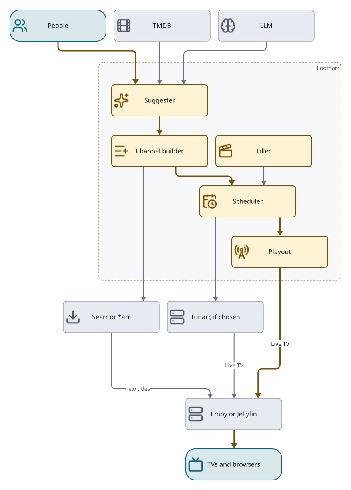

# Overview

Formerly `design.md` §1, §2 (except the package map), §7.1, §14.1 and §18.

## Purpose

Loomarr turns "I want a channel that feels like X" into a running virtual channel and keeps it
populated as content comes and goes:

**intent → suggest a lineup → acquire what is missing → build the schedule → converge the selected
playout backend → backfill and maintain.**

| Subsystem | Owns | Decides |
| --- | --- | --- |
| Suggester | intent → Proposal | what content belongs on the channel |
| Provisioner | acquire missing titles, track them to available | whether and when content exists |
| Media Inventory | provider-neutral item and source facts with provenance | what Loomarr knows about available content |
| Scheduler | lineup, pods, local materialization, Tunarr projection when selected, backfill | order, timing and delivery |
| Playout | the channel packager, tuner and guide | how bytes reach the television |
| Filler | filler sources, clip catalog, pod assembly | what plays in the breaks |
| Web and TV clients | the human control and watching surfaces | approval, oversight and watching |

### In scope

- Natural-language channel intent → grounded Proposal (lineup and acquisitions).
- Acquiring missing titles through Seerr or Sonarr/Radarr, tracked to `available` or `unavailable`.
- Channel programming (order, time slots, shuffle, blocks) with era- and audience-matched
  commercial pods from Loomarr's own filler pipeline.
- Reconciling every channel's durable desired state, and projecting it through Tunarr's API when
  Tunarr is the channel's backend.
- Backfill: go live at once with available content and filler, swap in real titles as they land,
  substitute on give-up.
- Postgres or SQLite persistence; multi-user login with local, imported media-server and SSO
  accounts; roles and audited approvals.
- A self-documenting HTTP API, an embedded web UI, native TV and mobile clients, one Docker image.
- Playing out its own channels: HLS and MPEG-TS segments plus an M3U tuner and XMLTV guide the media
  server registers directly, with Tunarr as a supported alternative backend.

### Non-goals

- **No indexers, download clients or quality profiles.** That is Sonarr/Radarr's job.
- **Not a replacement for the media server.** Emby/Jellyfin remain the library and the client a
  viewer opens; Loomarr feeds them a tuner.
- **Not a replacement for Tunarr.** Tunarr stays a playout backend chosen per channel.
- **The provisioner never chooses titles or acquires on its own.** The Suggester proposes; a person,
  a quota-gated auto-approve, or a channel's opted-in auto-curate grant
  ([`programming-design.md`](../programming-design.md) §8.2) confirms. Every path goes through the one
  `Approve` gate; none writes a `wanted` title directly.

### Design envelope

About **100k library items, 50 channels, 20 users, 10k filler clips and one media server**. Tests
should assume it. These bounds justify deliberate simplicities: federated search instead of an
index, `LIKE` instead of full-text search, client-side list filtering, in-process jobs. Anything
beyond the envelope needs an issue first.

## Architecture

*[D2 source](../diagrams/architecture.d2)*

The subsystems ship in one binary and one container, decoupled by interfaces. The provisioner's
availability events are an internal feed to the scheduler, which is what drives backfill; an
optional outbound webhook and SSE serve external consumers.

**Filler flow.** Every clip arrives through a filler source: `folder` (a watched directory),
`youtube` (yt-dlp), `archive` (Archive.org) or `library` (a filler library on the media server).
Loomarr probes and hashes the files itself, and each clip then travels the ingest pipeline
(transcode, language, transcription, tagging, compilation splitting). Tunarr is optional: when a
channel uses it, Loomarr registers the folder as a Tunarr `local` source.

### Boundaries

Core logic depends on interfaces; adapters live at the edges. Three boundaries are concrete structs
because each has one implementation and inverts its own dependencies through narrow interfaces it
declares.

| Boundary | Shape | Adapters |
| --- | --- | --- |
| Library | interface `Library.Lookup(title) → (itemID, present)` | Emby, Jellyfin (shared implementation, flavor-specific auth) |
| Media Inventory | interface `inventory.Service` | durable aggregate over the Store, fed by the Library importer |
| Requester | interface `Requester.Request/Cancel(title)` | Seerr (default), Sonarr + Radarr |
| Programmer | interface `Programmer.Reconcile(channel, lineup)` | Tunarr |
| Suggester | struct `suggest.Suggester` | a local model over the Ollama API, or an OpenAI-compatible endpoint |
| Catalog | struct `catalog.Catalog` | Library + TMDB/TVDB; grounds the model and backs `GET /v1/search` |
| FillerSource | interface `filler.FillerSource` | `folder`, `youtube`, `archive`, `library` |
| StorageGovernor | struct `storagegovernor.Governor` | host filesystem capacity, managed-root usage, atomic reservations |
| Store | interface `Store` | Postgres, SQLite |
| Events | struct `events.Bus` | internal (to the scheduler) and optional outbound webhook |

### Names that do not separate themselves

Subsystem names map many-to-many onto packages, and four packages share two verbs.

| Looking for… | It is in | Not in |
| --- | --- | --- |
| Channel identity, `DesiredLineup`, `ChannelPolicy`, ordering and seasonal math (pure, no I/O) | `internal/schedule` | `internal/scheduler` |
| The job runner: named jobs, intervals, leases, "Run now" (nothing to do with TV) | `internal/scheduler` | `internal/schedule` |
| Materializing a channel and converging its Tunarr projection; the per-channel mutex | `internal/channels` | `internal/reconcile` |
| The provisioning backstop: claim due titles, retry `wanted`, poll the library, enforce deadlines | `internal/reconcile` | `internal/channels` |
| Turning an approved Proposal into a channel, preserving operator edits | `internal/binder` | `internal/channels` |
| Re-evaluating a channel's intent through the approval gate | `internal/recurate` | `internal/suggest` |
| Title/Key identity and the acquisition state machine (pure) | `internal/provision` | `internal/reconcile` |
| Operator connection flows (Live TV wiring, setup checklist) | `internal/setup` | `internal/config`, `internal/app` |
| Federated search over library, TMDB and clips | `internal/catalog` | — |

`internal/programmer` is the Tunarr port and is unrelated to
[`programming-design.md`](../programming-design.md), which covers `ChannelPolicy` heuristics. The
"Provisioner" is `provision` + `reconcile` + `requester` + `store`; the "Scheduler" is `schedule` +
`channels` + `programmer`, and does not include `scheduler`. Every package, its layer and its imports
are in the generated [package map](package-map.md).

## Backend structure rules

- **Dependencies point one way.** Outside a small, asserted exception set, no production package
  imports `internal/api` or Huma; `internal/app` is the only composition root. The gate discovers
  packages recursively, so a new package is covered automatically. A domain package that needs an
  API type means the type belongs in the domain.
- **Test code never reaches production.** `go list -deps ./cmd/loomarr` contains neither
  `internal/testkit` nor `testing` from any Loomarr package; store conformance lives in `_test.go`.
- **Every package has a package doc** stating the invariants its types do not show. The package map
  is generated from these.
- **`panic` is for boot-time programmer error only** (a duplicate settings key, an undeclared job).
  Never for a condition an operator can cause.
- **Split a file along its seams when it passes about 600 lines**, not arbitrarily. Declaration
  tables (`settings/declared.go`) and shared conformance suites are long on purpose.
- **A size or field count is a prompt to read, never a finding.** Two "obvious" refactors were wrong
  once the code was read:
  - Composition is per-subsystem functions (`buildFoundation`, `buildPlayout`, `buildHTTP`, …)
    that take immutable inputs and return concrete results, never methods on a shared mutable
    builder. A builder trades compile-time use-before-assignment errors for runtime nils. A container
    started without `DATABASE_URL` must still answer `/readyz` with the reason.
  - `api.Server`'s fields are narrow, purpose-named interfaces where `nil` means 501, not a service
    locator. That is what lets an unconfigured install boot and explain itself.
    `optionsparity_test.go` guards the `Options` → `Server` copy.
- **The application generation owns its lifecycle.** Build returns one application value with a
  read-only `Handler` and an idempotent `Shutdown(ctx)`, which cancels and awaits every owned
  subsystem in reverse dependency order. The caller owns the listener, signals and Store: cancel the
  generation, drain HTTP, `Shutdown`, then close the Store. Nothing registers work on Store closure.
  A failed Build unwinds what it started. Tests observe wiring through the application value or
  behaviour, never package globals.
- **Request-launched operations belong to the generation.** Filler acquisition, compilation
  detection and model pull outlive their request through one application-owned launcher: it
  detaches from the request, derives its context from the generation, refuses starts once quiesce
  begins, and is awaited by `Shutdown`. Each keeps a finite timeout and persists its progress and
  outcome under the returned `jobId`, so its GET stays authoritative across dropped SSE; startup
  marks a previous generation's unfinished operation interrupted. Request contexts,
  `context.Background()` launches and SSE-only results are forbidden here. These are not Jobs: the
  launcher has no queue, retries or claims.
- **Persistence is broad only at the root.** `store.Store` is the full union held by the composition
  root and the conformance suite. A domain module accepts the smallest role interface it needs,
  usually declared by that module, and does not widen it back.

## HTTP API

The OpenAPI spec is the API reference: [`api/openapi.yaml`](../../api/openapi.yaml), served as
OpenAPI 3.1 at `/openapi.{json,yaml}` with self-hosted interactive docs at `/docs` (no CDN, so it
works air-gapped). Each operation is defined once in Go with Huma; the spec, request validation and
served docs all derive from it, and hand-kept API docs are not allowed (decision
[0002](decisions/0002-code-first-openapi.md)). CI fails when the committed spec drifts
(`make openapi-verify`).

- **Every `/v1` route is a Huma operation**, including binary downloads, images, SSE, multipart and
  redirects (`rawOp` in `internal/api/rawop.go`). That keeps one fail-closed authorization
  middleware, CSRF and the router/exporter drift guard covering every route.
- **Arrays are never nullable**, and `null` is not an empty list anywhere. `humaConfig` sets
  `DefaultArrayNullable = false`, and `TestResponses_ContainNoJSONNull` runs every parameterless GET
  against an empty store. A handler returning a nil slice is a bug: build slices with
  `make([]T, 0, …)`.
- **SSE frames are declared types.** Huma names an event after its payload type, so a frame whose
  type is not registered ships without an `event:` name and every browser listener silently stops.
- **Listing a byte route in the spec describes it; it is not a stability promise.** Playout stream
  shapes follow what media servers accept.

## Concurrency and correctness

- A per-title mutex serializes provisioning; a per-channel mutex serializes reconciles.
- Upserts keyed by external id make writes idempotent; terminal provisioning states are monotonic.
- The reconciler enforces deadlines and backstops library presence; availability itself is
  confirmed by the polling jobs, not by an inbound webhook.
- Channel reconciliation is desired-versus-actual and idempotent: recompute, diff, make the minimal
  backend calls, safe to re-run.
- With Postgres and more than one instance, `ClaimDue*` (titles, jobs, scheduled jobs) uses
  `FOR UPDATE SKIP LOCKED`, and the channel loop needs a single leader or per-channel claims. In-memory
  events do not cross instances; the periodic channel sweep is what keeps several instances correct.
  SQLite means one instance. One instance is also the supported beta boundary until a multi-replica
  test passes.

## Stack

Go 1.27+ server, one static cgo-free binary; a Rust `loomarr-image` worker; React 19 + TypeScript
web client; Expo + React Native TV and mobile clients (decision
[0024](decisions/0024-react-native-clients.md)). Every dependency and its reason is in
[`dependencies.md`](dependencies.md). Adding one means adding its row there in the same PR.

## Tests that pin this

Formerly `design.md` §19.

- **API contract:** `/openapi.json` is valid OpenAPI 3.1; the served spec equals the committed
  `api/openapi.yaml` (CI fails on drift); the spec's `State` enum equals the code enum; `/docs`
  renders offline.
