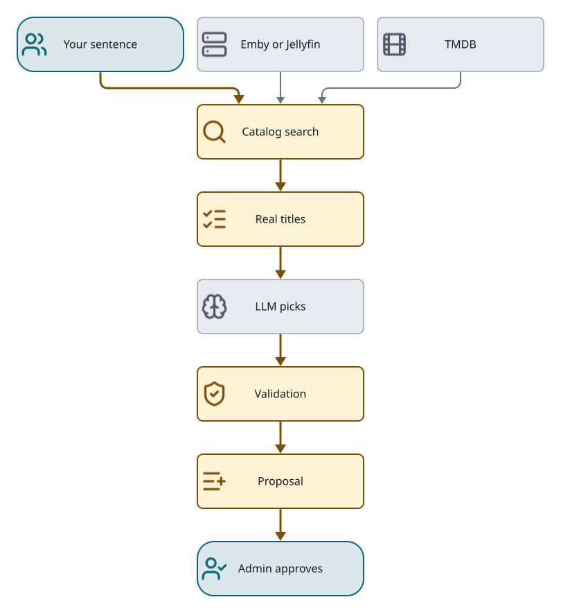

# Suggester

Formerly `design.md` §8, §8.1 and §8.2, and §6's reference source. The Suggester turns a channel
**Intent** into a **Proposal**: a lineup of library titles, an acquisition list for what is missing,
more suggestions, and a ChannelPolicy. How a Proposal is executed, approved and traced is in
[`proposal-workflow.md`](proposal-workflow.md); the scheduling heuristics are in
[`programming-design.md`](../programming-design.md).

*[D2 source](../diagrams/suggester.d2)*

## Intent

An Intent is a natural-language description plus optional constraints (era, runtime target, tone,
must-include and exclude). A **refine** adds a free-text change and the channel's current lineup as
context; the lineup is context only, and every new pick is grounded exactly as in a fresh request.

Ambient context is an explicit input, never hidden nondeterminism. Today a daypart or weather
condition counts only when the request says it. If Loomarr ever supplies them automatically, the
Intent must carry the resolved household-local daypart and a coarse condition
(`clear|rain|snow|storm|hot|cold`) as inspectable soft signals, and evaluation pins them. The
Suggester never fetches weather itself.

## Grounding

The model never supplies trusted identity (decision [0004](decisions/0004-grounding.md)).

- **Catalog tool.** The model proposes candidates through a read-only `catalog_search` tool over the
  library and TMDB: title search, genre and era discovery, TMDB keyword discovery (holidays, motifs,
  franchises, topics), with validated country, language, runtime and vote qualifiers. Candidates
  carry the source-backed genres, overview, origin, runtime, votes and keyword names their corpus
  supplied; these are reasoning evidence, never identity, and missing means unknown.
- **Genre namespaces.** TMDB movie and TV discovery use different genre ids (science fiction is movie
  `878` but TV `10765`); names are translated per endpoint before a mixed search is blended.
- **One canonical key.** Each candidate exposes one provisioning `key`, and every final pick must
  copy it byte for byte. The surfaced-key lookup decides authority; public Proposal fields come from
  the Catalog candidate. A different namespace, alternate id, fabricated or malformed key cannot
  gain authority through normalisation.
- **Exact-name fallback.** A provider that ignores the tool may return plausible names with invented
  keys. Only while no candidate has been surfaced, the Suggester searches up to eight of those names
  concurrently and keeps each single unambiguous exact-title match of the right media type (and year,
  if given). Surviving Catalog keys replace the model's keys; anything missing, ambiguous or
  conflicting is dropped. No second model call is made.
- **Revalidation.** Every item resolves to a real id tagged `in_library`; unresolvable items are
  dropped. Acquisitions are re-checked against TMDB (exists) and the library (absent).
- **Untrusted text.** Library, TMDB and reference text in prompts cannot steer tools, change quotas
  or reach secrets.
- **Editorial support is a second gate.** A surfaced pick must also carry positive source-backed
  evidence for the request: normalised user terms and resolved reference anchors matched against
  title, overview, genres, keyword names and year facts. Matching only the era is not enough when
  the Intent has other meaningful terms, and model rationale never counts. Unsupported picks are
  dropped with a closed trace reason; no survivors is the typed no-grounded-title outcome.
- A known contradictory origin country, or a genre set that omits a requested known genre, drops
  the candidate. Missing metadata is not a contradiction. A thinner accurate Proposal beats padding.

## Reference-backed Intent

A person may express an idea as prose, a named programming block, examples, or a pasted URL. These
are input forms of one Intent. A reference is evidence to resolve, not licence for the model to claim
membership.

- **Pasted page.** One public HTTP(S) URL goes through a site-neutral read-only adapter: no
  credentials or non-standard ports; initial and redirected hosts that resolve to private, loopback,
  link-local, unspecified or multicast space are refused; at most three redirects, a 10-second
  budget, a 256 KiB body cap and a 16 KiB visible-text cap. HTML, XHTML and plain text only; no
  scripts. Anything Loomarr cannot read safely fails closed. Only the URL is sent to the host.
- **What comes back** is the title, URL, bounded visible text and title-like anchors from links,
  headings, lists and tables. It is labelled untrusted data and is never persisted in traces, logs,
  diagnostics, evaluation artefacts or training data.
- **Automatic discovery.** For a named block with no pasted page or user-supplied constituents, only
  the extracted block label goes to English Wikipedia's search API (at most five results). A unique
  exact match described as a programming block is required; its exact category, which must contain
  the subject, supplies direct article members as anchors. Snippets and schedule tables are not
  rosters. For an acronym label with a phase qualifier, the acronym is searched and the qualifier
  constrains selection. One 10-second budget, at most two GETs, reused within the invocation.
- **Bounds.** Keep up to 128 anchors as membership evidence, prefetch at most 48 of them, and send at
  most 24 grounded candidates to the prompt, library members first. Anchors the operator named take
  prefetch slots first. Once source grounding yields a usable constituent, the catalog tool is
  retired and the provider finalises from source-grounded candidates.
- **Named-set mode** comes from the request's structure (a programming-block phrase, a proper or
  acronym label used with block, lineup or collection language), not from a brand registry. Network
  and person roles keep their discovery meaning; lower-case genre or mood collections stay fuzzy
  themes. An ambiguous bare label that cannot establish constituents fails closed.
- **Membership.** Only unambiguous Catalog identities for user-supplied constituents or resolved
  anchors are members. A model-authored roster is a search hypothesis. When an exact source title
  maps to several identities and exactly one is in the library, that one is actionable. A
  curated-episode request ("classic episodes of a sitcom") admits only the named series.
- **Required titles.** Titles in `mustInclude` or direct inclusion clauses (`with`, `include`,
  `keep`, `add`, `want`) are independently exact-searched and kept as bindings even if the provider
  omits them. Softer examples (`like`, `think`, `example`) stay the model's choice. The combined list
  is bounded to eight picks.
- **Source completion.** For a resolved named set, other grounded members fill the eight-pick bound
  after the provider's choices, as ordinary review rows the operator can remove. Members outside an
  explicit date axis are not restored.
- Explanations for named-set items are generated from the admitted provenance, not model prose, and
  the review translates them into plain copy; reason codes stay in troubleshooting data.

## Policy from explicit constraints

Explicit user constraints are applied deterministically, not left to model output:

- A written rating ceiling (`keep it PG-13`, `nothing above PG`, `PG or gentler`) is kept exactly,
  even on an adult channel; multiple maxima keep the stricter. An unqualified adult channel has no
  inferred ceiling. `exclude unrated` refuses unknown ratings even without a ceiling.
- A request that promises child or family safety adds a `TV-Y7` or `TV-PG` maximum.
- A request naming a built-in holiday becomes `seasonal.mode=exclusive` with only that holiday. A
  refine that merely adds holiday programming adds a `holiday:<id>` rule instead. Holiday episode
  selection is a restriction: no matching evidence selects no episodes.
- These values enter the request cache identity, so a cached Proposal that lost them is not reused.

Content ratings ride on candidates and Proposal items as enforcement metadata (never identity).
An acquisition with no library rating is enriched from TMDB at proposal time; an entry still unrated
at reconcile is healed once from the library when its title lands. A series pick may carry a
`seasonMin`/`seasonMax` airing window, which narrows the grounded expansion and never affects what
is acquired.

## Assessment

Assessment reports evidence, not calibrated confidence. `scores.themeFit` is nullable qualifier
coverage: the fraction of requested qualifiers supported by each item's Catalog metadata, using whole
words and a small explicit synonym table (cosy/cozy, mystery/whodunit, sitcom/situation comedy,
sci-fi/science fiction). Named membership is its own full-support case. `scores.eraBalance` is
requested-date adherence from source-backed release or premiere years; it is null when no era was
requested or evidence is missing. Neither diagnostic excludes an item, and the evaluation
`MinThemeFit` floor treats unassessed as failing.

## Providers

One `Suggester` interface with two plain `net/http` adapters and no vendor SDK:

- **`ollama`** (`/api/chat` with tools), the local default. Thinking mode is disabled on tool turns
  for reasoning models, which otherwise break tool calls.
- **`openai`**, any OpenAI-compatible `/v1/chat/completions`: hosted aggregators, direct vendors and
  local runtimes. The dialect is the interface; do not add named per-vendor adapters. It normalises
  tool-call `arguments` strings and wraps `oneOf`/`anyOf`/`allOf` tool schemas in a required `input`
  envelope. Schemas with `$ref` or `$id` fail before inference.

The tool loop:

- JSON mode is off while tools are offered. The first non-empty grounded result starts a
  finalisation phase with tools removed and JSON mode on; a tool call emitted there is treated as
  malformed output and repaired, never executed.
- Tool calls are sequential and single. The parser extracts the outermost balanced JSON object, so
  presentation never rejects a grounded answer.
- Every turn carries `max_tokens: 2048`, and the final selection is at most eight picks. When
  acquisitions are allowed, roughly a third of a 6–8 pick Proposal is reserved for relevant
  outside-library discoveries, if they exist.
- A pick-less answer with nothing surfaced gets one lower-temperature retry that requires a catalog
  call; a second empty answer fails.

The behavioural probe, not declared metadata, decides capability. About 7–8B parameters is the
practical floor for reliable grounded tool use.

## Model selection

Admins pick a provider and model in the app; the choice hot-swaps the running Suggester through an
atomic pointer and persists to `llm.provider`, `llm.model`, `llm.url` and the secret `llm.api_key`,
which override their environment defaults. The key is never returned.

- **Probe** (`GET /v1/system/llm`) lists local models discovered live from Ollama (pulled models with
  the `tools` capability, sized against detected VRAM, one recommended) and the hosted choices:
  OpenRouter and a Custom OpenAI-compatible URL. Hosted model lists are live; a small reviewed table
  ranks families into Best balance (default), Best value and Highest quality, with price as the
  tie-break. Unreviewed tool-capable models stay selectable but unranked; models with unknown tool
  support are not selectable; `:batch` variants are excluded.
- **Select** validates the endpoint and key with a cheap live call before committing (401/502 on
  failure). Local models must already be pulled (409). OpenRouter requires a namespaced slug.
- **Test** validates credentials without swapping. "AI connected" is not "suggestions ready":
  suggestions also need TMDB grounding, and the UI names that dependency.
- **Discover** ranks downloadable GGUF models from Hugging Face's API that fit this machine, using
  real per-file sizes of the Q4_K_M-class build that Ollama's `latest` pulls. A family allowlist,
  remix and vision-variant marker tables, one row per canonical model, and a fitness score (fit,
  then family and size reliability, then popularity) produce one recommended pick with a plain role
  and note. It is best-effort; an outage shows a link instead.
- **Pull** is local-only and returns a durable operation at
  `GET /v1/system/llm/pull-operations/{jobId}`; startup marks an unfinished prior pull interrupted.

## Model residency

Loading a local model dominates latency (measured about 9 s cold against 0.5 s warm for an 8B model).

- Every Ollama call carries `keep_alive` (`llm.keep_alive`, default `2m`, `0` disables). The default is
  short because the GPU is shared with playout: a resident 8B model holds about 6 GB, and an encoder
  that cannot allocate its context fails.
- Reactive eviction on a failed hardware encode retired with the beta.7 playout chain; the channel
  packager has no eviction step ([`playout.md`](playout.md#the-channel-packager)).
- Boot and every model selection warm the model in the background, best-effort. With no configured
  model the warm-up is declined (`ErrNothingToWarm`), not attempted against a fallback tag.

## Discovery feedback

Feedback is explicit household editorial state, never inferred from viewing.

- An admin records `keep`, `less`, `never` or `surprise` against a canonical title key
  (`provision.ParseKey`), for the household or one Channel. Every change appends an actor-attributed
  event; clearing appends a tombstone. Members may read, not write; anonymous callers can do neither.
- The latest event per `(scope, target)` is effective, and a Channel event overrides the household
  one for that Channel. `GET /v1/discovery/feedback` returns the effective view with the scope and
  actor that supply each row, so undoing a Channel override reveals the household fallback.
- A Channel-scoped event must name a persisted Channel (else 404 after authorization); detached
  Channels keep theirs, and purge removes only that Channel's rows. No detach, purge, playback,
  approval, denial or inactivity ever creates feedback.
- Re-curation resolves its Channel scope server-side from the claimed Job's owning Channel; a client
  never supplies execution scope.
- **Ranking.** One pure deterministic ranker applies it below grounding, audience, explicit
  includes and excludes, approval and quotas: `never` excludes, `keep` protects an existing lineup
  item from automatic retirement, `less` demotes the title and same-genre candidates in the batch,
  and `surprise` enables a diversity pass inside each unchanged relevance band without boosting the
  marked title. Feedback affects only later proposals, never current playout.

## Evaluation

Behaviour is evaluated by the Go harness in `internal/eval` against frozen, digest-pinned corpora.
Development corpora never certify (`certified: false`), scripted replies prove application behaviour
only, and live provider trials are explicit, budgeted and outside CI. `make eval-matrix` runs one
corpus through the local generator and through OpenRouter with pinned models and a single pinned
upstream route (no fallbacks, no data collection); it refuses to start unless
`LOOMARR_EVAL_ALLOW_LOCAL=1` confirms the host is idle, because local inference competes with
playback. Empty proposals are classified (`no_tool_call`, `retrieval_empty`, `selection_empty`,
`generation_error`, `provider_error`) so retrieval, provider and curation problems can be separated.
The full certification protocol is archived in
[`suggester-certification.md`](../engineering/archive/design-2026-09/suggester-certification.md).
