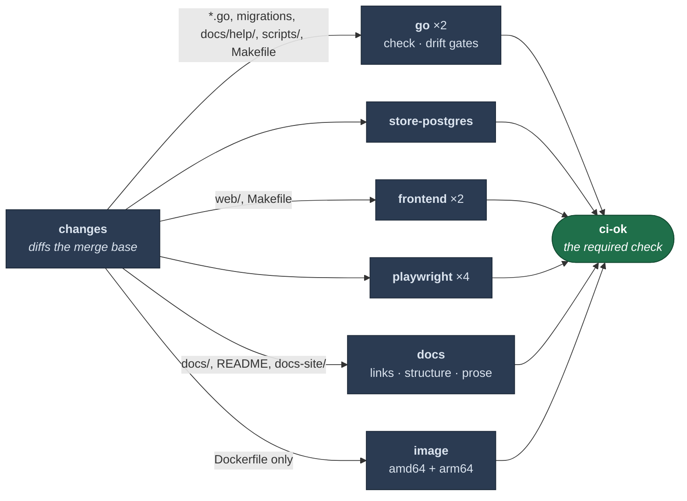

# CI

## Jobs run only when their inputs changed

A `changes` job diffs against the merge base and each job gates on its output. It fails safe: no
usable merge base — first push, force-push, new branch — runs everything.

**Adding a new build input means adding it to the filter in the same PR.**

Two non-obvious entries: `docs/help/` is in the Go filter because those pages are embedded and
the doc-claims test reads them, and `scripts/` is there because the job executes them.

## The image job is the exception

`Makefile` and workflow changes trigger Go and Frontend, but not the image, which gates on
`Dockerfile` and `.dockerignore` only. It builds both release platforms under QEMU — about half
an hour of billed CI — and neither of those files changes what `docker build` produces.

It's also the only job with a `timeout-minutes`; GitHub's default is six hours.

It exists because a Dockerfile that could never build for arm64 sat undetected. Build both
platforms or it can't catch that.

## `ci-ok` is the only required check

It always runs and inspects `needs.*.result` explicitly. That has to be explicit: a skipped job
doesn't fail an aggregate by default, and neither does a failed one under `if: always()`.

Never add a workflow-level `paths:`. A run that doesn't trigger reports no checks, so a required
check sits "expected" forever and the PR can't merge. Filter per job.

## Sharding

Go, frontend and Playwright split across runners for wall-clock only. `make go-shard-verify`
asserts the Go shards are a true partition of `go list ./...` — a split that drops a package
would pass by not running.

Sharding is free on a public repo. Check the bill before copying it into a private one.

## Caching

- **`actions/cache` never overwrites an existing key.** A cache whose contents track something
  its key doesn't gets written once and frozen. Use a rolling key with `restore-keys`.
- **The 10GB cap evicts LRU across all refs**, so closed PRs' caches push out live ones.
  `cache-cleanup.yml` deletes them on close.

## Known gap: `tags-verify` is not a gate

Two separate things are true:

1. No CI job runs it — `make tags-verify` appears in `ci.yml` only inside a comment.
2. It couldn't fail if one did. `scripts/check-tags.sh` prints the tags found in the tree and the
   tags the Makefile declares, then exits 0; its comparison policy is an unfilled
   `TODO(maintainer)` listing three options.

So the hand-maintained `TAGS` list has no guard. Fixing it means picking the policy first — adding
a step that always passes would make the gap harder to see.
