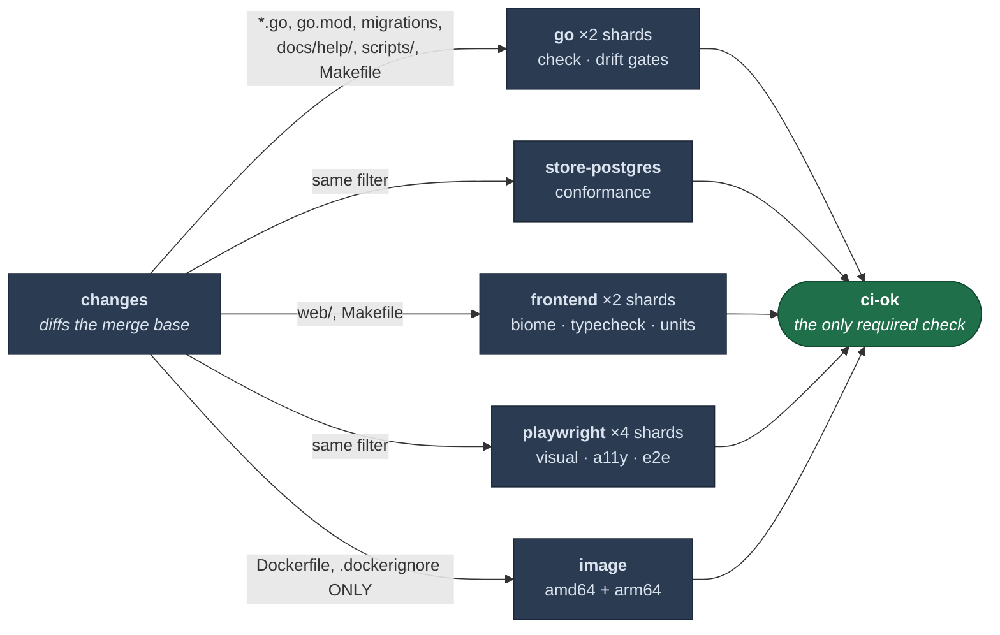

# CI

## Jobs run only when their inputs changed

A `changes` job diffs against the merge base and each job gates on its output. It's hand-rolled
rather than a marketplace action, and it **fails safe**: no usable merge base — first push,
force-push, new branch — runs everything.

**Adding a new build input means adding it to the filter in the same PR.** It is the same class
of hand-maintained list as `scripts/check-retired.sh`, with the same failure mode.

Two non-obvious inclusions:

- **`docs/help/` is in the Go filter** because those pages are embedded in the binary and are
  what `retired-verify` and the doc-claims test read.
- **`scripts/` is in the Go filter** because the job *executes* them. Without it, a PR editing
  only a guard script would skip the one job that runs it.

## The Image job is the deliberate exception

`Makefile` and workflow changes trigger Go and Frontend — they define how those jobs run — but
**not** the image, which gates on `Dockerfile` and `.dockerignore` only. It builds both release
platforms under QEMU, so a cold build costs around half an hour of billed CI; spending that on
every workflow tweak would be waste, and neither file can change what `docker build` produces.

It's also the only job with a `timeout-minutes`. GitHub's default is six hours, which is a lot
of money for a hung emulated build.

It exists because a Dockerfile that could never build for arm64 sat undetected — `apt` exited
100 on a package with no arm64 candidate — and since the image was previously built only on a
`v*` tag, the first symptom would have been a failed release. **Build both platforms or the job
cannot catch the class it was added for.**

## `ci-ok` is the single required check

It always runs and inspects `needs.*.result` explicitly. This has to be explicit: a skipped job
does not fail an aggregate by default — **and neither does a failed one under `if: always()`** —
so a naive shim reports green over a red job.

> ⚠ **Never add a workflow-level `paths:`.** A run that doesn't trigger reports no checks at
> all, so a required check sits "expected" forever and the PR can never merge. Filter per job.

## Sharding

The Go, frontend and Playwright suites are split across runners for wall-clock only. The Go
split has its own guard — `make go-shard-verify` asserts the shards are a true partition of
`go list ./...`, because a split that silently drops a package is a suite that passes by not
running.

Sharding is free on a public repo. Don't copy the pattern into a private one without checking
the bill.

## Caching

Two rules that are easy to get wrong:

- **`actions/cache` never overwrites an existing key.** Any cache whose *contents* track
  something the *key* doesn't — `~/.cache/go-build` tracks source; a `go.sum` key doesn't — is
  written once and frozen forever. Use a rolling key (`github.run_id`) plus `restore-keys`
  prefixes. One 473MB entry served every run for days while the source moved under it.
- **The 10GB repo cap evicts LRU across all refs**, so caches from closed PRs push out live
  ones. `cache-cleanup.yml` deletes a PR's caches when it closes; GitHub's own 7-day expiry is
  far too slow when a single Go cache is ~470MB.

## Known gap: `make tags-verify` is not a gate

It is easy to believe otherwise — it sits in the Makefile beside the real verify targets, and
`CLAUDE.md` used to list it among them. Two separate things are true:

1. **No CI job runs it.** `make tags-verify` appears in `ci.yml` only inside a comment.
2. **It could not fail if one did.** `scripts/check-tags.sh` extracts the tags found in the tree
   and the tags the Makefile declares, prints both, and exits 0 — its comparison policy is an
   unfilled `TODO(maintainer)` that records three options and asks for a decision.

So the hand-maintained `TAGS` list has no guard, and the tagged-build blind spot that
[`vet-tags`](testing.md) exists for is only covered as long as that list stays correct by hand.

Resolving it means picking the policy in `scripts/check-tags.sh` and then adding the step —
in that order, since adding a step that always passes would make the gap harder to see rather
than fixing it. Recorded here rather than quietly omitted: **a gate everyone believes in is
worse than one they know is pending.**
