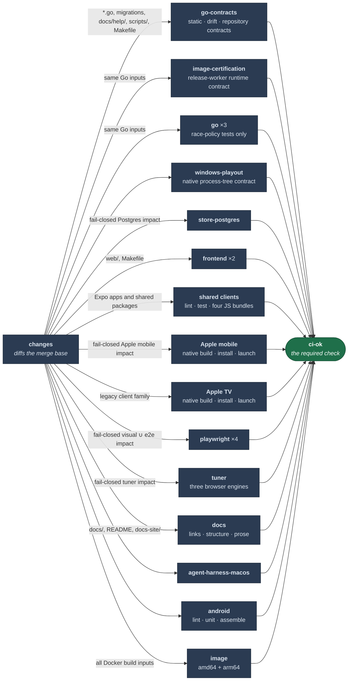

# CI

## Jobs run only when their inputs changed

A `changes` job diffs against the merge base and each job gates on its output. It fails safe: no
usable merge base — first push, force-push, new branch — runs everything.

**Adding a new build input means adding it to the filter in the same PR.**

Two non-obvious entries: `docs/help/` is in the Go filter because those pages are embedded and
the doc-claims test reads them, and `scripts/` is there because the job executes them.

### Specialized gate classifier activates one job at a time

The `changes` job also runs `scripts/ci-impact.sh` and publishes `impact_*` outputs for the
specialized contract, Go, full-Go, Rust, Postgres, Windows, web, shared-client, iOS, tvOS, Expo
Android mobile, Expo Android TV, visual, e2e, tuner, image, docs, agent, and legacy Android TV
gates. Its run summary places those proposed decisions beside the current broad families.

Postgres was the first active specialized output. `store-postgres` consumes `impact_postgres`
directly while remaining in the required `CI` aggregate. The explicit release-candidate scope
continues to exclude database conformance. This first activation intentionally treats every `.go`
file plus `go.mod`, `go.sum`, store migrations, and unknown paths as Postgres-sensitive. That
conservative boundary skips proven
non-Go over-selection without guessing which transitive Go dependency can change a real-Postgres
assertion. Dependency-aware narrowing is a later shadow change.

Playwright is the second active job. Its four shards consume the union of `impact_visual` and
`impact_e2e`; the combined job still runs both suites exactly as before. Shipping Web runtime
sources are conservatively visual-sensitive because Storybook alias imports make filename-only
transitive narrowing unsafe. Shared API/core/fixture inputs and OpenAPI select both suites, while
visual/e2e tests and committed baselines select their owner. Only proven unit-test-only Web sources
skip Playwright in this first slice.

Tuner is the third active job. Its macOS browser matrix consumes `impact_tuner` directly. Every
shipping Web runtime source remains tuner-sensitive because the matrix loads the real SPA and HLS
controller; unit, spec, and story-only modules may skip it. Tuner e2e inputs, browser build
configuration, shared API/core/fixture packages, runtime tokens, and OpenAPI select it explicitly.

Apple mobile is the fourth active decision and the first native split. iOS and tvOS are separate
top-level jobs with hard-coded app commands and independent required results. iOS consumes
`impact_apple_mobile`; tvOS deliberately retains the legacy shared-client selector until its own
reversible activation. Existing cache-key strings are preserved so splitting job identity does not
discard compatible pnpm, CocoaPods, or ExpoModulesJSI entries.

The existing `go`, `web`, `image`, `docs`, `agent`, and `android` outputs remain authoritative for
every other job while their specialized results are compared with complete CI outcomes. A missing
base, classifier failure, or unknown path selects every specialized gate. The manual
release-candidate scope remains unchanged and excludes Postgres, Playwright, and tuner.

`scripts/testdata/ci-impact.tsv` records the exact ordered gate set for representative paths and
multi-path changes across every specialized gate. The classifier contract test compares complete
sets, so both a missed gate and an unexplained extra gate require an explicit fixture decision.

Non-code files consumed by Go tests are Go inputs too. In particular, design/configuration/command
docs, install docs and README, the committed OpenAPI document, production Compose, and embedded
help select the complete Go test set. Dockerfile and packaged licence/notices select repository
contracts as well as the image build. These mappings are fixtures because file extensions cannot
reveal those dependencies.

Client decisions follow the actual consumer graph. An app-local mobile change selects shared-client,
iOS, and Expo Android mobile evidence; a TV change selects shared-client, tvOS, and Expo Android TV.
Changes to `api`, `core`, `fixtures`, `design-system`, or `ui` select both apps on both native
platforms because those packages are transitive inputs to both. Browser-only client-proof and
Turborepo contract changes select the shared JavaScript gate without spending a native runner.
Apple mobile is active. Apple TV, Expo Android mobile, and Expo Android TV remain observational
until each consumes its independently required job and current-main evidence is proven.

## Per-run measurements

The required `CI` aggregate appends a timing table after it has evaluated every required result.
`scripts/ci-run-metrics.sh` reads GitHub's run and job records and reports queue delay, execution
time, end-to-end time, the longest job, and total occupied runner time. The report is observational:
an API or checkout failure emits a warning but cannot turn verified code red or hide a failed gate.
Its formatter is tested against a pinned API fixture without touching the network.

The distinction between queue and execution is load-bearing for native work. A macOS job can be the
critical path because it waited for capacity, because Xcode compiled slowly, or both; changing cache
policy cannot solve the first case, while adding shards can make it worse.

## The image job is the exception

The image filter follows every source family copied by the Dockerfile: Docker metadata, packaged
LICENSE/notices, Cargo and Rust sources, Go sources/modules/embedded migrations, embedded help, the frontend,
OpenAPI, and the bundle guard. `Makefile` and workflow-only changes do not change image bytes and
therefore do not trigger it.

It builds each release platform on a native runner, loads the resulting image without pushing it,
and inspects the packaged LICENSE/notices and OCI labels. The Dockerfile's build-time commands prove
the bundled tools; the post-build inspection proves the final runtime filesystem rather than a
comment or an intermediate stage.

It's also the only job with a `timeout-minutes`; GitHub's default is six hours.

It exists because a Dockerfile that could never build for arm64 sat undetected. Build both
platforms or it can't catch that.

## Manual scopes are explicit

Manual CI defaults to `release-candidate`. That scope is for certifying an exact `main` commit before
tagging: it runs repository contracts, the real-codec image-worker certification, and both native
release-image builds. It does not rerun Android, Windows, PostgreSQL, Go race, frontend, Playwright,
tuner, docs, or the macOS harness; their normal push and pull-request impact coverage is unchanged.

Select `full` explicitly when an investigation genuinely needs every matrix. Both modes publish a
scope-marker job, but `scripts/validate-release-source.sh` accepts only the release-candidate marker
for Docker publication. It rejects normal push CI and full manual runs even when green, so mobile,
client, and unrelated platform matrices cannot become release prerequisites. The release-candidate
marker also makes the contract and certification jobs mandatory evidence rather than relying only on
the workflow's overall conclusion.

## `ci-ok` is the only required check

It always runs and inspects `needs.*.result` explicitly. That has to be explicit: a skipped job
doesn't fail an aggregate by default, and neither does a failed one under `if: always()`.

The `main` branch requires the GitHub Actions-owned `CI` check in strict mode: a pull request must
be tested against the current base before it can merge. Preserve both the check name and its app
binding when editing branch protection.

`make release-verify` parses the workflow and requires every top-level job to appear in
`ci-ok.needs`. This prevents a newly added or accidentally removed dependency from producing a
green required check while its real job is red.

Never add a workflow-level `paths:`. A run that doesn't trigger reports no checks, so a required
check sits "expected" forever and the PR can't merge. Filter per job.

The workflow already handles `merge_group`, but GitHub offers merge queues only to public
repositories owned by organizations (or qualifying organization-owned private repositories).
`loomarr/loomarr` is organization-owned. Queue activation is therefore an explicit repository
ruleset operation; the strict required `CI` check remains the protected current-base boundary until
the queue is enabled and its first `merge_group` run is proven.

## Sharding

Go tests, frontend and Playwright split across runners for wall-clock only. Repository-wide Go and
Rust contracts run once in `go-contracts`, in parallel with three test-only Go shards and the
independent release-worker certification. Their union is the same assurance as local `make check`
plus the existing CI-only certification. The `ci-ok` aggregate requires every job, so moving a
contract out of the test shards cannot make it optional.

`make go-shard-verify` runs in `go-contracts` and asserts the Go shards are a true partition of
`go list ./...` — a split that drops a package would otherwise pass by not running it.

Sharding is free on a public repo. Check the bill before copying it into a private one.

## Caching

- **`actions/cache` never overwrites an existing key.** A cache whose contents track something
  its key doesn't gets written once and frozen. Use a rolling key with `restore-keys`.
- **The 10GB cap evicts LRU across all refs**, so closed PRs' caches push out live ones.
  `cache-cleanup.yml` deletes them on close.

## Hand-maintained lists, and what guards them

Three lists in this repo are written by hand and would rot silently. Each has an executable guard
that fails when it drifts, and all three run in CI:

| List | Guard | Runs via |
| --- | --- | --- |
| `TAGS` in the Makefile | `scripts/check-tags.sh` | `make tags-verify`, part of `make check` |
| Retired identifiers | `scripts/check-retired.sh` | `make retired-verify`, its own CI step |
| Release-image source-family probes | `releaseverify.VerifyCIImageInputs` | `make release-verify`, part of `make check` |

`tags-verify` compares the tags in `//go:build` lines against `TAGS` and fails **both ways**:

- **In the tree, not in `TAGS`** — those files are invisible to `vet-tags` and `lint`. Nothing
  compiles them, which is how a live ffmpeg test sat uncompiled for months.
- **In `TAGS`, not in the tree** — the list claims coverage it doesn't have. Drop the tag in the
  PR that removed its last file.

Downgrading the second direction to a warning is the obvious-looking fix when it's inconvenient.
Don't — a warning printed by a job that exits 0 is one nobody reads.

The CI path filter includes `scripts/`, so a PR editing only a guard still runs the job that
executes it.

## Scheduled Rust maintenance

`rust-maintenance.yml` is intentionally outside the required PR gate. Every Monday, and on manual
dispatch, it installs pinned cargo-deny and cargo-fuzz versions, checks both Cargo lockfiles for
RustSec advisories, approved SPDX licences, and untrusted sources, then fuzzes the worker's bounded
JSON-to-decoder boundary under nightly libFuzzer. A crash retains its reproducer for 30 days.

This job is allowed to be expensive and network-sensitive. The fast deterministic protections stay
in `make check`: Cargo lock enforcement, clippy/tests, and `#![forbid(unsafe_code)]` on Loomarr-owned
shipping crates.
