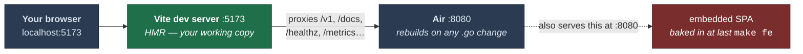

# The dev loop

Two processes, each with live reload. Run them in separate terminals.

```bash
cp .env.example .env    # required — Air sources it

make dev-be                        # terminal 1: backend  :8080, Air rebuilds on any Go change
cd web && pnpm --filter @loomarr/web dev   # terminal 2: frontend :5173, Vite HMR
```

## Develop against :5173



**:8080 serves the SPA that was compiled into the binary at your last `make fe`, not your
working copy.** It is never *wrong*, only stale — but a frontend change will not appear there,
and that costs people an afternoon roughly once each.

Vite proxies `/v1`, `/hooks`, `/docs`, `/openapi.*`, `/healthz`, `/readyz` and `/metrics` to
:8080, with websocket upgrade on `/v1` for SSE and HLS. Point it somewhere else with
`LOOMARR_API=http://otherbox:8080`.

## Never use `go run ./cmd/loomarr`

It does not reload, and because `go run` supervises rather than execs, closing the terminal can
orphan a child that keeps serving pre-change code indefinitely with no sign anything is stale.

If an API change isn't showing up:

```bash
curl -s localhost:8080/v1/system/version
```

It reports the commit the running binary was built from and whether the tree was dirty.

`make dev-be` makes this impossible. It runs two guards:

- **A single-instance guard** — a second `make dev-be` refuses to start rather than racing for
  the port. `DEV_BE_REPLACE=1` terminates exactly the existing `loomarr-dev` binary by its
  unique path, never a blanket kill.
- **A stale-binary watchdog** — detects "Air alive but not rebuilding" by comparing the running
  binary's mtime against the newest `.go` source, and self-heals through Air's own path.
  `DEV_BE_NO_WATCHDOG=1` opts out.

Both exist because of real multi-day losses, not hypotheticals.

## Air's configuration is load-bearing

Two settings in `.air.toml` must not be "tidied":

- **`stop_on_error = false`** — with `true`, Air stops watching after any failed build, so a
  mid-refactor compile error wedges it permanently while it keeps serving the old binary.
- **`poll = true`** — inotify is unreliable on btrfs and with atomic-save editors.

It also *sources* `.env` rather than inlining variables, deliberately: an inlined
`DATABASE_URL` would silently point at a different, empty database.

## `make dev` is not the app

It brings up **external dependencies only** — a pinned Tunarr container wired to your media
server, plus the filler drop folder. Use it when working on the Tunarr backend. `make dev-gpu`
adds the NVIDIA overlay.

## A dev store

```bash
make seed
```

Populates a store through the **real domain paths**, honouring the approval gate — it never
writes `available` rows for unapproved titles. Seeding by writing rows directly would produce
a database no real run could reach.
