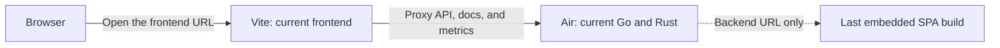

# The dev loop

Two processes, each with live reload. Run them in separate terminals; the harness assigns stable,
worktree-specific ports and prints both URLs.

```bash
make dev-be    # backend, rebuilds the Go server and required Rust image worker
make dev-fe    # Vite HMR, proxying this worktree's backend
```

## Develop against the frontend URL



The backend URL serves the SPA compiled into the binary at your last `make fe`, not your working copy.
Frontend changes appear only at the frontend URL.

Vite proxies `/v1`, `/hooks`, `/docs`, `/openapi.*`, `/healthz`, `/readyz` and `/metrics` to this
worktree's backend. Point it elsewhere with `LOOMARR_API=http://otherbox:8080`.

## Don't use `go run ./cmd/loomarr`

It doesn't reload, and because `go run` supervises rather than execs, closing the terminal can
leave an orphan serving old code with no sign anything is stale.

If an API change isn't showing up:

```bash
eval "$(./scripts/dev-env.sh export)"
curl -s "localhost:$LOOMARR_DEV_PORT/v1/system/version"
```

That reports the commit the running binary was built from.

`make dev-be` prevents this. It refuses to start a second instance, and a watchdog detects "Air
alive but not rebuilding" by comparing the binary's mtime against the newest watched Go/Rust input.
`DEV_BE_REPLACE=1` replaces a running instance; `DEV_BE_NO_WATCHDOG=1` skips the watchdog.

Process ownership includes the worktree cwd. Replacement never kills another worktree's Air or
backend, even though their process names are identical.

## Two Air settings that must stay

- **`stop_on_error = false`** — with `true`, Air stops watching after a failed build, so a
  mid-refactor compile error wedges it while it keeps serving the old binary.
- **`poll = true`** — inotify is unreliable on btrfs and with atomic-save editors.

It also sources `.env` rather than inlining variables, so an inlined `DATABASE_URL` can't
silently point at a different database.

## `make dev` is not the app

It starts external dependencies only — a Tunarr container and the filler drop folder. Use it
when working on the Tunarr backend. `make dev-gpu` adds the NVIDIA overlay.

## A dev store

```bash
make seed
```

Populates a store through the real domain paths, honouring the approval gate.
