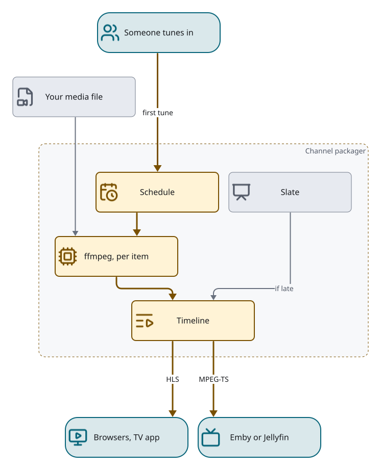
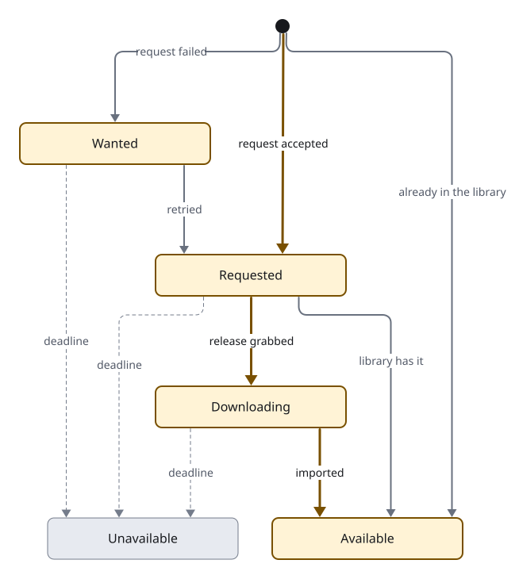

# How Loomarr works

**For:** anyone who wants the mental model before (or after) making a channel.
**You'll get:** who does what, and how a sentence becomes a channel that's always on.

## Who does what

Your **media server** (Emby or Jellyfin) owns the library. Loomarr only reads it.

Loomarr decides **what plays and in what order**, and by default it also plays it: it encodes
the stream and serves a tuner your media server picks up as Live TV.

**Tunarr** is the alternative, chosen in the wizard. Pick it if your hardware can't transcode,
or if you already run it. Loomarr still decides what plays, and hands the schedule to Tunarr.

The practical difference: on the default backend, Loomarr must be running for channels to play.
On Tunarr, they keep playing without it.

## Playing a channel

Nothing is encoded ahead of time. When someone tunes a channel, Loomarr looks up what's on and
starts one encoder for that item, reading your media file. Each item joins one
continuous timeline, and everyone watching that channel shares it. If an item isn't ready in
time, a slate fills the gap. Browsers and the TV app get HLS; your media server gets MPEG-TS.

## Intent → proposal → channel

You describe a channel; the suggester returns a **proposal**:

- a **lineup** of titles you already have, and
- an **acquisition list** of titles you don't.

Every pick is a real title from your library or TMDB. The model can't invent one. If nothing
matches, the run fails clearly instead of making something up.

## Approval — the one gate

A proposal does nothing until an **admin approves** it. Approval is the only place resources get
spent: it starts the downloads and creates the channel. Members can suggest and review; only
admins approve.

## Filling in

A missing title is **requested** from Seerr or the *arrs, then **downloading**, then
**available**. If the request can't be sent, the title waits as **wanted** and is retried. A title
that doesn't arrive by its deadline becomes **unavailable**. A channel is built from what's
available now; anything missing becomes a **pending** slot filled with commercials, and swaps to
the real program the moment it lands.

## Series

A movie is one program. A **series** expands into one program per episode you actually have,
in the channel's order. New episodes join on the next refresh.

## Filler and pods

Between programs, Loomarr inserts **pods** — short runs of bumpers and commercials from your
[filler](../guides/filler.md) folder, matched to the channel. No filler just means no commercials.

## Policy

A channel carries a **policy**: which content, a rating cap, no repeats, ordering. The model
suggests it from your intent ("for the kids" → a `TV-Y7` cap); the scheduler enforces it the
same way every time. See the [curation page](curation.md).

## What stays home

Your library, channels and quality measurements stay in your database. [Privacy](privacy.md)
lists every outside service Loomarr can contact, what it sends, and how to turn it off.
