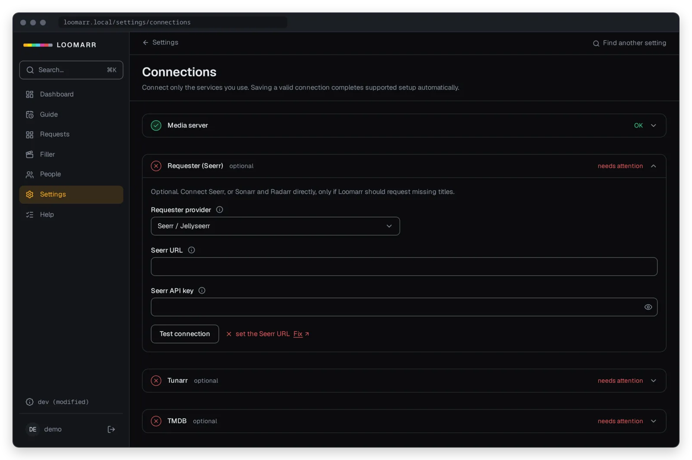
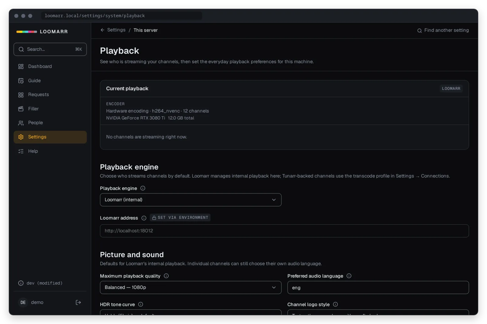

# Connect your services

**For:** household admins filling in **Settings → Connections** and **Settings → AI**.
**You'll get:** each service connected in the right order, and a way to tell it's working.

Connect only the services you use. Each one shows a check when Loomarr can reach it; a red check
links to [Troubleshooting](troubleshooting.md) for the fix. Every field is also an environment
variable. A value set in the environment wins, and shows as locked in Settings. The
[settings reference](https://mantonx.github.io/loomarr/reference/settings/) lists every one.



## 1. Your media server

Required. Emby or Jellyfin holds your library, and can also supply user accounts. In
**Settings → Connections**, enter:

| You need | Environment | Example |
| --- | --- | --- |
| Which server | `LIBRARY_FLAVOR` | `emby` or `jellyfin` |
| Its address | `LIBRARY_URL` | `http://192.168.1.10:8096` |
| An API key | `LIBRARY_TOKEN` | An **admin** API key from the media server's dashboard |

Loomarr only reads your library. The one thing it writes is its own Live TV tuner and guide, and it
registers those for you when you save.

## 2. TMDB

Required for suggestions. TMDB grounds every suggestion in a real title and supplies ratings for
titles you don't have yet. [Get a free key](https://www.themoviedb.org/settings/api) and paste it
in **Settings → Connections** (`TMDB_API_KEY`).

## 3. An AI model

Turns your sentence into a lineup. The model must support tool calling. Set it up in
**Settings → AI**; a change takes effect straight away, with no restart.

- **Local Ollama** (the default, `LLM_PROVIDER=ollama`): enter its address, such as
  `http://192.168.1.10:11434`. Don't pick a model tag by hand: the picker ranks the models that
  fit your GPU. Prefer a Q6_K quant.
- **Hosted** (OpenAI, Gemini, Groq, OpenRouter; `LLM_PROVIDER=openai`): enter the base address
  ending in `/v1`, the model and the API key.

OpenRouter can also run the filler AI features with the same key: choose **Connected speech
service** and leave its address blank. Chat, vision and speech models stay separate, because
each takes different input. [Privacy](../explanation/privacy.md) lists what each choice sends.

## 4. Loomarr's own address

Set **Loomarr address** in **Settings → Playback** (`SERVER_PUBLIC_URL`) to the address your media
server reaches Loomarr on, such as `http://192.168.1.10:8080`. Stream addresses are built from
it, so a wrong value shows up only when a channel fails to play in your media server. Current
Health flags an address Loomarr can't reach.

The rest of Playback can stay as it is. For a GPU, see
[Set up hardware encoding](hardware-encoding.md).



## 5. Downloads (optional)

How Loomarr requests titles you don't have. Without it, channels still play what you already own,
and nothing downloads until an admin approves a proposal.

- **Seerr** (one connection for movies and shows): `SEERR_URL`, `SEERR_API_KEY`.
- **Sonarr and Radarr** directly: `SONARR_URL`, `SONARR_API_KEY`, `RADARR_URL`, `RADARR_API_KEY`.

There's nothing to set up for finished downloads. Loomarr scans the library on a schedule, and
with Sonarr and Radarr also checks their queues. A title becomes available once it's in your
media server. To check sooner, open **Settings → Tasks** and use **Run now**. Older versions
asked for a webhook in each app; if you added one, you can delete it.

## 6. Tunarr (optional)

The alternative way to stream channels, chosen on the wizard's Playout step. Pick it if your
hardware can't transcode, or if you already run Tunarr. Loomarr still decides what plays.

- `TUNARR_URL`: for example `http://192.168.1.10:8000`. Tunarr has no login.
- `TUNARR_TRANSCODE_CONFIG_ID`: optional. Leave it empty to use your Tunarr's `Default`.

Saving connects Tunarr to your media library and to the guide. If Tunarr has no programs to
play, use **Wire Tunarr to your library** in the wizard.

## Notifications

**Settings → Notifications** has one list of providers:

1. Click **Add provider**.
2. Choose the provider, and enter its settings. Only its own fields appear.
3. Select which events it receives.
4. Save, then send a test.

Passwords, tokens and webhook addresses are encrypted in the database and never sent back to the
browser. When you edit a provider, leave a secret unchanged to keep it, or clear it on purpose.

A successful test means Loomarr handed the message to the provider, not that a device displayed
it. Each provider shows its last accepted handoff, and how many messages are queued or failed.
Account invitations and password recovery always send by email, whatever events you choose.

| Provider | What to enter |
| --- | --- |
| SMTP | Submission host, port, TLS policy, sender address and name, and optional username and password. `None` is only for a trusted local relay. |
| Webhook | HTTPS endpoint, plus an optional bearer token and HMAC signing secret. Loomarr sends a versioned JSON event with an `X-Loomarr-Event-ID` header. |
| Slack, Discord, Mattermost | The incoming webhook URL from the destination channel. |
| ntfy | Server URL and topic; optionally a username and password or token. |
| Gotify | Server URL and application token. |
| Apprise | Apprise API URL, and either a stored configuration key or a stateless destination URL; optionally an API token. |
| Pushover | Application token and user or group key; optionally a device. |
| Telegram Bot | Bot token and chat ID; optionally a topic or thread ID. |
| Matrix | Homeserver URL, room ID and access token. |
| MQTT | `mqtt://` or `mqtts://` broker URL, base topic, QoS 0 or 1, retain, and optionally a client ID or username and password. For a private CA or mutual TLS, add the PEM CA and the client certificate and key. |
| Browser Push | Nothing to paste. Choose events, then click **Enable this browser**; the permission prompt appears only then. |

### Provider notes

- **Slack, Discord and Mattermost** need no bot, OAuth or inbound access. To rotate a webhook,
  create the new one, update the provider, test it, then revoke the old one.
- **ntfy:** use a hard-to-guess topic with authentication, especially on `ntfy.sh`, where anyone
  who knows a public topic's name can read it. Routine events use priority 3 and a `tv` tag;
  degraded and gave-up events use priority 4 and a `warning` tag.
- **Gotify:** create an application in Gotify and paste its token. To revoke access, replace or
  delete that token, then update and retest the provider.
- **Apprise:** run the Apprise API yourself. Save an Apprise configuration (such as `loomarr.yml`
  with a service URL under `urls:`) under a key such as `household`, then enter the Apprise address
  and that key. Apprise, and every service it forwards to, receives the notification text; Loomarr
  confirms only its handoff to Apprise.
- **Pushover:** create a Pushover application, then enter its token and your user or group key.
  Pushover needs an account and may need a one-time purchase. Loomarr never uses emergency
  priority.
- **Telegram:** create a bot with BotFather, add it to the chat or group, and enter the numeric
  chat ID. The bot must be allowed to post.
- **Matrix:** invite a dedicated account to the room and use its access token. Encrypted rooms
  aren't supported.
- **MQTT:** leave Client ID blank and Loomarr derives a stable one. Messages go to
  `<base topic>/<event type>` and aren't retained unless you turn retain on, which can replay an
  old alert as if it were new. `mqtts://` uses TLS 1.2 or newer and always verifies the broker's
  certificate and hostname; there's no bypass. Home Assistant can subscribe without giving Loomarr
  any credential:

  ```yaml
  automation:
    - alias: Loomarr degraded channel
      triggers:
        - trigger: mqtt
          topic: home/loomarr/channel_degraded
      actions:
        - action: notify.mobile_app_phone
          data:
            title: "{{ trigger.payload_json.subject }}"
            message: "{{ trigger.payload_json.summary }}"
  ```

- **Browser Push** belongs to the person who enabled it, in that browser. Members see only their
  own; admins also see the installation's providers. A locked-screen preview says only that a
  Loomarr notification is waiting. Deleting the provider unsubscribes the browser when it can, and
  an expired subscription turns off on its own.

## Filler

Optional commercials between programs. See [Set up filler](filler.md).
