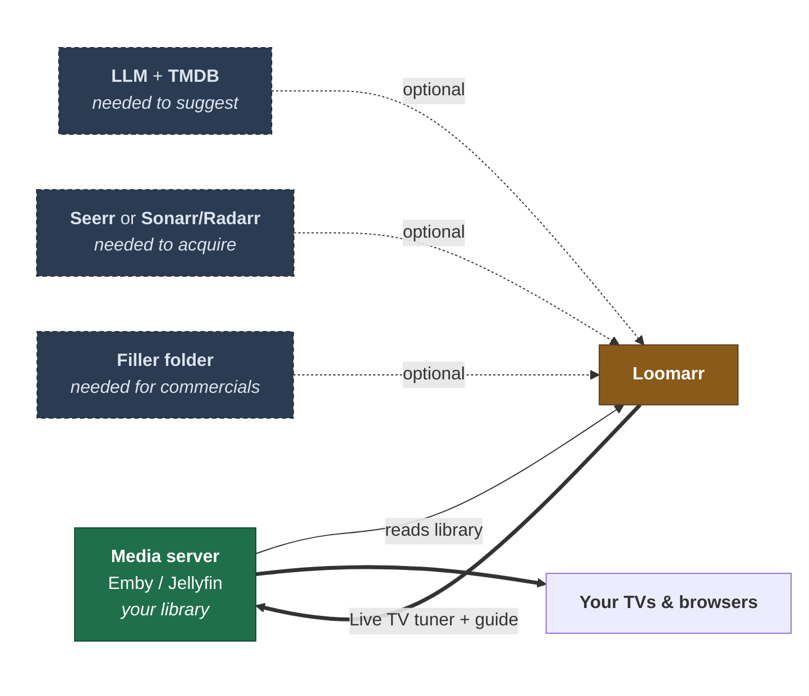
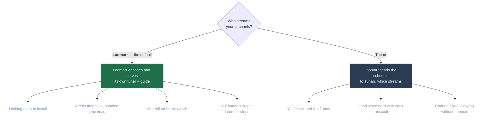

# Installing Loomarr

Loomarr describes a channel in a sentence, builds it from your library, and keeps it running.
This page covers what it needs from you and how the pieces fit; [Docker](docker.md) is the
step-by-step.

## What you need

Exactly one thing is required: **Emby or Jellyfin**. Everything else adds a capability, and
Loomarr tells you which capability is missing rather than refusing to start.

Without an LLM and a TMDB key, Loomarr can't propose lineups. Without a requester it schedules
only what you already own. Without a filler folder, channels play back to back with no ads.
None of that stops it booting, and none of it blocks the setup wizard.

## The one real decision: who streams

The wizard asks this early because it changes what else you have to set up.

**Pick Loomarr unless you have a reason not to.** It is the default, it needs nothing else
installed, and it is the only backend that can place ad breaks *inside* a programme. Choose
Tunarr when your hardware can't transcode, or when you already run Tunarr happily.

The choice is not permanent — it's an instance default you can override per channel.

## What runs where

Loomarr is one container: a Go binary with the web UI, the help pages, and the API baked in.
It serves everything on **one port, 8080**, and stores everything under **one volume, `/data`**.

| It needs | Because |
| --- | --- |
| Port 8080 | UI, API, and — on the default backend — the video streams |
| A `/data` volume | The database, downloaded artwork, and filler clips |
| `SERVER_PUBLIC_URL` | The address your media server reaches Loomarr on. Stream URLs are built from it |
| A GPU *(optional)* | Hardware encoding. Software works; it just limits concurrent channels |

`SERVER_PUBLIC_URL` is the one setting with no useful default and no boot-time warning. Set it
to something your media server can actually resolve — a LAN IP, not `localhost`.

## Next

- **[Docker install](docker.md)** — compose, volumes, and first boot.
- **[Hardware acceleration](hardware.md)** — GPU passthrough for Intel, AMD, and NVIDIA.
- **[Upgrading](upgrading.md)** — back up, then pull.
- **[Configuration reference](../configuration.md)** — every setting, generated from the source.
