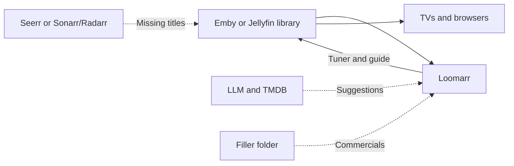

# Installing Loomarr

[Docker](docker.md) is the step-by-step. This page covers what Loomarr needs and the one
choice you'll be asked to make.

## What you need

Only **Emby or Jellyfin** is required for Loomarr to start and serve an existing channel. The
product's defining describe-a-channel flow also requires **TMDB** and an **LLM** (local Ollama or
an OpenAI-compatible provider). Requesters and filler add capabilities; Loomarr degrades without
them rather than refusing to start.

Without an LLM and a TMDB key, Loomarr can't suggest lineups. Without a requester, it schedules
only what you already own. Without a filler folder, channels play back to back.

## Who streams your channels

The wizard asks this early because it changes what else you set up.

| | Loomarr — default | Tunarr |
| --- | --- | --- |
| Streaming owner | Loomarr encodes and serves the tuner and guide | Loomarr sends the schedule; Tunarr streams it |
| Extra install | None | Tunarr |
| Mid-programme breaks | Supported | Limited by Tunarr's schedule model |
| If Loomarr stops | Channels stop | Existing Tunarr channels keep playing |
| Best fit | Most installations | Hosts that already use Tunarr or cannot transcode in Loomarr |

Pick Loomarr unless you have a reason not to. You can change it later, and override it per
channel.

## What runs where

Loomarr is one compiled application container behind a Traefik edge container. Traefik publishes
**port 8080** by default; Loomarr serves UI, API, and streams on private container port 8080 and
stores state under **`/data`**.

| It needs | For |
| --- | --- |
| Host port 8080 | Traefik routes UI, API, and video streams to Loomarr |
| A `/data` volume | Database, artwork, filler clips |
| `SERVER_PUBLIC_URL` | The address your media server reaches Loomarr on |
| A GPU (optional) | Hardware encoding — software works, just fewer channels at once |

Set `SERVER_PUBLIC_URL` to something your media server can resolve, like a LAN IP. Release Compose
refuses to start without it; a wrong but reachable-looking value still shows up when a channel
fails to play. The beta supports one Loomarr replica behind Traefik while multi-replica safety is
tested explicitly.

The published artifact is a Linux container for amd64 and arm64. Linux runs it directly. macOS
runs the same image through Docker Desktop; Apple Silicon selects arm64 automatically. Docker
Desktop does not pass through the Mac GPU to Linux containers, so internal playout uses software
encoding there.

## Next

- [Docker install](docker.md)
- [Hardware acceleration](hardware.md)
- [Upgrading](upgrading.md)
- [All settings](../configuration.md)
