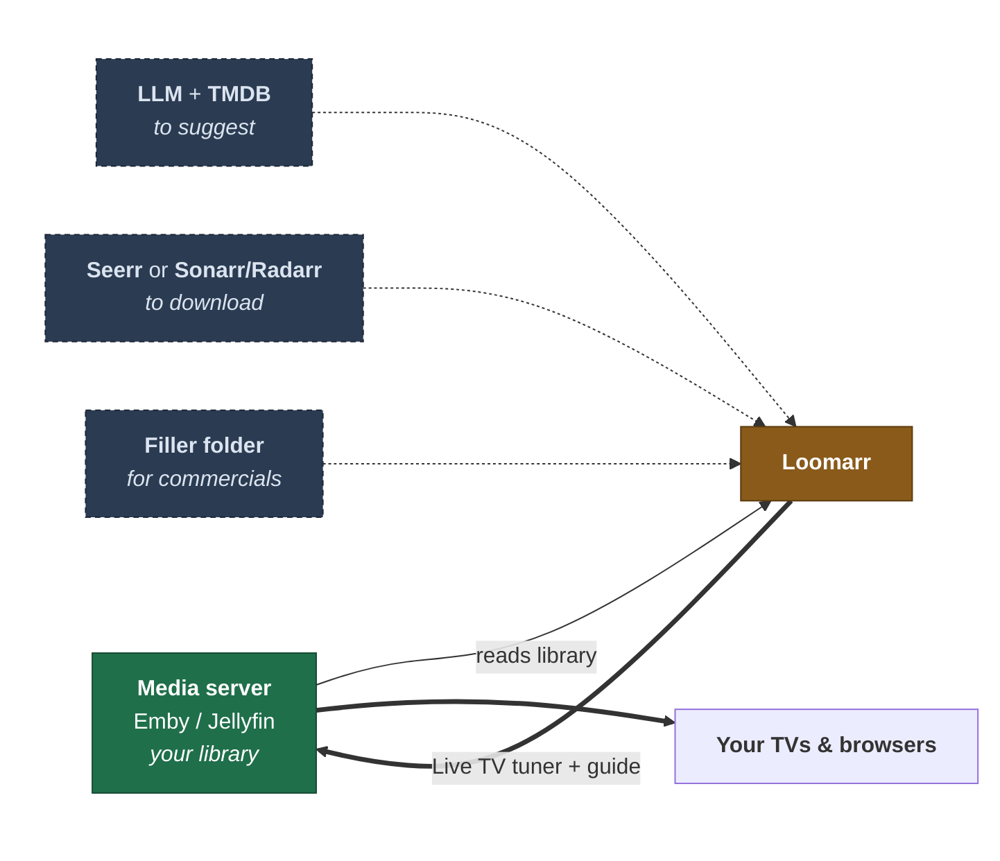
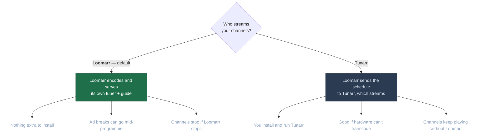

# Installing Loomarr

[Docker](docker.md) is the step-by-step. This page covers what Loomarr needs and the one
choice you'll be asked to make.

## What you need

Only **Emby or Jellyfin** is required. Everything else adds a capability, and Loomarr tells you
which one is missing rather than refusing to start.

Without an LLM and a TMDB key, Loomarr can't suggest lineups. Without a requester, it schedules
only what you already own. Without a filler folder, channels play back to back.

## Who streams your channels

The wizard asks this early because it changes what else you set up.

Pick Loomarr unless you have a reason not to. You can change it later, and override it per
channel.

## What runs where

Loomarr is one container. It serves everything on **port 8080** and stores everything under
**`/data`**.

| It needs | For |
| --- | --- |
| Port 8080 | UI, API, and video streams |
| A `/data` volume | Database, artwork, filler clips |
| `SERVER_PUBLIC_URL` | The address your media server reaches Loomarr on |
| A GPU (optional) | Hardware encoding — software works, just fewer channels at once |

Set `SERVER_PUBLIC_URL` to something your media server can resolve, like a LAN IP. It has no
default, and a wrong value only shows up when a channel fails to play.

## Next

- [Docker install](docker.md)
- [Hardware acceleration](hardware.md)
- [Upgrading](upgrading.md)
- [All settings](../configuration.md)
