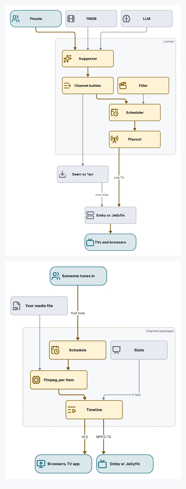
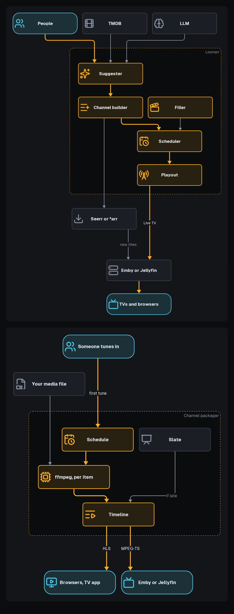
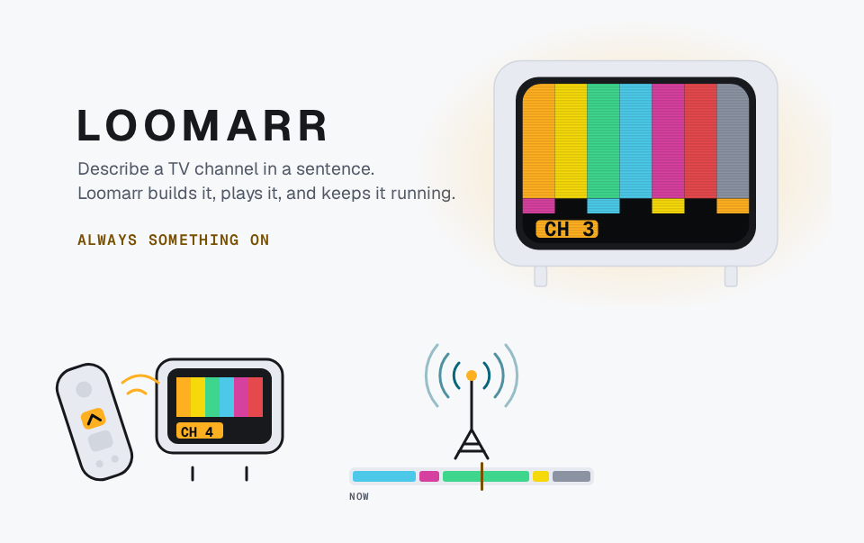
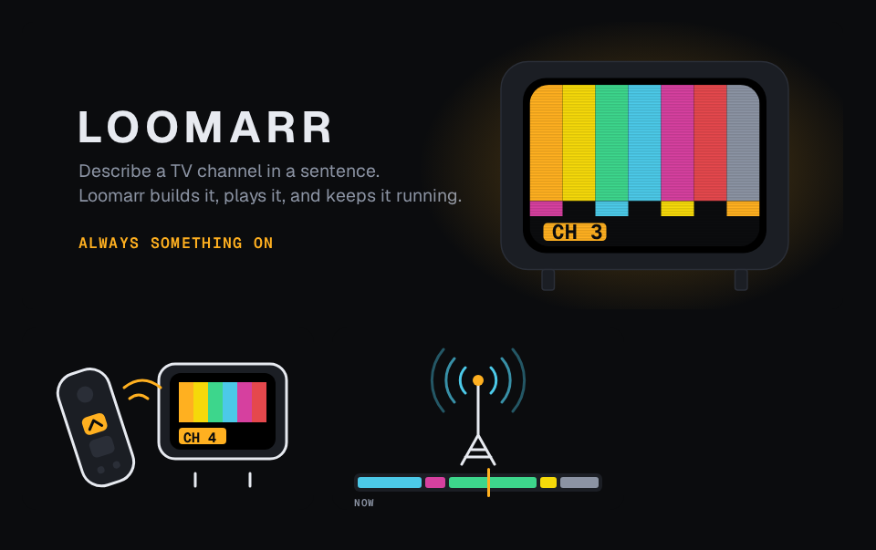
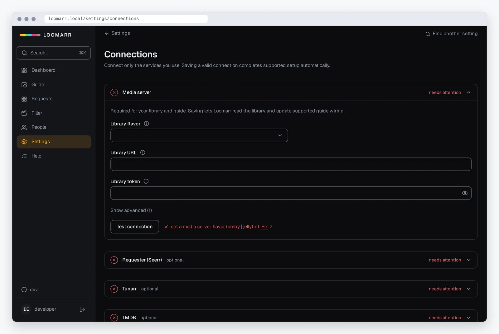
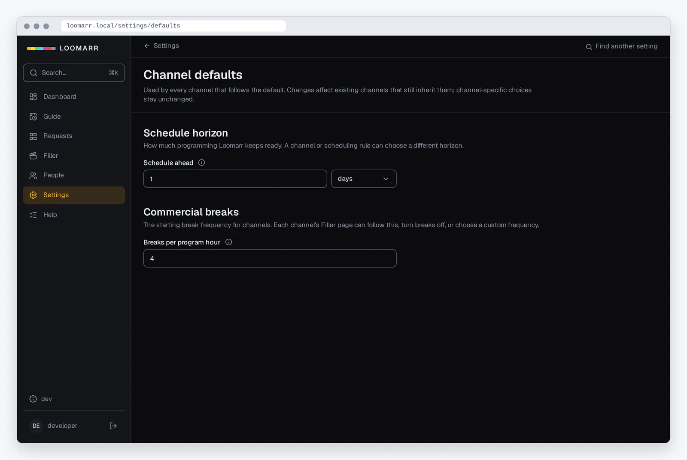
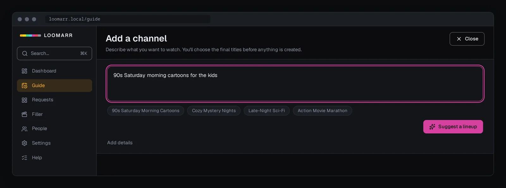
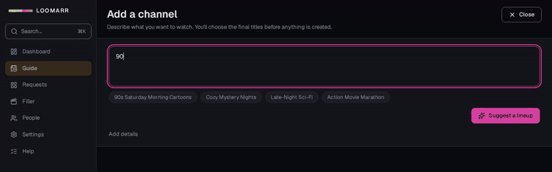

# Polished diagrams and the imagery track (#1572)

Samples for the maintainer's look. Everything here is a real render from `origin/main`, and
nothing under `docs/` has changed.

## 1. Polished diagrams (D2 + brand theme)

| light | dark |
| --- | --- |
|  |  |

What changed after review:

- **Zero line or label crossings.** Container labels are now one or two words, pinned top-right,
  clear of edges entering from above. Edge labels that sat on bends are gone ("a sentence") or
  moved to the prose ("1 s segments").
- **One flow direction.** Both read top to bottom: inputs at the top, viewers at the bottom.
  Filler now feeds the Scheduler from above, not from below.
- **Consistent spacing.** Every node is 240 × 52 px. ELK layered layout, with 48 px between
  layers and 24 px edge clearance, is fixed in the render script. Both fit an 800 px docs column
  (826 and 746 px wide).
- **Icons.** Lucide, the app's own icon set, one per node, coloured by role. Each icon SVG
  carries its own light/dark stroke, because an SVG loaded as an image still follows the
  reader's colour scheme. That settles the earlier "no icons" rule.
- **Not generic boxes.** Role colour, icon and shape now say what each node is: amber for
  Loomarr, neutral for your services, cyan for people and screens.

## 2. Brand illustrations (SVG from the tokens)

**Proposed motif: the test card.** It isn't a new idea: the design system already calls its
palette the "Test Card palette", and `brand-contract.json` defines the seven chroma bars, the
wordmark (Geist 700, 0.12 em tracking) and the tagline "always something on". The motif is a
warm retro set showing the card, a channel badge in Geist Mono, and a soft amber glow. Only
brand tokens are used, and there's no AI generation.

| light | dark |
| --- | --- |
|  |  |

- **Hero** (1200 × 420): the landing page and README.
- **Spots** (320 × 200), one per top-level section. Shown here: *Guides* (a remote on channel
  up) and *Explanation* (a tower over a guide timeline). To follow: *Get started*, *Reference*,
  *Contributing*.
- Each is one SVG with light and dark inside, `role="img"` plus a `<title>`, and Geist embedded
  so it renders the same on GitHub. **Size today is about 70 KB each** because the whole font is
  embedded. The rollout subsets it to the glyphs used (target 25 KB or less).

## 3. Product screenshots and a clip

| Settings → Connections | Settings → Channel defaults | Add a channel |
| --- | --- | --- |
|  |  |  |

Clip (4.6 s, GIF 124 KB for GitHub; the site gets the 14 KB WebM):

**How they're made (reproducible).** One Playwright script (`prototype/capture/capture.mjs`)
signs in to a lane backend, visits fixed routes at a fixed viewport (1280 × 800 @2x) with
reduced motion, and crops to the panel the page is about. A second script (`frame.mjs`) wraps
each capture in a browser frame drawn from the tokens (light and dark frame) and encodes WebP.
Re-running both regenerates every image, including after beta.9's design-system work.

**Honest limits of these samples.**

- They show screens with **no media data** (settings and the composer), because the demo
  dataset doesn't exist yet. The existing `make seed` and the Storybook fixtures both use real
  film titles, so neither can be used in a public repo.
- The web app is **dark-only** today, so the screen is dark in both variants and only the frame
  follows the reader's theme.
- The sidebar shows the lane's `dev` badge and `developer` user. The demo dataset will use a
  friendly demo user.

### The demo dataset (built in phase 2, before any media screenshot)

- A **stand-in media server** (`cmd/demo-library`), modelled on `internal/testkit`'s fake,
  serving about 24 invented titles across genres. Every name is checked against TMDB search
  before it's used, and must have no exact match.
- **Generated artwork:** a poster template from the tokens (a genre colour field, the title in
  Geist, a test-card strip), rendered to PNG.
- **Generated video:** short ffmpeg `lavfi` items (colour field, title card, scene fades, so
  mid-roll breaks and the watermark have something to act on).
- **`make demo-seed`** creates channels through the real channels API with explicit lineups.
  The LLM stays off; the "assistant proposes a lineup" clip uses the scripted LLM fake that
  testkit already has.
- It feeds the remaining shots on the maintainer's list: the guide, creating a channel end to
  end, channel surfing on the TV app (emulator, under the lock), the watermark on screen, and
  the remaining Settings pages.

### Conventions

| | Rule |
| --- | --- |
| Screenshots | 1280 × 800 @2x capture, cropped to the panel, browser frame from tokens, WebP q82 at 1600 px wide, **≤ 150 KB** |
| TV screenshots | 1920 × 1080 capture in a TV-bezel frame from the tokens, same budget |
| Clips | ≤ 6 s, no audio. The site uses WebM (VP9) **≤ 300 KB** with a poster frame and no autoplay under `prefers-reduced-motion`. GitHub and the README use GIF **≤ 400 KB** |
| Light/dark | The frame follows the reader's theme (`<picture>` on the site); the app screen is whatever theme the app has |
| Alt text | Says what the reader should notice, not "screenshot of…" |
| Data | Demo dataset only. Never a real title, poster, person, host or IP |
| Regenerate | `make docs-capture` (one script; see `contributing/docs-imagery.md`) whenever a captured screen changes |
