# Docs overhaul: phase 1 proposal (#1572)

Proposal only. Nothing in `docs/` has changed. Everything below was built and rendered from
`origin/main` at `381e9165`, and every screenshot is a real render. This PR is a draft and
exists so the images render on GitHub. It will be closed, not merged.

**The short version**

| Decision | Recommendation | Runner-up (also prototyped) |
| --- | --- | --- |
| Platform | **Keep Starlight**, re-themed from the design tokens | Docusaurus 3 |
| Organisation | **Diátaxis nav, one repo folder per nav section**; internal material off the site in `project/` | Audience nav (Use / Run / Build) |
| Diagrams | **Keep D2**, with a real theme built from the design tokens and one SVG that follows light/dark | Mermaid, pre-rendered |
| Content | **131 files → about 30 published pages.** Delete or move 98 files off the site; rewrite most of the rest | — |

The tables of options, the evidence and the full audit follow.

---

## 1. What is wrong today (brutal version)

- **The first command a new user runs is wrong.** README, `install/docker.md`, `help/quickstart.md`
  and `install/upgrading.md` all pin `0.1.0-beta.8`. The current release is `v0.2.0-beta.7`.
- **The Quickstart has the wrong wizard.** The wizard has a **Location** step; the Quickstart
  doesn't mention it.
- **Pages describe removed features.** `install/docker.md` still lists `/data/prepared/`
  ("reusable prepared programme media") as live data, two paragraphs above the note saying it's
  gone. `upgrading.md` says prepared media "can be regenerated". Prepared media was retired in #1547.
- **The site has no front door.** `/` is a meta-refresh to the install page. There's no landing
  page, and the nav shows the 13,000-line design doc to users.
- **The site isn't on brand.** `docs-site/src/styles/custom.css` claims its green (`#1f6f4a`) is
  "borrowed from the app's own tokens". It isn't in the tokens. The brand is amber.
- **The diagrams misinform.** `readme-overview.d2`, the first picture on the README, draws
  "Admin approves?" as a decision with no "No" branch. `architecture.d2` is 16 boxes and 19 edges
  in D2's default blue theme, and its text renders at about 7 px in the README column. The
  diagram standard in `docs/README.md` says "use the shared D2 light/dark configuration"; there
  isn't one, and each file copies its own `vars` block.
- **Pages written for us, shipped to users.** `integrations/media-server-livetv.md` opens with
  "Intended repo location" and a list of design-doc sections, then explains Phase 0 payload
  pinning. It's a briefing note, not a user page.
- **Real titles in a public repo.** `help/programming.md` uses a real film as its example, and
  `docs/release/v0.2.0-beta.7.md` names one in published release notes.
- **Duplication.** The backup and restore procedure is written out in full twice (docker,
  upgrading) and summarised twice more (README, Quickstart). The install prerequisites appear
  four times.
- **Internal material swamps the tree.** 98 of the 131 files are plans, dated evidence, research
  bake-offs, agent config, release-note headers and a 4,596-line archived journal. Most have at
  most one inbound link; git history already keeps them.

## 2. Platform (prototyped: Starlight vs Docusaurus)

The same sample tree (Get started, 2 explanation pages with the 2 diagrams, and stub pages for the
full nav), the same design tokens, and the same GitHub-alert callouts, built in both:

| Get started | light | dark |
| --- | --- | --- |
| Starlight (left) vs Docusaurus (right) | 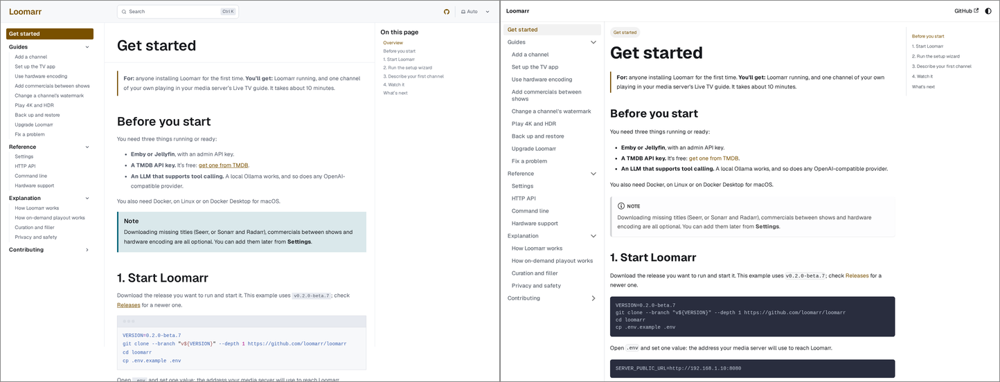 | 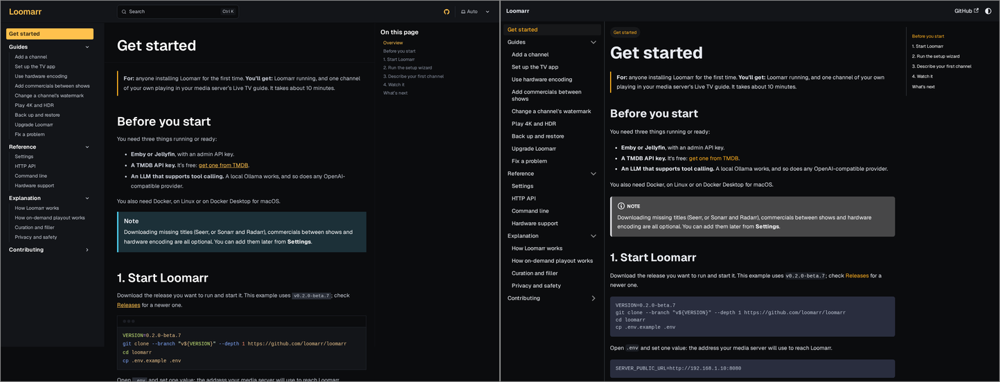 |

| Architecture page | light | dark |
| --- | --- | --- |
| Starlight vs Docusaurus | 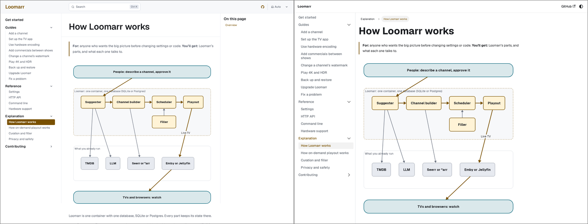 | 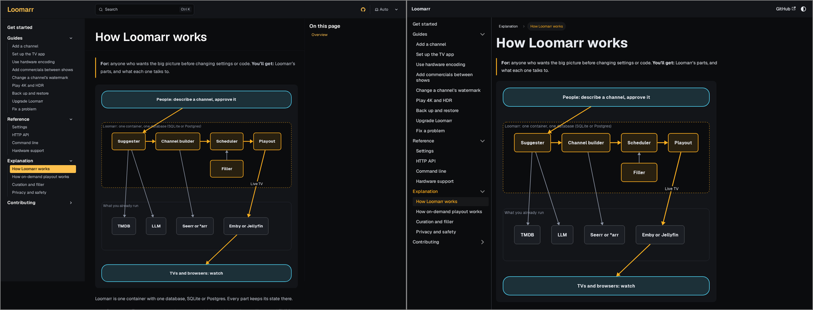 |

| Playout page | light | dark |
| --- | --- | --- |
| Starlight vs Docusaurus | 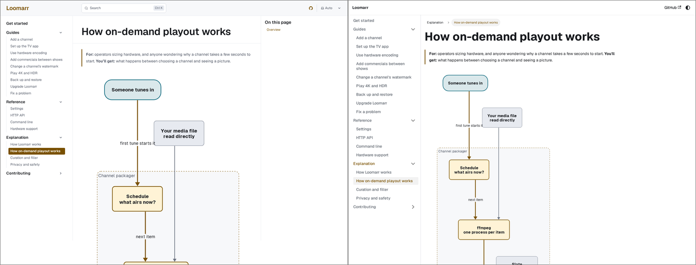 | 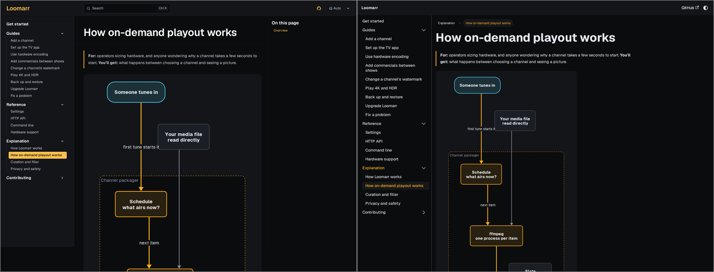 |

| Criterion | Starlight 0.41 (Astro) | Docusaurus 3.10 (React) |
| --- | --- | --- |
| Reading experience | Cleaner typography and a right-hand table of contents out of the box; ships almost no JS | Good; a React SPA, heavier; breadcrumbs built in |
| Search | **Pagefind built in: static, offline, no service** | None built in: Algolia DocSearch (hosted, applied for) or a community local plugin |
| Versioning per release | Community plugin (`starlight-versions`) or build per tag | **Native** |
| i18n path | Native | Native |
| Dark mode | Native, follows the OS | Native, follows the OS |
| MDX / components | Astro components, MDX | React components, MDX |
| OpenAPI reference | `starlight-openapi` plugin | `docusaurus-plugin-openapi-docs` (more mature) |
| Build (23 pages, measured) | **1.1 s build, 2.1 s wall** | 6.2 s wall |
| In-binary help (`embed.FS`) | Works through the existing in-place loader (about 150 lines of our code) | **Works with no custom loader**: `docs.path: "../docs"` + `markdown.format: "detect"` reads H1 titles natively |
| Callouts (`> [!NOTE]`) | Needed our own 40-line remark plugin: Starlight asides don't apply to loader content | Off-the-shelf plugin worked first time |
| Link checking | None (we rely on lychee) | **Built in**: it caught a real broken link in my sample page that Starlight passed |
| Maintenance | Few dependencies; already wired into CI and the gates | webpack stack; hit a Node 26 + ESM build failure during the prototype (`require.resolveWeak`) |

Other options, not prototyped, and why:

- **VitePress:** good and fast, but no versioning and a Vue component stack that nothing else here uses.
- **MkDocs Material:** excellent, but adds a Python toolchain. Its maintainers have announced a
  successor project, so it's in maintenance mode (verify before relying on this).
- **Fumadocs / Nextra:** a Next.js app to maintain. More moving parts than the docs need.
- **Mintlify and other hosted platforms:** proprietary hosting and a paid tier to grow into.
  That fails the "no paid lock-in" rule.

**Recommendation: keep Starlight.** Search that works offline, with no third-party service,
matches a self-hosted, privacy-first product. It's the fastest and lightest option, and it's
already wired into the gates. Its gaps each have a small, known fix: the alert plugin (written
and working in the prototype), a link validator (`starlight-links-validator`; compatibility
with our loader needs checking), and versioning by build (below). **Pick Docusaurus instead**
if per-release versioned docs become a hard requirement before 1.0.

## 3. Organisation (prototyped: Diátaxis nav vs audience nav)

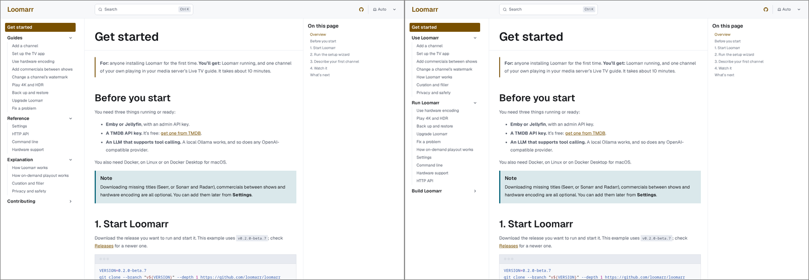

**Recommendation: Diátaxis (left).** It's the approved plan, every page gets exactly one kind of
job, and each section stays short. The audience nav (right) buries different kinds of page under
"Run Loomarr" (10 items, mixing how-tos, reference and explanation). The page opener ("**For:**
… **You'll get:** …") names the audience on every page instead.

### Repository layout: one folder per nav section

```text
docs/
  get-started.md            tutorial: install → first channel playing
  guides/                   how-to, task-shaped
  reference/                settings (generated), API (generated), CLI (generated), hardware
  explanation/              how Loomarr works, playout, curation and filler, privacy
  contributing/             was docs/dev/
  design.md, design/        #779's restructure; linked from Contributing → Design
  diagrams/                 D2 sources, system/theme.d2, generated/*.svg
  agents/                   stays here (vendored skills reference these paths); not on the site
project/                    NOT on the site: plans, evidence, research, release-note headers
```

- **In-binary help.** Today `docs/embed.go` embeds `help/*.md`. After the move it embeds
  `get-started.md`, `guides/` and `explanation/`: the pages a household admin needs offline. The
  setup API emits anchors like `troubleshooting#tunarr-library` (`internal/api/setup.go`,
  guarded by `embed_test.go`). The move keeps every anchor and adds a small old-ID → new-ID alias
  map in `embed.go`, so links from older app builds still resolve. That is a code change with
  tests, in the IA PR.
- **Versioning.** Publish the site from the **latest release tag** (docs match what people
  run) and publish `main` under `/next/`. That's two builds in the Pages workflow and works on
  any platform. It needs no versioning plugin until 1.0.
- **Internal material.** A repo folder (`project/`), not a second site and not the wiki. The
  wiki isn't reviewed in PRs and agents can't change it alongside code; a second site is
  infrastructure nobody reads. Most of it should simply be deleted (see the audit); git history
  keeps it.

### Redirects

- **Site:** one `docs/redirects.json` (old slug → new slug) feeds Astro's `redirects` (a static
  page per old URL, which works on GitHub Pages). A test fails if any slug published by the
  previous build is missing from the new build and from the map.
- **GitHub links** (`blob/main/docs/...`): GitHub doesn't redirect moved files. We don't keep
  stub files (they're clutter that ages). Inbound links from the repo are fixed in the same PR
  (lychee enforces this). Links from outside the repo land on a 404 that the README's docs link
  resolves. That leaves the in-app `/v1/docs` IDs, and those get the alias map above.

## 4. Diagrams (prototyped: D2 vs Mermaid, same two diagrams, same palette)

Before, the current `architecture.d2` and `readme-overview.d2`:

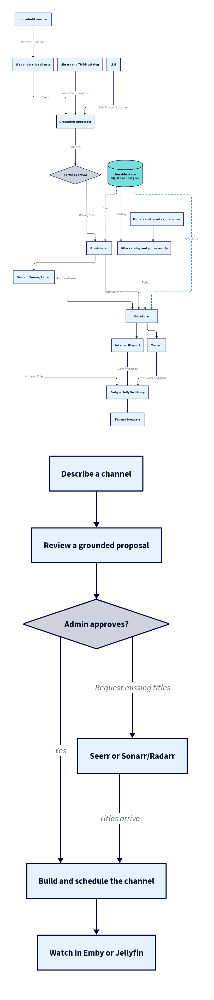

After, left is D2 and right is Mermaid:

| light | dark |
| --- | --- |
| 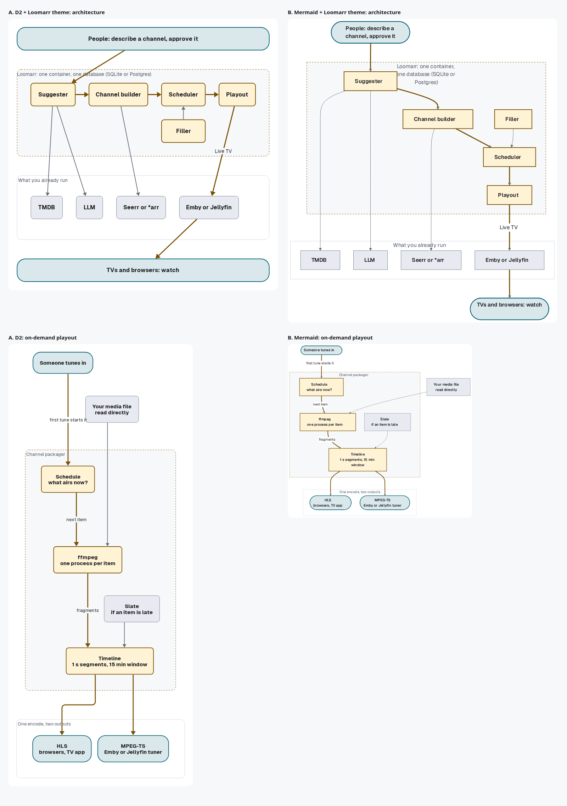 | 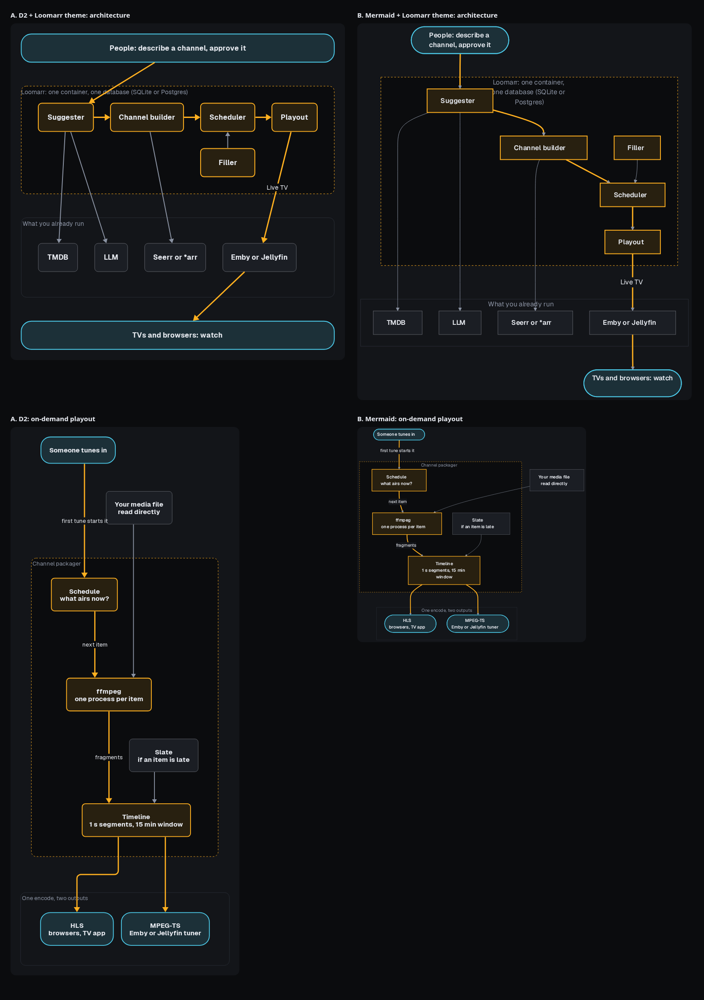 |

| Criterion | D2 v0.7.1 + theme | Mermaid 11.12 (mermaid-cli) |
| --- | --- | --- |
| Looks professional | Yes, once themed; the grid gives exact placement | Weaker: it ignored the subgraph's left-to-right direction, and the container label collides with a node |
| Diff-able source | Yes | Yes |
| Theming from tokens | Yes: role classes in `system/theme.d2` | Yes: `themeCSS` in a config file |
| Light/dark | **One SVG that follows the reader** (D2's own dark theme plus a 40-line post-render map) | Two SVGs per diagram plus `<picture>`; GitHub's native Mermaid ignores our theme |
| Renders on GitHub | Committed SVG | Committed SVG, or native blocks without our theme |
| Accessibility | Real text, Geist embedded; alt text lives in the Markdown | Labels are HTML inside `foreignObject`; alt text lives in the Markdown |
| Toolchain | 1 pinned container, no network, about 0.4 s per diagram | Chromium in the render path (2 GB image) |
| Agents can maintain it | Yes: small declarative files, and the grid avoids layout guesswork | Yes, but layout can't be controlled, so fixes are trial and error |

Also considered: **Excalidraw/tldraw** (hand-drawn style is off-brand for a broadcast-console
identity, the JSON source can't be reviewed, and tldraw's SDK licence needs checking);
**Structurizr/C4** (a Java DSL; notation for engineers only); **hand-drawn SVG components**
(the best polish, but they don't render on GitHub, and agents are poor at maintaining
coordinates).

**Recommendation: keep D2, with the system in section 6.** Honest costs: D2 v0.7 can't
reference its theme slots from `style`, so role colours need the small post-render dark map.
Edges in a grid are straight lines, so layouts need a quick check for edges through boxes.
Geist Regular TTF has to be committed next to the Bold that already ships in `internal/watermark/fonts`.

**Existing diagrams: redo or delete.**

| Diagram | Verdict |
| --- | --- |
| `readme-overview` | **Delete.** Wrong (a decision with no "No" branch), and the redone architecture diagram replaces it on the README |
| `architecture` | **Redo** (sample above) |
| `install-overview` | **Delete.** It repeats the prerequisites list beside it |
| `suggester` | **Redo** in the system, for Explanation → Curation (#779 decides whether design.md keeps it) |
| `acquisition-state` | **Redo** as a state diagram in Explanation → How a channel fills in |
| `ci` | **Redo**; the contributor CI page needs it |
| `dev-loop` | **Delete.** Two processes and a proxy: one sentence says it |
| new `on-demand-playout` | **Add** (sample above) |

## 5. Style guide (draft)

**Voice.** Plain, friendly, second person. Short sentences, one idea each. Present tense, active
voice. Say what to do and what happens. No marketing, no "simply", "just" or "easily". British or
American spelling: pick one repo-wide (the app copy is British; proposal: British).

**Every page opens the same way.**

```markdown
# <Task-first title: "Back up and restore", not "Backups">

**For:** <who>.
**You'll get:** <the outcome, in one line>.
```

**Page templates.** *Tutorial* (Get started only): prerequisites, numbered `##` steps, "What's
next". *How-to*: goal, numbered steps, "If it doesn't work". *Reference*: generated where
possible, tables, no narrative. *Explanation*: one diagram at most, then prose, no procedures.

**Headings.** Sentence case. Task-first in guides ("Add a channel"). Never skip a level. Don't
rename a heading in `guides/troubleshooting.md` without updating the API anchor (it's a
contract).

**Code.** Always fence with a language. One command per block when the reader might run them
separately. Show expected output when it tells the reader they succeeded. Placeholders in
`<angle-brackets>`. LAN addresses use `192.168.1.10`; never real hosts, IPs or domains.

**Callouts.** GitHub alert syntax only: `> [!NOTE]`, `> [!TIP]`, `> [!WARNING]`. They render
natively on GitHub, as asides on the site, and as blockquotes in the in-app viewer. At most two
per page. A warning is for data loss or security, nothing else.

**Links.** Relative links to `.md` files. Link text says where it goes ("the upgrade guide"),
never "here".

**Examples.** Genre words only ("90s Saturday morning cartoons", "cozy mystery series"). Never a
real film, show, person or brand in a page, a screenshot or a release note.

**Screenshots.** Only when the UI is the point. They come from a seeded dev instance with a
synthetic library, never from a real media library. Crop to the relevant panel, show light
theme only, and include alt text. Retake them in the PR that changes the UI.

**Numbers and versions.** Versions come from one generated snippet, never hand-typed in four
places (that's how every install page ended up on `0.1.0-beta.8`).

## 6. Diagram system

Sources: `docs/diagrams/system/theme.d2` (imported by every diagram with `...@system/theme`) and
`system/darken.mjs` (post-render). Both are in `prototype/d2/`.

**Colour roles.** Every value is a design-system semantic token
(`web/packages/design-system/src/tokens/tokens.ts`); none is invented. The one derived value
is dark "amber wash" `#282010`: signal at 12% over the canvas, the design system's own tint
formula.

| Role | Used for | Light fill / stroke | Dark fill / stroke |
| --- | --- | --- | --- |
| `loomarr` | Loomarr's own parts | `#FFF3D6` / `#795000` (surface.focus / action.primary) | `#282010` / `#FFB020` |
| `service` | Things you run beside Loomarr | `#E7EAF0` / `#747C8B` (surface.elevated / border.control) | `#1B1E24` / `#61646B` |
| `audience` | People and screens | `#DAE8EB` / `#08657A` (info) | `#1C3038` / `#4CC9E8` |
| `boundary` | One running thing (container, process), dashed amber | `#F7F8FA` / `#795000` | `#0B0C0E` / `#FFB020` |
| `zone` | A grouping that isn't a running thing | card / `#D2D6DE` | card / `#2A2E37` |
| `hot` edge | The one path the diagram is about | `#795000`, 3 px | `#FFB020` |
| `flow` edge | Other flow | `#69717F`, 2 px | `#8B93A3` |
| `state` edge | Reads and writes of durable state, dashed | `#747C8B`, 1 px | `#61646B` |
| card | Diagram background | `#FFFFFF` (surface.raised) | `#131519` |

**Contrast (measured, WCAG).** Node text on every fill: at least 14.0:1 light and 11.4:1
dark. Edge labels: 7.15:1 / 5.92:1. Strokes against the card: amber 7.09 / 9.99, info 6.66 /
9.42, flow 4.92 / 5.92, neutral border 4.20 / 3.08. All non-text elements pass 3:1.

**Shapes.** Rounded rectangles for parts (radius 8), pills for people and screens (radius 24),
a cylinder only for a store that is the subject of the diagram. No diamonds (decisions belong
in prose or a state diagram), no clouds, no 3D.

**Typography.** Geist Regular and Bold, embedded in the SVG. Node labels 16 px Bold; container
and edge labels 14 px Regular, upright (D2 italicises edge labels by default). Labels are nouns
of at most three words; detail goes in the prose.

**Layout.** One question per diagram, written as the first comment in the source. Design for the
docs column: the viewBox is at most 900 px wide, so text is never scaled below its size. Use a
grid for placement, and ELK only for flows with one direction. At most 10 nodes and one `hot`
path. Don't draw an edge that every node would have (say it in the container label instead).

**Legend.** The roles are fixed, so the legend lives once, on a "Reading our diagrams" page in
Contributing. A diagram draws its own legend only if it uses `state` edges.

**Icons.** None inside diagrams. D2 embeds icons as images, which can't switch with the theme;
colour and shape carry the meaning. (Lucide icons stay in the UI.)

**Light/dark.** One SVG per diagram. D2's own dark theme covers its slots, and `darken.mjs`
appends one dark-scheme rule per role colour. CSS attribute selectors outrank SVG presentation
attributes, so the light render is untouched.

**Alt text.** Every diagram image has alt text that states the flow in full sentences, as in the
samples. A lint rule will require it for any image under `diagrams/generated/` (at least 40
characters).

## 7. The rewritten page

The sample Get started page, rendered in the recommended setup (Starlight, re-themed), full page:

| light | dark |
| --- | --- |
| 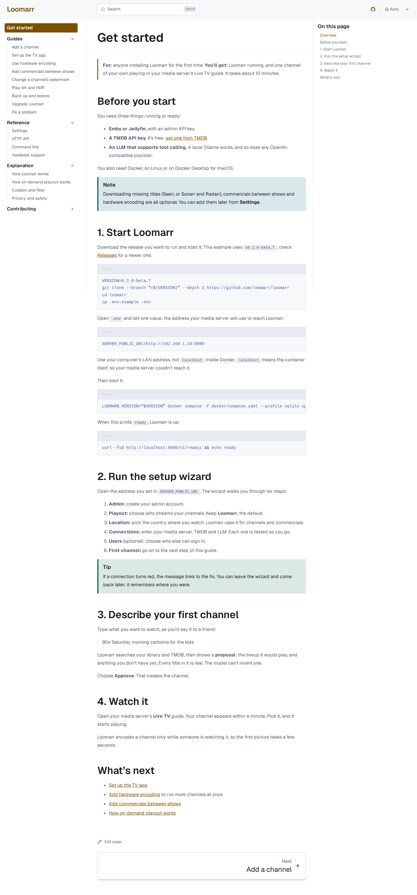 | 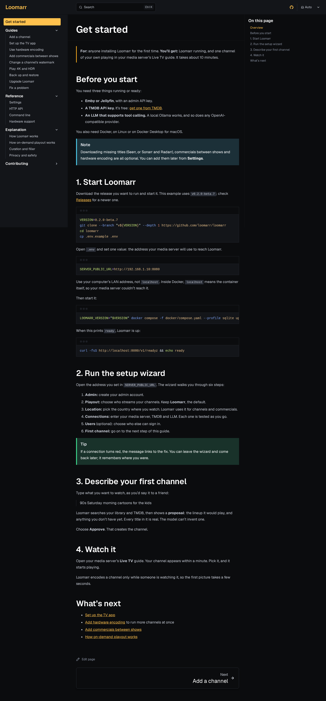 |

Source: [`prototype/sample/get-started.md`](prototype/sample/get-started.md). It fixes the
version, adds the Location step, drops the SQLite `DATABASE_URL` aside and the Postgres detour
(both belong in a guide), and ends with the channel playing in the Live TV guide.

## 8. Audit

Quality is 1 (harmful) to 5 (keep as is). "Stale" means it contradicts `origin/main` today. The
target path is where the content goes, if it survives.

The full table (every file, with audience, job, quality, staleness and action → target) is in
[`AUDIT.md`](AUDIT.md). In brief:

- **Published after the overhaul:** about 30 pages. The site renders 32 today, but mixed with design docs and missing the pages
  users need (landing, backups, TV app, privacy).
- **Rewrite:** every install and help page. Four of them pin the wrong version, one describes
  removed media, and one has the wrong wizard steps.
- **Delete:** about 75 internal files (dated certifications, bake-offs, finished plans, the
  4,596-line journal, the 1,116-line mock delta). Git history keeps them.
- **Move off the site:** about 15 (still-live plans and evidence → `project/`; agent pages →
  beside `AGENTS.md`).
- **Keep in place, off the site:** `docs/agents/*`, because the vendored skills reference them
  by path.

## 9. Execution plan after approval (unchanged from the issue, now concrete)

1. **IA PR:** move files to the layout above, add `redirects.json` and its test, change
   `embed.go` (new paths and the ID alias map), update `setup.go` anchors, add the site landing
   page, and apply the token theme and alert plugin. No content rewrites. Docs gates green.
2. **Diagram-system PR:** add `system/theme.d2` and `darken.mjs` to `generate-diagrams.sh`,
   commit Geist Regular, redo or delete the diagrams per the table, and add the alt-text lint.
3. **Content PRs, one per section:** Get started, then Guides, Reference, Explanation and
   Contributing, each against the style guide.
4. **Polish:** README (pitch, one diagram, Get started), search tuning, and a fresh-reader review.

## Open questions for the maintainer

1. Starlight or Docusaurus (section 2)? And Diátaxis or audience nav (section 3)?
2. Delete, rather than move, the internal files marked "delete". Git history keeps them.
3. British or American spelling?
4. Versioned docs: is the latest release tag plus `/next/` enough until 1.0?
5. The real title in `docs/release/v0.2.0-beta.7.md`: edit the published notes, or leave it?
